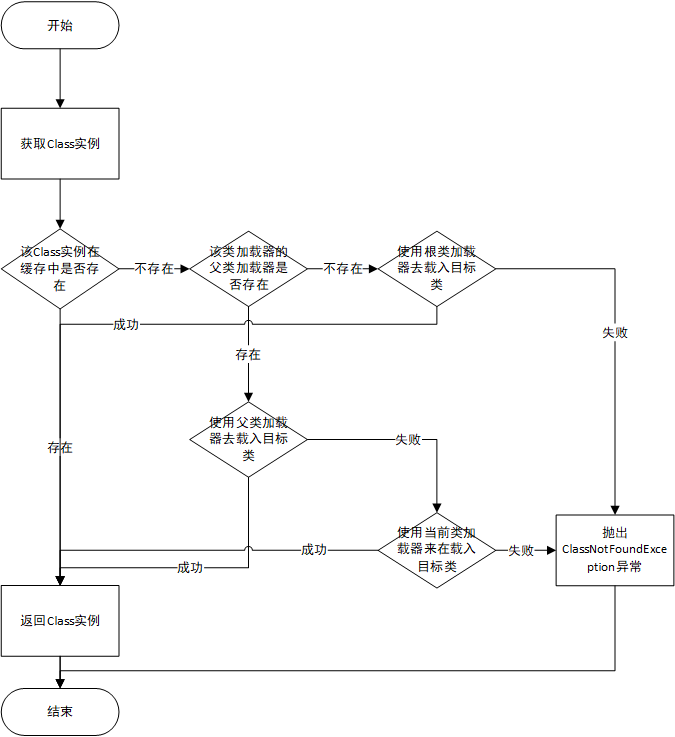

# 类加载机制与反射

## 类的加载、连接和初始化

### Java和类
当Java程序运行时，会启动一个JVM进程，而程序中的所有变量，都会在JVM进程的内存区里，当JVM进程被终止时，该内存区里的所有变量都将被丢弃。

### JVM进程终止
当在以下几种情况时，JVM进程将被终止。
- 程序运行到最好正常结束。
- 程序运行到使用`System.exit()`或`Runtime.getRuntime().exit()`代码处结束程序。
- 程序执行过程中遇到未捕获的异常或错误而结束。
- 程序所在平台强制结束了JVM进程。

### 类的加载
类的加载：当在程序中需要用到某个类，而这个类又没有被加载到内存中时，系统会通过**加载**、**连接**、**初始化**三个步骤来对该类进行初始化。**正常情况下**这三个步骤是依次连续完成的，所以这三个步骤也被统称为**类加载**或**类初始化**。类的加载就是将class文件读入到内存，并为之创建一个`java.lang.Class`对象，也就是说，当程序中使用任何类时，系统都会为之创建一个`java.lang.Class`对象。

### 类加载器
类的加载由类加载器完成，通常类加载器是有JVM提供的，这些JVM提供的类加载器通常被称为**系统类加载器**。当然我们也可以通过继承`ClassLoader`基类来自定义类加载器。

通过不同的类加载器，可以从不同来源来加载二进制数据，通常有以下几种来源。
- 从本地文件系统加载class文件。
- 从JAR包中加载class文件。
- 通过网络加载class文件。
- 把一个Java源文件动态编译，并执行加载。

**PS:**类加载器通常并不是要等到某个类首次被使用时才开始加载该类，在很多情况下Java虚拟机规范允许系统预加载某些类。

### 类的连接
当类被加载后，系统就会为之生成一个对应的Class对象，接着就会进入连接阶段，连接阶段负责把类的二进制数据合并到JRE（JRE是Java Runtime Enviroment是指Java的运行环境，是面向Java程序的使用者，而不是开发者。）中。

类连接又可以分为如下三个阶段。
1. 验证，检查被加载的类是否有正确的内部结构，并和其它类协调一致。
2. 准备，为类的类变量分配内存，并设置默认初始值。
3. 解析，将类的二进制数据中的符号引用替换成直接引用。

### 类的初始化
在这一阶段，虚拟机负责对类进行初始化，主要是对类变量进行初始化。

在Java类中对类变量指定初始值有两种方式：

1. 声明类变量时指定初始值。
2. 使用静态初始化代码块为类变量指定初始值。

JVM初始化一个类包含如下几个步骤。
1. 假如这个类还没有被加载和连接，则程序就会先加载并连接该类。
2. 假如该类的直接父类还没有被初始化，则先初始化直接父类。**PS**:直接父类的初始化同样遵守JVM初始化一个类的几个步骤。
3. 假如类中有初始化语句，则系统依次执行这些初始化语句。

### 类初始化的时期
当Java程序首次动过下面6种方式来使用某个类或接口时，系统就会初始化该类或接口。
1. 创建类的实例。为某个类创建实例的方式包括：使用new关键字来创建实例，通过反射来创建实例，通过反序列化的方式来创建实例。
2. 调用某个类的类方法（静态方法）。
3. 访问某个类或接口的类变量，或为该类变量赋值。
4. 使用反射方式来强制创建某个类或接口对应的`java.lang.Class`对象。例如代码`class.forName("Person")`，如果系统还未初始化Person类，则这行代码将导致Person类被初始化，并返回Person类对应的`java.lang.Class`对象。
5. 初始化某个类的子类。当初始化某个类的子类时，该子类的所有父类都会被初始化。
6. 直接使用java.exe命令来运行某个主类，程序会先初始化该主类。

除此之外，下面几种情况需要特别指出。
- 对于一个final修饰的类变量，如果该类能在编译时期就可以确定下来，那么这个类变量相当于一个宏变量（常量），因此即使在程序中使用该静态类变量也不会导致类的初始化。
- 当使用ClassLoader类的loadClass()方法来加载某个类时，该方法只加载该类，并不会执行该类的初始化。

## 类加载器

### 类加载器简介
类加载器负责加载所有的类，系统为所有被载入内存中的类生成一个`java.lang.Class`实例。一旦一个类被载入JVM中，同一个类就不会被再次载入了。

怎么样才算同一个类？
- 在Java代码中，同一个类就是用**全限定类名（包名加类名）**来表示同一个类。
- 在JVM中，同一个类就是用**全限定类名**加**类加载器**来表示同一个类。

当JVM启动时，会形成由三个类加载器组成的初始类加载器层次结构。
- Bootstrap ClassLoader：根类加载器，该类不是ClassLoader的子类，而是JVM自身实现的，它负责加载Java的核心类。
- Extension ClassLoader：扩展类加载器，该类加载器是ExtClassLoader的实例。
- System ClassLoader：系统类加载器，该类加载器是。

### 类加载器加载Class过程



### 类加载机制
JVM的类加载机制主要有如下3种。
1. 全局负责，当一个类加载器负责加载某个Class时，该Class所依赖和引用的其他Class也将由该类加载器负责载入，除非显示使用另外一个类加载器来载入。
2. 父类委托，先让父类加载器试图加载该Class，只有在父类加载器无法加载该Class时，才尝试从自己的类路径中加载该类。
3. 缓存机制，会保证所有被加载过的Class都会被缓存，当程序中需要使用某个Class时，类加载器会先从缓存中去取Class，如果缓存中没有，系统才会读取该类对应的二进制数据，并将其转化为Class对象，存入缓存。

### 自定义类加载器
JVM中除**根类加载器**外的所有类加载器都是**ClassLoader**的子类，所以开发者就可以通过扩展ClassLoader的子类，并重写该ClassLoader所包含的方法来实现自定义的类加载器。

ClassLoader类的两大关键方法如下。
1. loadClass(String name, boolean resolv)：该方法为ClassLoader的入口点，根据指定的名称来加载类，系统就是调用该方法来获取指定类对应的Class对象。
2. findClass(String name)：根据指定名称来查找类。

如果需要实现自定义的ClassLoader，则可以通过重写以上两个关键方法来实现。通常推荐重写`findClass(String name)`方法，而不是重写`loadClass(String name, boolean resolv)`方法，因为`loadClass(String name, boolean resolv)`方法的执行步骤如下。
1. 用`findLoadedClass(String name)`方法来检查是否已经加载类，如果已经加载则直接返回。
2. 在父类加载器上调用`loadClass(String name, boolean resolv)`方法。如果父类加载器为空，则调用根类加载器。
3. 调用`findClass(String name)`方法查找类。

从上面可以知道，如果重写`loadClass(String name, boolean resolv)`方法，当需要继续使用父类的`loadClass(String name, boolean resolv)`方法实现逻辑时，会让代码实现起来比较费力。所以建议在**需要继续使用父类`loadClass(String name, boolean resolv)`方法实现逻辑**时，重写`findLoadedClass(String name)`方法更好。

### URLClassLoader类
此类是系统类加载器和扩展类加载器的父类，URLClassLoader功能比较强大，它既可以从本地文件系统获取二进制文件来加载类，也可以从远程主机获取二进制文件来加载类。

URLClassLoader提供了如下两个构造器。
1. URLClassLoader(URL[] urls)：使用默认的父类加载器创建一个ClassLoader对象，该对象将从urls所指定的系列路径中来查询并加载类。
2. URLClassLoader(URL[] urls, ClassLoader parent)：使用指定的父类加载器创建一个ClassLoader对象，其他功能与前一个构造器相同。

## 通过反射查看类信息

### 获得Class对象
在Java程序中获得Class对象通常有如下三种方式。
1. 使用Class类的静态方法：Class.forName(String name)，该方法需要传入字符串参数，该字符串参数的值是某个类的全限定类名(必须添加完整的包名)。
2. 调用某个类的class属性来获取该类对应的Class对象。例如，Person.class将会返回Person类对应的Class对象。
3. 调用某个对象的getClass()方法。该方法时java.lang.Object类中的一个方法，所以所有的Java对象都可以调用该方法，该方法将会返回该对象所属类对应的Class对象。

### 从Class对象中获取信息
常用方法已经在代码中实现，代码如下。
```java
package com.zgy.mytest.local.demo10;

/**
 * @author ZGY
 * @version 1.0
 * @date 2019/7/29
 * @description ClassTest
 */

import java.lang.annotation.Annotation;
import java.lang.annotation.Repeatable;
import java.lang.annotation.Retention;
import java.lang.annotation.RetentionPolicy;
import java.lang.reflect.Constructor;
import java.lang.reflect.Method;
import java.util.Arrays;

// 说明该注解在编译、运行时可见
@Retention(value = RetentionPolicy.RUNTIME)
@interface Annos {
    Anno[] value();
}

/**
 * 定义可重复注解
 */
@Repeatable(value = Annos.class)
@interface Anno {

}

// 警告不检查
@SuppressWarnings(value = "unchecked")
@Deprecated
// 使用重复注解注解该类
@Anno
@Anno
public class ClassTest {
    // 将无参构造私有化
    private ClassTest() {}
    // 定义个有参数的构造器
    public ClassTest(String name) {
        System.out.println("===================> 执行了有参数的构造器，name：["+name+"]");
    }
    // 定义一个无参数的info方法
    public void info() {
        System.out.println("==================> 执行了无参数的info方法");
    }
    // 定义一个有参数的info方法
    public void info(String str) {
        System.out.println("===================> 执行了有参数的info方法，str：["+str+"]");
    }
    // 定义一个内部类
    class Inner {

    }
    // main方法
    public static void main(String[] args) throws Exception {
        // 获取ClassTest的实例
        Class clazz = ClassTest.class;
        // 获取ClassTest的所有构造构造器
        Constructor[] declaredConstructors = clazz.getDeclaredConstructors();
        System.out.println("================> ClassTest的所有构造构造器如下。");
        for (Constructor declaredConstructor : declaredConstructors) {
            System.out.println("==========> declaredConstructor: ["+declaredConstructor+"]");
        }
        // 获取ClassTest的所有public构造器
        Constructor[] constructors = clazz.getConstructors();
        System.out.println("===========================> ClassTest的所有public构造构造器如下。");
        for (Constructor constructor : constructors) {
            System.out.println("=================> constructor: [" + constructor +"]");
        }
        // 获取该Class对象所对应的全部public方法
        Method[] methods = clazz.getMethods();
        System.out.println("========================> 获取该Class对象所对应的全部public方法如下。");
        for (Method method : methods) {
            System.out.println("=============> method: ["+ method +"]");
        }
        // 获取该Class对象所对应类的指定方法
        System.out.println("=====================> ClassTest里带一个字符串参数的info方法为：" + clazz.getMethod("info", String.class));
        // 获取该Class对象所对应类的全部注解
        Annotation[] annotations = clazz.getAnnotations();
        System.out.println("========================> 获取该Class对象所对应的全部注解如下。");
        for (Annotation annotation : annotations) {
            System.out.println("==============> annotation: ["+ annotation +"]");
        }
        System.out.println("=================> 该类上的@SuppressWarnings注解为：" + Arrays.toString(clazz.getAnnotationsByType(SuppressWarnings.class)));
        System.out.println("=================> 该类上的@Anno：" + Arrays.toString(clazz.getAnnotationsByType(Anno.class)));
        // 获取该Class对象所对应类的全部内部类
        Class[] declaredClasses = clazz.getDeclaredClasses();
        System.out.println("========================> 获取该Class对象所对应的内部类如下。");
        for (Class declaredClass : declaredClasses) {
            System.out.println("==============> declaredClass: ["+ declaredClass +"]");
        }
        // 使用Class.forName()方法来加载ClassTest的Inner内部类
        Class<?> innerClass = Class.forName("com.zgy.mytest.local.demo10.ClassTest$Inner");
        // 通过getDeclaringClass()访问该类所在的外部类
        Class<?> declaringClass = innerClass.getDeclaringClass();
        System.out.println("=================> innerClass所在的外部类为：" + declaringClass);
        System.out.println("=================> ClassTest的包为：" + clazz.getPackage());
        System.out.println("=================> ClassTest的父类为：" + clazz.getSuperclass());
    }
}

```

值得指出的是，虽然定义ClassTest类时使用了`@SuppressWarings`注解，但程序运行时无法分析出该类里包含的该注解，这是因为`@SuppressWarings`使用了`@Retention(value = SOURCE)`修饰，这表明`@SuppressWarings`只能保存在源码级别上，而通过`ClassTest.class`获取该类的运行时`Class`对象，所以程序无法访问到`@SuppressWarings`注解。
