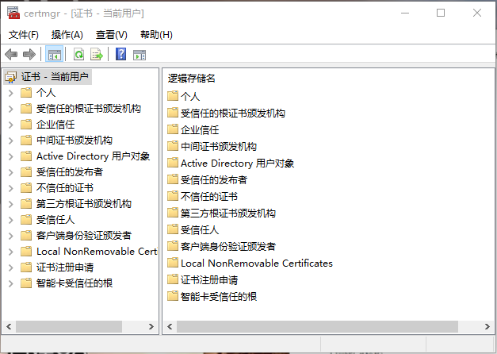
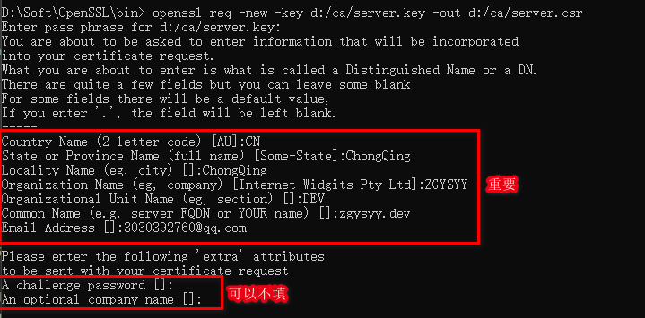
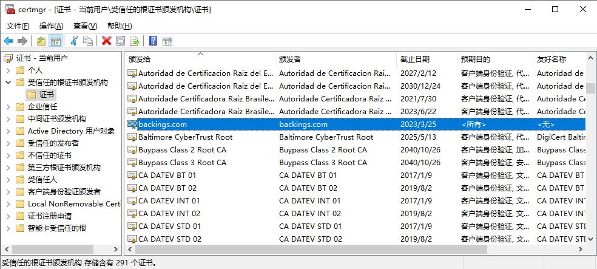
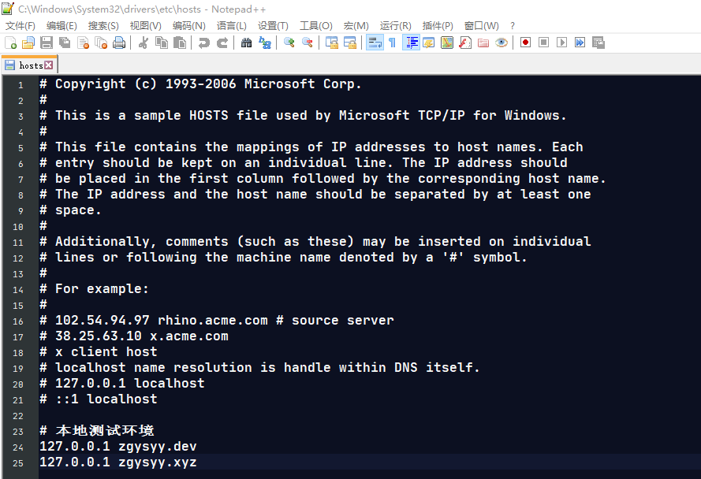
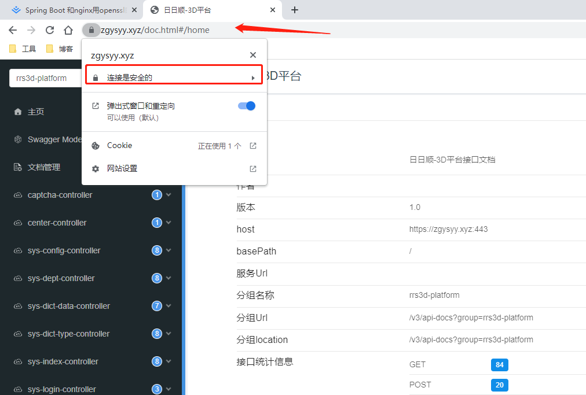
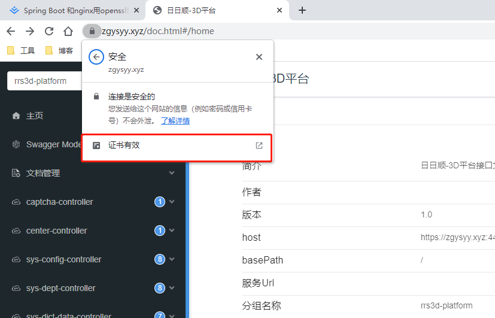
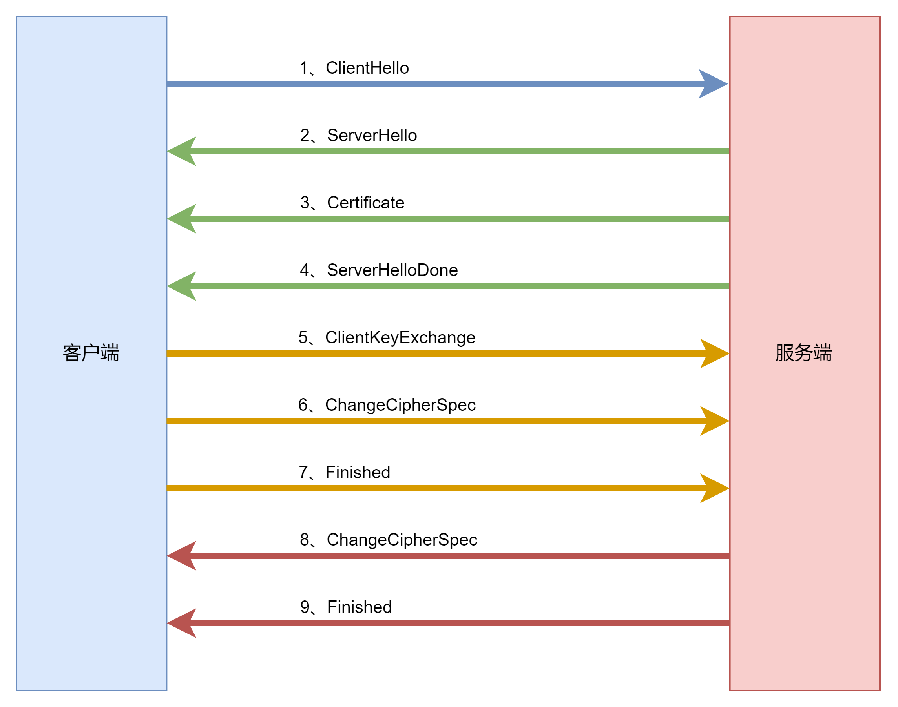

# 目录

[TOC]

# 1、使用 OpenSSL 创建证书

## 1.1、Windows 查看系统已存在证书

在 Windows 中，使用 `Win + R`，打开运行命令窗口，在窗口输入 `certmgr.msc` 打开证书管理器。



## 1.2、相关概念

CA：第三方证书签名机构。

KEY：私钥文件。

CSR：证书签名请求文件，由 KEY 来生成。

CRT：证书文件，由 CSR 通过 CA 签名后生成。 

## 1.3、OpenSSL 证书生成

创建服务器私钥

```cmd
openssl genrsa -des3 -out d:/ca/server.key 1024
```

> **Tips**
>
> 参数解释如下：
>
> - genrsa：生成私钥。
>
> - -des3：生成的私钥盐的加密方式。
>
> - -out：生成文件的位置。
>
> - 1024：生成的私钥长度，可以不写，默认 2048。

由私钥创建服务器待签名证书

```cmd
openssl req -new -key d:/ca/server.key -out d:/ca/server.csr
```



> **Tips**
>
> 参数解释如下：
>
> - req：发起请求。
> - -new：生成一个新的证书。
> - -key：指定私钥的位置。
> - -out：生成文件的位置。

查看服务器待签名证书内容

```cmd
openssl req -text -in d:/ca/server.csr
```

创建 CA 私钥

```
openssl genrsa -out d:/ca/myca.key
```

生成 CA 待签名证书

```
openssl req -new -key d:/ca/myca.key -out d:/ca/myca.csr
```

生成 CA 根证书

```
openssl x509 -req -in d:/ca/myca.csr -extensions v3_ca -signkey d:/ca/myca.key -out d:/ca/myca.crt
```

> **Tips**
>
> 参数解释如下：
>
> - x509：是密码学里公钥证书的格式标准。
> - -req：发起请求。
> - -extensions：证书的扩展项，这里的值是 v3_ca。
> - -signkey：指定私钥的位置。

对服务器证书签名

```cmd
openssl x509 -days 365 -req -in d:/ca/server.csr -extensions v3_req -CAkey d:/ca/myca.key -CA d:/ca/myca.crt -CAcreateserial -out d:/ca/server.crt
```

> **Tips**
>
> 参数解释如下：
>
> - -days：有效天数。
> - -in：服务器待签名证书位置。
> - -extensions：证书的扩展项，这里的值是 v3_req。
> - -CAkey：CA 私钥位置。
> - -CA：CA 证书位置。
> - -CAcreateserial：签发证书。

# 2、使用 OpenSSL 创建证书并完成证书自签然后集成 SpringBoot

> **Tips**
>
> 从chrome58版本开始，使用`SAN (Subject Alternative Name)`来代替比较流行的`Common Name (CN)`，如果使用自签名的证书，你只定义了CN，则将会出现`Subject Alternative Name Missing`错误

## 2.1、创建根证书

1. 创建根证书的私钥文件

    ```
    openssl genrsa -out d:/ca/myca.key
    ```

2. 创建根证书的待签名证书文件

    ```
    openssl req -new -key d:/ca/myca.key -out d:/ca/myca.csr
    ```

3. 创建根证书的证书文件

    ```
    openssl x509 -req -in d:/ca/myca.csr -extensions v3_ca -signkey d:/ca/myca.key -out d:/ca/myca.crt
    ```

## 2.2、创建服务证书

1. 创建配置文件 `server.conf`，内容如下

    ```text
    [req]
    distinguished_name = req_distinguished_name
    req_extensions = v3_req
    
    [req_distinguished_name]
    countryName = country
    stateOrProvinceName = province
    localityName = city
    organizationName = company name
    commonName = domain name or ip
     
    [v3_req]
    subjectAltName = @alt_names
    
    [alt_names]
    DNS.1=zgysyy.xyz
    DNS.2=zgysyy.dev
    ```

2. 创建服务的私钥文件

    ```
    openssl genrsa -des3 -out d:/ca/server.key
    ```

3. 创建服务的待签名证书文件

    ```
    openssl req -new -key d:/ca/server.key -out d:/ca/server.csr -config d:/ca/server.conf
    ```

4. 创建服务的证书文件

    ```
    openssl x509 -days 365 -req -in d:/ca/server.csr -extensions v3_req --extfile d:/ca/server.conf -CAkey d:/ca/myca.key -CA d:/ca/myca.crt -CAcreateserial -out d:/ca/server.crt
    ```

## 2.3、集成 SpringBoot

1. 将服务的证书文件从 crt 转为 p12 格式

    ```
    openssl pkcs12 -export -clcerts -in d:/ca/server.crt -inkey d:/ca/server.key -out d:/ca/server.p12
    ```

2. 在 SpringBoot 项目的 `application.properties` 文件下添加如下配置

    ```
    server.port=443
    server.ssl.key-store=classpath:server.p12
    server.ssl.key-store-password=123456
    server.ssl.key-store-type=pkcs12
    ```

## 2.4、信任根证书



## 2.5、验证

1. 修改本机 Hosts 文件，内容如下

    

2. 打开浏览器访问验证

    

    

# 3、HTTPS 四次握手详解

四次握手示意图如下所示：



各步骤详解如下：

1、ClientHello

客户端发送 Client Hello 消息，跟服务器打招呼，其中主要携带参数如下：

- 客户端的TLS版本号（Version）。
- 客户端支持的加密套件列表（Cipher Suites）。
- 客户端生成的随机数（Client Random）。

2、ServerHello

服务器收到客户端的 Client Hello 消息后，首先回复 Server Hello 消息，其中主要携带参数如下：

- 服务器确认支持客户端的TLS版本（Version）。
- 服务器从客户端发来的加密套件列表中选出一个最合适的加密组合（Cipher Suite）。
- 服务器生成的随机数（Server Random）。

3、Certificate

随后，服务器为了证明身份，会给客户端发送数字证书，其中主要内容如下：

- 服务器信息，比如公钥、域名、公司名等。
- CA 机构对证书的签名值。

4、ServerHelloDone

服务器告诉客户端，我要做的都做完了，现在看你表演。

5、ClientKeyExchange

根据步骤【2】所选择的加密组合来决定具体实现。

由于实现比较复杂，这里可以简单的理解为客户端生成了一个秘钥，并用服务器的公钥进行加密，然后将加密结果发送给服务器，告诉服务端后续的数据我会用这个秘钥进行加密。

6、ChangeCipherSpec

客户端告诉服务器，我以后就用步骤【5】生成的秘钥进行数据加密了哈。

7、Finished

客户端将步骤【1~7】产生的所有报文数据进行摘要计算得到一个摘要值，然后把步骤【5】得到的秘钥对摘要值进行加密，将加密值发送给服务器。并告诉服务器我要做的都做完了，现在看你表演。

该步骤是否能成功，取决于服务器用步骤【5】得到的秘钥对收到的加密值进行解密后得到的摘要值是否和服务器将步骤【1~7】产生的所有报文数据进行摘要计算得到一个摘要值相同来决定。

8、ChangeCipherSpec

服务器收到步骤【5】确定的秘钥后，回复客户端后续的数据我会用这个秘钥进行加密。

9、Finished

服务器将步骤【1~9】产生的所有报文数据进行摘要计算得到一个摘要值，然后把步骤【5】得到的秘钥对摘要值进行加密，将加密值发送给客户端。并告诉客户端我要做的都做完了，现在看你表演。

该步骤是否能成功，取决于客户端用步骤【5】得到的秘钥对收到的加密值进行解密后得到的摘要值是否和服务器将步骤【1~9】产生的所有报文数据进行摘要计算得到一个摘要值相同来决定。