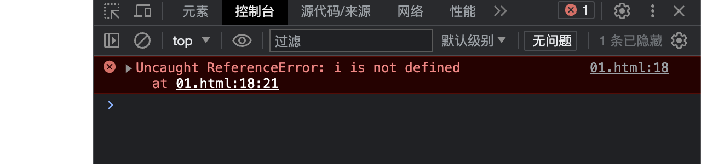

# 目录

[TOC]


# ES6

> ECMAScript 6.0 （简称 ES6）是 JavaScript 语言下的下一代标准，于 2015 年 6 月 正式发布。它的目标是使得 JavaScript 语言可以用来编写复杂的大型应用程序，成为企业级开发语言
>
> - 1997 年：ECMAScript 1.0。
> - 1998 年：ECMAScript 2.0。
> - 1999 年：ECMAScript 3.0。
> - 2006 年：ECMAScript 4.0（未通过）。
> - 2009 年：ECMAScript 5.0。
> - 2015 年：ECMAScript 6.0。
> - 至今：版本号改用年号的形式。

## 1、let 声明变量

### 1.1、块级作用域

使用 var 来声明变量时，在代码的任何地方都可以访问，示例代码如下

```html
<!DOCTYPE html>
<html lang="en">
<head>
    <meta charset="UTF-8">
    <meta name="viewport" content="width=device-width, initial-scale=1.0">
    <title>Document</title>
</head>
<body>
    
    <script>
        // 1、块级作用域
        if (true) {
            var i = 100;
        }
        console.log(i);
    </script>
</body>
</html>
```

结果如下：


如果使用 let 来声明变量，就可以避免该问题，代码如下：

```html
<!DOCTYPE html>
<html lang="en">
<head>
    <meta charset="UTF-8">
    <meta name="viewport" content="width=device-width, initial-scale=1.0">
    <title>Document</title>
</head>
<body>
    
    <script>
        // 1、块级作用域
        if (true) {
            let i = 100;
        }
        console.log(i);
    </script>
</body>
</html>
```

结果如下：



### 1.2、不允许重复声明

示例代码如下：

```html
<!DOCTYPE html>
<html lang="zh">
<head>
    <meta charset="UTF-8">
    <meta name="viewport" content="width=device-width, initial-scale=1.0">
    <title>Document</title>
</head>
<body>
    <script>
        // ==================== 使用 var 可以重复声明 ==================== START
        var a = 1;
        var a = 2;
        console.log(a);
        // ==================== 使用 var 可以重复声明 ==================== END

        // ==================== 使用 let 不可以重复声明 ==================== START
        let a = 1;
        let a = 2;
        console.log(a);
        // ==================== 使用 let 不可以重复声明 ==================== END
    </script>
</body>
</html>
```

### 1.3、无变量提升

当使用 var 时，会出现变量提升的效果，示例代码如下：

```html
<!DOCTYPE html>
<html lang="zh">
<head>
    <meta charset="UTF-8">
    <meta name="viewport" content="width=device-width, initial-scale=1.0">
    <title>Document</title>
</head>
<body>
    <script>
        // ==================== 使用 var 变量提升 ==================== START
        console.log(name);
        var name = "ZGY";
        // ==================== 使用 var 变量提升 ==================== END
    </script>
</body>
</html>
```

结果如下：


当使用 let 时，不会出现变量提升的效果，示例代码如下：

```html
<!DOCTYPE html>
<html lang="zh">
<head>
    <meta charset="UTF-8">
    <meta name="viewport" content="width=device-width, initial-scale=1.0">
    <title>Document</title>
</head>
<body>
    <script>
        // ==================== 使用 let 不存在变量提升 ==================== START
        console.log(name);
        let name = "ZGY";
        // ==================== 使用 let 不存在变量提升 ==================== END
    </script>
</body>
</html>
```

结果如下：


### 1.4、暂存性死区

示例代码如下：

```html
<!DOCTYPE html>
<html lang="zh">
<head>
    <meta charset="UTF-8">
    <meta name="viewport" content="width=device-width, initial-scale=1.0">
    <title>Document</title>
</head>
<body>
    <script>
        // ==================== 暂存性死区 ==================== START
        let myname = "ZGY";
        function test() {
            console.log(myname); // 方法体和外部使用 let 定义相同名称的属性名，导致暂存性死区，即变量不可访问
            let myname = "YY";
        }
        test();
        // ==================== 暂存性死区 ==================== END
    </script>
</body>
</html>
```

结果如下：


### 1.5、不与顶层挂钩

使用 var 声明变量，将默认和顶层的 window 对象挂钩，示例代码如下：

```html
<!DOCTYPE html>
<html lang="zh">
<head>
    <meta charset="UTF-8">
    <meta name="viewport" content="width=device-width, initial-scale=1.0">
    <title>Document</title>
</head>
<body>
    <script>
        // ==================== 使用 var 声明变量与顶层 window 挂钩 ==================== START
        var myname = "ZGY";
        console.log(myname, window.myname);
        // ==================== 使用 var 声明变量与顶层 window 挂钩 ==================== END
    </script>
</body>
</html>
```

结果如下：


使用 let 声明变量，不会和顶层的 window 对象挂钩，示例代码如下：

```html
<!DOCTYPE html>
<html lang="zh">
<head>
    <meta charset="UTF-8">
    <meta name="viewport" content="width=device-width, initial-scale=1.0">
    <title>Document</title>
</head>
<body>
    <script>
         // ==================== 使用 let 声明变量不与顶层 window 挂钩 ==================== START
         let myname = "ZGY";
         console.log(myname, window.myname);
        // ==================== 使用 var 声明变量不与顶层 window 挂钩 ==================== END
    </script>
</body>
</html>
```

结果如下：


## 2、const 声明常量

### 2.1、初始化必须赋值且不能再次赋值

常量必须在声明时就赋值，不能再次给常量赋值，示例代码如下：

```html
<!DOCTYPE html>
<html lang="zh">
<head>
    <meta charset="UTF-8">
    <meta name="viewport" content="width=device-width, initial-scale=1.0">
    <title>Document</title>
</head>
<body>
    <script>
        // ==================== 给常量再次赋值错误 ==================== START
        const myname = "ZGY";
        myname = "YY";
        // ==================== 给常量再次赋值错误 ==================== END
    </script>
</body>
</html>
```

结果如下：


定义常量时不赋值，后续再赋值错误，示例代码如下：

```html
<!DOCTYPE html>
<html lang="zh">
<head>
    <meta charset="UTF-8">
    <meta name="viewport" content="width=device-width, initial-scale=1.0">
    <title>Document</title>
</head>
<body>
    <script>
        // ==================== 定义常量时不赋值，后续再赋值错误 ==================== START
        const myname;
        myname = "ZGY";
        // ==================== 定义常量时不赋值，后续再赋值错误 ==================== END
    </script>
</body>
</html>
```

结果如下：


### 2.2、不能重复定义

示例代码如下：

```html
<!DOCTYPE html>
<html lang="zh">
<head>
    <meta charset="UTF-8">
    <meta name="viewport" content="width=device-width, initial-scale=1.0">
    <title>Document</title>
</head>
<body>
    <script>
        // ==================== 常量重复定义 ==================== START
        const myname = "ZGY";
        const myname = "YY";
        // ==================== 常量重复定义 ==================== END
    </script>
</body>
</html>
```

结果如下：


### 2.3、存在块级作用域

定义在代码块中的常量，代码块外是无法访问的。示例代码如下：

```html
<!DOCTYPE html>
<html lang="zh">
<head>
    <meta charset="UTF-8">
    <meta name="viewport" content="width=device-width, initial-scale=1.0">
    <title>Document</title>
</head>
<body>
    <script>
        // ==================== 块级作用域以外无法访问 ==================== START
        {
            const myname = "ZGY";
        }
        console.log(myname);
        // ==================== 块级作用域以外无法访问 ==================== END
    </script>
</body>
</html>
```

结果如下：


### 2.4、无常量提升

无法在常量声明前，进行访问。示例代码如下：

```html
<!DOCTYPE html>
<html lang="zh">
<head>
    <meta charset="UTF-8">
    <meta name="viewport" content="width=device-width, initial-scale=1.0">
    <title>Document</title>
</head>
<body>
    <script>
        // ==================== 无常量提升 ==================== START
        console.log(myname);
        const myname = "ZGY";
        // ==================== 无常量提升 ==================== END
    </script>
</body>
</html>
```

结果如下：


### 2.5、暂存性死区

示例代码如下：

```html
<!DOCTYPE html>
<html lang="zh">
<head>
    <meta charset="UTF-8">
    <meta name="viewport" content="width=device-width, initial-scale=1.0">
    <title>Document</title>
</head>
<body>
    <script>
        // ==================== 暂存性死区 ==================== START
        const myname = "ZGY";
        function test() {
            console.log(myname); // 方法体和外部使用 const 定义相同名称的属性名，导致暂存性死区，即常量不可访问
            const myname = "YY";
        }
        test();
        // ==================== 暂存性死区 ==================== END
    </script>
</body>
</html>
```

结果如下：


### 2.6、不与顶层对象挂钩

示例代码如下：

```html
<!DOCTYPE html>
<html lang="zh">
<head>
    <meta charset="UTF-8">
    <meta name="viewport" content="width=device-width, initial-scale=1.0">
    <title>Document</title>
</head>
<body>
    <script>
        // ==================== 不与顶层对象 window 挂钩 ==================== START
        const myname = "ZGY";
        console.log(myname, window.myname);
        // ==================== 不与顶层对象 window 挂钩 ==================== END
    </script>
</body>
</html>
```

结果如下：


### 2.7、声明对象

使用 const 声明对象时，实际指向的是对象的引用，因此对象内部是属性依然可以修改，如果想要实现对象内部属性不能修改，可以使用 `Object.freeze()` 函数将对象作为入参。示例代码如下：

```html
<!DOCTYPE html>
<html lang="zh">
<head>
    <meta charset="UTF-8">
    <meta name="viewport" content="width=device-width, initial-scale=1.0">
    <title>Document</title>
</head>
<body>
    <script>
        // ==================== 修饰对象 ==================== START
        const user = {
            name: "ZGY",
            age: 26
        }
        console.log(user)
        user.name = "YY";
        console.log(user);

        const student = Object.freeze({
            name: "ZGY",
            age: 18
        });
        console.log(student);
        student.age = 22;
        console.log(student);
        // ==================== 修饰对象 ==================== END
    </script>
</body>
</html>
```

结果如下：


<b style="color:red">Tips</b>：Object.freeze() 函数只对对象的第一层简单属性生效，如果对象中存在复杂属性，将会失效，解决办法是将复杂属性作为参数调用 Object.freeze() 函数做进一步封装。

## 3、变量结构赋值

### 3.1、数组解构

示例代码如下：

```html
<!DOCTYPE html>
<html lang="zh">
<head>
    <meta charset="UTF-8">
    <meta name="viewport" content="width=device-width, initial-scale=1.0">
    <title>Document</title>
</head>
<body>
    <script>
        // ==================== 数组解构 ==================== START
        let arr = [1, 2, 3];
        let [a, b, c] = arr;
        console.log(a, b, c);
        // ==================== 数组解构 ==================== END

        // ==================== 数组解构-元素交换 ==================== START
        let x = 1;
        let y = 2;
        [y, x] = [x, y];
        console.log(x, y);
        // ==================== 数组解构-元素交换 ==================== END
    </script>
</body>
</html>
```

结果如下：


嵌套数组解构，示例代码如下：

```html
<!DOCTYPE html>
<html lang="zh">
<head>
    <meta charset="UTF-8">
    <meta name="viewport" content="width=device-width, initial-scale=1.0">
    <title>Document</title>
</head>
<body>
    <script>
        // ==================== 数组解构-嵌套数组 ==================== START
        let arr = [1, [2, 3, 4], 5, 6];
        let [a, [b, , c], d] = arr;
        console.log(a, b, c, d);
        // ==================== 数组解构-嵌套数组 ==================== END
    </script>
</body>
</html>
```

结果如下：


数组解构设置默认值，示例代码如下：

```html
<!DOCTYPE html>
<html lang="zh">
<head>
    <meta charset="UTF-8">
    <meta name="viewport" content="width=device-width, initial-scale=1.0">
    <title>Document</title>
</head>
<body>
    <script>
        // ==================== 数组解构-设置默认值 ==================== START
        let [x, y = 200] = [100, ];
        console.log(x, y);
        // ==================== 数组解构-设置默认值 ==================== END
    </script>
</body>
</html>
```

结果如下：


### 3.2、对象解构

对象解构赋值，示例代码如下：

```html
<!DOCTYPE html>
<html lang="zh">
<head>
    <meta charset="UTF-8">
    <meta name="viewport" content="width=device-width, initial-scale=1.0">
    <title>Document</title>
</head>
<body>
    <script>
        // ==================== 对象解构赋值-简单对象 ==================== START
        let obj = {
            name: "ZGY",
            age: 26
        }

        let {name, age} = obj
        console.log(name, age);
        // ==================== 对象解构赋值-简单对象 ==================== END
    </script>
</body>
</html>
```

结果如下：


对象解构赋值时，自定义变量名，示例代码如下：

```html
<!DOCTYPE html>
<html lang="zh">
<head>
    <meta charset="UTF-8">
    <meta name="viewport" content="width=device-width, initial-scale=1.0">
    <title>Document</title>
</head>
<body>
    <script>
        // ==================== 对象解构赋值-简单对象-自定义变量名 ==================== START
        let data = "OJBK!";
        let obj = {
            code: 200,
            data: "sucess"
        }
        let {code, data:da} = obj;
        console.log(code, da);
        // ==================== 对象解构赋值-简单对象-自定义变量名 ==================== END
    </script>
</body>
</html>
```

结果如下：


对象解构时，设置默认值，示例代码如下：

```html
<!DOCTYPE html>
<html lang="zh">
<head>
    <meta charset="UTF-8">
    <meta name="viewport" content="width=device-width, initial-scale=1.0">
    <title>Document</title>
</head>
<body>
    <script>
        // ==================== 对象解构赋值-设置默认值 ==================== START
        let obj = {
            name: "ZGY",
            age: 26
        }
        let {name, age, sex = "男"} = obj;
        console.log(name, age, sex);
        // ==================== 对象解构赋值-设置默认值 ==================== END
    </script>
</body>
</html>
```

结果如下：


复杂对象进行解构赋值，示例代码如下：

```html
<!DOCTYPE html>
<html lang="zh">
<head>
    <meta charset="UTF-8">
    <meta name="viewport" content="width=device-width, initial-scale=1.0">
    <title>Document</title>
</head>
<body>
    <script>
        // ==================== 复杂对象解构赋值 ==================== START
        let obj = {
            name: "ZGY",
            age: 26,
            other: {
                list: ["aaa", "bbb", "ccc"]
            }
        }
        let {name, age, other: {list}} = obj;
        console.log(name, age, list);
        // ==================== 复杂对象解构赋值 ==================== END
    </script>
</body>
</html>
```

结果如下：


函数参数解构，示例代码如下：

```html
<!DOCTYPE html>
<html lang="zh">
<head>
    <meta charset="UTF-8">
    <meta name="viewport" content="width=device-width, initial-scale=1.0">
    <title>Document</title>
</head>
<body>
    <script>
        // ==================== 函数参数解构赋值 ==================== START
        let obj = {
            name: "ZGY",
            age: 26,
            other: {
                list: ["aaa", "bbb", "ccc"]
            }
        }

        function handleData({name, age, other:{list}}) {
            console.log(name, age, list);
        }

        handleData(obj);
        // ==================== 函数参数解构赋值 ==================== END
    </script>
</body>
</html>
```

结果如下：


字符串解构赋值，示例代码如下：

```html
<!DOCTYPE html>
<html lang="zh">
<head>
    <meta charset="UTF-8">
    <meta name="viewport" content="width=device-width, initial-scale=1.0">
    <title>Document</title>
</head>
<body>
    <script>
        // ==================== 字符串解构赋值 ==================== START
        let str = "hello world!";
        let [x, y, z] = str;
        let {legnth} = str;
        console.log(x, y, z, length);
        // ==================== 字符串解构赋值 ==================== END
    </script>
</body>
</html>
```

结果如下：


## 4、模板字符串

简单的示例代码如下：

```html
<!DOCTYPE html>
<html lang="zh">
<head>
    <meta charset="UTF-8">
    <meta name="viewport" content="width=device-width, initial-scale=1.0">
    <title>Document</title>
    <style>
        .active {
            color: red;
        }
    </style>
</head>
<body>
    <ul>

    </ul>

    <script>
        // ==================== 模板字符串 ==================== START
        function sayHello() {
            return "hello!";
        }
    
        let arr = ["ZGY", "YY", "LHM"];
        let list = arr.map(function(item, index) {
            return `<li class = "${index === 0 ? 'active': ''}">
                <b>${item}</b>
                ${sayHello()}
            </li>`;
        });
        console.log(list);
    
        let ul = document.querySelector("ul");
        ul.innerHTML = list.join("");
        // ==================== 模板字符串 ==================== END
    </script>
</body>
</html>
```

结果如下：


## 5、字符串与数值扩展

### 5.1、字符串扩展

示例代码如下：

```html
<!DOCTYPE html>
<html lang="zh">
<head>
    <meta charset="UTF-8">
    <meta name="viewport" content="width=device-width, initial-scale=1.0">
    <title>Document</title>
</head>
<body>
    <script>
        let myname = "ZhangGuoYuan";
        
        // ==================== 判断字符串中是否存在 Guo ==================== START
        console.log(myname.includes("Guo"));
        // ==================== 判断字符串中是否存在 Guo ==================== END

        // ==================== 判断字符串中是否是以 Zhang 开头 ==================== START
        console.log(myname.startsWith("Zhang"));
        // ==================== 判断字符串中是否是以 Zhang 开头 ==================== END

        // ==================== 判断字符串中是否是以 Yuan 结尾 ==================== START
        console.log(myname.endsWith("Yuan"));
        // ==================== 判断字符串中是否是以 Yuan 结尾 ==================== END

        // ==================== 判断字符串中从第 5 个元素开始，往后是否存在 Guo ==================== START
        console.log(myname.includes("Guo", 5));
        // ==================== 判断字符串中从第 5 个元素开始，往后是否存在 Guo ==================== END

        // ==================== 判断字符串中从第 5 个元素开始，往后是否是以 Guo 开头 ==================== START
        console.log(myname.startsWith("Guo", 5));
        // ==================== 判断字符串中从第 5 个元素开始，往后是否是以 Guo 开头 ==================== END

        // ==================== 判断字符串中从第 8 个元素开始，往前是否是以 Guo 结尾 ==================== START
        console.log(myname.endsWith("Guo", 8));
        // ==================== 判断字符串中从第 8 个元素开始，往前是否是以 Guo 结尾 ==================== END

        // ==================== repeat 使用 ==================== START
        console.log(myname.repeat(0));
        console.log(myname.repeat(1));
        console.log(myname.repeat(2));
        console.log(myname.repeat("3"));
        // ==================== repeat 使用 ==================== END
    </script>
</body>
</html>
```

结果如下：


### 5.2、数值扩展

示例代码如下：

```html
<!DOCTYPE html>
<html lang="zh">
<head>
    <meta charset="UTF-8">
    <meta name="viewport" content="width=device-width, initial-scale=1.0">
    <title>Document</title>
</head>
<body>
    <script>
        // ==================== 支持各种进制写法 ==================== START
        // 二进制
        console.log(0b110);
        // 八进制
        console.log(0o117);
        // 十六进制
        console.log(0xABC);
        // ==================== 支持各种进制写法 ==================== END

        // ==================== Number.isFinite 数字是否有效判断 ==================== START
        console.log(Number.isFinite(100)); // true
        console.log(Number.isFinite(100/0)); // false
        console.log(Number.isFinite(Infinity)); // false
        console.log(Number.isFinite("100")); // false
        // ==================== Number.isFinite 数字是否有效判断 ==================== END

        // ==================== Number.isNaN 是否不是一个 Number 判断 ==================== START
        console.log(Number.isNaN(100)); // false
        console.log(Number.isNaN(NaN)); // true
        console.log(Number.isNaN("ABC")); // false
        console.log(Number.isNaN("100")); // false
        // ==================== Number.isNaN 是否不是一个 Number 判断 ==================== END

        // ==================== Number.isInteger 是否是整数判断 ==================== START
        console.log(Number.isInteger(100)); // true
        console.log(Number.isInteger(100.0)); // true
        console.log(Number.isInteger("ABC")); // false
        console.log(Number.isInteger("100")); // false
        // ==================== Number.isInteger 是否是整数判断 ==================== END

        // ==================== Number.EPSILON 极小常量应用 ==================== START
        function isEqual(x, y) {
            return Math.abs(x - y) < Number.EPSILON;
        }
        console.log(isEqual(0.1 + 0.2, 0.3));
        // ==================== Number.EPSILON 极小常量应用 ==================== END

        // ==================== Number.trunc 将小数抹掉 ==================== START
        console.log(Math.trunc(1.2)); // 1
        console.log(Math.trunc(1.8)); // 1
        console.log(Math.trunc(-1.8)); // -1
        console.log(Math.trunc(-1.2)); // -1
        // ==================== Number.trunc 将小数抹掉 ==================== END

        // ==================== Number.sign 判断一个数是正数、负数、零 ==================== START
        console.log(Math.sign(-100)); // -1
        console.log(Math.sign(100)); // 1
        console.log(Math.sign(0)); // 0
        console.log(Math.sign(-0)); // -0
        console.log(Math.sign("ZGY")); // NaN
        // ==================== Number.sign 判断一个数是正数、负数、零 ==================== END
    </script>
</body>
</html>
```

结果如下：


## 6、数组扩展

### 6.1、展开运算符

数组复制，并且不影响原数组，示例代码如下：

```html
<!DOCTYPE html>
<html lang="zh">
<head>
    <meta charset="UTF-8">
    <meta name="viewport" content="width=device-width, initial-scale=1.0">
    <title>Document</title>
</head>
<body>
    <script>
        // ==================== 数组复制，复制后不影响原数组 ==================== START
        let arr = [1, 2, 3]
        let arr1 = arr.concat();
        console.log(arr1);
        arr1.push(4);
        console.log(arr, arr1);
        // ==================== 数组复制，复制后不影响原数组 ==================== END
    </script>
</body>
</html>
```

结果如下：


<b style="color:red;">Tips</b>：这种复制被称为浅复制，当数组中存的是对象时，实际复制的是对象的引用。

数组复制，并且不影响原数组的另一种写法，示例代码如下：

```html
<!DOCTYPE html>
<html lang="zh">
<head>
    <meta charset="UTF-8">
    <meta name="viewport" content="width=device-width, initial-scale=1.0">
    <title>Document</title>
</head>
<body>
    <script>
        // ==================== 数组复制，复制后不影响原数组另一种写法 ==================== START
        let arr = [1, 2, 3];
        let arr1 = [...arr];
        let arr2 = [4, 5, 6];
        let arr3 = [...arr, ...arr2];
        console.log(arr1, arr2, arr3);
        // ==================== 数组复制，复制后不影响原数组另一种写法 ==================== END
    </script>
</body>
</html>
```

结果如下：


结合数组解构赋值的应用，示例代码如下：

```html
<!DOCTYPE html>
<html lang="zh">
<head>
    <meta charset="UTF-8">
    <meta name="viewport" content="width=device-width, initial-scale=1.0">
    <title>Document</title>
</head>
<body>
    <script>
        // ==================== 结合数组解构赋值的应用 ==================== START
        let arr = [1, 2, 3, 4, 5, 6];
        let [a, b, ...c] = arr;
        console.log(a, b, c);
        // ==================== 结合数组解构赋值的应用 ==================== END
    </script>
</body>
</html>
```

结果如下：


### 6.2、Array.from 函数

Array.from 函数可以将类似数组的元素（比如：arguments）转换为真正的数据，示例代码如下：

```html
<!DOCTYPE html>
<html lang="zh">
<head>
    <meta charset="UTF-8">
    <meta name="viewport" content="width=device-width, initial-scale=1.0">
    <title>Document</title>
</head>
<body>
    <ul>
        <li>AAA</li>
        <li>BBB</li>
        <li>CCC</li>
    </ul>
    <script>
        // ==================== Array.from 的示例 1 ==================== START
        function test() {
            console.log(arguments);
            console.log(Array.from(arguments));
        }

        test(1, 2, 3, 4);
        // ==================== Array.from 的示例 1 ==================== END

        // ==================== Array.from 的示例 2 ==================== START
        let ulArr = document.querySelectorAll("ul li");
        let ulArr1 = Array.from(ulArr);
        console.log(ulArr);
        console.log(ulArr1);
        // ==================== Array.from 的示例 2 ==================== END
    </script>
</body>
</html>
```

结果如下：


### 6.3、Array.of 函数

Array.of 函数的作用是初始化一个数组，示例代码如下：

```html
<!DOCTYPE html>
<html lang="zh">
<head>
    <meta charset="UTF-8">
    <meta name="viewport" content="width=device-width, initial-scale=1.0">
    <title>Document</title>
</head>
<body>
    <script>
        let arr = [1, 2, 3, 4];
        let arr1 = Array(4);
        let arr2 = Array.of(1, 2, 3, 4);
        console.log("arr", arr);
        console.log("arr1", arr1);
        console.log("arr2", arr2);
    </script>
</body>
</html>
```

结果如下：


### 6.4、findXXX 函数

示例代码如下：

```html
<!DOCTYPE html>
<html lang="zh">
<head>
    <meta charset="UTF-8">
    <meta name="viewport" content="width=device-width, initial-scale=1.0">
    <title>Document</title>
</head>
<body>
    <script>
        let arr = [1, 2, 3, 4];
        let res = arr.find(function(item) {
            return item > 2;
        });
        console.log("res", res);

        let res1 = arr.findIndex(function(item) {
            return item > 3;
        });
        console.log("res1", res1);

        // ES13 发布的方法
        let res2 = arr.findLast(function(item) {
            return item > 2;
        });
        console.log("res2", res2);

        // ES13 发布的方法
        let res3 = arr.findLastIndex(function(item) {
            return item > 3;
        });
        console.log("res3", res3);
    </script>
</body>
</html>
```

结果如下：


### 6.5、Array.fill 函数

Array.fill 函数的作用就是给数组填充数据，示例代码如下：

```html
<!DOCTYPE html>
<html lang="zh">
<head>
    <meta charset="UTF-8">
    <meta name="viewport" content="width=device-width, initial-scale=1.0">
    <title>Document</title>
</head>
<body>
    <script>
        let arr = Array(5).fill("ZGY");
        console.log(arr);

        let arr1 = ["ZGY", "YY", "LHM"];
        arr1.fill("AAA", 0, 1);
        console.log(arr1);
    </script>
</body>
</html>
```

结果如下：


### 6.6、flat、flatMap 函数

示例代码如下：

```html
<!DOCTYPE html>
<html lang="zh">
<head>
    <meta charset="UTF-8">
    <meta name="viewport" content="width=device-width, initial-scale=1.0">
    <title>Document</title>
</head>
<body>
    <script>
        let arr = [1, 2, 3, [4, 5, 6]];
        let arr1 = arr.flat();
        console.log(arr1);

        let arr2 = [{name:"ZGY", list:[1, 2, 3]}, {name:"LHM", list:[4, 5, 6]}];
        let arr3 = arr2.flatMap(function(item) {
            return item.list;
        });
        console.log(arr3);
    </script>
</body>
</html>
```

结果如下：


## 7、对象扩展

### 7.1、对象简写

在给对象赋值时，如果属性名称和值的变量相同，就可以进行对象简写，示例代码如下：

```html
<!DOCTYPE html>
<html lang="zh">
<head>
    <meta charset="UTF-8">
    <meta name="viewport" content="width=device-width, initial-scale=1.0">
    <title>Document</title>
</head>
<body>
    <script>
        let name = "ZGY";
        let age = 26;
        let obj = {
            name, // name: name
            age // age: age
        }
        console.log(obj);
    </script>
</body>
</html>
```

### 7.2、对象属性表达式

当一个属性的名称是变量时，可以使用对象属性表达式，示例代码如下：

```html
<!DOCTYPE html>
<html lang="zh">
<head>
    <meta charset="UTF-8">
    <meta name="viewport" content="width=device-width, initial-scale=1.0">
    <title>Document</title>
</head>
<body>
    <script>
        let name = "ZGY";
        let obj = {
            [name]: "AAA"
        }
        console.log(obj);
    </script>
</body>
</html>
```

结果如下：


### 7.3、扩展运算符

该特性是在 ES9 提出的，可以实现将一个对象的属性复制到另外一个对象中，示例代码如下：

```html
<!DOCTYPE html>
<html lang="zh">
<head>
    <meta charset="UTF-8">
    <meta name="viewport" content="width=device-width, initial-scale=1.0">
    <title>Document</title>
</head>
<body>
    <script>
        // ==================== 使用扩展运算符进行对象复制 ==================== START
        let obj = {
            name: "ZGY"
        }
        let obj1 = {
            ...obj
        }
        let obj2 = {
            age: 26
        }
        let obj3 = {...obj, ...obj2}
        console.log(obj1);
        obj2.name = "LHM";
        console.log(obj, obj2);
        console.log(obj3);

        let obj4 = {
            name: "YY",
            ...obj // 相同属性，后一个会覆盖前面的
        }
        console.log(obj4);
        // ==================== 使用扩展运算符进行对象复制 ==================== END

        // ==================== ES6 对象复制 ==================== START
        let obj5 = {
            name: "ZGY"
        }
        let obj6 = {
            age: 26
        }
        let obj7 = {
            name: "YY"
        }
        Object.assign(obj5, obj6, obj7); // 将属性复制到第一参数中
        console.log("obj5", obj5);
        let obj8 = {}
        Object.assign(obj8, obj5, obj6, obj7);
        console.log("obj8", obj8);
        // ==================== ES6 对象复制 ==================== END
    </script>
</body>
</html>
```

结果如下：


<b style="color:red;">Tips</b>：`Object.assign` 是把属性复制到第一个参数中。

### 7.4、Object.is 函数

Object.is 函数的作用是判断对象是否相等，示例代码如下：

```html
<!DOCTYPE html>
<html lang="zh">
<head>
    <meta charset="UTF-8">
    <meta name="viewport" content="width=device-width, initial-scale=1.0">
    <title>Document</title>
</head>
<body>
    <script>
        console.log(Object.is(6, 6)); // true
        console.log(Object.is(6, "6")); // false
        console.log(Object.is({}, {})); // false
        console.log(Object.is(parseInt("ZGY"), NaN)); // true
        console.log(Object.is(-0, 0)); // false
    </script>
</body>
</html>
```

结果如下：


## 8、函数扩展

## 9、Symbol

## 10、Iterator

## 11、Set 数据结构

## 12、Map 数据结构

## 13、Proxy

## 14、Reflect

## 15、Promise 对象

## 16、Generator 函数

## 17、Class 语法

## 18、Class 继承

## 19、Module 语法

## 20、NodeJS 中的模块化

# ES7

## 1、新特性

# ES8

## 1、async 与 await

## 2、对象方法扩展

## 3、字符串填充

# ES9

## 1、rest 与扩展运算符

## 2、正则扩展

## 3、Promise.finally

## 4、异步迭代

# ES10

## 1、Object.fromEntries

## 2、trimStart 与 trimEnd

## 3、其他新增

# ES11

## 1、Promise.allSettled

## 2、Module 新增

## 3、String 的 matchAll 方法

## 4、BigInt

## 5、顶层对象 globalThis

## 6、空值合并运算符

## 7、可选链操作符

# ES12

## 1、新增逻辑操作符

## 2、数字分隔符

## 3、字符串的 replaceAll 方法

## 4、Promise.any

## 5、WeakRefs

## 6、FinalizationRegistry

# ES13

## 1、类新增特性

## 2、最外层的 await

## 3、at 函数

## 4、正则匹配的开始和结束索引

## 5、其他新增特性