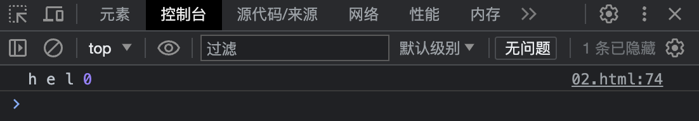
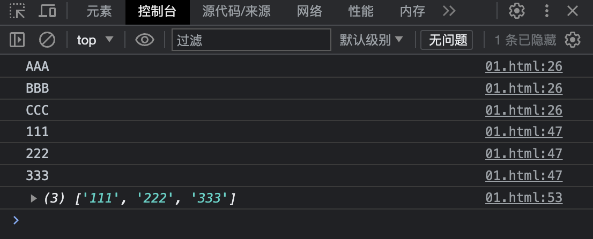

# 目录

[TOC]


# ES6

> ECMAScript 6.0 （简称 ES6）是 JavaScript 语言下的下一代标准，于 2015 年 6 月 正式发布。它的目标是使得 JavaScript 语言可以用来编写复杂的大型应用程序，成为企业级开发语言
>
> - 1997 年：ECMAScript 1.0。
> - 1998 年：ECMAScript 2.0。
> - 1999 年：ECMAScript 3.0。
> - 2006 年：ECMAScript 4.0（未通过）。
> - 2009 年：ECMAScript 5.0。
> - 2015 年：ECMAScript 6.0。
> - 至今：版本号改用年号的形式。

## 1、let 声明变量

### 1.1、块级作用域

使用 var 来声明变量时，在代码的任何地方都可以访问，示例代码如下

```html
<!DOCTYPE html>
<html lang="en">
<head>
    <meta charset="UTF-8">
    <meta name="viewport" content="width=device-width, initial-scale=1.0">
    <title>Document</title>
</head>
<body>
    
    <script>
        // 1、块级作用域
        if (true) {
            var i = 100;
        }
        console.log(i);
    </script>
</body>
</html>
```

结果如下：


如果使用 let 来声明变量，就可以避免该问题，代码如下：

```html
<!DOCTYPE html>
<html lang="en">
<head>
    <meta charset="UTF-8">
    <meta name="viewport" content="width=device-width, initial-scale=1.0">
    <title>Document</title>
</head>
<body>
    
    <script>
        // 1、块级作用域
        if (true) {
            let i = 100;
        }
        console.log(i);
    </script>
</body>
</html>
```

结果如下：


### 1.2、不允许重复声明

示例代码如下：

```html
<!DOCTYPE html>
<html lang="zh">
<head>
    <meta charset="UTF-8">
    <meta name="viewport" content="width=device-width, initial-scale=1.0">
    <title>Document</title>
</head>
<body>
    <script>
        // ==================== 使用 var 可以重复声明 ==================== START
        var a = 1;
        var a = 2;
        console.log(a);
        // ==================== 使用 var 可以重复声明 ==================== END

        // ==================== 使用 let 不可以重复声明 ==================== START
        let a = 1;
        let a = 2;
        console.log(a);
        // ==================== 使用 let 不可以重复声明 ==================== END
    </script>
</body>
</html>
```

### 1.3、无变量提升

当使用 var 时，会出现变量提升的效果，示例代码如下：

```html
<!DOCTYPE html>
<html lang="zh">
<head>
    <meta charset="UTF-8">
    <meta name="viewport" content="width=device-width, initial-scale=1.0">
    <title>Document</title>
</head>
<body>
    <script>
        // ==================== 使用 var 变量提升 ==================== START
        console.log(name);
        var name = "ZGY";
        // ==================== 使用 var 变量提升 ==================== END
    </script>
</body>
</html>
```

结果如下：


当使用 let 时，不会出现变量提升的效果，示例代码如下：

```html
<!DOCTYPE html>
<html lang="zh">
<head>
    <meta charset="UTF-8">
    <meta name="viewport" content="width=device-width, initial-scale=1.0">
    <title>Document</title>
</head>
<body>
    <script>
        // ==================== 使用 let 不存在变量提升 ==================== START
        console.log(name);
        let name = "ZGY";
        // ==================== 使用 let 不存在变量提升 ==================== END
    </script>
</body>
</html>
```

结果如下：


### 1.4、暂存性死区

示例代码如下：

```html
<!DOCTYPE html>
<html lang="zh">
<head>
    <meta charset="UTF-8">
    <meta name="viewport" content="width=device-width, initial-scale=1.0">
    <title>Document</title>
</head>
<body>
    <script>
        // ==================== 暂存性死区 ==================== START
        let myname = "ZGY";
        function test() {
            console.log(myname); // 方法体和外部使用 let 定义相同名称的属性名，导致暂存性死区，即变量不可访问
            let myname = "YY";
        }
        test();
        // ==================== 暂存性死区 ==================== END
    </script>
</body>
</html>
```

结果如下：


### 1.5、不与顶层挂钩

使用 var 声明变量，将默认和顶层的 window 对象挂钩，示例代码如下：

```html
<!DOCTYPE html>
<html lang="zh">
<head>
    <meta charset="UTF-8">
    <meta name="viewport" content="width=device-width, initial-scale=1.0">
    <title>Document</title>
</head>
<body>
    <script>
        // ==================== 使用 var 声明变量与顶层 window 挂钩 ==================== START
        var myname = "ZGY";
        console.log(myname, window.myname);
        // ==================== 使用 var 声明变量与顶层 window 挂钩 ==================== END
    </script>
</body>
</html>
```

结果如下：


使用 let 声明变量，不会和顶层的 window 对象挂钩，示例代码如下：

```html
<!DOCTYPE html>
<html lang="zh">
<head>
    <meta charset="UTF-8">
    <meta name="viewport" content="width=device-width, initial-scale=1.0">
    <title>Document</title>
</head>
<body>
    <script>
         // ==================== 使用 let 声明变量不与顶层 window 挂钩 ==================== START
         let myname = "ZGY";
         console.log(myname, window.myname);
        // ==================== 使用 var 声明变量不与顶层 window 挂钩 ==================== END
    </script>
</body>
</html>
```

结果如下：


## 2、const 声明常量

### 2.1、初始化必须赋值且不能再次赋值

常量必须在声明时就赋值，不能再次给常量赋值，示例代码如下：

```html
<!DOCTYPE html>
<html lang="zh">
<head>
    <meta charset="UTF-8">
    <meta name="viewport" content="width=device-width, initial-scale=1.0">
    <title>Document</title>
</head>
<body>
    <script>
        // ==================== 给常量再次赋值错误 ==================== START
        const myname = "ZGY";
        myname = "YY";
        // ==================== 给常量再次赋值错误 ==================== END
    </script>
</body>
</html>
```

结果如下：


定义常量时不赋值，后续再赋值错误，示例代码如下：

```html
<!DOCTYPE html>
<html lang="zh">
<head>
    <meta charset="UTF-8">
    <meta name="viewport" content="width=device-width, initial-scale=1.0">
    <title>Document</title>
</head>
<body>
    <script>
        // ==================== 定义常量时不赋值，后续再赋值错误 ==================== START
        const myname;
        myname = "ZGY";
        // ==================== 定义常量时不赋值，后续再赋值错误 ==================== END
    </script>
</body>
</html>
```

结果如下：


### 2.2、不能重复定义

示例代码如下：

```html
<!DOCTYPE html>
<html lang="zh">
<head>
    <meta charset="UTF-8">
    <meta name="viewport" content="width=device-width, initial-scale=1.0">
    <title>Document</title>
</head>
<body>
    <script>
        // ==================== 常量重复定义 ==================== START
        const myname = "ZGY";
        const myname = "YY";
        // ==================== 常量重复定义 ==================== END
    </script>
</body>
</html>
```

结果如下：


### 2.3、存在块级作用域

定义在代码块中的常量，代码块外是无法访问的。示例代码如下：

```html
<!DOCTYPE html>
<html lang="zh">
<head>
    <meta charset="UTF-8">
    <meta name="viewport" content="width=device-width, initial-scale=1.0">
    <title>Document</title>
</head>
<body>
    <script>
        // ==================== 块级作用域以外无法访问 ==================== START
        {
            const myname = "ZGY";
        }
        console.log(myname);
        // ==================== 块级作用域以外无法访问 ==================== END
    </script>
</body>
</html>
```

结果如下：


### 2.4、无常量提升

无法在常量声明前，进行访问。示例代码如下：

```html
<!DOCTYPE html>
<html lang="zh">
<head>
    <meta charset="UTF-8">
    <meta name="viewport" content="width=device-width, initial-scale=1.0">
    <title>Document</title>
</head>
<body>
    <script>
        // ==================== 无常量提升 ==================== START
        console.log(myname);
        const myname = "ZGY";
        // ==================== 无常量提升 ==================== END
    </script>
</body>
</html>
```

结果如下：


### 2.5、暂存性死区

示例代码如下：

```html
<!DOCTYPE html>
<html lang="zh">
<head>
    <meta charset="UTF-8">
    <meta name="viewport" content="width=device-width, initial-scale=1.0">
    <title>Document</title>
</head>
<body>
    <script>
        // ==================== 暂存性死区 ==================== START
        const myname = "ZGY";
        function test() {
            console.log(myname); // 方法体和外部使用 const 定义相同名称的属性名，导致暂存性死区，即常量不可访问
            const myname = "YY";
        }
        test();
        // ==================== 暂存性死区 ==================== END
    </script>
</body>
</html>
```

结果如下：


### 2.6、不与顶层对象挂钩

示例代码如下：

```html
<!DOCTYPE html>
<html lang="zh">
<head>
    <meta charset="UTF-8">
    <meta name="viewport" content="width=device-width, initial-scale=1.0">
    <title>Document</title>
</head>
<body>
    <script>
        // ==================== 不与顶层对象 window 挂钩 ==================== START
        const myname = "ZGY";
        console.log(myname, window.myname);
        // ==================== 不与顶层对象 window 挂钩 ==================== END
    </script>
</body>
</html>
```

结果如下：


### 2.7、声明对象

使用 const 声明对象时，实际指向的是对象的引用，因此对象内部是属性依然可以修改，如果想要实现对象内部属性不能修改，可以使用 `Object.freeze()` 函数将对象作为入参。示例代码如下：

```html
<!DOCTYPE html>
<html lang="zh">
<head>
    <meta charset="UTF-8">
    <meta name="viewport" content="width=device-width, initial-scale=1.0">
    <title>Document</title>
</head>
<body>
    <script>
        // ==================== 修饰对象 ==================== START
        const user = {
            name: "ZGY",
            age: 26
        }
        console.log(user)
        user.name = "YY";
        console.log(user);

        const student = Object.freeze({
            name: "ZGY",
            age: 18
        });
        console.log(student);
        student.age = 22;
        console.log(student);
        // ==================== 修饰对象 ==================== END
    </script>
</body>
</html>
```

结果如下：


<b style="color:red">Tips</b>：Object.freeze() 函数只对对象的第一层简单属性生效，如果对象中存在复杂属性，将会失效，解决办法是将复杂属性作为参数调用 Object.freeze() 函数做进一步封装。

## 3、变量解构赋值

### 3.1、数组解构

示例代码如下：

```html
<!DOCTYPE html>
<html lang="zh">
<head>
    <meta charset="UTF-8">
    <meta name="viewport" content="width=device-width, initial-scale=1.0">
    <title>Document</title>
</head>
<body>
    <script>
        // ==================== 数组解构 ==================== START
        let arr = [1, 2, 3];
        let [a, b, c] = arr;
        console.log(a, b, c);
        // ==================== 数组解构 ==================== END

        // ==================== 数组解构-元素交换 ==================== START
        let x = 1;
        let y = 2;
        [y, x] = [x, y];
        console.log(x, y);
        // ==================== 数组解构-元素交换 ==================== END
    </script>
</body>
</html>
```

结果如下：


嵌套数组解构，示例代码如下：

```html
<!DOCTYPE html>
<html lang="zh">
<head>
    <meta charset="UTF-8">
    <meta name="viewport" content="width=device-width, initial-scale=1.0">
    <title>Document</title>
</head>
<body>
    <script>
        // ==================== 数组解构-嵌套数组 ==================== START
        let arr = [1, [2, 3, 4], 5, 6];
        let [a, [b, , c], d] = arr;
        console.log(a, b, c, d);
        // ==================== 数组解构-嵌套数组 ==================== END
    </script>
</body>
</html>
```

结果如下：


数组解构设置默认值，示例代码如下：

```html
<!DOCTYPE html>
<html lang="zh">
<head>
    <meta charset="UTF-8">
    <meta name="viewport" content="width=device-width, initial-scale=1.0">
    <title>Document</title>
</head>
<body>
    <script>
        // ==================== 数组解构-设置默认值 ==================== START
        let [x, y = 200] = [100, ];
        console.log(x, y);
        // ==================== 数组解构-设置默认值 ==================== END
    </script>
</body>
</html>
```

结果如下：


### 3.2、对象解构

对象解构赋值，示例代码如下：

```html
<!DOCTYPE html>
<html lang="zh">
<head>
    <meta charset="UTF-8">
    <meta name="viewport" content="width=device-width, initial-scale=1.0">
    <title>Document</title>
</head>
<body>
    <script>
        // ==================== 对象解构赋值-简单对象 ==================== START
        let obj = {
            name: "ZGY",
            age: 26
        }

        let {name, age} = obj
        console.log(name, age);
        // ==================== 对象解构赋值-简单对象 ==================== END
    </script>
</body>
</html>
```

结果如下：


对象解构赋值时，自定义变量名，示例代码如下：

```html
<!DOCTYPE html>
<html lang="zh">
<head>
    <meta charset="UTF-8">
    <meta name="viewport" content="width=device-width, initial-scale=1.0">
    <title>Document</title>
</head>
<body>
    <script>
        // ==================== 对象解构赋值-简单对象-自定义变量名 ==================== START
        let data = "OJBK!";
        let obj = {
            code: 200,
            data: "sucess"
        }
        let {code, data:da} = obj;
        console.log(code, da);
        // ==================== 对象解构赋值-简单对象-自定义变量名 ==================== END
    </script>
</body>
</html>
```

结果如下：


对象解构时，设置默认值，示例代码如下：

```html
<!DOCTYPE html>
<html lang="zh">
<head>
    <meta charset="UTF-8">
    <meta name="viewport" content="width=device-width, initial-scale=1.0">
    <title>Document</title>
</head>
<body>
    <script>
        // ==================== 对象解构赋值-设置默认值 ==================== START
        let obj = {
            name: "ZGY",
            age: 26
        }
        let {name, age, sex = "男"} = obj;
        console.log(name, age, sex);
        // ==================== 对象解构赋值-设置默认值 ==================== END
    </script>
</body>
</html>
```

结果如下：


复杂对象进行解构赋值，示例代码如下：

```html
<!DOCTYPE html>
<html lang="zh">
<head>
    <meta charset="UTF-8">
    <meta name="viewport" content="width=device-width, initial-scale=1.0">
    <title>Document</title>
</head>
<body>
    <script>
        // ==================== 复杂对象解构赋值 ==================== START
        let obj = {
            name: "ZGY",
            age: 26,
            other: {
                list: ["aaa", "bbb", "ccc"]
            }
        }
        let {name, age, other: {list}} = obj;
        console.log(name, age, list);
        // ==================== 复杂对象解构赋值 ==================== END
    </script>
</body>
</html>
```

结果如下：


函数参数解构，示例代码如下：

```html
<!DOCTYPE html>
<html lang="zh">
<head>
    <meta charset="UTF-8">
    <meta name="viewport" content="width=device-width, initial-scale=1.0">
    <title>Document</title>
</head>
<body>
    <script>
        // ==================== 函数参数解构赋值 ==================== START
        let obj = {
            name: "ZGY",
            age: 26,
            other: {
                list: ["aaa", "bbb", "ccc"]
            }
        }

        function handleData({name, age, other:{list}}) {
            console.log(name, age, list);
        }

        handleData(obj);
        // ==================== 函数参数解构赋值 ==================== END
    </script>
</body>
</html>
```

结果如下：


字符串解构赋值，示例代码如下：

```html
<!DOCTYPE html>
<html lang="zh">
<head>
    <meta charset="UTF-8">
    <meta name="viewport" content="width=device-width, initial-scale=1.0">
    <title>Document</title>
</head>
<body>
    <script>
        // ==================== 字符串解构赋值 ==================== START
        let str = "hello world!";
        let [x, y, z] = str;
        let {legnth} = str;
        console.log(x, y, z, length);
        // ==================== 字符串解构赋值 ==================== END
    </script>
</body>
</html>
```

结果如下：



## 4、模板字符串

简单的示例代码如下：

```html
<!DOCTYPE html>
<html lang="zh">
<head>
    <meta charset="UTF-8">
    <meta name="viewport" content="width=device-width, initial-scale=1.0">
    <title>Document</title>
    <style>
        .active {
            color: red;
        }
    </style>
</head>
<body>
    <ul>

    </ul>

    <script>
        // ==================== 模板字符串 ==================== START
        function sayHello() {
            return "hello!";
        }
    
        let arr = ["ZGY", "YY", "LHM"];
        let list = arr.map(function(item, index) {
            return `<li class = "${index === 0 ? 'active': ''}">
                <b>${item}</b>
                ${sayHello()}
            </li>`;
        });
        console.log(list);
    
        let ul = document.querySelector("ul");
        ul.innerHTML = list.join("");
        // ==================== 模板字符串 ==================== END
    </script>
</body>
</html>
```

结果如下：


## 5、字符串与数值扩展

### 5.1、字符串扩展

示例代码如下：

```html
<!DOCTYPE html>
<html lang="zh">
<head>
    <meta charset="UTF-8">
    <meta name="viewport" content="width=device-width, initial-scale=1.0">
    <title>Document</title>
</head>
<body>
    <script>
        let myname = "ZhangGuoYuan";
        
        // ==================== 判断字符串中是否存在 Guo ==================== START
        console.log(myname.includes("Guo"));
        // ==================== 判断字符串中是否存在 Guo ==================== END

        // ==================== 判断字符串中是否是以 Zhang 开头 ==================== START
        console.log(myname.startsWith("Zhang"));
        // ==================== 判断字符串中是否是以 Zhang 开头 ==================== END

        // ==================== 判断字符串中是否是以 Yuan 结尾 ==================== START
        console.log(myname.endsWith("Yuan"));
        // ==================== 判断字符串中是否是以 Yuan 结尾 ==================== END

        // ==================== 判断字符串中从第 5 个元素开始，往后是否存在 Guo ==================== START
        console.log(myname.includes("Guo", 5));
        // ==================== 判断字符串中从第 5 个元素开始，往后是否存在 Guo ==================== END

        // ==================== 判断字符串中从第 5 个元素开始，往后是否是以 Guo 开头 ==================== START
        console.log(myname.startsWith("Guo", 5));
        // ==================== 判断字符串中从第 5 个元素开始，往后是否是以 Guo 开头 ==================== END

        // ==================== 判断字符串中从第 8 个元素开始，往前是否是以 Guo 结尾 ==================== START
        console.log(myname.endsWith("Guo", 8));
        // ==================== 判断字符串中从第 8 个元素开始，往前是否是以 Guo 结尾 ==================== END

        // ==================== repeat 使用 ==================== START
        console.log(myname.repeat(0));
        console.log(myname.repeat(1));
        console.log(myname.repeat(2));
        console.log(myname.repeat("3"));
        // ==================== repeat 使用 ==================== END
    </script>
</body>
</html>
```

结果如下：


### 5.2、数值扩展

示例代码如下：

```html
<!DOCTYPE html>
<html lang="zh">
<head>
    <meta charset="UTF-8">
    <meta name="viewport" content="width=device-width, initial-scale=1.0">
    <title>Document</title>
</head>
<body>
    <script>
        // ==================== 支持各种进制写法 ==================== START
        // 二进制
        console.log(0b110);
        // 八进制
        console.log(0o117);
        // 十六进制
        console.log(0xABC);
        // ==================== 支持各种进制写法 ==================== END

        // ==================== Number.isFinite 数字是否有效判断 ==================== START
        console.log(Number.isFinite(100)); // true
        console.log(Number.isFinite(100/0)); // false
        console.log(Number.isFinite(Infinity)); // false
        console.log(Number.isFinite("100")); // false
        // ==================== Number.isFinite 数字是否有效判断 ==================== END

        // ==================== Number.isNaN 是否不是一个 Number 判断 ==================== START
        console.log(Number.isNaN(100)); // false
        console.log(Number.isNaN(NaN)); // true
        console.log(Number.isNaN("ABC")); // false
        console.log(Number.isNaN("100")); // false
        // ==================== Number.isNaN 是否不是一个 Number 判断 ==================== END

        // ==================== Number.isInteger 是否是整数判断 ==================== START
        console.log(Number.isInteger(100)); // true
        console.log(Number.isInteger(100.0)); // true
        console.log(Number.isInteger("ABC")); // false
        console.log(Number.isInteger("100")); // false
        // ==================== Number.isInteger 是否是整数判断 ==================== END

        // ==================== Number.EPSILON 极小常量应用 ==================== START
        function isEqual(x, y) {
            return Math.abs(x - y) < Number.EPSILON;
        }
        console.log(isEqual(0.1 + 0.2, 0.3));
        // ==================== Number.EPSILON 极小常量应用 ==================== END

        // ==================== Number.trunc 将小数抹掉 ==================== START
        console.log(Math.trunc(1.2)); // 1
        console.log(Math.trunc(1.8)); // 1
        console.log(Math.trunc(-1.8)); // -1
        console.log(Math.trunc(-1.2)); // -1
        // ==================== Number.trunc 将小数抹掉 ==================== END

        // ==================== Number.sign 判断一个数是正数、负数、零 ==================== START
        console.log(Math.sign(-100)); // -1
        console.log(Math.sign(100)); // 1
        console.log(Math.sign(0)); // 0
        console.log(Math.sign(-0)); // -0
        console.log(Math.sign("ZGY")); // NaN
        // ==================== Number.sign 判断一个数是正数、负数、零 ==================== END
    </script>
</body>
</html>
```

结果如下：


## 6、数组扩展

### 6.1、展开运算符

数组复制，并且不影响原数组，示例代码如下：

```html
<!DOCTYPE html>
<html lang="zh">
<head>
    <meta charset="UTF-8">
    <meta name="viewport" content="width=device-width, initial-scale=1.0">
    <title>Document</title>
</head>
<body>
    <script>
        // ==================== 数组复制，复制后不影响原数组 ==================== START
        let arr = [1, 2, 3]
        let arr1 = arr.concat();
        console.log(arr1);
        arr1.push(4);
        console.log(arr, arr1);
        // ==================== 数组复制，复制后不影响原数组 ==================== END
    </script>
</body>
</html>
```

结果如下：


<b style="color:red;">Tips</b>：这种复制被称为浅复制，当数组中存的是对象时，实际复制的是对象的引用。

数组复制，并且不影响原数组的另一种写法，示例代码如下：

```html
<!DOCTYPE html>
<html lang="zh">
<head>
    <meta charset="UTF-8">
    <meta name="viewport" content="width=device-width, initial-scale=1.0">
    <title>Document</title>
</head>
<body>
    <script>
        // ==================== 数组复制，复制后不影响原数组另一种写法 ==================== START
        let arr = [1, 2, 3];
        let arr1 = [...arr];
        let arr2 = [4, 5, 6];
        let arr3 = [...arr, ...arr2];
        console.log(arr1, arr2, arr3);
        // ==================== 数组复制，复制后不影响原数组另一种写法 ==================== END
    </script>
</body>
</html>
```

结果如下：


结合数组解构赋值的应用，示例代码如下：

```html
<!DOCTYPE html>
<html lang="zh">
<head>
    <meta charset="UTF-8">
    <meta name="viewport" content="width=device-width, initial-scale=1.0">
    <title>Document</title>
</head>
<body>
    <script>
        // ==================== 结合数组解构赋值的应用 ==================== START
        let arr = [1, 2, 3, 4, 5, 6];
        let [a, b, ...c] = arr;
        console.log(a, b, c);
        // ==================== 结合数组解构赋值的应用 ==================== END
    </script>
</body>
</html>
```

结果如下：


### 6.2、Array.from 函数

Array.from 函数可以将类似数组的元素（比如：arguments）转换为真正的数据，示例代码如下：

```html
<!DOCTYPE html>
<html lang="zh">
<head>
    <meta charset="UTF-8">
    <meta name="viewport" content="width=device-width, initial-scale=1.0">
    <title>Document</title>
</head>
<body>
    <ul>
        <li>AAA</li>
        <li>BBB</li>
        <li>CCC</li>
    </ul>
    <script>
        // ==================== Array.from 的示例 1 ==================== START
        function test() {
            console.log(arguments);
            console.log(Array.from(arguments));
        }

        test(1, 2, 3, 4);
        // ==================== Array.from 的示例 1 ==================== END

        // ==================== Array.from 的示例 2 ==================== START
        let ulArr = document.querySelectorAll("ul li");
        let ulArr1 = Array.from(ulArr);
        console.log(ulArr);
        console.log(ulArr1);
        // ==================== Array.from 的示例 2 ==================== END
    </script>
</body>
</html>
```

结果如下：


### 6.3、Array.of 函数

Array.of 函数的作用是初始化一个数组，示例代码如下：

```html
<!DOCTYPE html>
<html lang="zh">
<head>
    <meta charset="UTF-8">
    <meta name="viewport" content="width=device-width, initial-scale=1.0">
    <title>Document</title>
</head>
<body>
    <script>
        let arr = [1, 2, 3, 4];
        let arr1 = Array(4);
        let arr2 = Array.of(1, 2, 3, 4);
        console.log("arr", arr);
        console.log("arr1", arr1);
        console.log("arr2", arr2);
    </script>
</body>
</html>
```

结果如下：


### 6.4、findXXX 函数

示例代码如下：

```html
<!DOCTYPE html>
<html lang="zh">
<head>
    <meta charset="UTF-8">
    <meta name="viewport" content="width=device-width, initial-scale=1.0">
    <title>Document</title>
</head>
<body>
    <script>
        let arr = [1, 2, 3, 4];
        let res = arr.find(function(item) {
            return item > 2;
        });
        console.log("res", res);

        let res1 = arr.findIndex(function(item) {
            return item > 3;
        });
        console.log("res1", res1);

        // ES13 发布的方法
        let res2 = arr.findLast(function(item) {
            return item > 2;
        });
        console.log("res2", res2);

        // ES13 发布的方法
        let res3 = arr.findLastIndex(function(item) {
            return item > 3;
        });
        console.log("res3", res3);
    </script>
</body>
</html>
```

结果如下：


### 6.5、Array.fill 函数

Array.fill 函数的作用就是给数组填充数据，示例代码如下：

```html
<!DOCTYPE html>
<html lang="zh">
<head>
    <meta charset="UTF-8">
    <meta name="viewport" content="width=device-width, initial-scale=1.0">
    <title>Document</title>
</head>
<body>
    <script>
        let arr = Array(5).fill("ZGY");
        console.log(arr);

        let arr1 = ["ZGY", "YY", "LHM"];
        arr1.fill("AAA", 0, 1);
        console.log(arr1);
    </script>
</body>
</html>
```

结果如下：


### 6.6、flat、flatMap 函数

示例代码如下：

```html
<!DOCTYPE html>
<html lang="zh">
<head>
    <meta charset="UTF-8">
    <meta name="viewport" content="width=device-width, initial-scale=1.0">
    <title>Document</title>
</head>
<body>
    <script>
        let arr = [1, 2, 3, [4, 5, 6]];
        let arr1 = arr.flat();
        console.log(arr1);

        let arr2 = [{name:"ZGY", list:[1, 2, 3]}, {name:"LHM", list:[4, 5, 6]}];
        let arr3 = arr2.flatMap(function(item) {
            return item.list;
        });
        console.log(arr3);
    </script>
</body>
</html>
```

结果如下：


## 7、对象扩展

### 7.1、对象简写

在给对象赋值时，如果属性名称和值的变量相同，就可以进行对象简写，示例代码如下：

```html
<!DOCTYPE html>
<html lang="zh">
<head>
    <meta charset="UTF-8">
    <meta name="viewport" content="width=device-width, initial-scale=1.0">
    <title>Document</title>
</head>
<body>
    <script>
        let name = "ZGY";
        let age = 26;
        let obj = {
            name, // name: name
            age // age: age
        }
        console.log(obj);
    </script>
</body>
</html>
```

### 7.2、对象属性表达式

当一个属性的名称是变量时，可以使用对象属性表达式，示例代码如下：

```html
<!DOCTYPE html>
<html lang="zh">
<head>
    <meta charset="UTF-8">
    <meta name="viewport" content="width=device-width, initial-scale=1.0">
    <title>Document</title>
</head>
<body>
    <script>
        let name = "ZGY";
        let obj = {
            [name]: "AAA"
        }
        console.log(obj);
    </script>
</body>
</html>
```

结果如下：


### 7.3、扩展运算符

该特性是在 ES9 提出的，可以实现将一个对象的属性复制到另外一个对象中，示例代码如下：

```html
<!DOCTYPE html>
<html lang="zh">
<head>
    <meta charset="UTF-8">
    <meta name="viewport" content="width=device-width, initial-scale=1.0">
    <title>Document</title>
</head>
<body>
    <script>
        // ==================== 使用扩展运算符进行对象复制 ==================== START
        let obj = {
            name: "ZGY"
        }
        let obj1 = {
            ...obj
        }
        let obj2 = {
            age: 26
        }
        let obj3 = {...obj, ...obj2}
        console.log(obj1);
        obj2.name = "LHM";
        console.log(obj, obj2);
        console.log(obj3);

        let obj4 = {
            name: "YY",
            ...obj // 相同属性，后一个会覆盖前面的
        }
        console.log(obj4);
        // ==================== 使用扩展运算符进行对象复制 ==================== END

        // ==================== ES6 对象复制 ==================== START
        let obj5 = {
            name: "ZGY"
        }
        let obj6 = {
            age: 26
        }
        let obj7 = {
            name: "YY"
        }
        Object.assign(obj5, obj6, obj7); // 将属性复制到第一参数中
        console.log("obj5", obj5);
        let obj8 = {}
        Object.assign(obj8, obj5, obj6, obj7);
        console.log("obj8", obj8);
        // ==================== ES6 对象复制 ==================== END
    </script>
</body>
</html>
```

结果如下：


<b style="color:red;">Tips</b>：`Object.assign` 是把属性复制到第一个参数中。

### 7.4、Object.is 函数

Object.is 函数的作用是判断对象是否相等，示例代码如下：

```html
<!DOCTYPE html>
<html lang="zh">
<head>
    <meta charset="UTF-8">
    <meta name="viewport" content="width=device-width, initial-scale=1.0">
    <title>Document</title>
</head>
<body>
    <script>
        console.log(Object.is(6, 6)); // true
        console.log(Object.is(6, "6")); // false
        console.log(Object.is({}, {})); // false
        console.log(Object.is(parseInt("ZGY"), NaN)); // true
        console.log(Object.is(-0, 0)); // false
    </script>
</body>
</html>
```

结果如下：


## 8、函数扩展

### 8.1、参数默认值

示例代码如下：

```html
<!DOCTYPE html>
<html lang="zh">
<head>
    <meta charset="UTF-8">
    <meta name="viewport" content="width=device-width, initial-scale=1.0">
    <title>Document</title>
</head>
<body>
    <script>
        // ==================== 参数默认值 ==================== START
        function ajax(url, method = "get", async = true) {
            console.log(url, method, async)
        }
        ajax("/aaa", "get", true)
        ajax("/bbb", "post")
        ajax("ccc")
        // ==================== 参数默认值 ==================== END
    </script>
</body>
</html>
```

结果如下：


### 8.2、rest 参数

示例代码如下：

```html
<!DOCTYPE html>
<html lang="zh">
<head>
    <meta charset="UTF-8">
    <meta name="viewport" content="width=device-width, initial-scale=1.0">
    <title>Document</title>
</head>
<body>
    <script>
        // ==================== rest 参数 ==================== START
        function test(x, y, ...data) {
            console.log(x, y, data)
        }

        test(1, 2, 3, 4, 5, 6)
        // ==================== rest 参数 ==================== END
    </script>
</body>
</html>
```

结果如下：


### 8.3、name 属性

用于获取函数的方法名，示例代码如下：

```html
<!DOCTYPE html>
<html lang="zh">
<head>
    <meta charset="UTF-8">
    <meta name="viewport" content="width=device-width, initial-scale=1.0">
    <title>Document</title>
</head>
<body>
    <script>
        // ==================== name 属性 ==================== START
        function test(a, b) {
            console.log(a, b)
        }
        console.log(test.name)
        // ==================== name 属性 ==================== END
    </script>
</body>
</html>
```

结果如下：


### 8.4、箭头函数

示例代码如下：

```html
<!DOCTYPE html>
<html lang="zh">
<head>
    <meta charset="UTF-8">
    <meta name="viewport" content="width=device-width, initial-scale=1.0">
    <title>Document</title>
</head>
<body>
    <label>关键字1:</label>
    <input type="text" id = "search"><br>
    <label>关键字2:</label>
    <input type="text" id = "search1"><br>
    <label>关键字3:</label>
    <input type="text" id = "search2"><br>
    <script>
        // ==================== 箭头函数-简单写法 ==================== START
        let test = () => "Hello World"
        console.log(test())
        // ==================== 箭头函数-简单写法 ==================== END

        // ==================== 箭头函数-返回对象 ==================== START
        let test1 = () => ({
            name: "ZGY",
            age: 26
        })
        console.log(test1())
        // ==================== 箭头函数-返回对象 ==================== END

        // ==================== 箭头函数-只有一个参数 ==================== START
        let arr = ["AAA", "BBB", "CCC"]
        arr.map(item => console.log(item))
        // ==================== 箭头函数-只有一个参数 ==================== END

        // ==================== 箭头函数-多个参数 ==================== START
         arr.map((item, index) => console.log(item, index))
        // ==================== 箭头函数-多个参数 ==================== END

        // ==================== 箭头函数-this ==================== START
        // ==================== 原生函数的 this ==================== START
         let search = document.querySelector("#search")
         let search1 = document.querySelector("#search1")
         search.oninput = function () {
            console.log(this.value)
         }

         search1.oninput = function () {
            let _this = this
            setTimeout(function () {
                console.log(_this.value)
            }) 
         }
        // ==================== 原生函数的 this ==================== END

        // ==================== 箭头函数的 this ==================== START
         search2.oninput = function () {
            setTimeout(() => console.log(this.value)) 
         }
        // ==================== 箭头函数的 this ==================== END
        // ==================== 箭头函数-this ==================== END
    </script>
</body>
</html>
```

结果如下：


<b style="color:red;">Tips</b>：

- 箭头函数无法访问 arguments，也不能使用 new 关键字。
- 箭头函数的 this 指向的父作用域，原生函数的 this 执行的是调用者。

## 9、Symbol

ES6 引入了一种新的原始数据类型，表示独一无二的值。它属于 JavaScript 语言的原生数据类型之一。

JavaScript 的原生数据类型有如下几种：

1. undefined。
2. null。
3. 布尔值（Boolean）。
4. 字符串（String）。
5. 数值（Number）。
6. 对象（Object）。
7. Symbol。

示例代码如下：

```html
<!DOCTYPE html>
<html lang="zh">
<head>
    <meta charset="UTF-8">
    <meta name="viewport" content="width=device-width, initial-scale=1.0">
    <title>Document</title>
</head>
<body>
    <script>
        /* 
            Symbol 用法
        */

        // ==================== 多个 Symbol 类型不相等 ==================== START
        let s1 = Symbol()
        let s2 = Symbol()
        console.log(s1 === s2)
        // ==================== 多个 Symbol 类型不相等 ==================== END

        // ==================== Symbol 不能进行运算 ==================== START
        // console.log(s1 > "1111") // 改行代码会报错
        // ==================== Symbol 不能进行运算 ==================== END

        // ==================== Symbol toString() ==================== START
        console.log(s1.toString())
        // ==================== Symbol toString() ==================== END

        // ==================== Symbol 隐式转换为 Boolean ==================== START
        if (s2) {
            console.log("Hello World")
        }
        // ==================== Symbol 隐式转换为 Boolean ==================== END

        // ==================== Symbol 实际应用-给对象扩展属性 ==================== START
        let obj = {
            name: "ZGY",
            age: 26
        }
        let name = Symbol()
        obj[name] = "LHM"
        console.log(obj)
        console.log(obj[name])

        let key1 = Symbol()
        let key2 = Symbol()
        let obj1 = {
            [key1]: "ZGY",
            [key2]: 26
        }
        console.log(obj1)
        // ==================== Symbol 实际应用-给对象扩展属性 ==================== END

        // ==================== Symbol 实际应用-给对象扩展属性并添加别名 ==================== START
        let key3 = Symbol("name")
        let key4 = Symbol("age")
        let obj2 = {
            [key3]: "ZGY",
            [key4]: 26
        }
        console.log(obj2)
        // ==================== Symbol 实际应用-给对象扩展属性并添加别名 ==================== END

        // ==================== 包含 Symbol 属性的对象遍历  ==================== START
        Reflect.ownKeys(obj2).forEach(item => console.log(item, obj2[item]))
        // ==================== 包含 Symbol 属性的对象遍历  ==================== END

        // ==================== 使用 Symbol 来优化常量判断  ==================== START
        const VIDEO = Symbol();
        const AUDIO = Symbol();
        const IMAGE = Symbol();

        function play(type) {
            switch (type) {
                case VIDEO:
                    console.log("视频播放")
                    break
                case AUDIO:
                    console.log("音频播放")
                    break
                case IMAGE:
                    console.log("图片播放")
                    break
                default:
                    console.log("未知格式")
                    break
            }
        }

        play(1)
        play(VIDEO)
        // ==================== 使用 Symbol 来优化常量判断  ==================== END
    </script>
</body>
</html>
```

结果如下：


<b style="color:red;">Tips</b>：

- Symbol 不能进行运算。
- 包含 Symbol 属性的对象无法使用 `for in` 语法。

## 10、Iterator

Iterator 的作用有三个，分别如下：

1. 为各种数据结构提供一个统一的简便访问接口。
2. 使得数据结构的成员能够按照某种次序排列。
3. 能够使用 ES6 提供的 `for...of` 进行循环。

原生 js 中默认具备 Iterator 接口的数据结构有如下这些：

- Array。
- Set。
- Map。
- String。
- arguments 对象。
- NodeList 对象。

示例代码如下：

```html
<!DOCTYPE html>
<html lang="zh">
<head>
    <meta charset="UTF-8">
    <meta name="viewport" content="width=device-width, initial-scale=1.0">
    <title>Document</title>
</head>
<body>
    <script>
        /*
            Iterator 使用案例
        */

        // ==================== 给具有线性属性的对象添加 Iterator 特性 ==================== START
        let obj = {
            0: "AAA",
            1: "BBB",
            2: "CCC",
            length: 3,
            [Symbol.iterator]: Array.prototype[Symbol.iterator]
        }
        for (item of obj) {
            console.log(item)
        }
        // ==================== 给具有线性属性的对象添加 Iterator 特性 ==================== END

        // ==================== Iterator 实际应用 ==================== START
        let obj1 = {
            name: "ZGY",
            age: 26,
            list: ["111", "222", "333"],
            [Symbol.iterator]() {
                let index = 0
                return {
                    next: () => ({
                        value: this.list[index++],
                        done: index === this.list.length + 1 ? true : false
                    })
                }
            }
        }

        for(item of obj1) {
            console.log(item)
        }
        // ==================== Iterator 实际应用 ==================== END

        // ==================== 存在 Symbol(Symbol.iterator) 属性的对象可以使用 ... 进行解构赋值 ==================== START
        let [...arr] = obj1
        console.log(arr)
        // ==================== 存在 Symbol(Symbol.iterator) 属性的对象可以使用 ... 进行解构赋值 ==================== END
    </script>
</body>
</html>
```

结果如下：



<b style="color:red;">Tips</b>：

- 判断一个对象是否能使用 for...of 进行循环的依据是查看对象的 prototype 属性下是否有 Symbol(Symbol.iterator) 属性。
- 代码中使用 Symbol.iterator 就是表示 Symbol(Symbol.iterator)。

## 11、Set 数据结构

Set 数据结构内可以装多个元素，而且不会有重复的元素。

基本使用示例代码如下：

```html
<!DOCTYPE html>
<html lang="zh">
<head>
    <meta charset="UTF-8">
    <meta name="viewport" content="width=device-width, initial-scale=1.0">
    <title>Document</title>
</head>
<body>
    <script>
        /*
            Set 使用案例
        */

        // ==================== Set 基本使用 ==================== START
        let s1 = new Set([1, 2, 3, 2, 3, 4])
        console.log(s1)
        console.log([...s1])
        console.log(Array.from(s1))

        let s2 = new Set()
        s2.add(1)
        s2.add(2)
        s2.add(3)
        s2.add(2)
        s2.add(3)
        s2.add(4)
        console.log(s2)

        // 使用 for of 遍历原始
        for(item of s1) {
            console.log(item)
        }

        // 查看 Set 内有多少个元素
        console.log(`有${s2.size}个元素`)

        // 判断某个元素在 Set 中是否存在
        console.log(s2.has(3))

        // 删除指定元素
        s2.delete(4)
        console.log(s2)

        // 情况 Set 中所有元素
        s2.clear()
        console.log(s2)

        // Set 的 keys 函数
        console.log("==========> Set 的 keys 函数 START")
        for(item of s1.keys()) {
            console.log(item)
        }
        console.log("==========> Set 的 keys 函数 END")

        // Set 的 values 函数
        console.log("==========> Set 的 values 函数 START")
        for(item of s1.values()) {
            console.log(item)
        }
        console.log("==========> Set 的 values 函数 END")

        // Set 的 entries 函数
        console.log("==========> Set 的 entries 函数 START")
        for(item of s1.entries()) {
            console.log(item)
        }
        console.log("==========> Set 的 entries 函数 END")


        // ==================== Set 基本使用 ==================== END
    </script>
</body>
</html>
```

结果如下：


## 12、Map 数据结构

Map 是键值对的集合，但是“键”的范围不限于字符串，键名不允许重复。

### 12.1、基本用法一

示例代码如下：

```html
<!DOCTYPE html>
<html lang="zh">
<head>
    <meta charset="UTF-8">
    <meta name="viewport" content="width=device-width, initial-scale=1.0">
    <title>Document</title>
</head>
<body>
    <script>
        /*
            Map 使用案例
        */

        // 创建 Map 对象，并初始化值
        console.log("==========> 创建 Map 对象，并初始化值 START")
        let m1 = new Map([
            ["name", "ZGY"],
            ["age", 26],
            [{a: 1}, {b:1}]
        ])
        console.log(m1)
        console.log("==========> 创建 Map 对象，并初始化值 END")

        // 创建 Map 对象，然后再设置值
        console.log("==========> 创建 Map 对象，然后再设置值 START")
        let m2 = new Map()
        m2.set("name", "ZGY")
        m2.set("age", 26)
        m2.set({a: 1}, {b: 1})
        console.log(m2)
        console.log("==========> 创建 Map 对象，然后再设置值 END")

        // 使用 for of 遍历 Map
        console.log("==========> 使用 for of 遍历 Map START")
        for(item of m1) {
            console.log(item)
        }
        console.log("==========> 使用 for of 遍历 Map END")

        // 用数组解构将 Map 转为数组
        console.log("==========> 用数组解构将 Map 转为数组 START")
        console.log([...m1])
        console.log("==========> 用数组解构将 Map 转为数组 END")
    </script>
</body>
</html>
```

结果如下：


### 12.2、基本用法二

示例代码如下：

```html
<!DOCTYPE html>
<html lang="zh">
<head>
    <meta charset="UTF-8">
    <meta name="viewport" content="width=device-width, initial-scale=1.0">
    <title>Document</title>
</head>
<body>
    <script>
        /*
            Map 的 set、get、has、delete、size、clear 方法使用案例
        */

        let obj = {
            name: "ZGY",
            age: 26
        }
        let m = new Map([
            ["key1", "value1"],
            ["key2", 1],
            [obj, {a: 1, b: 2}]
        ])
        m.set("key3", "value3")
        console.log(m.get("key1"))
        console.log(m.get("key2"))
        console.log(m.get(obj))
        console.log(m.get("key3"))
        console.log(m.has("key2"))
        console.log(m.delete(obj))
        console.log(m.size)
        m.clear()
        console.log(m)
    </script>
</body>
</html>
```

结果如下：


### 12.3、基本用法三

示例代码如下：

```html
<!DOCTYPE html>
<html lang="zh">
<head>
    <meta charset="UTF-8">
    <meta name="viewport" content="width=device-width, initial-scale=1.0">
    <title>Document</title>
</head>
<body>
    <script>
        /*
            Map 的遍历
        */

        let obj = {
            name: "ZGY",
            age: 26
        }
        let m = new Map([
            ["key1", "value1"],
            ["key2", 1],
            [obj, {a: 1, b: 2}]
        ])

        console.log("==========> keys 遍历 START")
        for(item of m.keys()) {
            console.log(item)
        }
        console.log("==========> keys 遍历 END")

        console.log("==========> values 遍历 START")
        for(item of m.values()) {
            console.log(item)
        }
        console.log("==========> values 遍历 END")

        console.log("==========> entries 遍历 START")
        for(item of m.entries()) {
            console.log(item)
        }
        console.log("==========> entries 遍历 END")

        console.log("==========> forEach 遍历 START")
        m.forEach((value, key) => {
            console.log(value, key)
        })
        console.log("==========> forEach 遍历 END")
    </script>
</body>
</html>
```

结果如下：


## 13、Proxy

Proxy 的作用是在对象和对象的属性之间设置一个代理，获取该对象的值或者设置改对象的值，以及实例化这些操作，都会被拦截住，因此我们可以在拦截的地方做一些增强操作。

在 ES6 以前，拦截对象属性更改，示例代码如下：

```html
<!DOCTYPE html>
<html lang="zh">
<head>
    <meta charset="UTF-8">
    <meta name="viewport" content="width=device-width, initial-scale=1.0">
    <title>Document</title>
</head>
<body>
    <div id="box"></div>
    <script>
        /*
            拦截对象属性更改
        */

        
        let box = document.querySelector("#box")
        let obj = {}
        Object.defineProperty(obj, "data", {
            get() {
                console.log("==========> 调用了 get 方法")
                return "ok"
            },
            set(value) {
                console.log("==========> 调用了 set 方法")
                box.innerHTML = value
            }
        })
    </script>
</body>
</html>
```

结果如下：


这种方式有以下局限性：

1. 只能针对一个属性进行拦截，如果是复杂对象，写着就比较麻烦。
2. 只能对对象进行拦截，像数组这种就不支持。

使用 Proxy 实现拦截对象属性更改，示例代码如下：

```html
<!DOCTYPE html>
<html lang="zh">
<head>
    <meta charset="UTF-8">
    <meta name="viewport" content="width=device-width, initial-scale=1.0">
    <title>Document</title>
</head>
<body>
    <div id="box"></div>
    <script>
        /*
            使用 Proxy 对对象属性进行拦截（监听）
        */

        let box = document.querySelector("#box")
        let obj = {}
        let proxy = new Proxy(obj, {
            get(target, key) {
                return target[key]
            },
            set(target, key, value) {
                if (key === "data") {
                    box.innerHTML = value
                }
                target[key] = value
            },
            has() {
                return false
            }
        })
    </script>
</body>
</html>
```

结果如下：


使用 Proxy 实现 Set、Map 属性的拦截，示例代码如下：

```html
<!DOCTYPE html>
<html lang="zh">
<head>
    <meta charset="UTF-8">
    <meta name="viewport" content="width=device-width, initial-scale=1.0">
    <title>Document</title>
</head>
<body>
    <script>
        /*
            Proxy 实现 Set、Map 属性的拦截
        */

        // Set 拦截
        let s = new Set()
        let proxy = new Proxy(s, {
            get(target, key) {
                // 如果是自带方法，就返回自己
                let value = target[key]
                if (value instanceof Function) {
                    return value.bind(target)
                }
                return value
             },
            set() {
                console.log("set")
            }
        })

        // Map 拦截
        let m = new Map()
        let proxy1 = new Proxy(m, {
            get(target, key) {
                // 如果是自带方法，就返回自己
                let value = target[key]
                if (value instanceof Function) {
                    return value.bind(target)
                }
                return value
             },
            set() {
                console.log("set")
            }
        })
    </script>
</body>
</html>
```

结果如下：


Proxy 本质属于元编程非破坏性数据劫持，在原对象的基础上进行了功能的衍生而又不影响原对象，符合高内聚低耦合的设计理念。

## 14、Reflect

Reflect 可以用于获取目标对象的行为，它与 Object 类似，但是更易读，能给所操作的对象提供了一种更优雅的方式。它的方法与 Proxy 是对应的。

### 14.1、代替 Object

目前的趋势，Reflect 正在逐步替代 Object，所以 Object 大多数方法和属性，都能使用 Reflect 来替代。示例代码如下：

```html
<!DOCTYPE html>
<html lang="zh">
<head>
    <meta charset="UTF-8">
    <meta name="viewport" content="width=device-width, initial-scale=1.0">
    <title>Document</title>
</head>
<body>
    <script>
        // ==================== 使用 Object 定义对象属性 ==================== START
        let obj = {}
        Object.defineProperty(obj, "name", {
            value: "ZGY", // 设置默认值
            writable: false, // 不可再赋值
            enumerable: false // 不允许删除
        })
        // ==================== 使用 Object 定义对象属性 ==================== END

        // ==================== 使用 Reflect 定义对象属性 ==================== START
        let obj1 = {}
        Reflect.defineProperty(obj1, "name", {
            value: "ZGY", // 设置默认值
            writable: false, // 不可再赋值
            enumerable: false // 不允许删除
        })
        // ==================== 使用 Reflect 定义对象属性 ==================== END
    </script>
</body>
</html>
```

结果如下：


<b style="color:red;">Tips</b>：Object 和 Reflect 还是有区别的，空余时间可以查资料了解一下。

### 14.2、优化方法返回异常

在使用 Project 的一些方法，比如 definProperty 方法时，如果出错会出现异常信息，使用 Reflect 后，将不会出现异常信息，而是返回一个 false。使用 Object 示例代码如下：

```html
<!DOCTYPE html>
<html lang="zh">
<head>
    <meta charset="UTF-8">
    <meta name="viewport" content="width=device-width, initial-scale=1.0">
    <title>Document</title>
</head>
<body>
    <script>
        // ==================== 使用 Object 出现异常 ==================== START
        let obj = {}

        Object.defineProperty(obj, "name", {
            value: "ZGY",
            writable: false,
            enumerable: false
        })

        Object.defineProperty(obj, "name", {
            value: "LHM",
            writable: false,
            enumerable: false
        })
        // ==================== 使用 Object 出现异常 ==================== END
    </script>
</body>
</html>
```

结果如下：


使用 Reflect 示例代码如下：

```html
<!DOCTYPE html>
<html lang="zh">
<head>
    <meta charset="UTF-8">
    <meta name="viewport" content="width=device-width, initial-scale=1.0">
    <title>Document</title>
</head>
<body>
    <script>
        // ==================== 使用 Reflect 不出现异常 ==================== START
        let obj = {}

        Reflect.defineProperty(obj, "name", {
            value: "ZGY",
            writable: false,
            enumerable: false
        })

        let res = Reflect.defineProperty(obj, "name", {
            value: "LHM",
            writable: false,
            enumerable: false
        })
        console.log("==========> res:", res)
        // ==================== 使用 Reflect 不出现异常 ==================== END
    </script>
</body>
</html>
```

结果如下：


### 14.3、将命令式语法改为函数式写法

示例代码如下：

```html
<!DOCTYPE html>
<html lang="zh">
<head>
    <meta charset="UTF-8">
    <meta name="viewport" content="width=device-width, initial-scale=1.0">
    <title>Document</title>
</head>
<body>
    <script>
        // ==================== 命令式写法 ==================== START
        let obj = {
            name: "ZGY",
            age: 27
        }

        console.log(obj)
        console.log("name" in obj)
        delete obj.name
        console.log(obj)
        // ==================== 命令式写法 ==================== END

        console.log("==================== 分割线 ====================")

        // ==================== 函数式写法 ==================== START
        let obj1 = {
            name: "ZGY",
            age: 27
        }

        console.log(obj1)
        console.log(Reflect.has(obj1, "name"))
        Reflect.deleteProperty(obj1, "name")
        console.log(obj)
        // ==================== 函数式写法 ==================== END
    </script>
</body>
</html>
```

结果如下：


### 14.4、结合 Proxy 对 Set 进行属性拦截

示例代码如下：

```html
<!DOCTYPE html>
<html lang="zh">
<head>
    <meta charset="UTF-8">
    <meta name="viewport" content="width=device-width, initial-scale=1.0">
    <title>Document</title>
</head>
<body>
    <script>
        let s = new Set()
        let proxy = new Proxy(s, {
            get(target, key) {
                let value = Reflect.get(target, key)
                if (value instanceof Function) {
                    return value.bind(target)
                }
                return value
            },
            set(target, key, value) {
                Reflect.set(...arguments)
            }
        })

        proxy.add(1)
        console.log("==========> s:", s)
        proxy.delete(1)
        console.log("==========> s:", s)
        proxy.name = "ZGY"
        console.log("==========> proxy:", proxy)
    </script>
</body>
</html>
```

结果如下：


### 14.5、结合 Proxy 对数组进行属性拦截

示例代码如下：

```html
<!DOCTYPE html>
<html lang="zh">
<head>
    <meta charset="UTF-8">
    <meta name="viewport" content="width=device-width, initial-scale=1.0">
    <title>Document</title>
</head>
<body>
    <script>
        let arr = [1, 2, 3, 4]
        let proxy = new Proxy(arr, {
            get(target, key) {
                console.log(`==========> get 方法，值为:${key}`)
                return Reflect.get(...arguments)
            },
            set(target, key, value) {
                console.log(`==========> set 方法，key:${key}, value:${value}`)
                return Reflect.set(...arguments)
            }
        })

        proxy.push(4)
        console.log(`==========> arr:${arr}`)
        let value = proxy.pop(2)
        console.log(`==========> value:${value}`)
    </script>
</body>
</html>
```

结果如下：


## 15、Promise 对象

Promise 是异步编程的一种解决方案，比传统的解决方案-“回调方法”更加合理和强大。ES6 将其写进了语言标准，同一了用法，因此原生 JS 就提供了 Promise 对象。

### 15.1、传统回调方法实现异步编程

传统的使用回调方法实现异步编程，会造成回调地狱，示例代码如下：

```html
<!DOCTYPE html>
<html lang="zh">
<head>
    <meta charset="UTF-8">
    <meta name="viewport" content="width=device-width, initial-scale=1.0">
    <title>Document</title>
</head>
<body>
    <script>
        // ==================== 使用传统方法-回调方法，实现异步编程 ==================== START
        function ajax(url, successcb, failcb) {
            // 模拟异步请求
            setTimeout(() => {
                successcb(Math.random())
                console.log("==========> 模拟异步请求，并成功请求到数据！");
            }, 3000)
        }

        // 回调地狱式的发送异步请求
        ajax("/a", (data) => {
            console.log(`==========> data: ${data}`);
            ajax("/b", (data1) => {
                console.log(`==========> data1: ${data1}`)
            }, () => {
                console.log("==========> 请求失败！");
            })
        }, () => {
            console.log("==========> 请求失败！");
        })
        // ==================== 使用传统方法-回调方法，实现异步编程 ==================== END
    </script>
</body>
</html>
```

结果如下：


### 15.2、Promise 基本使用

Promise 基本使用，示例代码如下：

```html
<!DOCTYPE html>
<html lang="zh">
<head>
    <meta charset="UTF-8">
    <meta name="viewport" content="width=device-width, initial-scale=1.0">
    <title>Document</title>
</head>
<body>
    <script>
        /**
         * 描述：Promise 的基本使用
         */
        
         let p = new Promise(function(resolve, reject){
            // 模拟异步方法-成功
            setTimeout(function(){
                resolve(Math.random())
                console.log("==========> 异步方法-成功")
            }, 3000)
         })

         let p1 = new Promise(function(resolve, reject){
            // 模拟异步方法-失败
            setTimeout(function(){
                reject(Math.random())
                console.log("==========> 异步方法-失败")
            }, 3000)
         })

         // 使用 Promise 执行异步方法
         p.then(data => {
            console.log(`==========> 异步方法执行成功，data: ${data}`)
         }).catch(err => {
            console.log(`==========> 异步方法执行失败，err: ${err}`)
         })

         p1.then(data => {
            console.log(`==========> 异步方法执行成功，data: ${data}`)
         }).catch(err => {
            console.log(`==========> 异步方法执行失败，err: ${err}`)
         })
    </script>
</body>
</html>
```

结果如下：


### 15.3、Promise 对象的状态

Promise 对象通过自身的状态，来控制异步操作。有如下 3 种状态：

1. 异步操作未完成（pending）。
2. 异步操作成功（fulfilled）。
3. 异步操作失败（rejected）。

三种状态的变化途径有如下 2 种：

1. 从”未完成“到”成功“。
2. 从”未完成“到”失败“。

一旦状态发生变化，将不会再有新的状态变化。这也是 Promise 这个名字的由来，它的英语意思是”承诺“，一旦承诺生效，就不得再该表。这也意味着，Promise 实例的状态变化只能发生一次。因此，Promise 的最终结果只有如下两种：

1. 异步操作成功，Promise 实例传回一个值（value），状态变为 fulfilled。
2. 异步操作失败，Promise 实例抛出一个错误（error），状态变为 rejected。

### 15.4、使用 Promise 实现 Ajax 异步调用

示例代码如下：

```html
<!DOCTYPE html>
<html lang="zh">
<head>
    <meta charset="UTF-8">
    <meta name="viewport" content="width=device-width, initial-scale=1.0">
    <title>Document</title>
</head>
<body>
    <script>
        /**
         * 描述：使用 Promise 实现 Ajax 异步调用
         */

         function ajax(url){
            return new Promise((resolve, reject) => {
                let xhr = new XMLHttpRequest()
                xhr.open("get", url, true)
                xhr.send()
                xhr.onreadystatechange = function() {
                    if (xhr.readyState === 4) {
                        if (xhr.status >= 200 && xhr.status < 300) {
                            resolve(JSON.parse(xhr.responseText))
                        } else {
                            reject(xhr.responseText)
                        }
                    }
                }
            })
         }

         // 调用 ajax 请求-成功
         ajax("1.json")
         .then(data => console.log(`==========> 获取数据成功，data：${JSON.stringify(data)}`))
         .catch(err => console.log("==========> 获取数据失败，错误信息如下：", err))

         // 调用 ajax 请求-失败
         ajax("2.json")
         .then(data => console.log(`==========> 获取数据成功，data：${JSON.stringify(data)}`))
         .catch(err => console.log("==========> 获取数据失败，错误信息如下：", err))
    </script>
</body>
</html>
```

结果如下：


### 15.5、使用 Promise 解决回调地狱

Promise 的 then 方法，如果 return 非 Promise 类型，状态转换是，pending 到 fulfilled。如果return Promise 类型，将根据这个新的 Promise 对象的结果来决定状态是，pending 到 fulfilled 或者 pending 到 rejected。

示例代码如下：

```html
<!DOCTYPE html>
<html lang="zh">
<head>
    <meta charset="UTF-8">
    <meta name="viewport" content="width=device-width, initial-scale=1.0">
    <title>Document</title>
</head>
<body>
    <script>
        /**
         * 描述：使用 Promise 解决回调地狱
         */
        
        function ajax(url){
            return new Promise((resolve, reject) => {
                let xhr = new XMLHttpRequest()
                xhr.open("get", url, true)
                xhr.send()
                xhr.onreadystatechange = function() {
                    if (xhr.readyState === 4) {
                        if (xhr.status >= 200 && xhr.status < 300) {
                            resolve(JSON.parse(xhr.responseText))
                        } else {
                            reject(xhr.responseText)
                        }
                    }
                }
            })
        }

        ajax("1.json").then(data => {
            console.log(data)
            return ajax("2.json")
        }).then(data => {
            console.log(dtaa)
        }).catch(err => console.log(err))
    </script>
</body>
</html>
```

结果如下：


### 15.6、Promise.all 方法

Promise.all 方法能够实现所有异步方法执行完后，再执行后续操作。示例代码如下：

```html
<!DOCTYPE html>
<html lang="zh">
<head>
    <meta charset="UTF-8">
    <meta name="viewport" content="width=device-width, initial-scale=1.0">
    <title>Document</title>
</head>
<body>
    <script>
        /**
         * 描述：Promise.all 方法使用
         *
         */

        let pro = new Promise((resolve, reject) => {
            setTimeout(() => {
                console.log("==========> 执行异步请求1")
                resolve(1)
            }, 3000)
        })

        let pro1 = new Promise((resolve, reject) => {
            setTimeout(() => {
                console.log("==========> 执行异步请求2")
                resolve(2)
            }, 2000)
        })

        let pro2 = new Promise((resolve, reject) => {
            setTimeout(() => {
                console.log("==========> 执行异步请求3")
                resolve(3)
            }, 1000)
        })

        Promise.all([pro, pro1, pro2]).then(data => {
            console.log(data)
        }).catch(err => {
            console.log(err)
        })
    </script>
</body>
</html>
```

结果如下：


### 15.7、Promise.race 方法

Promise.race 方法能够实现，哪个请求快就响应哪个，示例代码如下：

```html
<!DOCTYPE html>
<html lang="zh">
<head>
    <meta charset="UTF-8">
    <meta name="viewport" content="width=device-width, initial-scale=1.0">
    <title>Document</title>
</head>
<body>
    <script>
        /**
         * 描述：Promise.race 方法使用
         *
         */

        let pro = new Promise((resolve, reject) => {
            setTimeout(() => {
                console.log("==========> 执行异步请求1")
                resolve(1)
            }, 3000)
        })

        let pro1 = new Promise((resolve, reject) => {
            setTimeout(() => {
                console.log("==========> 执行异步请求2")
                resolve(2)
            }, 2000)
        })

        let pro2 = new Promise((resolve, reject) => {
            setTimeout(() => {
                console.log("==========> 执行异步请求3")
                resolve(3)
            }, 1000)
        })

        Promise.race([pro, pro1, pro2]).then(data => {
            console.log(data)
        }).catch(err => {
            console.log(err)
        })
    </script>
</body>
</html>
```

结果如下：


<b style="color:red;">Tips</b>：在声明 Promise 实例后，执行体的代码会执行，并不是要在调用 then 方法后才执行，需要明确 then 方法和 catch 方法，都是为了获取结果或错误。 

## 16、Generator 函数

## 17、Class 语法

## 18、Class 继承

## 19、Module 语法

## 20、NodeJS 中的模块化

# ES7

## 1、新特性

# ES8

## 1、async 与 await

## 2、对象方法扩展

## 3、字符串填充

# ES9

## 1、rest 与扩展运算符

## 2、正则扩展

## 3、Promise.finally

## 4、异步迭代

# ES10

## 1、Object.fromEntries

## 2、trimStart 与 trimEnd

## 3、其他新增

# ES11

## 1、Promise.allSettled

## 2、Module 新增

## 3、String 的 matchAll 方法

## 4、BigInt

## 5、顶层对象 globalThis

## 6、空值合并运算符

## 7、可选链操作符

# ES12

## 1、新增逻辑操作符

## 2、数字分隔符

## 3、字符串的 replaceAll 方法

## 4、Promise.any

## 5、WeakRefs

## 6、FinalizationRegistry

# ES13

## 1、类新增特性

## 2、最外层的 await

## 3、at 函数

## 4、正则匹配的开始和结束索引

## 5、其他新增特性