<center><h1>移动web开发（rem）布局</h1></center>
在开发中，我们会有这样的需求：

- 页面布局文字能随着屏幕大小变化而变化。
- 让屏幕发生变化的时候，元素高度和宽度比例缩放。

这个时候，就可以使用rem布局来实现。

------

# rem是什么？

rem（root em）是一个相对单位，类似于em，em是父元素字体大小。

rem与em的区别在于rem的基准是相对于html元素的字体大小。

比如，根源上（html）设置font-size = 12px，非根元素width:2rem，则换成px表示就是24px。

------

# 什么是媒体查询？

媒体查询（Media Query）是CSS3新语法。

- 使用@media查询，可以针对不同的媒体类型定义不同的样式。
- <b>@media可以针对不同的屏幕尺寸设置不同的样式</b>。
- 当重置浏览器大小的过程中，页面也会根据浏览器的宽度和高度重新渲染页面。
- 目前针对很多苹果手机、Android、平板等设备都用得到媒体查询。

语法规范如下：

@media mediatype and|not|only (media feature) {

​	CSS-Code

}

- 用@media开头。

- mediatype媒体类型。

  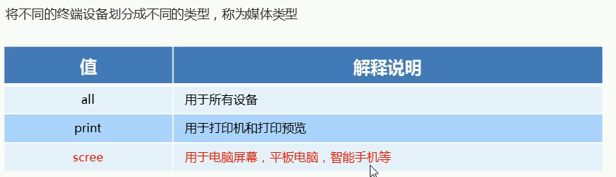

- 关键字and、not、only。

  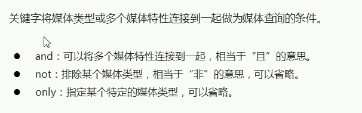

- media feature 媒体特性，必须在小括号中。

  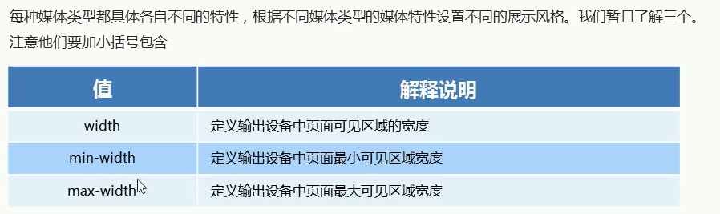

示例代码如下：

```html
<!DOCTYPE html>
<html lang="zh">
<head>
    <meta charset="UTF-8">
    <meta name="viewport" content="width=device-width, initial-scale=1.0">
    <meta http-equiv="X-UA-Compatible" content="ie=edge">
    <title>Document</title>
    <style>
        @media screen and (max-width:800px) {
            body{
                background-color: rgb(224, 36, 92);
            }
        }
        @media screen and (max-width:600px) {
            body{
                background-color: blueviolet;
            }
        }
    </style>
</head>
<body>
    
</body>
</html>
```

案例，当屏幕小于540像素时，背景色为蓝色。当屏幕大于等于540像素并且小于970像素时，背景色为绿色。当屏幕大于等于970像素时，背景色为红色。代码如下：

```html
<!DOCTYPE html>
<html lang="en">
<head>
    <meta charset="UTF-8">
    <meta name="viewport" content="width=device-width, initial-scale=1.0">
    <meta http-equiv="X-UA-Compatible" content="ie=edge">
    <title>Document</title>
    <style>
        @media screen and (max-width: 539px) {
            body{
                background-color: blue;
            }
        }
        @media screen and (min-width: 540px) {
            body{
                background-color: green;
            }
        }
        @media screen and (min-width: 970px) {
            body{
                background-color: red;
            }
        }
    </style>
</head>
<body>
    
</body>
</html>
```

------

媒体查询的引入资源功能。

在开发中，出现一个div在屏幕不同尺寸下，样式不同的情况下，就可以使用媒体查询的引入资源功能。

核心代码如下：

```html
<link rel="stylesheet" href="style320.css" media="screen and (min-width:320px)">
<link rel="stylesheet" href="style640.css" media="screen and (min-width:640px)">
```

这样，页面就会根据屏幕大小尺寸来载入对应的CSS样式。

------

# Less基础

<b>CSS的一些弊端如下：</b>

- CSS是一门非程序式语言，没有变量、函数、SCOPE（作用域）等概念。
- CSS需要书写大量看似没有逻辑的代码，CSS冗余度比较高。
- 不方便维护及扩展，不利于复用。
- CSS没有很好的计算能力。

由于CSS有那么的弊端，所以可以使用Less预处理器，来弥补CSS的弊端。

Less（Leaner Style Sheets的缩写）是一门CSS扩展语言，也称为CSS预处理器。作为CSS的一种形式的扩展，它并没有减少CSS的功能，而是在现有的CSS语法上，为CSS加入程序式语言的特性。

它在CSS的语法基础之上，引入了变量、Mixin（混入）、运算和函数等功能，大大简化了CSS的编写，并且降低了CSS的维护成本，就像它的名字所说的那样，Less可以让我们用更少的代码做更多的事情。

Less中文网：http://lesscss.cn/

常见的CSS预处理器：Sass、Less、Stylus。

------

<b>Less的安装教程如下：</b>

1. 安装nodejs。
2. 检查nodejs是否安装成功，在命令行模式下输入<code>node -v</code>，如果有相应的数据显示就表示安装成功。
3. 在命令行模式下安装Less，输入<code>npm install -g less</code>。
4. 检查Less是否安装成功，在命令行模式下输入<code>lessc -v</code>，如果有相应的数据显示就表示安装成功。

------

<b>Less的使用</b>

首先创建一个后缀名为.less的文件，然后在这个文件中写Less语句。

less变量

格式为：@变量名:值;

命名规范：

- 必须有@为前缀。
- 不能包含特殊字符。
- 不能以数字开头。
- 大小写敏感。

示例核心代码如下：

```less
@color:red;
@font14:14px;
body {
    background-color:@color;
}
div {
    background-color:@color;
    font-size:@font14;
}
```

------

<b>Less的编译</b>

本质上，Less包含一套自定义的语法和解析器，用户根据这些语法定义自己的样式规则，这些规则最终会通过解析器，编译生成相应的CSS文件。

所以，我们需要将==less==文件，编译生成为==css==文件，这样我们的HTML页面才能使用。

在使用VSCode编辑器的时候，我们可以按照插件==Easy LESS==来把==less==文件编译位==css==文件。把该插件安装后，重新启动VSCode编辑器，当修改less文件的时候，会自动生成一个同名的，但后缀名为.css的文件，如果该文件存在，就会覆盖文件中的内容。

------

<b>Less的嵌套</b>

我们经常用到选择器的嵌套

```css
#header .logo {
    width: 300px;
}
```

Less嵌套写法

```less
#header {
    .logo {
        width:300px;
    }
}
```

如果遇见==交集==或者==伪类==或者==伪元素==选择器时

- 内层选择器的前面没有&符号，则它被解析为父选择器的后代。
- 如果有&符号，它就被解析为父元素自身或父元素的伪类。

```css
a:hover {
    color:red;
}
```

Less嵌套写法

```less
a {
    &:hover {
        color:red;
    }
}
```

------

<b>Less的运算</b>

任何数字、颜色或者变量都可以参与运算。Less提供了加（+）、减（-）、乘（*）、除（/）算术运算。

Less的运算示例

```less
@width:15px + 10;
@height:(10px + 250px) * 2;
div {
    border:@width solid red;
    height:@height;
}
```

生成的css代码

```css
div {
    border:25px solid red;
    height:320px;
}
```

<b style="color:red;">注意</b>：

- 运算符中间左右各有个空格隔开。
- 对于两个不同单位的值之间的运算，运算结果的值取第一个值的单位。
- 如果两个值之间只有一个值有单位，则运算结果就取该单位。

------

# rem适配方案

让一些不能等比例自适应的元素，达到当设备尺寸发生改变的时候，等比例适配当前设备。使用媒体查询根据不同的设备按比例设置html的字体大小，然后页面元素使用rem做尺寸单位，当html字体大小变化，元素尺寸也会发生变化，从而达到等比缩放的适配。

------

<b>rem实际开发适配方案</b>

1. 按照设计稿与设备宽度的比例，动态计算并设置html根标签的font-size大小。（使用媒体查询功能）
2. CSS中，设计稿元素的宽、高、相对位置等取值，按照同等比例换算为rem为单位的值。

------

<b>rem适配方案技术使用（市场主流）</b>

技术方案一：Less、媒体查询、rem。

技术方案二：flexible.js、rem。（推荐）

<b style="color:blue;">总结</b>：两种方案现在都存在，方案二更简单。

------

<b>rem实际开发适配方案1</b>

使用 rem + 媒体查询 + Less技术。

设计稿常见尺寸宽度如下

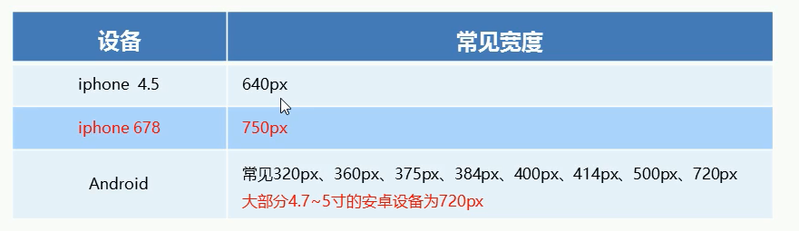

一般情况下，我们以一套或两套效果图适应大部分的屏幕，放弃极端屏或对其进行优雅降级，牺牲一些效果，现在基本以750px为准。

元素大小的取值方法公法如下：

选择一个常数，理论上，该值越大，在效果缩放上的差距就越小，通常用10或者15，选择一个基本通用的屏幕宽度X （一般是750px）/ 这个常数，得到另一个数Y。在这个通用屏幕宽度下，选择一个元素的宽（比如宽50px）/ Y，得到一个数Z，这个Z就是rem的值。

------

# 苏宁首页案例制作


------

<center><h1>Bootstrap响应式框架</h1></center>
# 响应式开发

<b>响应式开发原理</b>

就是使用媒体查询针对不同宽度的设备进行布局和样式的设置，从而适配不同设备的目的。

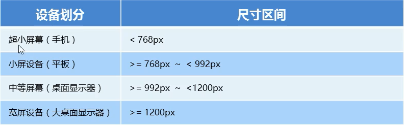

------

<b>响应式布局容器</b>

响应式需要一个父级作为布局容器，来配合子级元素来实现变化效果。

原理就是在不同屏幕下，通过媒体查询来改变这个布局容器的大小，再改变里面子元素的排列方式和大小，从而实现不同屏幕下，看到不同的页面布局和样式变化。

平常我们的响应式尺寸划分如下：

- 超小屏幕（手机，小于768px）：设置宽度为100%。
- 小屏幕（平板，大于768px）：设置宽度为750px；
- 中等屏幕（桌面显示器，大于等于992px）：设置宽度为970px。
- 大屏幕（大桌面显示器，大于等于1200px）：设置宽度为1170px。

也可以根据实际情况自己划分宽度。

------

# Bootstrap前端开发框架

<b>Bootstrap简介</b>

Bootstrap来自Twitter，是目前最受欢迎的前端框架。Bootstrap是基于HTML、CSS、JavaScript的，它简洁灵活，<b style="color:red;">使得web开发更加便捷</b>。

- 中文官网：http://www.bootcss.com/
- 官网：http://getbootstrap.com/

框架：顾名思义就是一套架构，它有一套比较完整的网页功能解决方案，而且控制权在框架本身，有预制样式库、组件和插件。使用者要安装框架所规定的某种规范进行开发。

优点：

- 标准化的html + css编码规范。
- 提供了一套简介、直观、强悍的组件。
- 有自己的生态圈，不断的更新迭代。
- 让开发更简单，提高了开发效率。

版本：

- 2.xx：停止维护，兼容性好，代码不够简洁，功能不够完善。
- 3.xx：目前使用最多，稳定，但是放弃了IE6-IE7。对IE8支持，但界面效果不好，偏向于开发==响应式布局==和==移动设备优先的WEB项目==。
- 4.xx：最新版，目前还不是很流行。

------

<b>bootstrap使用</b>

1. 创建文件结构

   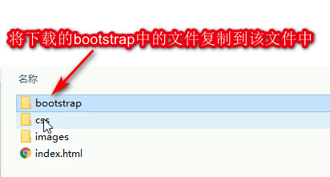

2. 创建html骨架结构

   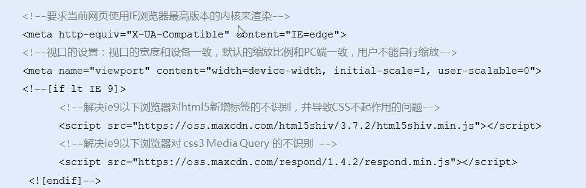

3. 引入相关样式文件，核心代码如下

   ```html
   <link rel="stylesheet" href="bootstrap/css/bootstrap.min.css"/>
   ```

4. 写页面内容。

------

# Bootstrap栅格系统

栅格系统英文名“grid systems”，也有人翻译为“网格系统”，它是指将页面布局划分为等宽的列，然后通过列数的定义来模块化页面布局。

Bootstrap提供了一套响应式、移动设备优先的流式栅格系统，随着屏幕或视口（viewport）尺寸的增加，系统会自动分为最多<b style="color:red;">12列</b>。

Bootstrap里面container宽度是固定的，但是不同屏幕下，container的宽度不同，我们再把container划分为12等份。

------

<b>栅格选项参数</b>

栅格系统用于通过一系列的行（row）与列（column）的组合来创建页面布局，你的内容可以放入这些创建好的布局中。

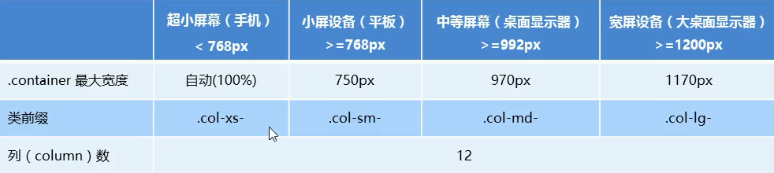

- 行（row）必须放到container布局容器中。
- 我们实现列的平均划分，需要给列添加<b>类前缀</b>。
- xs-extra small：超小；sm-smal：小；md-medium：中等；lg-larg：大。
- 列（column）大于12，多余的列所在的元素将被作为一个整体另起一行排列。
- 每一列默认左右都有15px的padding。
- 可以同时为一列指定多个设备的类名，以便划分不同倍数，例如：class="col-md-4 col-sm-6"。

------

<b>列嵌套</b>

栅格系统内置的栅格系统将内容再次嵌套。简单理解就是一个列内再分成若干小列。我们可以通过添加一个新的 .row 元素和一系列 .col-sm-* 元素到已经存在的 .col-sm-* 元素内。

在列嵌套的时候，最好加一个 row 这样可以取消父元素的padding值，并且高度会与父元素一样高。

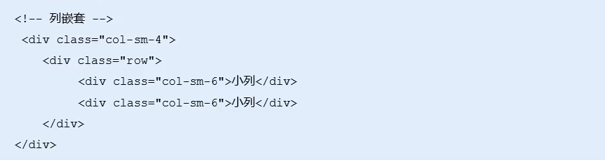

------

<b>列偏移</b>

使用 .col-md-offset-* 类可以将列向右侧偏移。这些类实际上是通过使用*选择器为当前元素增加了左侧的边距（margin）。

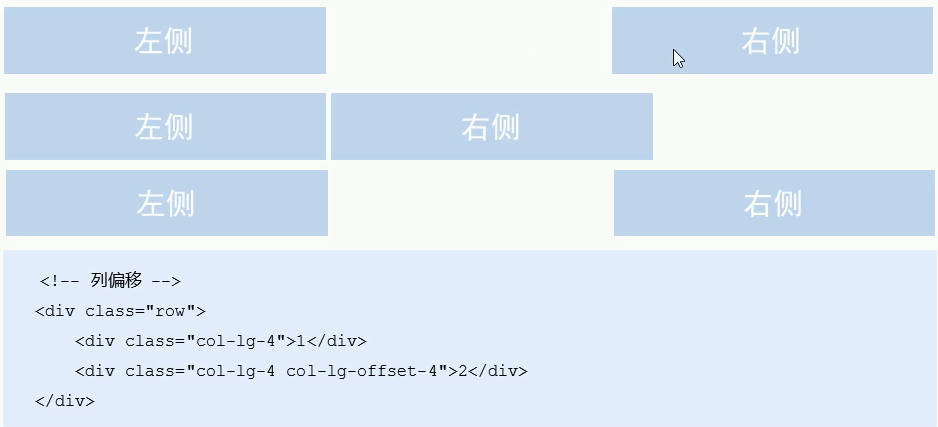

------

<b>列排序</b>

通过使用 .col-md-push-* 和 .col-md-pull-* 类就可以很容易的改变列（column）的顺序。

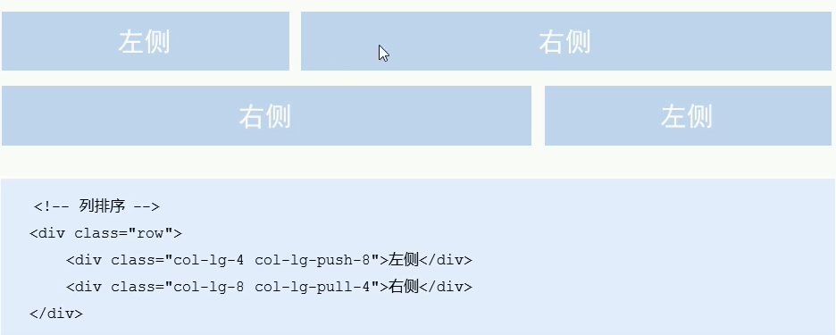

------

<b>响应式工具</b>

为了加快对移动设备友好的页面开发工作，利于媒体查询功能，并使用这些工具类可以方便的针对不同设备展示或隐藏页面内容。

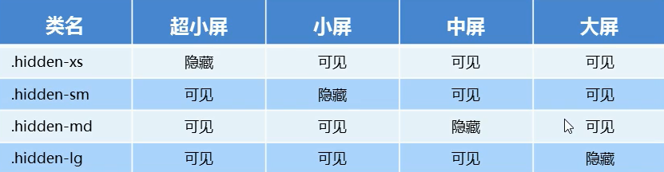

与之相反的，是visible-xs、visible-sm、visible-md、visible-lg 是显示某个页面内容。

------

# 阿里百秀案例


------

<center><h1>ES6详解</h1></center>
# ES6简介

<b>什么是ES6？</b>

ES的全称是ECMAScript，它是由ECMA国际标准化组织制定的<b>一项脚本语言的标准化规范</b>。

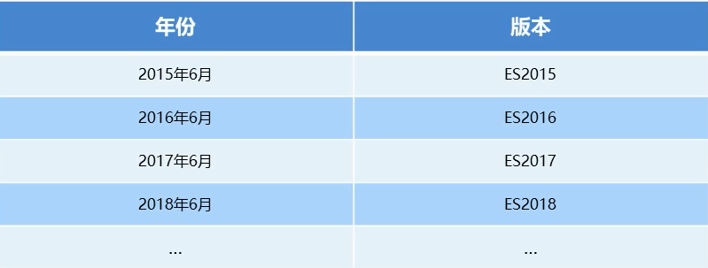

ES6实际上是一个泛指，泛指ES2015及后续的版本。

------

# ES6的新增语法

<b>let</b>

ES6中新增的用于声明变量的关键字。

- let声明的变量只在所处于的块级有效。

  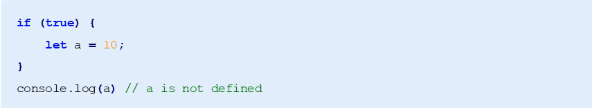

- 不存在变量提升，使用前必须要先声明。

  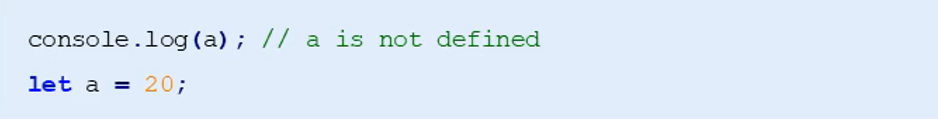

- 暂时性死区，在let定义的变量所在的代码块前面有和代码块中一样的变量名称时，在代码块中定义该变量的前面使用该变量依然会报错。

  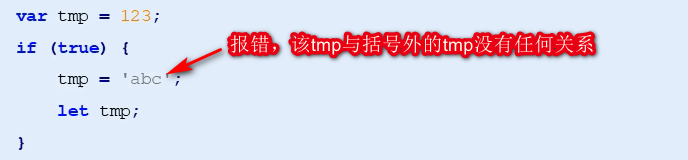

------

<b>const</b>

作用：声明常量，常量就是值（内存地址）不能变化的量。

- 具有块级作用域。

  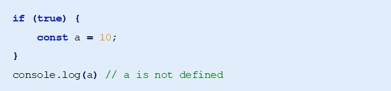

- 声明常量时必须赋值。

  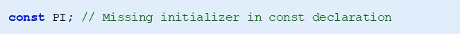

- 常量赋值后，值不能修改。

  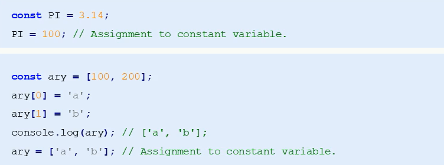

------

<b>let、const、var的区别</b>

1. 使用<b style="color:red">var</b>声明的变量，其作用域为<b style="color:red">该语句所在的函数内，且存在变量提升现象</b>。
2. 使用<b style="color:red">let</b>声明的变量，其作用域为<b style="color:red">该语句所在的代码块内，不存在变量提升</b>。
3. 使用<b style="color:red">const</b>声明的是常量，在后面出现的代码中<b style="color:red">不能再修改该常量的值</b>。

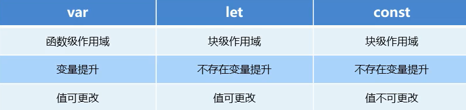

------

<b>解构赋值</b>

ES6中允许从数组中提取值，按照对应位置，对变量赋值。对象也可以实现解构。

------

<b>数组解构</b>

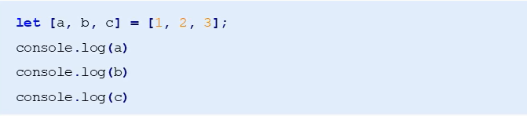

如果解构不成功，变量的值为undefined。

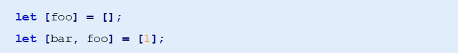

------

<b>对象解构</b>

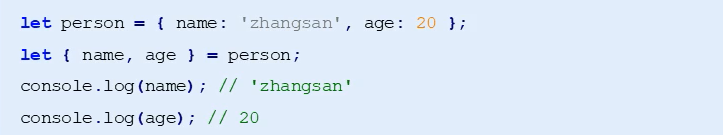

对象解构的另一种写法

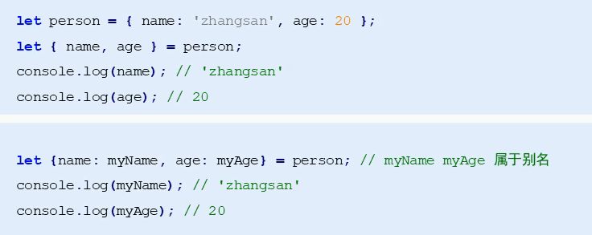