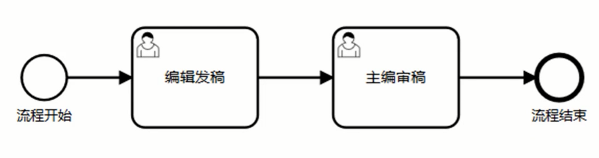
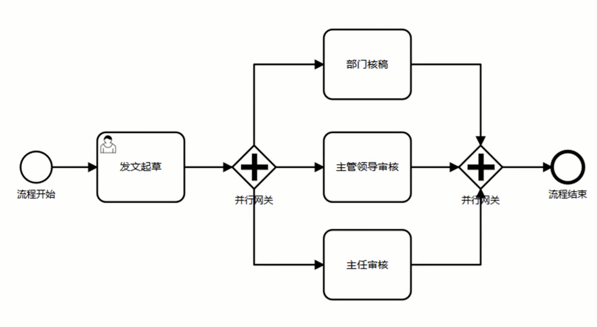
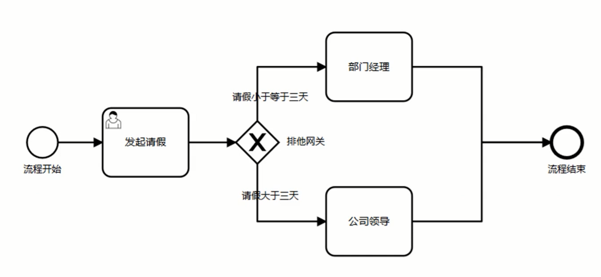
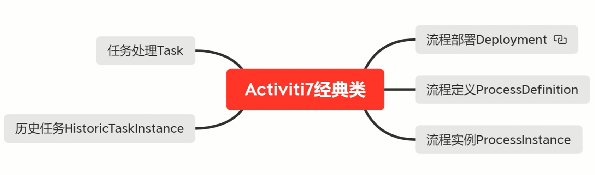

# 目录

[TOC]

# Activiti7 介绍

Activiti 项目是基于 Apache License 许可的开源项目。

Activiti 是一个用 Java 编写的开源工作流引擎。并且遵循 BPNM2.0 标准。

Activiti7 能轻易的与 SpringBoot 项目进行整合。

Activiti7 以 SpringSecurity 作为用户与角色的默认安全机制。 

## 1、工作流常见业务场景

### 1.1、线性审批



### 1.2、会签审批



### 1.3、条件流程



# BPMN2.0 标准

BPNM：业务流程建模标注（Business Process Model And Notation）。

BPNM 图最终是以 XML 文件的格式保存的。

# SpringBoot 与 Activiti7 整合

## 1、Maven 引入依赖

关键依赖如下：

```xml
<dependencyManagement>
    <dependencies>
        <dependency>
            <groupId>org.activiti.dependencies</groupId>
            <artifactId>activiti-dependencies</artifactId>
            <version>7.1.0.M6</version>
            <type>pom</type>
            <scope>import</scope>
        </dependency>
    </dependencies>
</dependencyManagement>

<dependencies>
    <dependency>
        <groupId>org.activiti</groupId>
        <artifactId>activiti-spring-boot-starter</artifactId>
    </dependency>
</dependencies>
```

完整依赖 pom.xml 如下：

```xml
<?xml version="1.0" encoding="UTF-8"?>
<project xmlns="http://maven.apache.org/POM/4.0.0"
         xmlns:xsi="http://www.w3.org/2001/XMLSchema-instance"
         xsi:schemaLocation="http://maven.apache.org/POM/4.0.0 http://maven.apache.org/xsd/maven-4.0.0.xsd">
    <modelVersion>4.0.0</modelVersion>

    <groupId>com.zgy</groupId>
    <artifactId>activiti7-lab</artifactId>
    <version>1.0-SNAPSHOT</version>
    <packaging>jar</packaging>
    <description>Activiti7 案例</description>

    <properties>
        <maven.compiler.source>8</maven.compiler.source>
        <maven.compiler.target>8</maven.compiler.target>
    </properties>

    <dependencyManagement>
        <dependencies>
            <dependency>
                <groupId>org.springframework.boot</groupId>
                <artifactId>spring-boot-dependencies</artifactId>
                <version>2.2.5.RELEASE</version>
                <type>pom</type>
                <scope>import</scope>
            </dependency>

            <dependency>
                <groupId>org.activiti.dependencies</groupId>
                <artifactId>activiti-dependencies</artifactId>
                <version>7.1.0.M6</version>
                <type>pom</type>
                <scope>import</scope>
            </dependency>
        </dependencies>
    </dependencyManagement>

    <dependencies>
        <dependency>
            <groupId>org.springframework.boot</groupId>
            <artifactId>spring-boot-starter-web</artifactId>
        </dependency>

        <dependency>
            <groupId>org.springframework.boot</groupId>
            <artifactId>spring-boot-starter-test</artifactId>
            <scope>test</scope>
        </dependency>

        <dependency>
            <groupId>org.projectlombok</groupId>
            <artifactId>lombok</artifactId>
            <version>1.18.22</version>
            <scope>provided</scope>
        </dependency>

        <dependency>
            <groupId>cn.hutool</groupId>
            <artifactId>hutool-all</artifactId>
            <version>5.7.22</version>
        </dependency>

        <dependency>
            <groupId>mysql</groupId>
            <artifactId>mysql-connector-java</artifactId>
            <version>8.0.28</version>
        </dependency>

        <dependency>
            <groupId>org.springframework.boot</groupId>
            <artifactId>spring-boot-starter-jdbc</artifactId>
        </dependency>

        <dependency>
            <groupId>org.activiti</groupId>
            <artifactId>activiti-spring-boot-starter</artifactId>
        </dependency>
    </dependencies>
</project>
```

# Activiti7 核心类



## 1、流程部署 Deployment

## 2、流程定义 ProcessDefinition

## 3、流程实例 ProcessInstance

## 4、任务处理 Task

## 5、历史任务 HistoryService

# UEL 表达式

# BPMN2.0 流程网关

# Activiti7 新特性

## 1、API 新特性-ProcessRuntime

## 2、API 新特性-TaskRuntime

## 3、SpringSecurity 集成

Activiti7 的 Maven 依赖包中默认就引入了 SpringSecurity 相关依赖，因此不需要额外引入 SpringSecurity 相关依赖。

在 Activiti7 中，用户必须要拥有 `ROLE_ACTIVITI_USER`角色才能执行相关的操作。

## 4、BPMN-JS 整合

