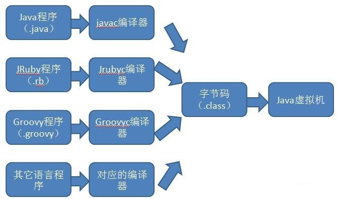
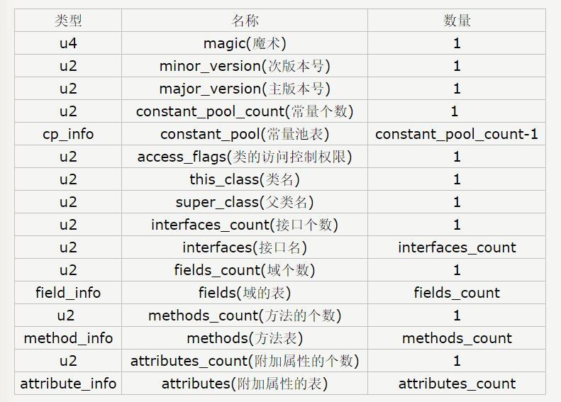

# 目录

[TOC]

# 概览

## 1、运行时数据区

### 1.1、五大区域

1. 栈（虚拟机栈）。
2. 本地方法栈。
3. 堆。
4. 方法区。
5. 程序计数器。

### 1.2、线程共享区域

堆、方法区。

### 1.3、线程私有区域

程序计数器、虚拟机栈、本地方法栈。

# 运行时数据区-详解

## 1、栈（虚拟机栈）

Java 虚拟机栈(Java Virtual Machine Stacks)，早期也叫 Java 栈。每个线程在创建的时候都会创建一个虚拟机栈，其内部保存一个个的栈帧(Stack Frame），对应着一次次 Java 方法调用，是线程私有的，生命周期和线程一致。

虚拟机栈描述的是 Java 方法执行的内存模型，每个方法被执行的时候都会同时创建一个栈帧（Stack Frame）用于存储局部变量表、操作栈、动态链接、方法出口等信息。每一个方法被调用直至执行完成的过程，就对应着一个栈帧在虚拟机栈中从入栈到出栈的过程。

局部变量表存放了编译期可知的各种基本数据类型（boolean、byte、char、short、int、float、long、double）、对象引用（reference 类型，它不等同于对象本身，根据不同的虚拟机实现，它可能是一个指向对象起始地址的引用指针，也可能指向一个代表对象的句柄或者其他与此对象相关的位置）和 returnAddress 类型（指向了一条字节码指令的地址）。

其中 64 位长度的 long 和 double 类型的数据会占用 2 个局部变量空间（Slot），其余的数据类型只占用 1 个。

局部变量表所需的内存空间在编译期间完成分配，当进入一个方法时，这个方法需要在帧中分配多大的局部变量空间是完全确定的，在方法运行期间不会改变局部变量表的大小。

在 Java 虚拟机规范中，对这个区域规定了两种异常状况：

1. 如果线程请求的栈深度大于虚拟机所允许的深度，将抛出StackOverflowError异常。
2. 如果虚拟机栈可以动态扩展（当前大部分的 Java 虚拟机都可动态扩展，只不过 Java 虚拟机规范中也允许固定长度的虚拟机栈），当扩展时无法申请到足够的内存时会抛出 OutOfMemoryError 异常。

## 2、本地方法栈

本地方法栈（Native Method Stacks）与虚拟机栈所发挥的作用是非常相似的，其区别不过是虚拟机栈为虚拟机执行 Java 方法（也就是字节码）服务，而本地方法栈则是为虚拟机使用到的 Native 方法服务。虚拟机规范中对本地方法栈中的方法使用的语言、使用方式与数据结构并没有强制规定，因此具体的虚拟机可以自由实现它。甚至有的虚拟机（譬如 Sun HotSpot 虚拟机）直接就把本地方法栈和虚拟机栈合二为一。与虚拟机栈一样，本地方法栈区域也会抛出 StackOverflowError和OutOfMemoryError 异常。

## 3、堆

对于大多数应用来说，Java堆（Java Heap）是Java虚拟机所管理的内存中最大的一块。Java堆是被所有线程共享的一块内存区域，在虚拟机启动时创建。此内存区域的唯一目的就是存放对象实例，几乎所有的对象实例都在这里分配内存。

Java 堆是垃圾收集器管理的主要区域，因此很多时候也被称做 “GC堆”。如果从内存回收的角度看，由于现在收集器基本都是采用的分代收集算法，所以 Java 堆中还可以细分为：新生代和老年代，再细致一点的有Eden空间、From Survivor 空间、To Survivor 空间等。

根据 Java 虚拟机规范的规定，Java 堆可以处于物理上不连续的内存空间中，只要逻辑上是连续的即可，就像我们的磁盘空间一样。在实现时，既可以实现成固定大小的，也可以是可扩展的，不过当前主流的虚拟机都是按照可扩展来实现的（通过`-Xmx`和`-Xms`控制）。

如果在堆中没有内存完成实例分配，并且堆也无法再扩展时，将会抛出 OutOfMemoryError 异常。

## 4、方法区

方法区（Method Area）与 Java 堆一样，是各个线程共享的内存区域，它用于存储已被虚拟机加载的类信息、常量、静态变量、即时编译器编译后的代码等数据。虽然 Java 虚拟机规范把方法区描述为堆的一个逻辑部分，但是它却有一个别名叫做 Non-Heap（非堆），目的应该是与 Java 堆区分开来。

对于习惯在 HotSpot 虚拟机上开发和部署程序的开发者来说，很多人愿意把方法区称为“永久代”（Permanent Generation），本质上两者并不等价，仅仅是因为 HotSpot 虚拟机的设计团队选择把 GC 分代收集扩展至方法区，或者说使用永久代来实现方法区而已。

Java 虚拟机规范对这个区域的限制非常宽松，除了和 Java 堆一样不需要连续的内存和可以选择固定大小或者可扩展外，还可以选择不实现垃圾收集。相对而言，垃圾收集行为在这个区域是比较少出现的，但并非数据进入了方法区就如永久代的名字一样“永久”存在了。这个区域的内存回收目标主要是针对常量池的回收和对类型的卸载，一般来说这个区域的回收“成绩”比较难以令人满意，尤其是类型的卸载，条件相当苛刻，但是这部分区域的回收确实是有必要的。

根据 Java 虚拟机规范的规定，当方法区无法满足内存分配需求时，将抛出 OutOfMemoryError 异常。

方法区有时被称为持久代（PermGen）。

## 5、程序计数器

程序计数器（Program Counter Register）是一块较小的内存空间，它的作用可以看做是当前线程所执行的字节码的行号指示器。在虚拟机的概念模型里（仅是概念模型，各种虚拟机可能会通过一些更高效的方式去实现），字节码解释器工作时就是通过改变这个计数器的值来选取下一条需要执行的字节码指令，分支、循环、跳转、异常处理、线程恢复等基础功能都需要依赖这个计数器来完成。

由于 Java 虚拟机的多线程是通过线程轮流切换并分配处理器执行时间的方式来实现的，在任何一个确定的时刻，一个处理器（对于多核处理器来说是一个内核）只会执行一条线程中的指令。因此，为了线程切换后能恢复到正确的执行位置，每条线程都需要有一个独立的程序计数器，各条线程之间的计数器互不影响，独立存储，我们称这类内存区域为“线程私有”的内存。

如果线程正在执行的是一个 Java 方法，这个计数器记录的是正在执行的虚拟机字节码指令的地址；如果正在执行的是 Natvie 方法，这个计数器值则为空（Undefined）。

此内存区域是唯一一个在 Java 虚拟机规范中没有规定任何 OutOfMemoryError 情况的区域。

# Class 文件详解

## 1、概述

在各种不同平台的 Java 虚拟机中，字节码（Byte Code）是所有平台都统一支持的程序存储格式，是构成平台无关性的基石，所以 class 文件主要用于解决平台无关性的中间文件。如下图所示：

每个 class 文件都是由字节流组成，各个数据项目严格按照顺序紧凑地排列在文件之中， 中间没有添加任何分隔符，每个字节流含有 8 个二进制位，所有的 16 位，32 位和 64 位长度的数据将通过 2 个，4 个和 8 个连续的 8 位字节来对其进行表示，多字节数据总是按照 big-endian（大端在前：也就是说高位字节存储在低的地址上面，而低位字节存储到高地址上面）的顺序进行存储。

Class 文件格式采用一种类似于 C 语言结构体的伪结构来存储数据，主要有两类数据项，无符号数和表，无符号数用来表述数字，索引引用以及字符串等，比如 u1,u2,u4,u8 分别代表 1 个字节，2 个字节，4 个字节，8 个字节的无符号数，而表是任意数量的可变长项组成，是有多个无符号数以及其它的表组成的复合结构，所有表的命名都习惯性地以 “_info” 结尾，无论是无符号数还是表， 当需要描述同一类型但数量不定的多个数据时， 经常会使用一个前置的容量计数器加若干个连续的数据项的形式， 这时候称这一系列连续的某一类型的数据为某一类型的“集合”。 

## 2、Class 类文件结构

# 常量池和运行时常量池之间的联系

# 垃圾回收算法

# 垃圾收集器

# JVM 常用调优参数

# JVM 常用工具详解

# JVM 调优技巧

# 类加载机制

# Java 四种引用
