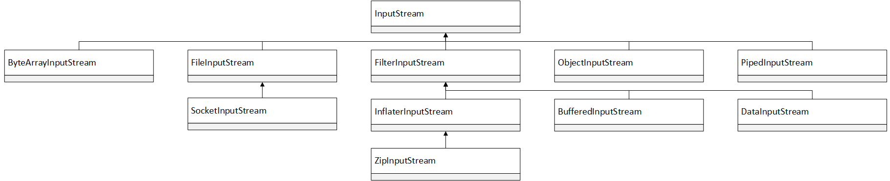
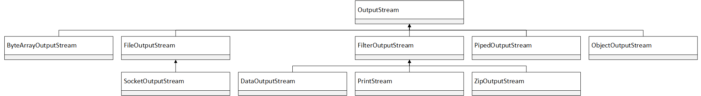
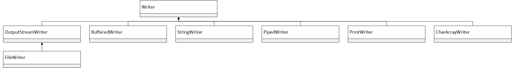
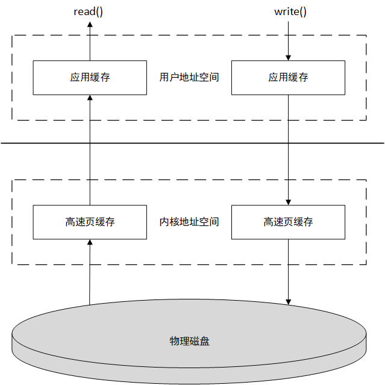
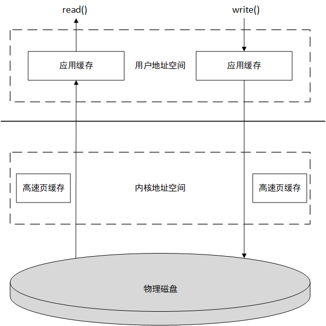

# 深入分析Java I/O的工作机制

## Java的IO操作类分组

- 基于字节操作的IO接口：InputStream 和 OutputStream。

  

  

  

  

- 基于字符操作的IO接口：Writer 和 Reader。

  

  

  

- 基于磁盘操作的IO接口：File。

- 基于网络操作的IO接口：Socket。

## 影响IO操作的核心问题

1. 数据格式。
2. 传输方式。

## 几种访问文件的方式

- 标准访问文件的方式。

  当应用程序调用read()接口时，操作系统会检查在内核的高速缓存中有没有需要的数据，如果有就直接返回，如果没有，就从磁盘中获取数据，然后将数据缓存到内核的高速缓存中。

  当应用程序调用write()接口时，将数据从用户地址空间复制到内核地址空间的缓存中，这时对用户程序来说，写操作就已经完成，至于什么时候再将数据写到磁盘中是有操作系统决定的，除非显式地调用了sync同步命令。

  

- 直接I/O的方式。

  应用程序直接访问磁盘数据，不经过操作系统内核缓存区，这样做的目的就是减少一次从内核缓冲区到用户程序缓存的数据复制。这种访问文件的方式通常是在对数据的缓存管理由应用程序实现的数据库管理系统中。如在数据库管理系统中，系统明确地知道应该缓存哪些数据，应该失效哪些数据，还可以对一些热点数据做预加载，提前将热点数据加载到内存，可以加速数据的访问效率。

  

- 同步访问文件的方式。

  数据的读取和写入都是同步操作的，与标准访问文件的方式不同的是，只有当数据被成功写到磁盘时才返回给应用程序成功的标志。

  这种访问文件的方式性能比较差，只有在一些对数据安全性要求较高的场景中才会使用，而且通常这种操作方式的硬件都是定制的。

- 异步访问文件的方式。

  异步访问文件的方式就是当访问数据的线程发出请求之后，线程会接着去处理其他事情，而不是阻塞等待，当请求的数据返回后继续处理下面的操作。这种访问文件的方式可以明显的提高应用程序的效率，但是并不会改变访问文件的效率。

- 内存映射的方式。

  内存映射的方式是指操作系统将内存中的某一块区域与磁盘中的文件关联起来，当要访问内存中的一段数据时，转换为访问文件的某一段数据。这种方式的目的同样时减少数据从内核空间缓存到用户空间缓存的数据复制操作，因为这两个空间的数据是共享的。