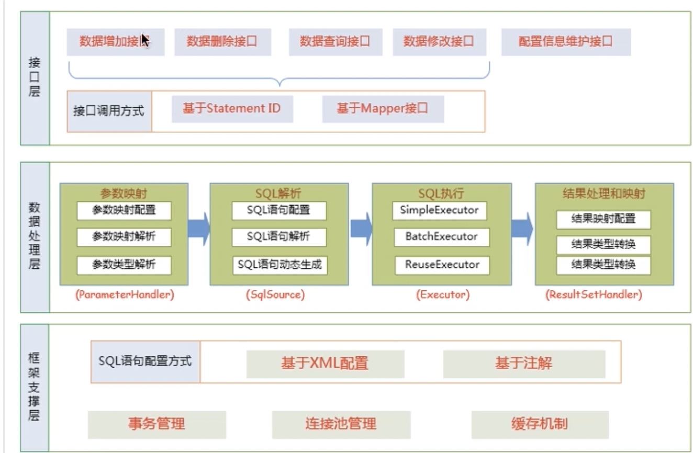
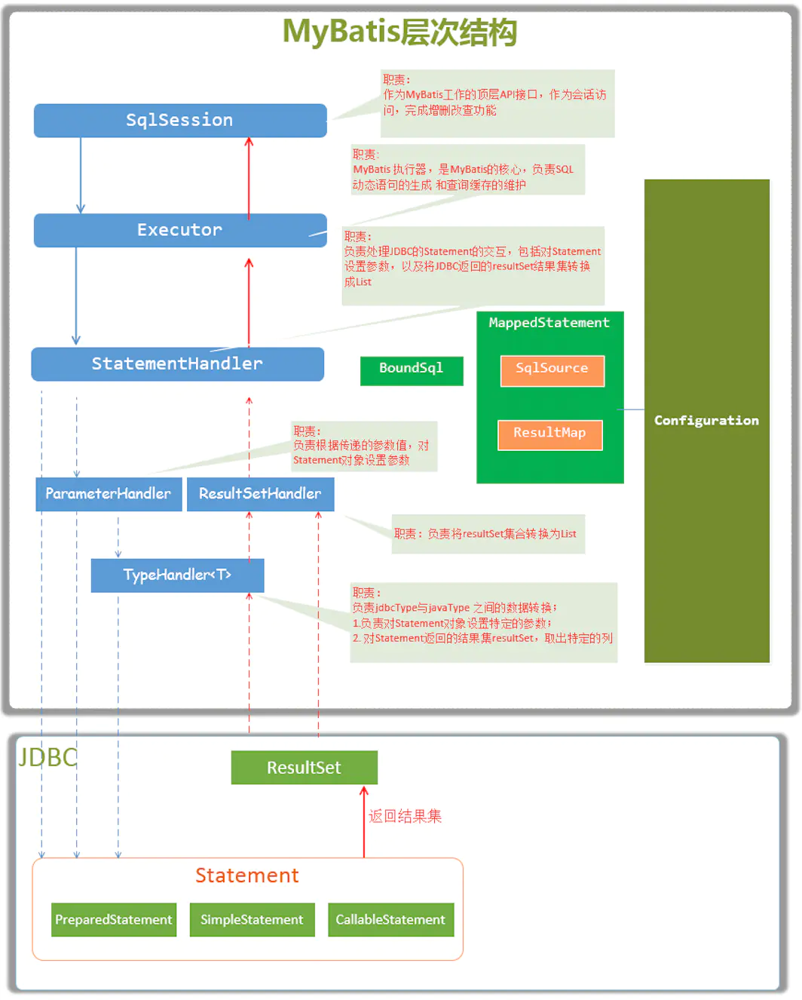

# 目录

[TOC]

# 源码解析

## 1、架构设计



我们把 MyBatis 的功能架构分为三层：

1. API 接口层：提供给外部使用的接口 API，开发人员通过这些本地 API 来操纵数据库。接口层在接收到调用请求就会调用数据处理层来完成具体的数据处理。

    MyBatis 和数据库的交互有两种方式：

    a. 使用传统的 MyBatis 提供的 API。

    b. 使用 Mapper 代理方式。

2. 数据处理层：负责具体的 SQL 查找、SQL 解析、SQL 执行和执行结果映射处理等。它主要的目的是根据调用的请求完成一次数据库操作。
3. 基础支撑层：负责最基础的功能支撑，包括连接管理、事务管理、配置加载和缓存处理，这些都是共用的东西，将它们抽取出来作为最基础的组件。为上层的数据处理层提供最基础的支撑。

## 2、主要构建及其相互关系

| 构建             | 描述                                                         |
| :--------------- | :----------------------------------------------------------- |
| SqlSession       | 作为 MyBatis 工作的主要顶层 API，表示和数据库交互的会话，完成必要数据库增、删、改、查功能。 |
| Executor         | MyBatis 执行器，是 MyBatis 的调度核心，负责 SQL 语句的生成和查询缓存的维护。 |
| StatementHandler | 封装 JDBC Statement 操作，负责对 JDBC Statement 的操作，如设置参数、将 Statement 结果集转换成 List 集合。 |
| ParameterHandler | 负责对用户传递的参数转换成 JDBC Statement 所需要的参数。     |
| ResultSetHandler | 负责将 JDBC 返回的 ResultSet 结果集对象转换成 List 类型的集合。 |
| TypeHandler      | 负责 JAVA 数据类型和 JDBC 数据类型之间的映射和转换。         |
| MappedStatement  | MappedStatement 维护了一条 <select\|update\|delete\|insert> 节点的封装。 |
| SqlSource        | 负责根据用户传递的 parameterObject，动态生成 SQL 语句，将信息封装到 BoundSql 对象中，并放回。 |
| BoundSql         | 表示动态生成的 SQL 语句以及相应的参数信息。                  |



## 3、总体流程

### 3.1、加载配置并初始化

触发条件：加载配置文件。

配置来源于两个地方，一个是配置文件（主配置文件 config.xml，mapper*.xml），一个是 JAVA 代码中的注解，将主要配置文件内容解析封装到 Configuration 类中，将 SQL 的配置信息加载成为一个 MappedStatement 对象，存储在内存之中。

### 3.2、接收调用请求

触发条件：调用 MyBatis 提供的 API。

传入参数：为 SQL 的 ID 和传入参数对象。

处理过程：将请求传递给下层的**数据处理层**进行处理。

### 3.3、处理操作请求

触发条件：API 接口层传递请求过来。

传入参数：为 SQL 的 ID 和传入参数对象。

处理过程：

1. 根据 SQL 的 ID 查找对应的 MappedStatement 对象。
2. 根据传入参数对象解析 MappedStatement 对象，得到最终要执行的 SQL 和执行传入参数。
3. 获取数据库连接，根据得到的最终 SQL 语句和执行传入参数到数据库执行，并得到执行结果。
4. 根据 MappedStatement 对象中的结果映射配置对得到的执行结果进行转换处理，并得到最终的处理结果。
5. 释放连接资源。

### 3.4、返回处理结果

将最终的处理结果返回。

## 4、源码剖析

### 4.1、传统方式源码剖析

### 4.1.1、源码剖析-初始化

```java
// 读取配置文件，读成字节输入流，但是并没有进行解析
InputStream resourceAsStream = Resources.getResourceAsStream("sqlMapConfig.xml");

// 解析配置文件，封装 Configuration 对象，创建 DefaultSqlSessionFactory 对象
SqlSessionFactory sqlSessionFactory = new SqlSessionFactoryBuilder().build(resourceAsStream);
```

进入源码分析 SqlSessionFactoryBuilder 类：

```java
// 1、初始化调用的 build 方法
public SqlSessionFactory build(InputStream inputStream) {
    return build(inputStream, null, null);
}

// 2、调用的重载方法
public SqlSessionFactory build(InputStream inputStream, String environment, Properties properties) {
    try {
        // XMLConfigBuilder 是专门解析 MyBatis 的配置文件的类
        XMLConfigBuilder parser = new XMLConfigBuilder(inputStream, environment, properties);
        // 这里又调用了一个重载方法，parser.parse() 的返回值是 Configuration 对象
        return build(parser.parse());
    } catch (Exception e) {
        throw ExceptionFactory.wrapException("Error building SqlSession.", e);
    } finally {
        ErrorContext.instance().reset();
        try {
            if (inputStream != null) {
                inputStream.close();
            }
        } catch (IOException e) {
            // Intentionally ignore. Prefer previous error.
        }
    }
}
```

MyBatis 在初始化的时候，会将 MyBatis 的配置信息全部加载到内存中，使用`org.apache.ibatis.session.Configuration` 实例来维护。

#### 4.1.1.1、配置文件解析。

##### 4.1.1.1.1、Configuration 对象进行介绍：

Configuration 对象的结构和 xml 配置⽂件的对象⼏乎相同。

回顾⼀下 xml 中的配置标签有哪些：properties (属性)， settings (设置)， typeAliases (类型别名)， typeHandlers (类型处理器)， objectFactory (对象⼯⼚)， mappers (映射器)等。

Configuration 有对应的对象属性来封装它们也就是说，初始化配置⽂件信息的本质就是创建 Configuration 对象，将解析的 xml 数据封装到 Configuration 内部属性中。以下是 org.apache.ibatis.builder.xml.XMLConfigBuilder 类主要代码：

```java
// 解析 XML 为 Configuration 对象
public Configuration parse() {
    if (parsed) {
        // 若已解析，抛出 BuilderException 异常
        throw new BuilderException("Each XMLConfigBuilder can only be used once.");
    }
    // 标记已解析
    parsed = true;
    // 解析 XML 的 configuration 节点
    parseConfiguration(parser.evalNode("/configuration"));
    return configuration;
}

// 解析 XML
private void parseConfiguration(XNode root) {
    try {
        // issue #117 read properties first
        // 解析 <properties/> 标签
        propertiesElement(root.evalNode("properties"));
        // 解析 <settings/> 标签
        Properties settings = settingsAsProperties(root.evalNode("settings"));
        // 加载自定义的 VFS 实现类
        loadCustomVfs(settings);
        loadCustomLogImpl(settings);
        // 解析 <typeAliases/> 标签
        typeAliasesElement(root.evalNode("typeAliases"));
        // 解析 <plugins/> 标签
        pluginElement(root.evalNode("plugins"));
        // 解析 <objectFactory/> 标签
        objectFactoryElement(root.evalNode("objectFactory"));
        // 解析 <objectWrapperFactory/> 标签
        objectWrapperFactoryElement(root.evalNode("objectWrapperFactory"));
        // 解析 <reflectorFactory/> 标签
        reflectorFactoryElement(root.evalNode("reflectorFactory"));
        // 赋值 <setting/> 至 Configuration 属性
        settingsElement(settings);
        // read it after objectFactory and objectWrapperFactory issue #631
        // 解析 <environments/> 标签
        environmentsElement(root.evalNode("environments"));
        // 解析 <databaseIdProvider/> 标签
        databaseIdProviderElement(root.evalNode("databaseIdProvider"));
        // 解析 <typeHandlers/> 标签
        typeHandlerElement(root.evalNode("typeHandlers"));
        // 解析 <mappers/> 标签
        mapperElement(root.evalNode("mappers"));
    } catch (Exception e) {
        throw new BuilderException("Error parsing SQL Mapper Configuration. Cause: " + e, e);
    }
}
```

##### 4.1.1.1.2、MappedStatement 对象介绍

作用：MappedStatement 与 Mapper 配置文件中的一个 select、update、insert、delete 节点相对应。Mapper 配置文件中的标签都被封装到此对象中，主要用途是描述一条 SQL 语句。

初始化过程：回顾上面介绍的加载配置文件的过程中，会对 mybatis-config.xml 中的各个标签都进行解析，其中有 mappers 标签用来引入 mapper.xml 文件或者配置 mapper 接口的目录。

比如下面的代码：

```xml
<select id="getUser" resultType="user">
	select * from user where id=#{id}
</select>
```

这样的一个 select 标签会在初始化配置文件的时候被封装成一个 MappedStatement 对象，然后存储在 Configuration 对象的 mappedStatements 属性中，mappedStatements 是个 HashMap，存储的 key = 全限定名 + 方法名，value = 对应的 MappedStatement 对象。

在 XMLConfigBuilder 类中，处理逻辑如下：

```java
private void parseConfiguration(XNode root) {
    try {
        //省略其他标签的处理
        mapperElement(root.evalNode("mappers"));
    } catch (Exception e) {
        throw new BuilderException("Error parsing SQL MapperConfiguration.Cause:" + e, e);
    }
}
```

到此对 xml 配置文件的解析就结束了，回到 4.1.1 的步骤 2 中调用的重载 build 方法，代码如下：

```java
// 3、调⽤的重载⽅法
public SqlSessionFactory build(Configuration config) {
    //创建了 DefaultSqlSessionFactory 对象，传⼊ Configuration 对象。
    return new DefaultSqlSessionFactory(config);
}
```


