
<h1>Spring Boot 参数校验</h1>

> 本文摘抄自：[Spring Boot 参数校验](https://www.cnblogs.com/cjsblog/p/8946768.html)

# 1、背景介绍

开发过程中，后台的参数校验是必不可少的，所以经常会看到类似下面这样的代码

这样写并没有什么错，还挺工整的，只是看起来不是很优雅而已。

接下来，用Validation来改写这段

# 2、Spring Boot文档中的Validation

在Spring Boot的官网中，关于Validation只是简单的提了一句，如下

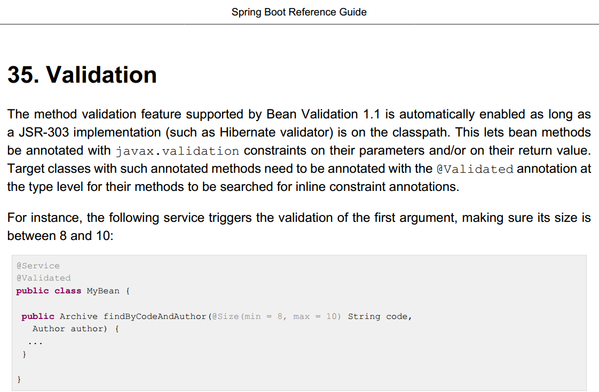

其实，**Spring Validator**和**Hibernate Validator**是两套Validator，可以混着用，这里我们用**Hibernate Validator**

# 3、Hibernate Validator

 https://docs.jboss.org/hibernate/stable/validator/reference/en-US/html_single/#preface

# 4、Spring Validator

https://docs.spring.io/spring/docs/5.0.5.RELEASE/spring-framework-reference/core.html#validation

# 5、示例

## 5.1、引入spring-boot-starter-validation

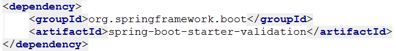

## 5.2、定义一个对象

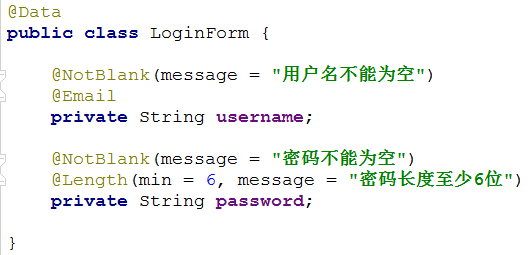

## 5.3、适用@Valid校验，并将校验结果放到BindingResult对象中

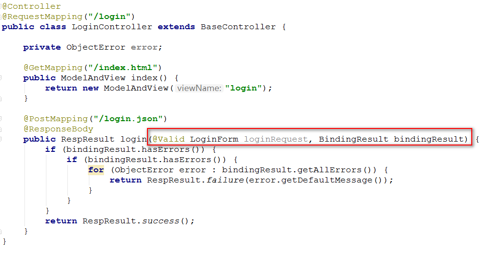

注意：

- 默认情况下，如果校验失败会抛javax.validation.ConstraintViolationException异常，可以用统一异常处理去对这些异常做处理
- An Errors/BindingResult argument is expected to be declared immediately after the model attribute

## 5.4、看效果

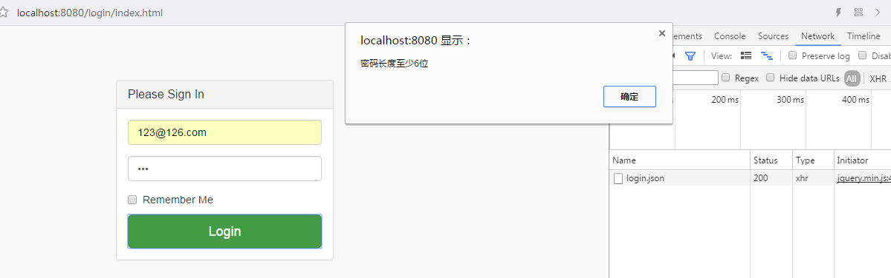

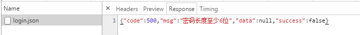

如果在校验的对象后面再加上Model对象的话，如果返回的是ModelAndView就可以将这个Model设置到其中，这样在页面就可以取到错误消息了

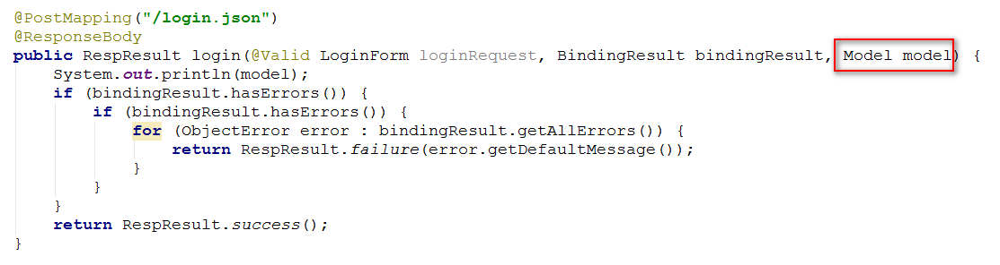

仅仅只是单字段校验的话未免也太不灵活了吧，如果字段之间有关联关系，那该如何校验呢？答案是自定义

## 5.5、自定义校验规则

https://docs.jboss.org/hibernate/stable/validator/reference/en-US/html_single/#validator-customconstraints

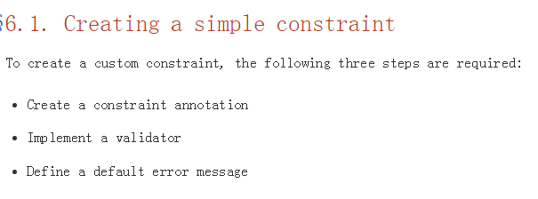

这里，以优惠券创建为例来演示如何自定义校验规则

首先，优惠券表单如下（仅仅只是演示用）：

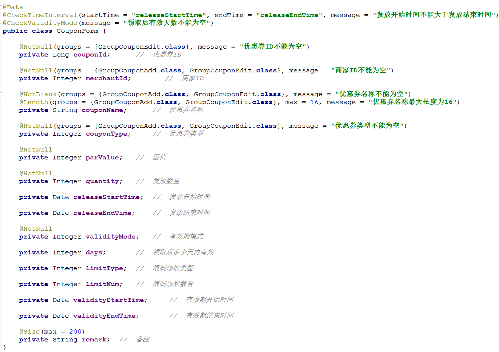

这里除了自定义了两条校验规则之外，还用到了分组。

为什么要有分组这一说呢？因为，举个例子，添加的时候不需要校验id，而修改的时候id不能为空，有了分组以后，就可以添加的时候校验用组A，修改的时候校验用组B

下面重点看一下@CheckTimeInterval

**第一步**、定义一个注解叫CheckTimeInterval

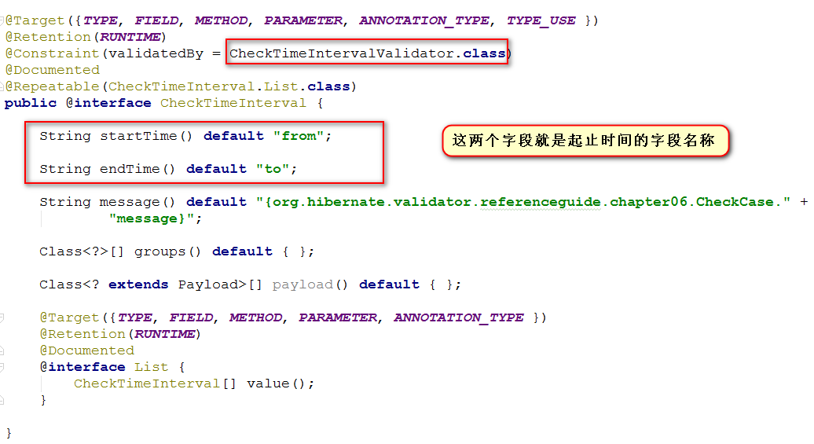

**第二步**、定义Validator去校验它

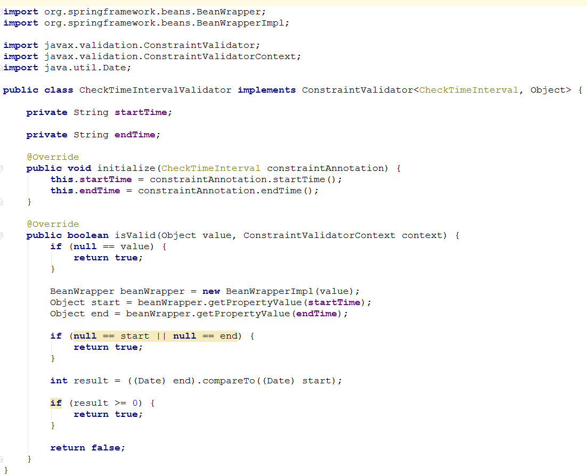

顺便提一句，这里BeanWrapper去取对象的属性值，我们稍微看一下BeanWrapper是做什么的

 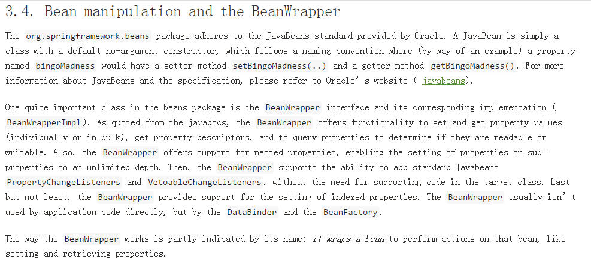

 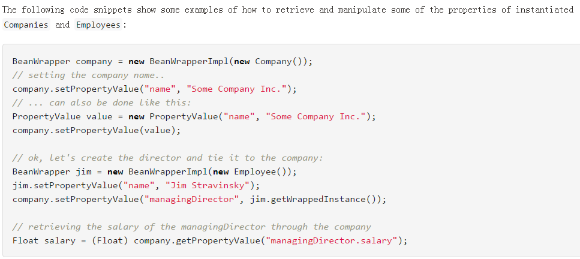

 言归正传

**第三步**、验证

 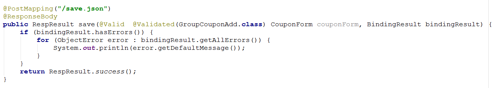

 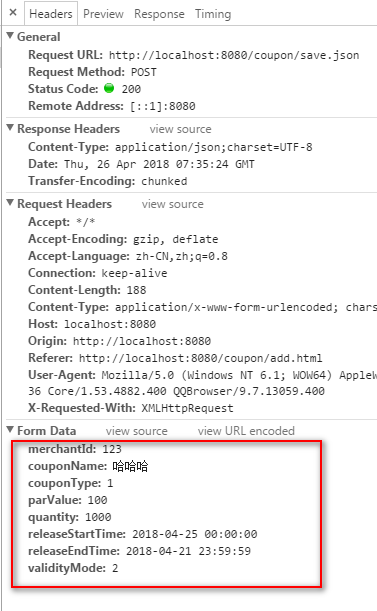

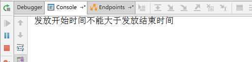 

 看，自定义的校验生效了

# 6、补充

## 6.1、校验模式

https://docs.jboss.org/hibernate/stable/validator/reference/en-US/html_single/#section-fail-fast

下面补充一点，关于校验模式

默认会校验完所有属性，然后将错误信息一起返回，但很多时候不需要这样，一个校验失败了，其它就不必校验了

为此，需要这样设置

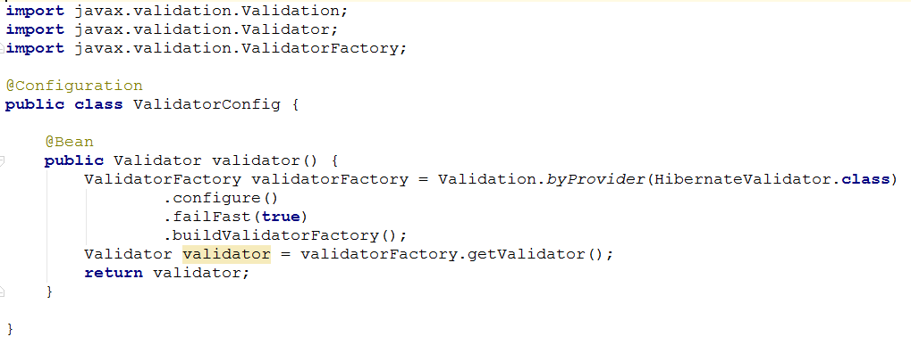

##  6.2、单个参数校验

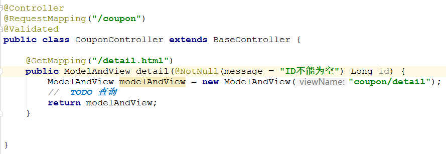

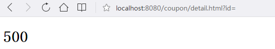

 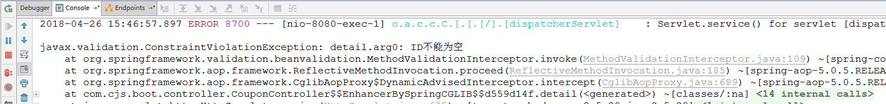

 如果是调整页面的时候参数校验失败的话，这时可以不做处理，让其调到错误页面。

如果是接口参数校验失败的话，可以在这里进行统一处理，并返回。例如：

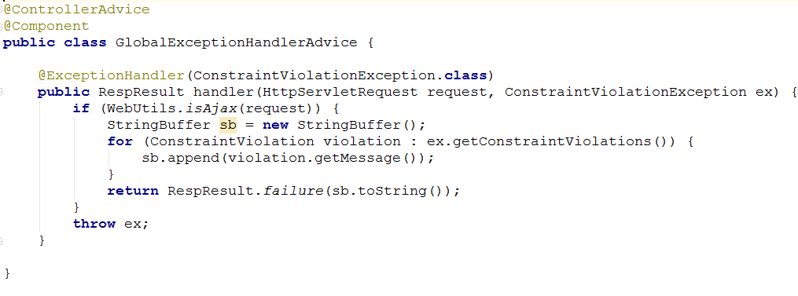

##  6.3、错误页面

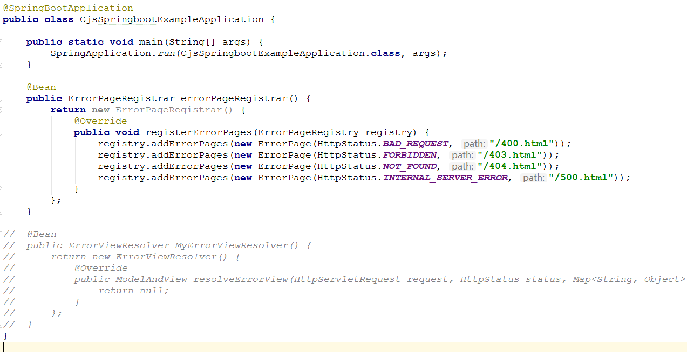

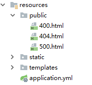

 以刚才优惠券详情为例

http://localhost:8080/coupon/detail.html　　　　　　400

http://localhost:8080/coupon/detail.html?id=　　　　400

http://localhost:8080/coupon/detail.html?id=abc　　 400

http://localhost:8080/coupon/detail222.html?id=123　　404

无权限　　403

int a = 1 / 0;　　500

 

##  6.4、@Valid与@Validated

 https://blog.csdn.net/qq_27680317/article/details/79970590

 

##  参考

http://rensanning.iteye.com/blog/2357373

https://blog.csdn.net/kenight/article/details/77774465

https://www.cnblogs.com/mr-yang-localhost/p/7812038.html

https://www.phpsong.com/3567.html

https://www.cnblogs.com/mr-yang-localhost/p/7812038.html