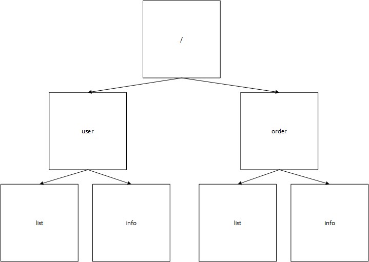

<center><h1>SpringBoot+Dubbo+Zookeeper实战笔记</h1></center>
# 技术栈区别

Spring Boot + Spring Cloud：组件多，功能完备。

Spring Boot + Dubbo + Zookeeper：组件少，功能不太完备。

# 什么是高可用

- 一直可以使用
- 能支持高并发
- 具有高性能

# 四大问题

1. 客户端如何访问这么多的服务

   API 网关

2. 服务与服务之间如何通信

   - 同步通信

     HTTP（Apache Http Client）

     RPC（Dubbo（只支持Java）、Apache Thrift、gRPC）

   - 异步通信

     消息队列（Kafka，RabbitMQ、RocketMQ）

3. 这么多服务，如何管理

   - 服务治理
     - 服务注册与发现
       - 基于客户端的服务注册与发现，Zookeeper
       - 基于服务端的服务注册与发现，Eureka

4. 服务挂了或者网络不可靠怎么办

   - 重试机制
   - 服务熔断
   - 服务降级
   - 服务限流

PS：其实最大问题就是网络不可靠。

# 什么是Zookeeper

Zookeeper是一种**分布式协调服务**，用于管理大型主机。在分布式环境中协调和管理服务是一个复杂的过程。Zookeeper通过其简单的架构和API解决了这个问题。Zookeeper允许开发人员专注于核心应用程序逻辑，而不必担心应用程序的分布式特性。

# 分布式锁应具备条件

- 在分布式系统环境下，一个方法在同一个时间内只能被一个机器的一个线程调用。
- 高可用的获取锁和释放锁。
- 高性能的获取锁和释放锁。
- 具备可重入特性
- 具备锁失效机制，防止出现死锁
- 具备非阻塞特性，即没有获取到锁立即返回获取锁失败。

# 分布式锁实现

- Zookeeper
- Memcache
- Redis
- Chubby

## 通过Redis来实现分布式锁

当有多个服务同时向Redis获取锁的时候，会遵循下面的步骤

1. 加锁：使用命令`setnx`往Redis中存放一个数据（标志位），该命令会有一个返回值，如果返回值大于0，表示加锁成功，如果返回值等于0，表示加锁失败。
2. 释放锁：使用`del`命令删除对应的数据。
3. 锁超时：为了防止某些特殊情况下，锁没有得到释放，因此需要实现一个在规定时间内，如果锁没有被释放，将自动调用`del`命令来释放锁。

# Zookeeper两大功能

1. 分布式锁。
2. 服务注册与发现。

# Zookeeper的数据模型

Zookeeper的数据模型像数据结构中的树，也很像linux中的文件系统目录。



上图中，**一个正方形代表一个节点（Znode）**。在Zookeeper中访问节点数据是通过路径来访问的，比如`/user/list`表示的是获取user下list节点数据。

Znede中包含的元素如下

- data：Znode存储的数据信息。
- ACL：记录Znode的访问权限，即哪些人或哪些IP可以访问本节点。
- stat：包含Znode的各种元数据，比如事务ID、版本号、时间戳、大小等。
- child：当前节点的子节点引用。

需要注意一点，Zookeeper是为读多写少的场景所设计。Znode并不是用来存储大规模业务数据的地方，而是用于存储少量的状态和配置信息的地方，所以规定**每个节点的数据大小不能超过1MB**。

# Zookeeper的基本操作

- 创建节点：create
- 删除节点：delete
- 判断节点是否存在：exists
- 获得一个节点的数据：getData
- 设置一个节点的数据：setData
- 获取节点下的所有子节点：getChildren

在上面的这些操作中，`getData`、`exists`、`getChildren`属于读操作，Zookeeper客户端在进行读操作的时候，可以选择是否设置`watch`选项，通过Zookeeper的**事件通知机制**，在服务端中，当被Zookeeper客户端watch的节点被修改（删除、修改）时，Zookeeper服务端会异步通知Zookeeper客户端当前数据被修改了。

# Zookeeper的事件通知机制

当用户访问某个服务的时候，会在Gateway（网关）中根据请求路径（如：user/info）来确定用户需要访问哪个服务，并确定该服务所对应的服务器IP地址，如果在网关中没有找到所访问路径的服务器IP地址，在Gateway中就会向Zookeeper服务器中发送getData(路径,whach)命令，在Zookeeper服务器获取对应路径的IP地址，并将查询的IP地址在Gateway（网关）中保存一份，这样就可以在下次请求该路径时，就不会再访问Zookeeper服务器。因为Gateway在向向Zookeeper服务器中发送getData命令的时候添加了`whach`选项，当我们的某个服务器宕机的时候，Zookeeper服务器就会异步通知Gateway，告诉Gateway哪台机器宕机了，这时Gateway就会在自己内部保存的IP地址中将那台宕机的IP地址删除掉。

# Zookeeper集群

Zookeeper集群是为了防止Zookeeper服务器宕机，导致所有服务不可用。

Zookeeper集群是一个一主多从结构。在更新数据时，首先会更新主节点（这里的节点指的是服务器，不是Znode），然后再从主节点将数据复制到从节点。在读取数据的时候，直接读取任意节点。

为了保证主从节点的数据一致性问题，Zookeeper采用了ZAB协议来保证数据的一致性。

[参考：ZAB协议详解](https://dbaplus.cn/news-141-1875-1.html)

# Docker中安装Zookeeper集群

在`/usr/local/`创建`docker`目录和`Zookeeper`目录

```bash
cd /usr/local
mkdir docker
cd docker
mkdir zookeeper
```

创建docker-compose.yml文件，内容如下

```bash
version: '3.1'

services:
  zoo1:
    image: zookeeper
    restart: always
    hostname: zoo1
    ports:
      - 2181:2181
    environment:
      ZOO_MY_ID: 1
      ZOO_SERVERS: server.1=0.0.0.0:2888:3888;2181 server.2=zoo2:2888:3888;2181 server.3=zoo3:2888:3888;2181

  zoo2:
    image: zookeeper
    restart: always
    hostname: zoo2
    ports:
      - 2182:2181
    environment:
      ZOO_MY_ID: 2
      ZOO_SERVERS: server.1=zoo1:2888:3888;2181 server.2=0.0.0.0:2888:3888;2181 server.3=zoo3:2888:3888;2181

  zoo3:
    image: zookeeper
    restart: always
    hostname: zoo3
    ports:
      - 2183:2181
    environment:
      ZOO_MY_ID: 3
      ZOO_SERVERS: server.1=zoo1:2888:3888;2181 server.2=zoo2:2888:3888;2181 server.3=0.0.0.0:2888:3888;2181
```

使用docker-compose创建容器并启动

```bash
docker-compose up -d
```

查看Zookeeper配置文件

```bash
# 进入容器内部
docker exec -it zookeeper_zoo1_1 /bin/bash
# 查看配置文件
cat /conf/zoo.cfg
```

配置文件内容如下：

```bash
# Zookeeper数据文件目录
dataDir=/data
# Zookeeper日志文件目录
dataLogDir=/datalog
# 这个时间是作为Zookeeper服务器与服务器或客户端与服务器之间维持心跳的间隔，也就是每隔tickTime时间就会发送一个心跳，单位为毫秒。
tickTime=2000
# 配置Zookeeper的主节点在初始化连接时最长能忍受从节点服务器多少个心跳时间间隔数，时间为initLimit*tickTime，单位为毫秒。
initLimit=5
# 配置Leader与Follower之间发送消息，请求和应答时间长度，最长不能超过syncLimit*tickTime的时间长度，，单位为毫秒。
syncLimit=2
autopurge.snapRetainCount=3
autopurge.purgeInterval=0
# 限制连接到Zookeeper的客户端数量，限制并发连接的数量，它通过IP来区分不同的客户端。此配置选项可以用来阻止某些类别的DOS攻击。将它设置为0或忽略而不进行设置将会取消对并发连接的限制。
maxClientCnxns=60
standaloneEnabled=true
admin.enableServer=true
# Server.A=B:C:D;E详解
# A：一个数字，表示第几号服务器。
# B：集群中当前服务器的IP地址，也可以是计算机名称。
# C：表示这个服务器与集群中loader服务器交换信息的端口。
# D：表示万一集群中loader服务器宕机了，需要一个端口来进行重新loader选举，而这个端口就是用来执行选举时，服务器相互通信的端口。
# E：对Zookeepercline端提供服务的端口
server.1=0.0.0.0:2888:3888;2181
server.2=zoo2:2888:3888;2181
server.3=zoo3:2888:3888;2181
```

测试

```bash
# 进入容器内部
docker exec -it zookeeper_zoo3_1 /bin/bash
# 进入/apache-zookeeper-3.5.5-bin/bin目录
cd /apache-zookeeper-3.5.5-bin/bin
# 启动Zookeeper客户端并连接Zookeeper服务端
# -server localhost:2181：Zookeeper服务器地址为localhost，端口号为2181
./zkCli.sh -server localhost:2181
# 创建一条数据
create /test "hello zookeeper"
# 获取创建的数据
get /test
# 删除数据
delete /test
```

**参考文档如下**：

> [什么是Zookeeper？](../什么是ZooKeeper/什么是ZooKeeper.md)

# Dubbo

Apache Dubbo是一款高性能、轻量级的开源Java RPC分布式服务框架，它提供了三大核心能力：

1. 面向接口的远程调用
2. 智能容错和负载均衡
3. 服务自动注册和发现

[Dubbo官方网站](http://dubbo.apache.org/zh-cn/docs/user/references/protocol/dubbo.html)

[Dubbo github](https://github.com/apache/dubbo)

## Dubbo五大角色

1. Provider：暴露服务的服务提供者。
2. Consumer：调用远程服务的服务消费者。
3. Registry：服务注册与发现的注册中心。
4. Monitor：统计服务的调用次数和调用时间的监控中心。
5. Container：服务运行容器。

调用关系说明：

- 服务容器`Container`负责启动、加载、运行服务提供者。
- 服务提供者`Provider`在启动时，向注册中心注册自己提供的服务。
- 服务消费者`Consumer`在启动时，向注册中心订阅自己所需的服务。
- 注册中心`Registry`返回服务提供者地址列表给消费者，如果有变更，注册中心将基于长连接推送变更数据给消费者。
- 服务消费者`Consumer`从提供者地址列表中，基于软负载均衡算法，选一台提供者进行调用，如果调用失败，再选另一台调用。
- 服务消费者`Consumer`和提供者`Provider`，在内存中累计调用次数和调用时间，定时每分钟发送一次统计数据到监控中心`Monitor`。

## Dubbo管理控制台

[Dubbo管理控制台安装教程](https://github.com/apache/dubbo-admin)

## Dubbo负载均衡

在application.properties中添加如下配置：

```properties
# 开启服务提供者负载均衡
# random：随机
# roundrobin：轮询
# leastactive：最少活跃调用数
# consistenthash：一致性Hash
dubbo.provider.loadbalance=roundrobin
```

## Kryo高速序列化

服务提供者和服务消费者中添加如下依赖

```xml
<dependency>
    <groupId>de.javakaffee</groupId>
    <artifactId>kryo-serializers</artifactId>
</dependency>
```

在application.properties中添加如下配置

```properties
dubbo.protocol.serialization=kryo
```

要让Kryo和FST完全发挥出高性能，最好将那些需要被序列化的类注册到dubbo系统中，例如我们可以实现如下回调接口：

```java
public class SerializationOptimizerImpl implements SerializationOptimizer {

    @Override
    public Collection<Class> getSerializableClasses() {
        List<Class> classes = new LinkedList<>();
        // classes.add(需要被序列化的类.class);
        return classes;
    }
}
```

在application.properties中添加如下配置

```properties
# SerializationOptimizerImpl应该是全限定名，比如：com.zgy.my.shop.commons.dubbo.config.SerializationOptimizerImpl
dubbo.protocol.optimizer=SerializationOptimizerImpl
```

**ps**：在对一个类做序列化的时候，可能还级联引用到很多类，比如java集合类。针对这种情况，Kryo已经自动将JDK中常用的类，进行了注册，所以不需要重复注册它们（当然重复注册也没有任何影响），包括：

```java
GregorianCalendar  
InvocationHandler  
BigDecimal  
BigInteger  
Pattern  
BitSet  
URI  
UUID  
HashMap  
ArrayList  
LinkedList  
HashSet  
TreeSet  
Hashtable  
Date  
Calendar  
ConcurrentHashMap  
SimpleDateFormat  
Vector  
BitSet  
StringBuffer  
StringBuilder  
Object  
Object[]  
String[]  
byte[]  
char[]  
int[]  
float[]  
double[]  
```

由于注册被序列化的类仅仅是出于性能优化的目的，所以即使你忘记了注册某些类也没有关系。事实上，即使不注册任何类，Kryo和FST的性能依然普遍优于hessian和dubbo序列化。

## Hystrix熔断器和仪表盘

### 熔断器简介

在微服务架构中，根据业务来拆分一个个业务，服务与服务之间可以通过RPC相互调用。为了保证其高可用，单个服务会集群部署。由于网络原因和自身原因，服务并不能保证100%可用，如果单个服务出现问题，调用这个服务就会出现线程阻塞，此时若有大量的请求涌入，Servlet容器的线程资源会被消耗完，导致服务瘫痪。由于服务与服务之间存在依赖性，从而导致故障传播，会对整个微服务系统造成灾难性的严重后果，这就是服务故障的“雪崩”效应。

为了解决这个问题，业界提出了熔断器模型。Netflix开源了Hystrix组件，实现了熔断机制，SpringCloud对这一组件进行了整合。在微服务架构中，一个请求需要调用多个服务是非常常见的，如下图：


当较底层的服务如果出现故障，会导致连锁故障。当对特定的服务的调用的不可用达到一个阀值（Hystrix是5秒20次）熔断器将会被打开。


熔断器打开后，为了避免连锁故障，通过`fallback`方法可以直接返回一个固定值。

### 使用熔断器

1. 在pom.xml中引入如下依赖：

```xml
<dependency>
    <groupId>org.springframework.cloud</groupId>
    <artifactId>spring-cloud-starter-netflix-hystrix</artifactId>
</dependency>
```

2. 在Springboot的启动类上添加`@EnableHystrix`注解

3. 在Service中对应的方法上添加`@HystrixCommand`注解，在调用方法上增加`@HystrixCommand`配置，此时调用会经过Hystrix代理

```java
@Service(version = "${services.versions.user.v1}")
@Transactional(readOnly = true)
public class UserServiceImpl implements UserService {

    @Autowired
    private UserMapper userMapper;
	// 两个HystrixProperty配置表示：修改阀值为2秒10次
    @HystrixCommand(commandProperties = {
            @HystrixProperty(name = "circuitBreaker.requestVolumeThreshold", value = "10"),
            @HystrixProperty(name = "execution.isolation.thread.timeoutInMilliseconds", value = "2000")
    },fallbackMethod = "selectAllError")
    @Override
    public List<User> selectAll() {
        return userMapper.selectAll();
    }
    
    /**
     * 获取用户失败时，Hystrix回调方法
     * @return
     */
    public List<User> selectAllError() {
        return Collections.emptyList();
    }
}
```

### 使用Hystrix-dashboard熔断器仪表盘

1. 在pom.xml中引入如下依赖：

```xml
<dependency>
    <groupId>org.springframework.cloud</groupId>
    <artifactId>spring-cloud-starter-netflix-hystrix-dashboard</artifactId>
</dependency>
```

2. 在Springboot的启动类上添加`@EnableHystrixDashboard`注解

3. 创建hystrix.stream的Servlet配置，添加一个`HystrixDashboardConfiguration`配置类，内容如下：

```java
/**
 * @author ZGY
 * @date 2019/10/8 10:43
 * @description HystrixDashboardConfiguration
 */
@Configuration
public class HystrixDashboardConfiguration {

    @Bean
    public ServletRegistrationBean getServlet() {
        HystrixMetricsStreamServlet streamServlet = new HystrixMetricsStreamServlet();
        ServletRegistrationBean registrationBean = new ServletRegistrationBean(streamServlet);
        registrationBean.setLoadOnStartup(1);
        registrationBean.addUrlMappings("/hystrix.stream");
        registrationBean.setName("HystrixMetricsStreamServlet");
        return registrationBean;
    }
}
```

4. 最后访问测试

# Docker安装Nexus3

[docker安装Nexus3教程](https://hub.docker.com/r/sonatype/nexus3)

docker快速运行命令如下

```bash
docker run -d -p 8081:8081 --name nexus -v /usr/local/docker/nexus-data:/nexus-data --restart=always sonatype/nexus3
```

# Docker安装Gitlab

[Docker安装Gitlab教程](https://docs.gitlab.com/omnibus/docker/README.html)

docker快速运行命令如下

```bash
sudo docker run --detach \
  --hostname gitlab.example.com \
  --publish 5443:443 --publish 580:80 --publish 522:22 \
  --name gitlab \
  --restart always \
  --volume /usr/local/docker/gitlab/config:/etc/gitlab \
  --volume /usr/local/docker/gitlab/logs:/var/log/gitlab \
  --volume /usr/local/docker/gitlab/data:/var/opt/gitlab \
  gitlab/gitlab-ce:latest
```


# 部署CI/CD

## 持续集成的基本概念

持续集成指的是，频繁的（一天多次）将代码集成到主干。它的好处有两个：

1. 快速发现错误。没完成一点更新，就集成到主干，可以快速发现错误，定位错误也比较容易。
2. 防止分支大幅偏离主干。如果不是经常集成，主干又在不断更新，会导致以后集成的难度变大，甚至难以集成。

Martin Fowler说过，“持续集成并不能消除bug，而是让它们非常容易发现和改正。”

持续集成强调开发人员提交新代码之后，立即进行构建、（单元）测试。根据测试结果，我们可以确定新代码和原有代码是否正确的集成在一起。

与持续集成相关的，还有两个概念，分别是**持续交付**和**持续部署**。

## 使用GitLab Runner实现持续集成

### 基于Docker安装GitLab Runner


## 使用 Jenkins实现持续交付

# API网关

# 分布式文件系统FastDFS

## 什么是FastDFS

DFS：分布式文件系统。

FastDFS：阿里开发的分布式文件系统。

FastDFS是一个开源的轻量级分布式文件系统，它对文件进行管理，功能包括：文件存储、文件同步、文件访问（文件上传、文件下载）等，解决了大容量存储和负载均衡问题。特别适合以文件为载体的在线服务，如相册网站、视频网站等。

FastDFS为互联网量身定制，充分考虑冗余备份、负载均衡、线性扩容等机制，并注重高可用、高性能等指标，使用FastDFS很容易搭建一套高性能的文件服务器集群，提供文件上传和下载等服务。

**FastDFS服务端有两大角色**

1. 跟踪器（tracker）：主要做调度工作，在访问上起负载均衡的作用。
2. 存储节点（storage）：存储文件。

**集群、高可用和负载均衡的区别**

- 集群：需要做到数据同步。
- 高可用：需要做到崩溃恢复。
- 负载均衡：一个应用部署多台，数据没有同步，没有做崩溃恢复。

**在搭建FastDFS时，为什么需要用到Nginx？**

因为FastDFS服务端的跟踪器可以部署多台，但是FastDFS的HTTP服务较为简单，无法提供负载均衡等高性能服务，所以需要使用Nginx来做负载均衡弥补上述的缺陷。

## Docker中安装FastDFS

## 使用FastDFS的Java客户端

## Docker中安装Nginx

## 使用Nginx解决跨域问题

# Solr全文检索

## 什么是Solr

## Docker安装Solr

## Solr中使用分词器——IKAnalyzer

## Solr的基本操作

## SpringBoot整合Solr