# SpringGateway 目录

[TOC]

# 1、简介

## 1.1、简介

Spring Cloud Gateway 底层使用了高性能的通信框架Netty。

## 1.2、特征

- Filter（过滤器）：和Zuul的过滤器在概念上类似，可以使用它拦截和修改请求，并且对上游的响应，进行二次处理。过滤器为`org.springframework.cloud.gateway.filter.GatewayFilter`类的实例。
- Route（路由）：网关配置的基本组成模块，和 Zuul 的路由配置模块类似。一个 Route 模块由一个 ID，一个目标 URI，一组断言和一组过滤器定义。如果断言为真，则路由匹配，目标URI会被访问。
- Predicate（断言）：这是一个 Java8 的 Predicate，可以使用它来匹配来自 HTTP 请求的任何内容，例如 headers 或参数。断言的输入类型是一个 ServerWebExchange。

## 1.3、处理流程

客户端向 Spring Cloud Gateway 发出请求。然后在 Gateway Handler Mapping 中找到与请求相匹配的路由，将其发送到 Gateway Web Handler。Handler 再通过指定的过滤器链来将请求发送到我们实际的服务执行业务逻辑，然后返回。过滤器之间用虚线分开是因为过滤器可能会在发送代理请求之前（pre）或之后（post）执行业务逻辑。

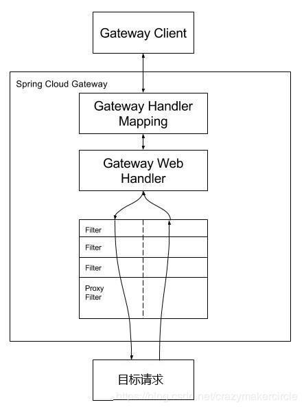

# 2、路由配置

## 2.1、路由配置方式

### 2.1.1、基础URI路由配置

如果请求的目标地址，是单个的URI资源路径，配置文件示例如下：

```yaml
server:
  port: 8080
spring:
  application:
    name: api-gateway
  cloud:
    gateway:
      routes:
        - id: url-proxy-1
          uri: https://blog.csdn.net
          predicates:
            - Path=/csdn
```

各字段含义如下：

- id：我们自定义的路由 ID，保持唯一。
- uri：目标服务地址。
- predicates：路由条件，Predicate 接受一个输入参数，返回一个布尔值结果。该接口包含多种默认方法来将 Predicate 组合成其他复杂的逻辑（比如：与，或，非）。

上面这段配置的意思是，配置了一个 id 为 url-proxy-1 的 URI 代理规则，路由的规则为：当访问地址http://localhost:8080/csdn/1.jsp 时，会路由到上游地址https://blog.csdn.net/1.jsp。

### 2.1.2、基于代码的路由配置

转发功能同样可以通过代码来实现，我们可以在启动类 GateWayApplication 中添加方法 customRouteLocator() 来定制转发规则。

```java
package com.springcloud.gateway;
 
import org.springframework.boot.SpringApplication;
import org.springframework.boot.autoconfigure.SpringBootApplication;
import org.springframework.cloud.gateway.route.RouteLocator;
import org.springframework.cloud.gateway.route.builder.RouteLocatorBuilder;
import org.springframework.context.annotation.Bean;
 
@SpringBootApplication
public class GatewayApplication {
 
    public static void main(String[] args) {
        SpringApplication.run(GatewayApplication.class, args);
    }
 
    @Bean
    public RouteLocator customRouteLocator(RouteLocatorBuilder builder) {
        return builder.routes()
                .route("path_route", r -> r.path("/csdn")
                        .uri("https://blog.csdn.net"))
                .build();
    }
}
```

我们在 yaml 配置文件中注销掉相关路由的配置，重启服务，访问链接：http://localhost:8080/csdn， 可以看到和上面一样的页面，证明我们测试成功。
上面两个示例中 uri 都是指向了我的 CSDN 博客，在实际项目使用中可以将 uri 指向对外提供服务的项目地址，统一对外输出接口。

### 2.1.3、和注册中心相结合的路由配置

在 uri 的 schema 协议部分为自定义的 `lb:` 类型，表示从微服务注册中心（如 Eureka）订阅服务，并且进行服务的路由。一个典型的示例如下：

```yaml
server:
  port: 8084
spring:
  cloud:
    gateway:
      routes:
      - id: seckill-provider-route
        uri: lb://seckill-provider
        predicates:
        - Path=/seckill-provider/**

      - id: message-provider-route
        uri: lb://message-provider
        predicates:
        - Path=/message-provider/**

application:
  name: cloud-gateway

eureka:
  instance:
    prefer-ip-address: true
  client:
    service-url:
      defaultZone: http://localhost:8888/eureka/
```

注册中心相结合的路由配置方式，与单个 URI 的路由配置，区别其实很小，仅仅在于 URI 的  schema 协议不同。单个 UR I的地址的 schema 协议，一般为 http 或者 https 协议。

## 2.2、路由规则匹配

### 2.2.1、Predicate 断言条件介绍

Predicate 来源于 Java 8，是 Java 8 中引入的一个函数，Predicate 接受一个输入参数，返回一个布尔值结果。该接口包含多种默认方法来将 Predicate 组合成其他复杂的逻辑（比如：与，或，非）。可以用于接口请求参数校验、判断新老数据是否有变化需要进行更新操作。
在 Spring Cloud Gateway 中 Spring 利用 Predicate 的特性实现了各种路由匹配规则，有通过 Header、请求参数等不同的条件来进行作为条件匹配到对应的路由。网上有一张图总结了 Spring Cloud 内置的几种 Predicate 的实现。

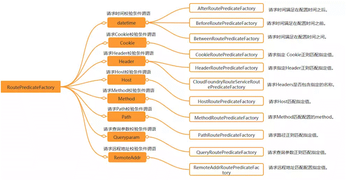

说白了 Predicate 就是为了实现一组匹配规则，方便让请求过来找到对应的 Route 进行处理，接下来我们接下 Spring Cloud GateWay 内置几种 Predicate 的使用。
转发规则（predicates）如下所示，假设转发 uri 都设定为 http://localhost:9023。

| 规则    | 实例                                                         | 说明                                                         |
| :------ | :----------------------------------------------------------- | :----------------------------------------------------------- |
| Path    | - Path=/gate/,/rule/                                         | 当请求的路径为 gate、rule 开头的时，转发到 http://localhost:9023 服务器上。 |
| Before  | - Before=2017-01-20T17:42:47.789-07:00[America/Denver]       | 在某个时间之前的请求才会被转发到 http://localhost:9023 服务器上。 |
| After   | - After=2017-01-20T17:42:47.789-07:00[America/Denver]        | 在某个时间之后的请求才会被转发。                             |
| Between | - Between=2017-01-20T17:42:47.789-07:00[America/Denver],2017-01-21T17:42:47.789-07:00[America/Denver] | 在某个时间段之间的才会被转发。                               |
| Cookie  | - Cookie=chocolate, ch.p                                     | 名为 chocolate 的表单或者满足正则     ch.p 的表单才会被匹配到进行请求转发。 |
| Header  | - Header=X-Request-Id, \d+                                   | 携带参数 X-Request-Id 或者满足 \d+ 的请求头才会匹配。        |
| Host    | - Host=www.hd123.com                                         | 当主机名为 www.hd123.com 的时候直接转发到 http://localhost:9023 服务器上。 |
| Method  | - Method=GET                                                 | 只有 GET 方法才会匹配转发请求，还可以限定 POST、PUT 等请求方式。 |

### 2.2.2、匹配方式

#### 2.2.2.1、通过请求参数匹配

Query Route Predicate 支持传入两个参数，一个是属性名，一个为属性值，属性值可以是正则表达式。示例如下：

```yaml
server:
  port: 8080
spring:
  cloud:
    gateway:
      routes:
      - id: query_route
        uri: https://example.org
        predicates:
        - Query=smile
```

这样配置，只要请求中包含 smile 属性的参数即可匹配路由。

使用 curl 测试，命令行输入: `curl localhost:8080?smile=x&id=2`，经过测试发现只要请求汇总带有 smile 参数即会匹配路由，不带 smile 参数则不会匹配。

还可以将 Query 的值以键值对的方式进行配置，这样在请求过来时会对属性值和正则进行匹配，匹配上才会走路由。示例如下：

```yaml
server:
  port: 8080
spring:
  cloud:
    gateway:
      routes:
      - id: query_route
        uri: https://example.org
        predicates:
            - Query=keep, pu.
```

这样只要当请求中包含 keep 属性并且参数值是以 pu 开头的长度为三位的字符串才会进行匹配和路由。

使用 curl 测试，命令行输入: 

`curl localhost:8080?keep=pub`

测试可以返回页面代码，将 keep 的属性值改为 pubx 再次访问就会报 404,证明路由需要匹配正则表达式才会进行路由。

#### 2.2.2.2、通过 Header 属性匹配

Header Route Predicate 和 Cookie Route Predicate 一样，也是接收 2 个参数，一个 header 中属性名称和一个正则表达式，这个属性值和正则表达式匹配则执行。示例如下：

```yaml
server:
  port: 8080
spring:
  cloud:
    gateway:
      routes:
      - id: query_route
        uri: https://example.org
        predicates:
            - Header=X-Request-Id, \d+
```

使用 curl 测试，命令行输入: 

`curl http://localhost:8080 -H "X-Request-Id:88"`

则返回页面代码证明匹配成功。

将参数 `-H "X-Request-Id:88"` 改为 `-H "X-Request-Id:spring"` 再次执行时返回 404 证明没有匹配。

#### 2.2.2.3、通过 Cookie 匹配

Cookie Route Predicate 可以接收两个参数，一个是 Cookie name ,一个是正则表达式，路由规则会通过获取对应的 Cookie name 值和正则表达式去匹配，如果匹配上就会执行路由，如果没有匹配上则不执行。示例如下：

```yaml
server:
  port: 8080
spring:
  application:
    name: api-gateway
  cloud:
    gateway:
      routes:
        -id: gateway-service
          uri: https://www.baidu.com
          order: 0
          predicates:
            - Cookie=sessionId, test
```

使用 curl 测试，命令行输入: 

`curl http://localhost:8080 --cookie "sessionId=test"`

则会返回页面代码，如果去掉 `--cookie "sessionId=test"`，后台会报 404 错误。

#### 2.2.3.4、通过 Host 匹配

Host Route Predicate 接收一组参数，一组匹配的域名列表，这个模板是一个 ant 分隔的模板，用.号作为分隔符。它通过参数中的主机地址作为匹配规则。示例如下：

```yaml
server:
  port: 8080
spring:
  cloud:
    gateway:
      routes:
      - id: query_route
        uri: https://example.org
        predicates:
          - Host=**.baidu.com
```

使用 curl 测试，命令行输入:
`curl http://localhost:8080 -H "Host: www.baidu.com"`
`curl http://localhost:8080 -H "Host: md.baidu.com"`
经测试以上两种 host 均可匹配到 host_route 路由，去掉 host 参数则会报 404 错误。

#### 2.2.3.5、通过请求方式匹配

可以通过是 POST、GET、PUT、DELETE 等不同的请求方式来进行路由。示例如下：

```yaml
server:
  port: 8080
spring:
  cloud:
    gateway:
      routes:
      - id: query_route
        uri: https://example.org
        predicates:
            - Method=GET
```

使用 curl 测试，命令行输入:
`curl http://localhost:8080`
测试返回页面代码，证明匹配到路由，我们再以 POST 的方式请求测试。
`curl -X POST http://localhost:8080`
返回 404 没有找到，证明没有匹配上路由。

#### 2.2.3.6、通过请求路径匹配

Path Route Predicate 接收一个匹配路径的参数来判断是否走路由。示例如下：

```yaml
server:
  port: 8080
spring:
  cloud:
    gateway:
      routes:
      - id: query_route
        uri: https://example.org
        predicates:
            -Path=/foo/{segment}
```

如果请求路径符合要求，则此路由将匹配，例如：/foo/1 或者 /foo/bar。
使用 curl 测试，命令行输入:
`curl http://localhost:8080/foo/1`
`curl http://localhost:8080/foo/xx`
`curl http://localhost:8080/boo/xx`
经过测试第一和第二条命令可以正常获取到页面返回值，最后一个命令报 404，证明路由是通过指定路由来匹配。

#### 2.2.3.7、通过请求 ip 地址进行匹配

Predicate 也支持通过设置某个 ip 区间号段的请求才会路由，RemoteAddr Route Predicate 接受 cidr 符号(IPv4 或 IPv6 )字符串的列表(最小大小为1)，例如 192.168.0.1/16 (其中 192.168.0.1 是 IP 地址，16 是子网掩码)。示例如下：

```yaml
server:
  port: 8080
spring:
  cloud:
    gateway:
      routes:
      - id: query_route
        uri: https://example.org
        predicates:
            - RemoteAddr=192.168.1.1/24
```

可以将此地址设置为本机的 ip 地址进行测试，使用 curl 测试，命令行输入:
`curl localhost:8080`
如果请求的远程地址是 192.168.1.10，则此路由将匹配。

#### 2.2.3.8、组合使用

示例代码如下：

```yaml
server:
  port: 8080
spring:
  application:
    name: api-gateway
  cloud:
    gateway:
      routes:
        - id: gateway-service
          uri: https://www.baidu.com
          order: 0
          predicates:
            - Host=**.foo.org
            - Path=/headers
            - Method=GET
            - Header=X-Request-Id, \d+
            - Query=foo, ba.
            - Query=baz
            - Cookie=chocolate, ch.p
```

各种 Predicates 同时存在于同一个路由时，请求必须同时满足所有的条件才被这个路由匹配。
一个请求满足多个路由的断言条件时，请求只会被首个成功匹配的路由转发。

## 2.3、过滤器规则匹配

### 2.3.1、PrefixPath

对所有的请求路径添加前缀。示例如下：

```yaml
spring:
  cloud:
    gateway:
      routes:
      - id: prefixpath_route
        uri: https://example.org
        filters:
        - PrefixPath=/mypath
```

访问 /hello 的请求被发送到 https://example.org/mypath/hello。 

### 2.3.2、RedirectTo

重定向，配置包含重定向的返回码和地址。示例如下：

```yaml
spring:
  cloud:
    gateway:
      routes:
      - id: prefixpath_route
        uri: https://example.org
        filters:
        - RedirectTo=302, https://acme.org
```

### 2.3.3、RemoveRequestHeader

去掉某个请求头信息。示例如下：

```yaml
spring:
  cloud:
    gateway:
      routes:
      - id: removerequestheader_route
        uri: https://example.org
        filters:
        - RemoveRequestHeader=X-Request-Foo
```

去掉请求头信息 X-Request-Foo。

### 2.3.4、RemoveResponseHeader

去掉某个请求参数信息。示例如下：

```yaml
spring:
  cloud:
    gateway:
      routes:
      - id: removerequestparameter_route
        uri: https://example.org
        filters:
        - RemoveRequestParameter=red
```

### 2.3.5、RewritePath

改写路径。示例如下：

```yaml
spring:
  cloud:
    gateway:
      routes:
      - id: rewrite_filter
        uri: http://localhost:8081
        predicates:
        - Path=/test/**
        filters:
        - RewritePath=/where(?<segment>/?.*), /test(?<segment>/?.*)
```

`/where/...` 改成 `test/...`

还可以使用代码改写路径。示例如下：

```java
RouteLocatorBuilder.Builder builder = routeLocatorBuilder.routes();
builder
    .route("path_rote_at_guigu", r -> r.path("/guonei")
           .uri("http://news.baidu.com/guonei"))
    .route("csdn_route", r -> r.path("/csdn")
           .uri("https://blog.csdn.net"))
    .route("blog3_rewrite_filter", r -> r.path("/blog3/**")
           .filters(f -> f.rewritePath("/blog3/(?<segment>.*)", "/$\\{segment}"))
           .uri("https://blog.csdn.net"))
    .route("rewritepath_route", r -> r.path("/baidu/**")
           .filters(f -> f.rewritePath("/baidu/(?<segment>.*)", "/$\\{segment}"))
           .uri("http://www.baidu.com"))

    .build();
```

### 2.3.6、SetPath

设置请求路径，与RewritePath类似。示例如下：

```yaml
spring:
  cloud:
    gateway:
      routes:
      - id: setpath_route
        uri: https://example.org
        predicates:
        - Path=/red/{segment}
        filters:
        - SetPath=/{segment}
```

如 /red/blue 的请求被转发到 /blue。

### 2.3.7、SetRequestHeader

设置请求头信息。示例如下：

```yaml
spring:
  cloud:
    gateway:
      routes:
      - id: setrequestheader_route
        uri: https://example.org
        filters:
        - SetRequestHeader=X-Request-Red, Blue
```

### 2.3.8、SetStatus

设置回执状态码。示例如下：

```yaml
spring:
  cloud:
    gateway:
      routes:
      - id: setstatusint_route
        uri: https://example.org
        filters:
        - SetStatus=401
```

### 2.3.9、StripPrefix

跳过指定路径。示例如下：

```yaml
spring:
  cloud:
    gateway:
      routes:
      - id: nameRoot
        uri: https://nameservice
        predicates:
        - Path=/name/**
        filters:
        - StripPrefix=2
```

请求 /name/blue/red 会转发到 /red。

### 2.3.10、RequestSize

请求大小。示例如下：

```yaml
spring:
  cloud:
    gateway:
      routes:
      - id: request_size_route
        uri: http://localhost:8080/upload
        predicates:
        - Path=/upload
        filters:
        - name: RequestSize
          args:
            maxSize: 5000000
```

超过 5M 的请求会返回 413 错误。

### 2.3.11、Default-filters

对所有请求添加过滤器。示例如下：

```yaml
spring:
  cloud:
    gateway:
      default-filters:
      - AddResponseHeader=X-Response-Default-Red, Default-Blue
      - PrefixPath=/httpbin
```

### 2.3.12、通过代码进行配置

通过代码进行配置，将路由规则设置为一个Bean即可。示例如下：

```java
@Bean
public RouteLocator customRouteLocator(RouteLocatorBuilder builder) {
	return builder.routes()
		.route("path_route", r -> r.path("/get")
			.uri("http://httpbin.org"))
		.route("host_route", r -> r.host("*.myhost.org")
			.uri("http://httpbin.org"))
		.route("rewrite_route", r -> r.host("*.rewrite.org")
			.filters(f -> f.rewritePath("/foo/(?<segment>.*)", "/${segment}"))
			.uri("http://httpbin.org"))
		.route("hystrix_route", r -> r.host("*.hystrix.org")
			.filters(f -> f.hystrix(c -> c.setName("slowcmd")))
			.uri("http://httpbin.org"))
		.route("hystrix_fallback_route", r -> r.host("*.hystrixfallback.org")
			.filters(f -> f.hystrix(c -> c.setName("slowcmd").setFallbackUri("forward:/hystrixfallback")))
			.uri("http://httpbin.org"))
		.route("limit_route", r -> r
			.host("*.limited.org").and().path("/anything/**")
			.filters(f -> f.requestRateLimiter(c -> c.setRateLimiter(redisRateLimiter())))
			.uri("http://httpbin.org"))
		.build();
}
```

# 3、熔断降级

## 3.1、为什么要实现熔断降级

在分布式系统中，网关作为流量的入口，因此会有大量的请求进入网关，向其他服务发起调用，其他服务不可避免的会出现调用失败（超时、异常），失败时不能让请求堆积在网关上，需要快速失败并返回给客户端，想要实现这个要求，就必须在网关上做熔断、降级操作。

## 3.2、为什么在网关上请求失败需要快速返回给客户端

因为当一个客户端请求发生故障的时候，这个请求会一直堆积在网关上，当然只有一个这种请求，网关肯定没有问题（如果一个请求就能造成整个系统瘫痪，那这个系统可以下架了），但是网关上堆积多了就会给网关乃至整个服务都造成巨大的压力，甚至整个服务宕掉。因此要对一些服务和页面进行有策略的降级，以此缓解服务器资源的的压力，以保证核心业务的正常运行，同时也保持了客户和大部分客户的得到正确的相应，所以需要网关上请求失败需要快速返回给客户端。示例如下：

```yaml
server.port: 8082

spring:
  application:
    name: gateway
  redis:
      host: localhost
      port: 6379
      password: 123456
  cloud:
    gateway:
      routes:
        - id: rateLimit_route
          uri: http://localhost:8000
          order: 0
          predicates:
            - Path=/test/**
          filters:
            - StripPrefix=1
            - name: Hystrix
              args:
                name: fallbackCmdA
                fallbackUri: forward:/fallbackA

  hystrix.command.fallbackCmdA.execution.isolation.thread.timeoutInMilliseconds: 5000
```

这里的配置，使用了两个过滤器：

1. 过滤器 StripPrefix，作用是去掉请求路径的最前面 n 个部分截取掉。

    StripPrefix=1 就代表截取路径的个数为 1，比如前端过来请求 /test/good/1/view，匹配成功后，路由到后端的请求路径就会变成 http://localhost:8888/good/1/view。

2. 过滤器 Hystrix，作用是通过 Hystrix 进行熔断降级。
    当上游的请求，进入了 Hystrix 熔断降级机制时，就会调用 fallbackUri 配置的降级地址。

    需要注意的是，还需要单独设置 Hystrix 的 commandKey 的超时时间。

fallbackUri 配置的降级地址的代码如下：

```java
package org.gateway.controller;

import org.gateway.response.Response;
import org.springframework.web.bind.annotation.GetMapping;
import org.springframework.web.bind.annotation.RestController;

@RestController
public class FallbackController {

    @GetMapping("/fallbackA")
    public Response fallbackA() {
        Response response = new Response();
        response.setCode("100");
        response.setMessage("服务暂时不可用");
        return response;
    }
}
```

# 4、过滤器

## 4.1、过滤器的执行次序

Spring-Cloud-Gateway 基于过滤器实现，同 zuul 类似，有 pre 和 post 两种方式的 filter,分别处理前置逻辑和后置逻辑。客户端的请求先经过pre类型的 filter，然后将请求转发到具体的业务服务，收到业务服务的响应之后，再经过post类型的 filter 处理，最后返回响应到客户端。**过滤器执行流程如下，order 越大，优先级越低**。

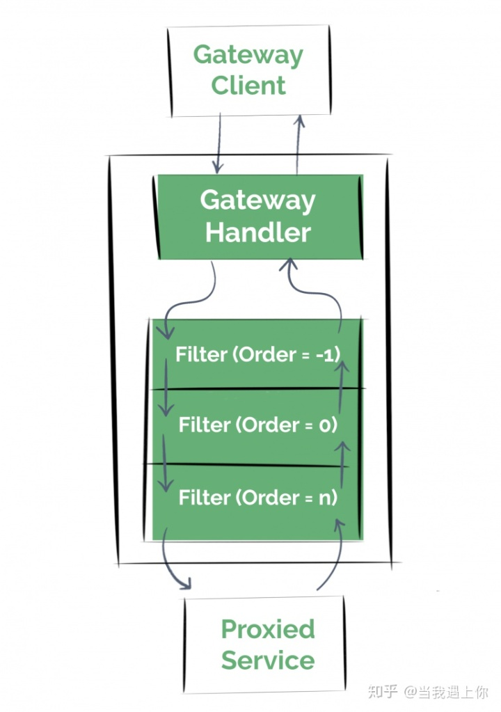

## 4.2、过滤器分类

### 4.2.1、全局过滤器

对所有路由生效。

#### 4.2.1.1、定义全局过滤器

实现 GlobalFilter 和 Ordered，重写相关方法，加入到 spring 容器管理即可，无需配置，全局过滤器对所有的路由都有效。
示例代码如下：

```java
package com.crazymaker.cloud.nacos.demo.gateway.config;

import lombok.extern.slf4j.Slf4j;
import org.springframework.cloud.gateway.filter.GatewayFilterChain;
import org.springframework.cloud.gateway.filter.GlobalFilter;
import org.springframework.context.annotation.Bean;
import org.springframework.context.annotation.Configuration;
import org.springframework.core.Ordered;
import org.springframework.core.annotation.Order;
import org.springframework.web.server.ServerWebExchange;
import reactor.core.publisher.Mono;

@Configuration
public class FilterConfig
{

    @Bean
    @Order(-1)
    public GlobalFilter a()
    {
        return new AFilter();
    }

    @Bean
    @Order(0)
    public GlobalFilter b()
    {
        return new BFilter();
    }

    @Bean
    @Order(1)
    public GlobalFilter c()
    {
        return new CFilter();
    }


    @Slf4j
    public class AFilter implements GlobalFilter, Ordered
    {

        @Override
        public Mono<Void> filter(ServerWebExchange exchange, GatewayFilterChain chain)
        {
            log.info("AFilter前置逻辑");
            return chain.filter(exchange).then(Mono.fromRunnable(() ->
            {
                log.info("AFilter后置逻辑");
            }));
        }

        //   值越小，优先级越高
		//    int HIGHEST_PRECEDENCE = -2147483648;
		//    int LOWEST_PRECEDENCE = 2147483647;
        @Override
        public int getOrder()
        {
            return HIGHEST_PRECEDENCE + 100;
        }
    }

    @Slf4j
    public class BFilter implements GlobalFilter, Ordered
    {
        @Override
        public Mono<Void> filter(ServerWebExchange exchange, GatewayFilterChain chain)
        {
            log.info("BFilter前置逻辑");
            return chain.filter(exchange).then(Mono.fromRunnable(() ->
            {
                log.info("BFilter后置逻辑");
            }));
        }


        //   值越小，优先级越高
		//    int HIGHEST_PRECEDENCE = -2147483648;
		//    int LOWEST_PRECEDENCE = 2147483647;
        @Override
        public int getOrder()
        {
            return HIGHEST_PRECEDENCE + 200;
        }
    }

    @Slf4j
    public class CFilter implements GlobalFilter, Ordered
    {

        @Override
        public Mono<Void> filter(ServerWebExchange exchange, GatewayFilterChain chain)
        {
            log.info("CFilter前置逻辑");
            return chain.filter(exchange).then(Mono.fromRunnable(() ->
            {
                log.info("CFilter后置逻辑");
            }));
        }

        //   值越小，优先级越高
		//    int HIGHEST_PRECEDENCE = -2147483648;
		//    int LOWEST_PRECEDENCE = 2147483647;
        @Override
        public int getOrder()
        {
            return HIGHEST_PRECEDENCE + 300;
        }
    }
}
```


### 4.2.2、局部过滤器

对指定路由生效。

#### 4.2.2.1、定义局部过滤器

步骤：

1. 需要实现GatewayFilter, Ordered，实现相关的方法。
2. 加入到过滤器工厂，并且注册到spring容器中。
3. 在配置文件中进行配置，如果不配置则不启用此过滤器规则。

局部过滤器举例, 对请求头部的 user-id 进行校验。示例代码如下：

1. 需要实现GatewayFilter, Ordered，实现相关的方法。

    ```java
    package com.crazymaker.cloud.nacos.demo.gateway.filter;
    
    import lombok.extern.slf4j.Slf4j;
    import org.apache.commons.lang3.StringUtils;
    import org.springframework.cloud.gateway.filter.GatewayFilter;
    import org.springframework.cloud.gateway.filter.GatewayFilterChain;
    import org.springframework.cloud.gateway.filter.GlobalFilter;
    import org.springframework.core.Ordered;
    import org.springframework.http.HttpStatus;
    import org.springframework.stereotype.Component;
    import org.springframework.web.server.ServerWebExchange;
    import reactor.core.publisher.Mono;
    
    //@Component
    @Slf4j
    public class UserIdCheckGateWayFilter implements GatewayFilter, Ordered
    {
        @Override
        public Mono<Void> filter(ServerWebExchange exchange, GatewayFilterChain chain)
        {
            String url = exchange.getRequest().getPath().pathWithinApplication().value();
            log.info("请求URL:" + url);
            log.info("method:" + exchange.getRequest().getMethod());
           /*   String secret = exchange.getRequest().getHeaders().getFirst("secret");
            if (StringUtils.isBlank(secret))
            {
                return chain.filter(exchange);
            }*/
             //获取param 请求参数
            String uname = exchange.getRequest().getQueryParams().getFirst("uname");
            //获取header
            String userId = exchange.getRequest().getHeaders().getFirst("user-id");
            log.info("userId：" + userId);
    
            if (StringUtils.isBlank(userId))
            {
                log.info("*****头部验证不通过，请在头部输入  user-id");
                //终止请求，直接回应
                exchange.getResponse().setStatusCode(HttpStatus.NOT_ACCEPTABLE);
                return exchange.getResponse().setComplete();
            }
            return chain.filter(exchange);
        }
    
        //   值越小，优先级越高
    	//    int HIGHEST_PRECEDENCE = -2147483648;
    	//    int LOWEST_PRECEDENCE = 2147483647;
        @Override
        public int getOrder()
        {
            return HIGHEST_PRECEDENCE;
        }
    }
    ```

    

2. 加入到过滤器工厂，并且注册到spring容器中。

    ```java
    package com.crazymaker.cloud.nacos.demo.gateway.config;
    
    import com.crazymaker.cloud.nacos.demo.gateway.filter.UserIdCheckGateWayFilter;
    import org.springframework.cloud.gateway.filter.GatewayFilter;
    import org.springframework.cloud.gateway.filter.factory.AbstractGatewayFilterFactory;
    import org.springframework.stereotype.Component;
    
    
    @Component
    public class UserIdCheckGatewayFilterFactory extends AbstractGatewayFilterFactory<Object>
    {
        @Override
        public GatewayFilter apply(Object config)
        {
            return new UserIdCheckGateWayFilter();
        }
    }
    ```

    

3. 在配置文件中进行配置，如果不配置则不启用此过滤器规则。

    ```yaml
    - id: service_provider_demo_route_filter
              uri: lb://service-provider-demo
              predicates:
                - Path=/filter/**
              filters:
                - RewritePath=/filter/(?<segment>.*), /provider/$\{segment}
                - UserIdCheck
    ```

## 4.3、ServerWebExchange交换机

### 4.3.1、ServerWebExchange 与过滤器的关系

Spring Cloud Gateway 同 zuul 类似，有 pre 和 post 两种方式的 filter。
客户端的请求先经过 pre 类型的 filter，然后将请求转发到具体的业务服务，收到业务服务的响应之后，再经过 post 类型的filter处理，最后返回响应到客户端。
引用 Spring Cloud Gateway 官网上的一张图：

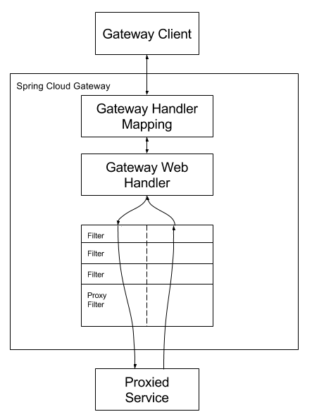

与 zuul 不同的是，filter 除了分为 pre 和 post 两种方式的 filter 外，在 Spring Cloud Gateway 中，filter 从作用范围可分为另外两种，一种是针对于单个路由的 gateway filter，它在配置文件中的写法同 Predicate 类似；一种是针对于所有路由的 global gateway filer。
现在从作用范围划分的维度来讲解这两种 filter。
我们在使用 Spring Cloud Gateway 的时候，注意到过滤器（包括 GatewayFilter 、GlobalFilter 和过滤器链 GatewayFilterChain）。
Spring Cloud Gateway 根据作用范围划分为 GatewayFilter 和 GlobalFilter，二者区别如下：

- GatewayFilter : 需要通过 spring.cloud.routes.filters 配置在具体路由下，只作用在当前路由上或通过 spring.cloud.default-filters 配置在全局，作用在所有路由上。
- GlobalFilter : 全局过滤器，不需要在配置文件中配置，作用在所有的路由上，最终通过GatewayFilterAdapter 包装成 GatewayFilterChain 可识别的过滤器，它为请求业务以及路由的 URI 转换为真实业务服务的请求地址的核心过滤器，不需要配置，系统初始化时加载，并作用在每个路由上。

Spring Cloud Gateway 框架内置的 GlobalFilter 如下：

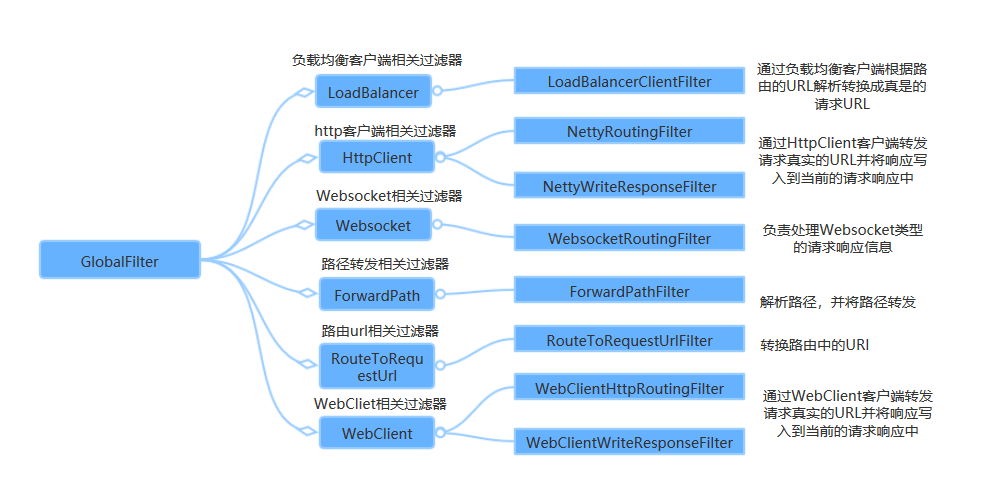

上图中每一个 GlobalFilter 都作用在每一个 router 上，能够满足大多数的需求。
但是如果遇到业务上的定制，可能需要编写满足自己需求的 GlobalFilter。
过滤器都依赖到 ServerWebExchange，代码如下：

```java
public interface GlobalFilter {

    Mono<Void> filter(ServerWebExchange exchange, GatewayFilterChain chain);
}

public interface GatewayFilter extends ShortcutConfigurable {

	Mono<Void> filter(ServerWebExchange exchange, GatewayFilterChain chain);
}

public interface GatewayFilterChain {

    Mono<Void> filter(ServerWebExchange exchange);
}
```

这里的设计和 Servlet 中的 Filter 是相似的，当前过滤器可以决定是否执行下一个过滤器的逻辑，由 GatewayFilterChain#filter() 是否被调用来决定。

而 ServerWebExchange 就相当于当前请求和响应的上下文。
ServerWebExchange 实例不单存储了 Request 和 Response 对象，还提供了一些扩展方法，如果想实现改造请求参数或者响应参数，就必须深入了解 ServerWebExchange。

先看 ServerWebExchange 的注释：

> Contract for an HTTP request-response interaction.
> Provides access to the HTTP request and response and also exposes additional server-side processing related properties and features such as request attributes.

翻译一下大概是：

> ServerWebExchange 是一个 HTTP 请求-响应交互的契约。提供对 HTTP 请求和响应的访问，并公开额外的服务器端处理相关属性和特性，如请求属性。

其实，ServerWebExchange 命名为服务网络交换器，存放着重要的请求-响应属性、请求实例和响应实例等等，有点像 Context 的角色。

### 4.3.2、ServerWebExchange 接口

ServerWebExchange 接口的所有方法如下所示：

```java
public interface ServerWebExchange {

    // 日志前缀属性的KEY，值为org.springframework.web.server.ServerWebExchange.LOG_ID
    // 可以理解为 attributes.set("org.springframework.web.server.ServerWebExchange.LOG_ID","日志前缀的具体值");
    // 作用是打印日志的时候会拼接这个KEY对饮的前缀值，默认值为""
    String LOG_ID_ATTRIBUTE = ServerWebExchange.class.getName() + ".LOG_ID";
    String getLogPrefix();

    // 获取ServerHttpRequest对象
    ServerHttpRequest getRequest();

    // 获取ServerHttpResponse对象
    ServerHttpResponse getResponse();
    
    // 返回当前exchange的请求属性，返回结果是一个可变的Map
    Map<String, Object> getAttributes();
    
    // 根据KEY获取请求属性
    @Nullable
    default <T> T getAttribute(String name) {
        return (T) getAttributes().get(name);
    }
    
    // 根据KEY获取请求属性，做了非空判断
    @SuppressWarnings("unchecked")
    default <T> T getRequiredAttribute(String name) {
        T value = getAttribute(name);
        Assert.notNull(value, () -> "Required attribute '" + name + "' is missing");
        return value;
    }

     // 根据KEY获取请求属性，需要提供默认值
    @SuppressWarnings("unchecked")
    default <T> T getAttributeOrDefault(String name, T defaultValue) {
        return (T) getAttributes().getOrDefault(name, defaultValue);
    } 

    // 返回当前请求的网络会话
    Mono<WebSession> getSession();

    // 返回当前请求的认证用户，如果存在的话
    <T extends Principal> Mono<T> getPrincipal();  
    
    // 返回请求的表单数据或者一个空的Map，只有Content-Type为application/x-www-form-urlencoded的时候这个方法才会返回一个非空的Map -- 这个一般是表单数据提交用到
    Mono<MultiValueMap<String, String>> getFormData();   
    
    // 返回multipart请求的part数据或者一个空的Map，只有Content-Type为multipart/form-data的时候这个方法才会返回一个非空的Map  -- 这个一般是文件上传用到
    Mono<MultiValueMap<String, Part>> getMultipartData();
    
    // 返回Spring的上下文
    @Nullable
    ApplicationContext getApplicationContext();   

    // 这几个方法和lastModified属性相关
    boolean isNotModified();
    boolean checkNotModified(Instant lastModified);
    boolean checkNotModified(String etag);
    boolean checkNotModified(@Nullable String etag, Instant lastModified);
    
    // URL转换
    String transformUrl(String url);    
   
    // URL转换映射
    void addUrlTransformer(Function<String, String> transformer); 

    // 注意这个方法，方法名是：改变，这个是修改ServerWebExchange属性的方法，返回的是一个Builder实例，Builder是ServerWebExchange的内部类
    default Builder mutate() {
	     return new DefaultServerWebExchangeBuilder(this);
    }

    interface Builder {      
         
        // 覆盖ServerHttpRequest
        Builder request(Consumer<ServerHttpRequest.Builder> requestBuilderConsumer);
        Builder request(ServerHttpRequest request);
        
        // 覆盖ServerHttpResponse
        Builder response(ServerHttpResponse response);
        
        // 覆盖当前请求的认证用户
        Builder principal(Mono<Principal> principalMono);
    
        // 构建新的ServerWebExchange实例
        ServerWebExchange build();
    }
}
```

### 4.3.3、ServerWebExchange#mutate() 方法

注意到 ServerWebExchange#mutate() 方法，ServerWebExchange 实例可以理解为不可变实例，如果我们想要修改它，需要通过 mutate() 方法生成一个新的实例，例如这样：

```java
public class CustomGlobalFilter implements GlobalFilter {

    @Override
    public Mono<Void> filter(ServerWebExchange exchange, GatewayFilterChain chain) {
        ServerHttpRequest request = exchange.getRequest();
        // 这里可以修改ServerHttpRequest实例
        ServerHttpRequest newRequest = ...
        ServerHttpResponse response = exchange.getResponse();
        // 这里可以修改ServerHttpResponse实例
        ServerHttpResponse newResponse = ...
        // 构建新的ServerWebExchange实例
        ServerWebExchange newExchange = exchange.mutate().request(newRequest).response(newResponse).build();
        return chain.filter(newExchange);
    }
}
```

### 4.3.4、ServerHttpRequest 接口

ServerHttpRequest 实例是用于承载请求相关的属性和请求体，Spring Cloud Gateway 中底层使用 Netty 处理网络请求，通过追溯源码，可以从 ReactorHttpHandlerAdapter 中得知 ServerWebExchange 实例中持有的 ServerHttpRequest 实例的具体实现是 ReactorServerHttpRequest。
之所以列出这些实例之间的关系，是因为这样比较容易理清一些隐含的问题，例如：ReactorServerHttpRequest 的父类 AbstractServerHttpRequest 中初始化内部属性 headers 的时候把请求的 HTTP 头部封装为只读的实例。代码如下：

```java
public AbstractServerHttpRequest(URI uri, @Nullable String contextPath, HttpHeaders headers) {
	this.uri = uri;
	this.path = RequestPath.parse(uri, contextPath);
	this.headers = HttpHeaders.readOnlyHttpHeaders(headers);
}

// HttpHeaders类中的readOnlyHttpHeaders方法，
// ReadOnlyHttpHeaders屏蔽了所有修改请求头的方法，直接抛出UnsupportedOperationException
public static HttpHeaders readOnlyHttpHeaders(HttpHeaders headers) {
	Assert.notNull(headers, "HttpHeaders must not be null");
	if (headers instanceof ReadOnlyHttpHeaders) {
		return headers;
	}
	else {
		return new ReadOnlyHttpHeaders(headers);
	}
}
```

所以, 不能直接从 ServerHttpRequest 实例中直接获取请求头 HttpHeaders 实例并且进行修改。

ServerHttpRequest 接口代码如下：

```java
public interface HttpMessage {
    
    // 获取请求头，目前的实现中返回的是ReadOnlyHttpHeaders实例，只读
    HttpHeaders getHeaders();
}    

public interface ReactiveHttpInputMessage extends HttpMessage {
    
    // 返回请求体的Flux封装
    Flux<DataBuffer> getBody();
}

public interface HttpRequest extends HttpMessage {

    // 返回HTTP请求方法，解析为HttpMethod实例
    @Nullable
    default HttpMethod getMethod() {
        return HttpMethod.resolve(getMethodValue());
    }
    
    // 返回HTTP请求方法，字符串
    String getMethodValue();    
    
    // 请求的URI
    URI getURI();
}    

public interface ServerHttpRequest extends HttpRequest, ReactiveHttpInputMessage {
    
    // 连接的唯一标识或者用于日志处理标识
    String getId();   
    
    // 获取请求路径，封装为RequestPath对象
    RequestPath getPath();
    
    // 返回查询参数，是只读的MultiValueMap实例
    MultiValueMap<String, String> getQueryParams();

    // 返回Cookie集合，是只读的MultiValueMap实例
    MultiValueMap<String, HttpCookie> getCookies();  
    
    // 远程服务器地址信息
    @Nullable
    default InetSocketAddress getRemoteAddress() {
       return null;
    }

    // SSL会话实现的相关信息
    @Nullable
    default SslInfo getSslInfo() {
       return null;
    }  
    
    // 修改请求的方法，返回一个建造器实例Builder，Builder是内部类
    default ServerHttpRequest.Builder mutate() {
        return new DefaultServerHttpRequestBuilder(this);
    } 

    interface Builder {

        // 覆盖请求方法
        Builder method(HttpMethod httpMethod);
		 
        // 覆盖请求的URI、请求路径或者上下文，这三者相互有制约关系，具体可以参考API注释
        Builder uri(URI uri);
        Builder path(String path);
        Builder contextPath(String contextPath);

        // 覆盖请求头
        Builder header(String key, String value);
        Builder headers(Consumer<HttpHeaders> headersConsumer);
        
        // 覆盖SslInfo
        Builder sslInfo(SslInfo sslInfo);
        
        // 构建一个新的ServerHttpRequest实例
        ServerHttpRequest build();
    }         
}
```

**注意**：ServerHttpRequest 或者说 HttpMessage 接口提供的获取请求头方法 HttpHeaders getHeaders()，返回结果是一个只读的实例，具体是 ReadOnlyHttpHeaders 类型，如果要修改 ServerHttpRequest 实例，那么需要这样做。示例如下：

```java
ServerHttpRequest request = exchange.getRequest();
ServerHttpRequest newRequest = request.mutate().header("key","value").path("/myPath").build();
```

### 4.3.5、ServerHttpResponse 接口

ServerHttpResponse 实例是用于承载响应相关的属性和响应体，Spring Cloud Gateway 中底层使用 Netty 处理网络请求，通过追溯源码，可以从 ReactorHttpHandlerAdapter 中得知 ServerWebExchange 实例中持有的 ServerHttpResponse 实例的具体实现是 ReactorServerHttpResponse。
之所以列出这些实例之间的关系，是因为这样比较容易理清一些隐含的问题。代码如下：

```java
// ReactorServerHttpResponse的父类
public AbstractServerHttpResponse(DataBufferFactory dataBufferFactory, HttpHeaders headers) {
	Assert.notNull(dataBufferFactory, "DataBufferFactory must not be null");
	Assert.notNull(headers, "HttpHeaders must not be null");
	this.dataBufferFactory = dataBufferFactory;
	this.headers = headers;
	this.cookies = new LinkedMultiValueMap<>();
}

public ReactorServerHttpResponse(HttpServerResponse response, DataBufferFactory bufferFactory) {
	super(bufferFactory, new HttpHeaders(new NettyHeadersAdapter(response.responseHeaders())));
	Assert.notNull(response, "HttpServerResponse must not be null");
	this.response = response;
}
```

可知 ReactorServerHttpResponse 构造函数初始化实例的时候，存放响应 Header 的是HttpHeaders 实例，也就是响应 Header 是可以直接修改的。
ServerHttpResponse 接口代码如下：

```java
public interface HttpMessage {
    
    // 获取响应Header，目前的实现中返回的是HttpHeaders实例，可以直接修改
    HttpHeaders getHeaders();
}  

public interface ReactiveHttpOutputMessage extends HttpMessage {
    
    // 获取DataBufferFactory实例，用于包装或者生成数据缓冲区DataBuffer实例(创建响应体)
    DataBufferFactory bufferFactory();

    // 注册一个动作，在HttpOutputMessage提交之前此动作会进行回调
    void beforeCommit(Supplier<? extends Mono<Void>> action);

    // 判断HttpOutputMessage是否已经提交
    boolean isCommitted();
    
    // 写入消息体到HTTP协议层
    Mono<Void> writeWith(Publisher<? extends DataBuffer> body);

    // 写入消息体到HTTP协议层并且刷新缓冲区
    Mono<Void> writeAndFlushWith(Publisher<? extends Publisher<? extends DataBuffer>> body);
    
    // 指明消息处理已经结束，一般在消息处理结束自动调用此方法，多次调用不会产生副作用
    Mono<Void> setComplete();
}

public interface ServerHttpResponse extends ReactiveHttpOutputMessage {
    
    // 设置响应状态码
    boolean setStatusCode(@Nullable HttpStatus status);
    
    // 获取响应状态码
    @Nullable
    HttpStatus getStatusCode();
    
    // 获取响应Cookie，封装为MultiValueMap实例，可以修改
    MultiValueMap<String, ResponseCookie> getCookies();  
    
    // 添加响应Cookie
    void addCookie(ResponseCookie cookie);  
}
```

这里可以看到除了响应体比较难修改之外，其他的属性都是可变的。

### 4.3.6、ServerWebExchangeUtils 和上下文属性

ServerWebExchangeUtils里面存放了很多静态公有的字符串KEY值，(这些字符串 KEY 的实际值是 org.springframework.cloud.gateway.support.ServerWebExchangeUtils. + 下面任意的静态公有 KEY)，这些字符串 KEY 值一般是用于 ServerWebExchange 的属性(Attribute，见上文的 ServerWebExchange#getAttributes() 方法)的 KEY，这些属性值都是有特殊的含义，在使用过滤器的时候如果时机适当可以直接取出来使用，下面逐个分析。

- PRESERVE_HOST_HEADER_ATTRIBUTE：是否保存 Host 属性，值是布尔值类型，写入位置是 PreserveHostHeaderGatewayFilterFactory，使用的位置是 NettyRoutingFilter，作用是如果设置为 true，HTTP 请求头中的 Host 属性会写到底层 Reactor-Netty 的请求 Header 属性中。
- CLIENT_RESPONSE_ATTR：保存底层 Reactor-Netty 的响应对象，类型是 reactor.netty.http.client.HttpClientResponse。
- CLIENT_RESPONSE_CONN_ATTR：保存底层 Reactor-Netty 的连接对象，类型是 reactor.netty.Connection。
- URI_TEMPLATE_VARIABLES_ATTRIBUTE：PathRoutePredicateFactory 解析路径参数完成之后，把解析完成后的占位符 
- KEY-路径 Path 映射存放在 ServerWebExchange 的属性中，KEY 就是 URI_TEMPLATE_VARIABLES_ATTRIBUTE。
- CLIENT_RESPONSE_HEADER_NAMES：保存底层 Reactor-Netty 的响应 Header 的名称集合。
- GATEWAY_ROUTE_ATTR：用于存放 RoutePredicateHandlerMapping 中匹配出来的具体的路由(org.springframework.cloud.gateway.route.Route)实例，通过这个路由实例可以得知当前请求会路由到下游哪个服务。
- GATEWAY_REQUEST_URL_ATTR：java.net.URI 类型的实例，这个实例代表直接请求或者负载均衡处理之后需要请求到下游服务的真实 URI。
- GATEWAY_ORIGINAL_REQUEST_URL_ATTR：java.net.URI 类型的实例，需要重写请求 URI 的时候，保存原始的请求 URI。
- GATEWAY_HANDLER_MAPPER_ATTR：保存当前使用的 HandlerMapping 具体实例的类型简称(一般是字符串 "RoutePredicateHandlerMapping")。
- GATEWAY_SCHEME_PREFIX_ATTR：确定目标路由URI中如果存在 schemeSpecificPart属性，则保存该 URI 的 scheme 在此属性中，路由 URI 会被重新构造，见 RouteToRequestUrlFilter。
- GATEWAY_PREDICATE_ROUTE_ATTR：用于存放 RoutePredicateHandlerMapping 中匹配出来的具体的路由(org.springframework.cloud.gateway.route.Route)实例的 ID。
- WEIGHT_ATTR：实验性功能(此版本还不建议在正式版本使用)存放分组权重相关属性，见 WeightCalculatorWebFilter。
- ORIGINAL_RESPONSE_CONTENT_TYPE_ATTR：存放响应 Header 中的 ContentType 的值。
- HYSTRIX_EXECUTION_EXCEPTION_ATTR：Throwable 的实例，存放的是 Hystrix 执行异常时候的异常实例，见 HystrixGatewayFilterFactory。
- GATEWAY_ALREADY_ROUTED_ATTR：布尔值，用于判断是否已经进行了路由，见 NettyRoutingFilter。
- GATEWAY_ALREADY_PREFIXED_ATTR：布尔值，用于判断请求路径是否被添加了前置部分，见 PrefixPathGatewayFilterFactory。

ServerWebExchangeUtils提供的上下文属性用于Spring Cloud Gateway 的 ServerWebExchange 组件处理请求和响应的时候，内部一些重要实例或者标识属性的安全传输和使用，使用它们可能存在一定的风险，
因为没有人可以确定在版本升级之后，原有的属性 KEY 或者 VALUE 是否会发生改变，如果评估过风险或者规避了风险之后，可以安心使用。
例如我们在做请求和响应日志(类似Nginx的Access Log)的时候，可以依赖到 GATEWAY_ROUTE_ATTR，因为我们要打印路由的目标信息。示例如下：

```java
@Slf4j
@Component
public class AccessLogFilter implements GlobalFilter {

    @Override
    public Mono<Void> filter(ServerWebExchange exchange, GatewayFilterChain chain) {
        ServerHttpRequest request = exchange.getRequest();
        String path = request.getPath().pathWithinApplication().value();
        HttpMethod method = request.getMethod();
        // 获取路由的目标URI
        URI targetUri = exchange.getAttribute(ServerWebExchangeUtils.GATEWAY_REQUEST_URL_ATTR);
        InetSocketAddress remoteAddress = request.getRemoteAddress();
        return chain.filter(exchange.mutate().build()).then(Mono.fromRunnable(() -> {
            ServerHttpResponse response = exchange.getResponse();
            HttpStatus statusCode = response.getStatusCode();
            log.info("请求路径:{},客户端远程IP地址:{},请求方法:{},目标URI:{},响应码:{}",
                    path, remoteAddress, method, targetUri, statusCode);
        }));
    }
}
```

### 4.3.7、修改请求体

修改请求体是一个比较常见的需求。
例如我们使用 Spring Cloud Gateway 实现网关的时候，要实现一个功能：把存放在请求头中的JWT解析后，提取里面的用户 ID，然后写入到请求体中。我们简化这个场景，假设我们把 userId 明文存放在请求头中的 accessToken 中，请求体是一个 JSON 结构，数据如下：

```json
{
    "serialNumber": "请求流水号",
    "payload" : {
        // ... 这里是有效载荷，存放具体的数据
    }
}
```

我们需要提取 accessToken，也就是 userId 插入到请求体 JSON 中，数据如下：

```json
{
    "userId": "用户ID",
    "serialNumber": "请求流水号",
    "payload" : {
        // ... 这里是有效载荷，存放具体的数据
    }
}
```

这里为了简化设计，用全局过滤器GlobalFilter实现，实际需要结合具体场景考虑。代码如下：

```java
@Slf4j
@Component
public class ModifyRequestBodyGlobalFilter implements GlobalFilter {

    private final DataBufferFactory dataBufferFactory = new NettyDataBufferFactory(ByteBufAllocator.DEFAULT);

    @Autowired
    private ObjectMapper objectMapper;

    @Override
    public Mono<Void> filter(ServerWebExchange exchange, GatewayFilterChain chain) {
        ServerHttpRequest request = exchange.getRequest();
        String accessToken = request.getHeaders().getFirst("accessToken");
        if (!StringUtils.hasLength(accessToken)) {
            throw new IllegalArgumentException("accessToken");
        }
        // 新建一个ServerHttpRequest装饰器,覆盖需要装饰的方法
        ServerHttpRequestDecorator decorator = new ServerHttpRequestDecorator(request) {

            @Override
            public Flux<DataBuffer> getBody() {
                Flux<DataBuffer> body = super.getBody();
                InputStreamHolder holder = new InputStreamHolder();
                body.subscribe(buffer -> holder.inputStream = buffer.asInputStream());
                if (null != holder.inputStream) {
                    try {
                        
                        // 解析JSON的节点
                        JsonNode jsonNode = objectMapper.readTree(holder.inputStream);
                        Assert.isTrue(jsonNode instanceof ObjectNode, "JSON格式异常");
                        ObjectNode objectNode = (ObjectNode) jsonNode;
                        
                        // JSON节点最外层写入新的属性
                        objectNode.put("userId", accessToken);
                        DataBuffer dataBuffer = dataBufferFactory.allocateBuffer();
                        String json = objectNode.toString();
                        log.info("最终的JSON数据为:{}", json);
                        dataBuffer.write(json.getBytes(StandardCharsets.UTF_8));
                        
                        return Flux.just(dataBuffer);
                    } catch (Exception e) {
                        throw new IllegalStateException(e);
                    }
                } else {
                    return super.getBody();
                }
            }
        };
        // 使用修改后的ServerHttpRequestDecorator重新生成一个新的ServerWebExchange
        return chain.filter(exchange.mutate().request(decorator).build());
    }

    private class InputStreamHolder {

        InputStream inputStream;
    }
}
```

测试效果如下：

```tex
// HTTP
POST /order/json HTTP/1.1
Host: localhost:9090
Content-Type: application/json
accessToken: 10086
Accept: */*
Cache-Control: no-cache
Host: localhost:9090
accept-encoding: gzip, deflate
content-length: 94
Connection: keep-alive
cache-control: no-cache

{
    "serialNumber": "请求流水号",
    "payload": {
        "name": "doge"
    }
}

// 日志输出
最终的JSON数据为:{"serialNumber":"请求流水号","payload":{"name":"doge"},"userId":"10086"}
```

最重要的是用到了 ServerHttpRequest 装饰器 ServerHttpRequestDecorator，主要覆盖对应获取请求体数据缓冲区的方法即可，至于怎么处理其他逻辑需要自行考虑，这里只是做一个简单的示范。
一般的代码逻辑如下代码：

```java
ServerHttpRequest request = exchange.getRequest();
ServerHttpRequestDecorator requestDecorator = new ServerHttpRequestDecorator(request) {

     @Override
     public Flux<DataBuffer> getBody() {
         // 拿到承载原始请求体的Flux
         Flux<DataBuffer> body = super.getBody();
         // 这里通过自定义方式生成新的承载请求体的Flux
         Flux<DataBuffer> newBody = ...
         return newBody;
     }            
}
return chain.filter(exchange.mutate().request(requestDecorator).build());    
```

### 4.3.8、修改响应体

修改响应体的需求也是比较常见的，具体的做法和修改请求体差不多。
例如我们想要实现下面的功能：第三方服务请求经过网关，原始报文是密文，我们需要在网关实现密文解密，然后把解密后的明文路由到下游服务，下游服务处理成功响应明文，需要在网关把明文加密成密文再返回到第三方服务。
现在简化整个流程，用 AES 加密算法，统一密码为字符串 "throwable"，假设请求报文和响应报文明文如下：

```json
// 请求密文
{
    "serialNumber": "请求流水号",
    "payload" : "加密后的请求消息载荷"
}

// 请求明文（仅仅作为提示）
{
    "serialNumber": "请求流水号",
    "payload" : "{\"name:\":\"doge\"}"
}

// 响应密文
{
    "code": 200,
    "message":"ok",
    "payload" : "加密后的响应消息载荷"
}

// 响应明文（仅仅作为提示）
{
    "code": 200,
    "message":"ok",
    "payload" : "{\"name:\":\"doge\",\"age\":26}"
}
```

为了方便一些加解密或者编码解码的实现，需要引入Apache的commons-codec类库，maven 依赖如下：

```xml
<dependency>
    <groupId>commons-codec</groupId>
    <artifactId>commons-codec</artifactId>
    <version>1.12</version>
</dependency>
```

这里定义一个全局过滤器专门处理加解密，实际上最好结合真实的场景决定是否适合全局过滤器，示例代码如下：

```java
// AES加解密工具类
public enum AesUtils {

    // 单例
    X;

    private static final String PASSWORD = "throwable";
    private static final String KEY_ALGORITHM = "AES";
    private static final String SECURE_RANDOM_ALGORITHM = "SHA1PRNG";
    private static final String DEFAULT_CIPHER_ALGORITHM = "AES/ECB/PKCS5Padding";

    public String encrypt(String content) {
        try {
            Cipher cipher = Cipher.getInstance(DEFAULT_CIPHER_ALGORITHM);
            cipher.init(Cipher.ENCRYPT_MODE, provideSecretKey());
            return Hex.encodeHexString(cipher.doFinal(content.getBytes(StandardCharsets.UTF_8)));
        } catch (Exception e) {
            throw new IllegalArgumentException(e);
        }
    }

    public byte[] decrypt(String content) {
        try {
            Cipher cipher = Cipher.getInstance(DEFAULT_CIPHER_ALGORITHM);
            cipher.init(Cipher.DECRYPT_MODE, provideSecretKey());
            return cipher.doFinal(Hex.decodeHex(content));
        } catch (Exception e) {
            throw new IllegalArgumentException(e);
        }
    }

    private SecretKey provideSecretKey() {
        try {
            KeyGenerator keyGen = KeyGenerator.getInstance(KEY_ALGORITHM);
            SecureRandom secureRandom = SecureRandom.getInstance(SECURE_RANDOM_ALGORITHM);
            secureRandom.setSeed(PASSWORD.getBytes(StandardCharsets.UTF_8));
            keyGen.init(128, secureRandom);
            return new SecretKeySpec(keyGen.generateKey().getEncoded(), KEY_ALGORITHM);
        } catch (Exception e) {
            throw new IllegalArgumentException(e);
        }
    }
}

// EncryptionGlobalFilter
@Slf4j
@Component
public class EncryptionGlobalFilter implements GlobalFilter, Ordered {

    @Autowired
    private ObjectMapper objectMapper;

    @Override
    public int getOrder() {
        return -2;
    }

    @Override
    public Mono<Void> filter(ServerWebExchange exchange, GatewayFilterChain chain) {
        ServerHttpRequest request = exchange.getRequest();
        // 响应体
        ServerHttpResponse response = exchange.getResponse();
        DataBufferFactory bufferFactory = exchange.getResponse().bufferFactory();
        ServerHttpRequestDecorator requestDecorator = processRequest(request, bufferFactory);
        ServerHttpResponseDecorator responseDecorator = processResponse(response, bufferFactory);
        return chain.filter(exchange.mutate().request(requestDecorator).response(responseDecorator).build());
    }

    private ServerHttpRequestDecorator processRequest(ServerHttpRequest request, DataBufferFactory bufferFactory) {
        Flux<DataBuffer> body = request.getBody();
        DataBufferHolder holder = new DataBufferHolder();
        body.subscribe(dataBuffer -> {
            int len = dataBuffer.readableByteCount();
            holder.length = len;
            byte[] bytes = new byte[len];
            dataBuffer.read(bytes);
            DataBufferUtils.release(dataBuffer);
            String text = new String(bytes, StandardCharsets.UTF_8);
            JsonNode jsonNode = readNode(text);
            JsonNode payload = jsonNode.get("payload");
            String payloadText = payload.asText();
            byte[] content = AesUtils.X.decrypt(payloadText);
            String requestBody = new String(content, StandardCharsets.UTF_8);
            log.info("修改请求体payload,修改前:{},修改后:{}", payloadText, requestBody);
            rewritePayloadNode(requestBody, jsonNode);
            DataBuffer data = bufferFactory.allocateBuffer();
            data.write(jsonNode.toString().getBytes(StandardCharsets.UTF_8));
            holder.dataBuffer = data;
        });
        HttpHeaders headers = new HttpHeaders();
        headers.putAll(request.getHeaders());
        headers.remove(HttpHeaders.CONTENT_LENGTH);
        return new ServerHttpRequestDecorator(request) {

            @Override
            public HttpHeaders getHeaders() {
                int contentLength = holder.length;
                if (contentLength > 0) {
                    headers.setContentLength(contentLength);
                } else {
                    headers.set(HttpHeaders.TRANSFER_ENCODING, "chunked");
                }
                return headers;
            }

            @Override
            public Flux<DataBuffer> getBody() {
                return Flux.just(holder.dataBuffer);
            }
        };
    }

    private ServerHttpResponseDecorator processResponse(ServerHttpResponse response, DataBufferFactory bufferFactory) {
        return new ServerHttpResponseDecorator(response) {

            @SuppressWarnings("unchecked")
            @Override
            public Mono<Void> writeWith(Publisher<? extends DataBuffer> body) {
                if (body instanceof Flux) {
                    Flux<? extends DataBuffer> flux = (Flux<? extends DataBuffer>) body;
                    return super.writeWith(flux.map(buffer -> {
                        CharBuffer charBuffer = StandardCharsets.UTF_8.decode(buffer.asByteBuffer());
                        DataBufferUtils.release(buffer);
                        JsonNode jsonNode = readNode(charBuffer.toString());
                        JsonNode payload = jsonNode.get("payload");
                        String text = payload.toString();
                        String content = AesUtils.X.encrypt(text);
                        log.info("修改响应体payload,修改前:{},修改后:{}", text, content);
                        setPayloadTextNode(content, jsonNode);
                        return bufferFactory.wrap(jsonNode.toString().getBytes(StandardCharsets.UTF_8));
                    }));
                }
                return super.writeWith(body);
            }
        };
    }

    private void rewritePayloadNode(String text, JsonNode root) {
        try {
            JsonNode node = objectMapper.readTree(text);
            ObjectNode objectNode = (ObjectNode) root;
            objectNode.set("payload", node);
        } catch (Exception e) {
            throw new IllegalStateException(e);
        }
    }

    private void setPayloadTextNode(String text, JsonNode root) {
        try {
            ObjectNode objectNode = (ObjectNode) root;
            objectNode.set("payload", new TextNode(text));
        } catch (Exception e) {
            throw new IllegalStateException(e);
        }
    }

    private JsonNode readNode(String in) {
        try {
            return objectMapper.readTree(in);
        } catch (Exception e) {
            throw new IllegalStateException(e);
        }
    }

    private class DataBufferHolder {

        DataBuffer dataBuffer;
        int length;
    }
}
```

先准备一份密文，内容如下：

```java
Map<String, Object> json = new HashMap<>(8);
json.put("serialNumber", "请求流水号");
String content = "{\"name\": \"doge\"}";
json.put("payload", AesUtils.X.encrypt(content));
System.out.println(new ObjectMapper().writeValueAsString(json));

// 输出
{"serialNumber":"请求流水号","payload":"144e3dc734743f5709f1adf857bca473da683246fd612f86ac70edeb5f2d2729"}
```

模拟请求，请求信息如下：

```tex
POST /order/json HTTP/1.1
Host: localhost:9090
accessToken: 10086
Content-Type: application/json
User-Agent: PostmanRuntime/7.13.0
Accept: */*
Cache-Control: no-cache
Postman-Token: bda07fc3-ea1a-478c-b4d7-754fe6f37200,634734d9-feed-4fc9-ba20-7618bd986e1c
Host: localhost:9090
cookie: customCookieName=customCookieValue
accept-encoding: gzip, deflate
content-length: 104
Connection: keep-alive
cache-control: no-cache

{
    "serialNumber": "请求流水号",
    "payload": "FE49xzR0P1cJ8a34V7ykc9poMkb9YS+GrHDt618tJyk="
}

// 响应结果
{
    "serialNumber": "请求流水号",
    "payload": "oo/K1igg2t/S8EExkBVGWOfI1gAh5pBpZ0wyjNPW6e8="   # <--- 解密后：{"name":"doge","age":26}
}
```

遇到的问题：

- 必须实现 Ordered 接口，返回一个小于-1的 order 值，这是因为 NettyWriteResponseFilter 的order值为 -1，我们需要覆盖返回响应体的逻辑，自定义的 GlobalFilter 必须比 NettyWriteResponseFilter 优先执行。

- 网关每次重启之后，第一个请求总是无法从原始的ServerHttpRequest读取到有效的Body，准确来说出现的现象是NettyRoutingFilter调用ServerHttpRequest#getBody() 的时候获取到一个空的对象，导致空指针；奇怪的是从第二个请求开始就能正常调用。笔者把Spring Cloud Gateway的版本降低到 Finchley.SR3，Spring Boot 的版本降低到 2.0.8.RELEASE，问题不再出现，初步确定是 Spring Cloud Gateway 版本升级导致的兼容性问题或者是 BUG。
    最重要的是用到了 ServerHttpResponse 装饰器 ServerHttpResponseDecorator，主要覆盖写入响应体数据缓冲区的部分，至于怎么处理其他逻辑需要自行考虑，这里只是做一个简单的示范。一般的代码逻辑如下：

    ```java
    ServerHttpResponse response = exchange.getResponse();
    ServerHttpResponseDecorator responseDecorator = new ServerHttpResponseDecorator(response) {
    
                @Override
                public Mono<Void> writeWith(Publisher<? extends DataBuffer> body) {
                    if (body instanceof Flux) {
                        Flux<? extends DataBuffer> flux = (Flux<? extends DataBuffer>) body;
                        return super.writeWith(flux.map(buffer -> {
                            // buffer就是原始的响应数据的缓冲区
                            // 下面处理完毕之后返回新的响应数据的缓冲区即可
                            return bufferFactory.wrap(...);
                        }));
                    }
                    return super.writeWith(body);
                }
            };
    return chain.filter(exchange.mutate().response(responseDecorator).build());
    ```

    

# 5、其他高级配置

## 5.1、分布式限流配置

从某种意义上讲，令牌桶算法是对漏桶算法的一种改进，桶算法能够限制请求调用的速率，而令牌桶算法能够在限制调用的平均速率的同时还允许一定程度的突发调用。在令牌桶算法中，存在一个桶，用来存放固定数量的令牌。算法中存在一种机制，以一定的速率往桶中放令牌。每次请求调用需要先获取令牌，只有拿到令牌，才有机会继续执行，否则选择选择等待可用的令牌、或者直接拒绝。放令牌这个动作是持续不断的进行，如果桶中令牌数达到上限，就丢弃令牌，所以就存在这种情况，桶中一直有大量的可用令牌，这时进来的请求就可以直接拿到令牌执行，比如设置 qps 为 100，那么限流器初始化完成一秒后，桶中就已经有 100 个令牌了，这时服务还没完全启动好，等启动完成对外提供服务时，该限流器可以抵挡瞬时的 100 个请求。所以，只有桶中没有令牌时，请求才会进行等待，最后相当于以一定的速率执行。

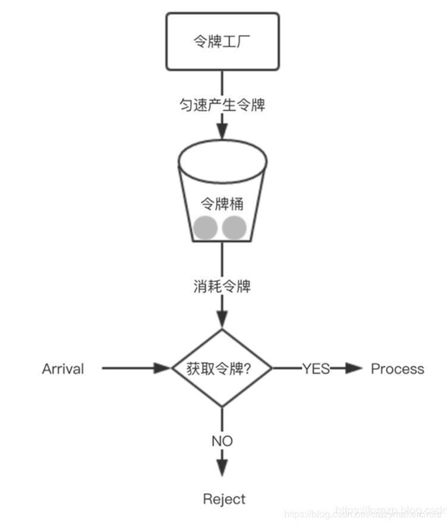

在 Spring Cloud Gateway 中，有Filter过滤器，因此可以在 pre 类型的Filter中自行实现上述三种过滤器。但是限流作为网关最基本的功能，Spring Cloud Gateway 官方就提供了 RequestRateLimiterGatewayFilterFactory 这个类，适用在Redis内的通过执行Lua脚本实现了令牌桶的方式。具体实现逻辑在 RequestRateLimiterGatewayFilterFactory 类中，lua 脚本在如下图所示的文件夹中：

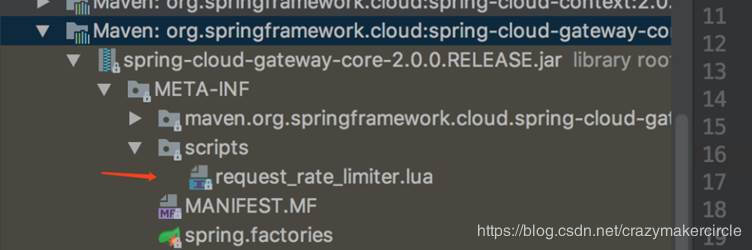

首先在工程的pom文件中引入 gateway 的起步依赖和 redis 的 reactive 依赖，代码如下:

```yaml
server:
  port: 8081
spring:
  cloud:
    gateway:
      routes:
      - id: limit_route
        uri: http://httpbin.org:80/get
        predicates:
        - After=2017-01-20T17:42:47.789-07:00[America/Denver]
        filters:
        - name: RequestRateLimiter
          args:
            key-resolver: '#{@userKeyResolver}'
            redis-rate-limiter.replenishRate: 1
            redis-rate-limiter.burstCapacity: 3
  application:
    name: cloud-gateway
  redis:
    host: localhost
    port: 6379
    database: 0
```

在上面的配置文件，指定程序的端口为 8081，配置了 redis 的信息，并配置了 RequestRateLimiter 的限流过滤器，该过滤器需要配置三个参数：

- burstCapacity，令牌桶总容量。
- replenishRate，令牌桶每秒填充平均速率。
- key-resolver，用于限流的键的解析器的 Bean 对象的名字。它使用 SpEL 表达式根据 #{@beanName} 从 Spring 容器中获取 Bean 对象。
    这里根据用户 ID 限流，请求路径中必须携带 userId 参数。

```java
@Bean
KeyResolver userKeyResolver() {
  return exchange -> Mono.just(exchange.getRequest().getQueryParams().getFirst("user"));
}
```

KeyResolver 需要实现 resolve 方法，比如根据 userid 进行限流，则需要用 userid 去判断。实现完 KeyResolver 之后，需要将这个类的 Bean 注册到 Ioc 容器中。
如果需要根据IP限流，定义的获取限流 Key 的 bean 如下代码所示：

```java
@Bean
public KeyResolver ipKeyResolver() {
  return exchange -> Mono.just(exchange.getRequest().getRemoteAddress().getHostName());
}
```

通过 exchange 对象可以获取到请求信息，这边用了 HostName，如果你想根据用户来做限流的话这边可以获取当前请求的用户 ID 或者用户名就可以了。
如果需要根据接口的 URI 进行限流，则需要获取请求地址的 uri 作为限流 key，定义的 Bean 对象如下代码所示：

```java
@Bean
KeyResolver apiKeyResolver() {
  return exchange -> Mono.just(exchange.getRequest().getPath().value());
}
```

## 5.2、健康检查配置

admin-client、actuator 健康检查配置，为之后的功能提供支持，此部分比较简单，不再赘述，加入以下 maven 依赖和配置：

```xml
<dependency>
    <groupId>org.springframework.boot</groupId>
    <artifactId>spring-boot-starter-actuator</artifactId>
</dependency>
<dependency>
    <groupId>de.codecentric</groupId>
    <artifactId>spring-boot-admin-starter-client</artifactId>
    <version>2.1.0</version>
</dependency>
<dependency>
    <groupId>org.springframework.cloud</groupId>
    <artifactId>spring-cloud-starter-netflix-eureka-client</artifactId>
</dependency>
```

applilcation.yml 配置如下：

```yaml
spring:
  application:
    name: mas-cloud-gateway
  boot:
    admin:
      client:
      ### 本地搭建的admin-server
        url: http://localhost:8011
eureka:
  client:
    registerWithEureka: true
    fetchRegistry: true
    healthcheck:
      enabled: true
    serviceUrl:
      defaultZone: http://localhost:6887/eureka/
    enabled: true
feign:
  sentinel:
    enabled: true
management:
  endpoints:
    web:
      exposure:
        include: '*'
  endpoint:
    health:
      show-details: ALWAYS
```

若转发的目标地址为微服务中组件，不为具体 ip:port 形式的，应写成 lb://mas-openapi-service 形式，目标地址会从注册中心直接拉取。

## 5.3、统一配置跨域请求

现在的请求通过经过 gateWay 网关时，需要在网关统一配置跨域请求，让所有请求通过，配置代码如下：

```yaml
spring:
  cloud:
    gateway:
      globalcors:
        cors-configurations:
          '[/**]':
            allowed-origins: "*"
            allowed-headers: "*"
            allow-credentials: true
            allowed-methods:
              - GET
              - POST
              - DELETE
              - PUT
              - OPTION
```


# 6、Nacos 整合

maven 依赖如下：

```xml
<?xml version="1.0" encoding="UTF-8"?>
<project xmlns="http://maven.apache.org/POM/4.0.0" xmlns:xsi="http://www.w3.org/2001/XMLSchema-instance"
         xsi:schemaLocation="http://maven.apache.org/POM/4.0.0 https://maven.apache.org/xsd/maven-4.0.0.xsd">
    <modelVersion>4.0.0</modelVersion>
    <parent>
        <groupId>org.springframework.boot</groupId>
        <artifactId>spring-boot-starter-parent</artifactId>
        <version>2.1.9.RELEASE</version>
        <relativePath/> <!-- lookup parent from repository -->
    </parent>
    <groupId>com.example</groupId>
    <artifactId>nacos_gateway</artifactId>
    <version>0.0.1-SNAPSHOT</version>
    <packaging>war</packaging>
    <name>nacos_gateway</name>
    <description>Demo project for Spring Boot</description>

    <properties>
        <java.version>1.8</java.version>
        <spring-cloud.version>Greenwich.SR3</spring-cloud.version>
    </properties>

    <dependencies>
        <dependency>
            <groupId>org.springframework.boot</groupId>
            <artifactId>spring-boot-starter-test</artifactId>
            <scope>test</scope>
        </dependency>
        <!--gateway-->
        <dependency>
            <groupId>org.springframework.cloud</groupId>
            <artifactId>spring-cloud-starter-gateway</artifactId>
        </dependency>
        <!--nacos dicovery-->
        <dependency>
            <groupId>org.springframework.cloud</groupId>
            <artifactId>spring-cloud-starter-alibaba-nacos-discovery</artifactId>
        </dependency>
    </dependencies>

    <dependencyManagement>
        <dependencies>
            <dependency>
                <groupId>org.springframework.cloud</groupId>
                <artifactId>spring-cloud-dependencies</artifactId>
                <version>${spring-cloud.version}</version>
                <type>pom</type>
                <scope>import</scope>
            </dependency>
            <dependency>
                <groupId>org.springframework.cloud</groupId>
                <artifactId>spring-cloud-alibaba-dependencies</artifactId>
                <version>0.2.2.RELEASE</version>
                <type>pom</type>
                <scope>import</scope>
            </dependency>
        </dependencies>
    </dependencyManagement>

    <build>
        <plugins>
            <plugin>
                <groupId>org.springframework.boot</groupId>
                <artifactId>spring-boot-maven-plugin</artifactId>
            </plugin>
        </plugins>
    </build>

</project>
```

需要注意在 Gateway 服务中的 pom.xml 文件中不要存在下面所示的 jar。

```xml
<dependency>
    <groupId>org.springframework.boot</groupId>
    <artifactId>spring-boot-starter-tomcat</artifactId>
    <scope>provided</scope>
</dependency>
```

否则调用接口时会报以下错误因为 gateway 使用的是 webflux,默认使用netty,所以从依赖中排除 tomcat 相关的依赖，如果没有排除，将会报如下错误：

```tex
java.lang.ClassCastException: org.springframework.core.io.buffer.DefaultDataBufferFactory cannot be cast to org.springframework.core.io.buffer.NettyDataBufferFactory
	at org.springframework.cloud.gateway.filter.NettyWriteResponseFilter.lambda$filter$1(NettyWriteResponseFilter.java:82) ~[spring-cloud-gateway-core-2.1.3.RELEASE.jar:2.1.3.RELEASE]
	at reactor.core.publisher.MonoDefer.subscribe(MonoDefer.java:44) [reactor-core-3.2.12.RELEASE.jar:3.2.12.RELEASE]
```

## 6.1、服务发现配置：从Nacos获取微服务提供者清单

配置信息如下：

```yaml
server:
  port: 9999

spring:
  application:
    name: springcloud-gateway
  profiles:
    active: dev
  cloud:
    nacos:
      discovery:
        server-addr: ${NACOS_SERVER:cdh1:8848}
      config:
        server-addr: ${NACOS_SERVER:cdh1:8848}
        prefix: springcloud-gateway
        group: DEFAULT_GROUP
        file-extension: yml
        ext-config:
          - data-id: crazymaker-db-dev.yml
            group: DEFAULT_GROUP
            refresh: true
          - data-id: crazymaker-redis-dev.yml
            group: DEFAULT_GROUP
            refresh: true
          - data-id: crazymaker-common-dev.yml
            group: DEFAULT_GROUP
            refresh: true
          - data-id: some.properties
            group: DEFAULT_GROUP
            refresh: true
    gateway:
      enabled: true
      discovery:
        locator:
          enabled: true  #开启从注册中心动态创建路由的功能，利用微服务名进行路由
          lower-case-service-id: true
          filters:
            - args[name]: serviceId
              name: Hystrix
          predicates:
            - args[pattern]: '"''/''+serviceId+''/**''"'
              name: Path
      routes:
        - id: blog
          uri: https://blog.csdn.net/
          predicates:
            - Path=/csdn
        - id: blog1
          uri: https://blog.csdn.net/
          predicates:
            - Path=/blog1/**
          filters:
            - RewritePath=/blog1/(?<segment>.*), /$\{segment}
        # 代理前  http://192.168.68.1:9999/blog1/crazymakercircle/article/details/80208650
        #  代理后  https://blog.csdn.net/crazymakercircle/article/details/80208650
        - id: service_provider_demo_route
          uri: lb://service-provider-demo
          predicates:
            - Path=/provider/**
        - id: service_provider_demo_route_filter
          uri: lb://service-provider-demo
          predicates:
            - Path=/filter/**
          filters:
            - RewritePath=/filter/(?<segment>.*), /provider/$\{segment}
            - UserIdCheck
        - id: service_consumer_demo_route
          uri: lb://service-consumer-demo
          predicates:
            - Path=/consumer/**
        - id: sentinel_demo_provider_route
          uri: lb://sentinel-demo-provider
          predicates:
            - Path=/sentinel-demo/**
        - id: uaa-provider_route
          uri: lb://uaa-provider
          predicates:
            - Path=/uaa-provider/**
    sentinel:
      transport:
        dashboard: cdh1:8849 #配置Sentinel dashboard地址
        port: 8719   #这里配置的是本地端口
      eager: true
    inetutils:
      timeout-seconds: 10
      preferred-networks: ${SCAFFOLD_PREFERRED_NETWORKS:192.168.68.}
      prefer-ip-address: true  #访问路径可以显示IP地址


ribbon:
  eager-load:
    enabled: true # 开启Ribbon的饥饿加载模式，启动时创建 RibbonClient
  MaxAutoRetries: 1 # 同一台实例的最大重试次数，但是不包括首次调用，默认为1次
  MaxAutoRetriesNextServer: 2  # 重试负载均衡其他实例的最大重试次数，不包括首次调用，默认为0次
  OkToRetryOnAllOperations: true  # 是否对所有操作都重试，默认false
  ServerListRefreshInterval: 2000 # 从注册中心刷新服务器列表信息的时间间隔，默认为2000毫秒，即2秒
  retryableStatusCodes: 400,401,403,404,500,502,504
  NFLoadBalancerRuleClassName: com.netflix.loadbalancer.RetryRule #配置规则 重试
  ConnectTimeout: 3000  #连接建立的超时时长，默认1秒
  ReadTimeout: 3000 #处理请求的超时时间，默认为1秒
  MaxTotalConnections: 1000  # 最大连接数
  MaxConnectionsPerHost: 1000  # 每个host最大连接数
  restclient:
    enabled: true


hystrix:
  threadpool:
    default:
      coreSize: 10 # 线程池核心线程数
      maximumSize: 20  # 线程池最大线程数
      allowMaximumSizeToDivergeFromCoreSize: true   # 线程池最大线程数是否有效
      keepAliveTimeMinutes: 10  # 设置可空闲时间，单位分钟
    demo-provider:
      coreSize: 20   # 线程池核心线程数
      maximumSize: 100   # 线程池最大线程数
      allowMaximumSizeToDivergeFromCoreSize: true   # 线程池最大线程数是否有效
      keepAliveTimeMinutes: 20  # 设置可空闲时间，单位分钟
  propagate:
    request-attribute:
      enabled: true
  command:
    default:  #全局默认配置
      execution:  #线程隔离相关配置
        timeout:
          enabled: true   #是否给方法执行设置超时时间，默认为true。一般我们不要改。
        isolation:
          strategy: THREAD    #配置请求隔离的方式，这里是默认的线程池方式。还有一种信号量的方式semaphore，使用比较少。
          thread:
            timeoutInMilliseconds: 100000  #方式执行的超时时间，默认为1000毫秒，在实际场景中需要根据情况设置
            interruptOnTimeout: true   #发生超时时是否中断方法的执行，默认值为true。不要改。
            interruptOnCancel: false  #是否在方法执行被取消时中断方法，默认值为false。没有实际意义，默认就好！
      circuitBreaker:   #熔断器相关配置
        enabled: true   #是否启动熔断器，默认为true，false表示不要引入 Hystrix。
        requestVolumeThreshold: 20     #启用熔断器功能窗口时间内的最小请求数，假设我们设置的窗口时间为10秒，
        sleepWindowInMilliseconds: 5000    #此配置的作用是指定熔断器打开后多长时间内允许一次请求尝试执行，官方默认配置为5秒。
        errorThresholdPercentage: 50   #窗口时间内超过50%的请求失败后就会打开熔断器将后续请求快速失败掉,默认配置为50
      metrics:
        rollingStats:
          timeInMilliseconds: 10000
          numBuckets: 10

# 暴露监控端点
management:
  endpoints:
    web:
      exposure:
        include: '*'
```

## 6.2、nacos实现动态配置

使用 nacos 实现动态路由，以上两种方式都是实现的静态配置路径，只能应对部分场景，接下来配置 nacos 实现动态配置以及配置的存储，由于 gateWay 并没有适配 nacos，需要自定义监听器，代码如下：

```java
@Component
@Slf4j
public class NacosDynamicRouteService implements ApplicationEventPublisherAware {
  private String dataId = "gateway-router";
  private String group = "DEFAULT_GROUP";
  @Value("${spring.cloud.nacos.config.server-addr}")
  private String serverAddr;
  @Autowired
  private RouteDefinitionWriter routeDefinitionWriter;
  private ApplicationEventPublisher applicationEventPublisher;
  private static final List<String> ROUTE_LIST = new ArrayList<>();
  @PostConstruct
  public void dynamicRouteByNacosListener() {
    try {
      ConfigService configService = NacosFactory.createConfigService(serverAddr);
      configService.getConfig(dataId, group, 5000);
      configService.addListener(dataId, group, new Listener() {
        @Override
        public void receiveConfigInfo(String configInfo) {
          clearRoute();
          try {
            if (StringUtil.isNullOrEmpty(configInfo)) {//配置被删除
              return;
            }
            List<RouteDefinition> gatewayRouteDefinitions = JSONObject.parseArray(configInfo, RouteDefinition.class);
            for (RouteDefinition routeDefinition : gatewayRouteDefinitions) {
              addRoute(routeDefinition);
            }
            publish();
          } catch (Exception e) {
            log.error("receiveConfigInfo error" + e);
          }
        }
        @Override
        public Executor getExecutor() {
          return null;
        }
      });
    } catch (NacosException e) {
        log.error("dynamicRouteByNacosListener error" + e);
    }
  }
  private void clearRoute() {
    for (String id : ROUTE_LIST) {
      this.routeDefinitionWriter.delete(Mono.just(id)).subscribe();
    }
    ROUTE_LIST.clear();
  }
  private void addRoute(RouteDefinition definition) {
    try {
      routeDefinitionWriter.save(Mono.just(definition)).subscribe();
      ROUTE_LIST.add(definition.getId());
    } catch (Exception e) {
 log.error("addRoute error" + e);
    }
  }
  private void publish() {
    this.applicationEventPublisher.publishEvent(new RefreshRoutesEvent(this.routeDefinitionWriter));
  }
  @Override
  public void setApplicationEventPublisher(ApplicationEventPublisher applicationEventPublisher) {
    this.applicationEventPublisher = applicationEventPublisher;
  }
```

在nacos中增加一个规则，规则如下：

```yaml
[{
    "filters": [],
    "id": "baidu_route",
    "order": 0,
    "predicates": [{
        "args": {
            "pattern": "/baidu"
        },
        "name": "Path"
    }],
    "uri": "https://www.baidu.com"
}]
```

访问网关的路由规则，能看到刚刚加入的规则，访问 http://localhost:9022/baidu 时请求直接被转发到百度的首页了。

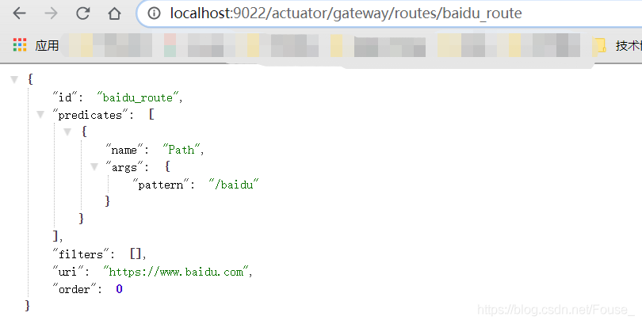

## 6.3、服务发现路由 predicates 和 filters 的自定义定义

可以将网关配置为基于使用 DiscoveryClient 注册中心注册的服务发现路由。
要启用此功能，请设置 spring.cloud.gateway.discovery.locator.enabled=true，并确保 DiscoveryClient 实现位于 classpath 上并已启用（如netflix eureka、consul或zookeeper）。

## 6.4、为注册中心路由配置断言和过滤器

默认情况下，网关为通过 DiscoveryClient 创建的路由定义单个断言和过滤器。
默认断言是使用 `/serviceId/**` 定义的 path 断言，其中 serviceId 是 DiscoveryClient 中服务的 ID。
默认过滤器是使用正则表达式 `/serviceId/(?.*)`和替换的`/${remaining}`进行重写。这只是在请求被发送到下游之前从路径中截取掉 service id 。

> 这个默认的过滤器，老版本没有，这就要命了。
> 这几天做推送中台 架构实操的时候， 升级了一下 springcloud gateway，这就要要了命了。
>
> 请求全部是404。
>
> 而且由于响应式编程不是太好调试， 不过，我不吃这套，喜欢深入敌后，进入源码后， 大概找到了 断言处理迭代 的地方， 看到了 10 多个过滤器。
>
> 其中一个过滤器 rewrite， 干了一件匪夷所思的事情，把后端服务的前缀给剔除了， 如果前缀是 serviceId的话。
>
> 这就是咱们的问题所在：赶巧的是，咱后端微服务，需要路径前缀，并且，路径的前缀就是 serviceId
>
> 这下子，这个springcloud gateway的 升级骚操作，把 路劲前缀搞没了，当然路由不过去了， 害的我白瞎了2小时。
>
> 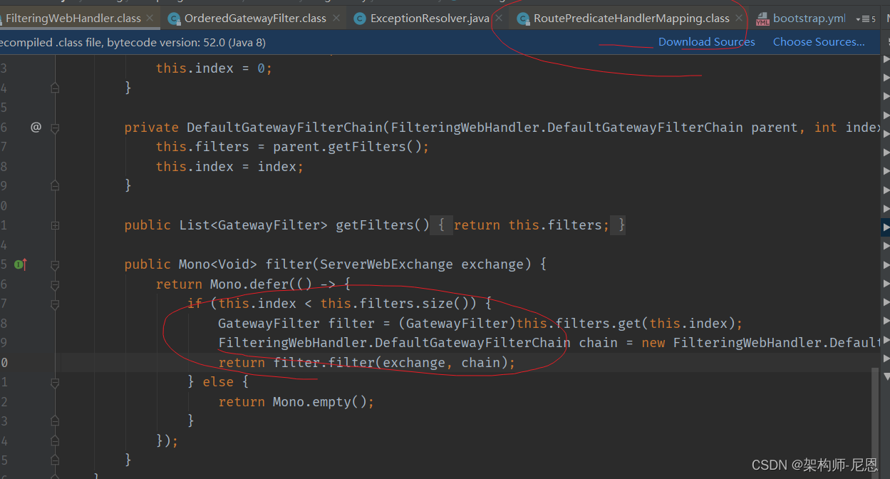
>
> 翻阅官方的文档，按照官方说明：
>
> 可以通过设置 spring.cloud.gateway.discovery.locator.predicates[x] and spring.cloud.gateway.discovery.locator.filters[y] 来， 去自定义 DiscoveryClient 路由使用的断言和过滤器。
>
> 当做了定制以后，默认的就没了，如果你想要保留默认功能，需要手动加上 默认断言和过滤器。
> 下面是这样一个例子，application.properties 配置如下：
>
> ```properties
> spring.cloud.gateway.discovery.locator.predicates[0].name: Path
> spring.cloud.gateway.discovery.locator.predicates[0].args[pattern]: "'/'+serviceId+'/**'"
> spring.cloud.gateway.discovery.locator.predicates[1].name: Host
> spring.cloud.gateway.discovery.locator.predicates[1].args[pattern]: "'**.foo.com'"
> spring.cloud.gateway.discovery.locator.filters[0].name: Hystrix
> spring.cloud.gateway.discovery.locator.filters[0].args[name]: serviceId
> spring.cloud.gateway.discovery.locator.filters[1].name: RewritePath
> spring.cloud.gateway.discovery.locator.filters[1].args[regexp]: "'/' + serviceId + '/(?<remaining>.*)'"
> spring.cloud.gateway.discovery.locator.filters[1].args[replacement]: "'/${remaining}'"
> ```
>
> 于是，需要去掉这个 RewritePath 过滤器，下面为 nacos 定制客户端的过滤器，配置如下：
>
> ```yaml
> gateway:
>   enabled: true
>   discovery:
>     locator:
>       enabled: true  #开启从注册中心动态创建路由的功能，利用微服务名进行路由
>       lower-case-service-id: true
>       filters:
>         - args[name]: serviceId
>           name: Hystrix
>       predicates:
>         - args[pattern]: '"''/''+serviceId+''/**''"'
>           name: Path
> ```
>
> 本质上，要不要去掉url的前缀，配置文件的下边，完全有规则可以自己配置。
>
> 当然，官方希望为 微服务 DiscoveryClient 路由 增加一些过滤器，也是可以理解的。
>
> 不管怎么说，咱们这个场景下，只能覆盖 官方的默认的discovery.filters的配置啦， 于是进行了上边的修改
>
> 修改之后，重启，再通过断点看过滤器，那个 rewrite 过滤器，没有了。
>
> 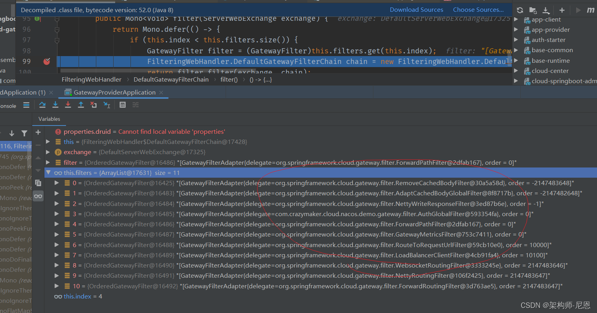
>
> 终于不是404的错误了。
>
> 看起来，springcloud 官方勤快的升级版本，也没有干什么有意义的事情， 做的很多都是花瓶的活儿。

# 7、Swagger 整合

maven 依赖如下：

```xml
<?xml version="1.0" encoding="UTF-8"?>
<project xmlns="http://maven.apache.org/POM/4.0.0"
         xmlns:xsi="http://www.w3.org/2001/XMLSchema-instance"
         xsi:schemaLocation="http://maven.apache.org/POM/4.0.0 http://maven.apache.org/xsd/maven-4.0.0.xsd">
    <parent>
        <artifactId>cloud-center-alibaba</artifactId>
        <groupId>com.crazymaker.springcloud</groupId>
        <version>1.0-SNAPSHOT</version>
    </parent>
    <modelVersion>4.0.0</modelVersion>

    <groupId>com.crazymaker.springcloud</groupId>
    <artifactId>springcloud-gateway-demo</artifactId>
    <version>1.0-SNAPSHOT</version>
    <name>springcloud-gateway-demo</name>
    <packaging>jar</packaging>


    <dependencies>
        <!--gateway 网关依赖,内置webflux 依赖 -->
        <dependency>
            <groupId>org.springframework.cloud</groupId>
            <artifactId>spring-cloud-starter-gateway</artifactId>
        </dependency>
        <!--新增sentinel-->
        <dependency>
            <groupId>com.alibaba.csp</groupId>
            <artifactId>sentinel-spring-cloud-gateway-adapter</artifactId>
        </dependency>
        <dependency>
            <groupId>com.alibaba.csp</groupId>
            <artifactId>sentinel-transport-simple-http</artifactId>
        </dependency>

        <!-- nacos服务注册发现依赖-->
        <dependency>
            <groupId>com.alibaba.cloud</groupId>
            <artifactId>spring-cloud-starter-alibaba-nacos-discovery</artifactId>
            <exclusions>
                <exclusion>
                    <groupId>com.google.guava</groupId>
                    <artifactId>guava</artifactId>
                </exclusion>
            </exclusions>
        </dependency>
        <dependency>
            <groupId>mysql</groupId>
            <artifactId>mysql-connector-java</artifactId>
            <version>${mysql.connector.version}</version>
        </dependency>
        <!-- nacos配置服务依赖-->
        <dependency>
            <groupId>com.alibaba.cloud</groupId>
            <artifactId>spring-cloud-starter-alibaba-nacos-config</artifactId>
            <exclusions>
                <exclusion>
                    <groupId>com.google.guava</groupId>
                    <artifactId>guava</artifactId>
                </exclusion>
            </exclusions>
        </dependency>
        <dependency>
            <groupId>org.springframework.cloud</groupId>
            <artifactId>spring-cloud-starter-netflix-hystrix</artifactId>
        </dependency>
        <dependency>
            <groupId>org.springframework.boot</groupId>
            <artifactId>spring-boot-starter-actuator</artifactId>
        </dependency>


        <dependency>
            <groupId>org.projectlombok</groupId>
            <artifactId>lombok</artifactId>
            <optional>true</optional>
        </dependency>
        <dependency>
            <groupId>org.springframework.boot</groupId>
            <artifactId>spring-boot-starter-test</artifactId>
            <scope>test</scope>
        </dependency>


        <dependency>
            <groupId>org.projectlombok</groupId>
            <artifactId>lombok</artifactId>
            <optional>true</optional>
        </dependency>

        <dependency>
            <groupId>cn.hutool</groupId>
            <artifactId>hutool-all</artifactId>
            <version>${hutool.version}</version>
        </dependency>
        <dependency>
            <groupId>io.springfox</groupId>
            <artifactId>springfox-swagger2</artifactId>
            <version>${swagger.version}</version>
        </dependency>
        <dependency>
            <groupId>io.springfox</groupId>
            <artifactId>springfox-swagger-common</artifactId>
            <version>${swagger.version}</version>
        </dependency>
        <dependency>
            <groupId>com.github.xiaoymin</groupId>
            <artifactId>swagger-bootstrap-ui</artifactId>
            <version>${swagger-ui.version}</version>
        </dependency>
        <dependency>
            <groupId>org.springframework.cloud</groupId>
            <artifactId>spring-cloud-commons</artifactId>
        </dependency>
    </dependencies>
    <build>
        <plugins>

            <plugin>
                <groupId>org.springframework.boot</groupId>
                <artifactId>spring-boot-maven-plugin</artifactId>
                <configuration>
                    <mainClass>com.crazymaker.cloud.nacos.demo.gateway.starter.GatewayProviderApplication</mainClass>
                </configuration>
                <executions>
                    <execution>
                        <goals>
                            <goal>repackage</goal>
                        </goals>
                    </execution>
                </executions>
            </plugin>


            <plugin>
                <artifactId>maven-assembly-plugin</artifactId>
                <version>2.4.1</version>
                <configuration>
                    <descriptors>
                        <descriptor>src/main/assembly/assembly.xml</descriptor>
                    </descriptors>
                </configuration>
                <executions>
                    <execution>
                        <id>make-assembly</id>
                        <phase>package</phase>
                        <goals>
                            <goal>single</goal>
                        </goals>
                    </execution>
                </executions>
            </plugin>

            <!-- 添加docker-maven插件 -->

            <plugin>
                <groupId>com.spotify</groupId>
                <artifactId>docker-maven-plugin</artifactId>
                <version>1.1.1</version>
                <configuration>
                    <imageName>dockerlocal:5000/${project.artifactId}:${project.version}</imageName>
                    <baseImage>dockerlocal:5000/java</baseImage>
                    <entryPoint>["java", "-jar", "/${project.build.finalName}.jar"]</entryPoint>
                    <dockerDirectory>docker</dockerDirectory>
                    <resources>
                        <resource>
                            <targetPath>/</targetPath>
                            <directory>${project.build.directory}</directory>
                            <include>${project.build.finalName}.jar</include>
                        </resource>
                    </resources>
                </configuration>
            </plugin>

        </plugins>
    </build>
</project>
```

配置代码如下：

```java
package com.crazymaker.cloud.nacos.demo.gateway.config;

import lombok.AllArgsConstructor;
import org.springframework.cloud.gateway.config.GatewayProperties;
import org.springframework.cloud.gateway.route.RouteLocator;
import org.springframework.cloud.gateway.support.NameUtils;
import org.springframework.context.annotation.Primary;
import org.springframework.stereotype.Component;
import springfox.documentation.swagger.web.SwaggerResource;
import springfox.documentation.swagger.web.SwaggerResourcesProvider;

import java.util.ArrayList;
import java.util.List;

/**
 * @ClassName SwaggerProvider
 * @PackageName com.ruoyi.gateway.config
 * @Description
 * @Author daiz
 * @Date 2019/8/16 10:04
 * @Version 1.0
 */
@Component
@Primary
@AllArgsConstructor
public class SwaggerConfig implements SwaggerResourcesProvider
{
    public static final String API_URI = "/v2/api-docs";

    private final RouteLocator routeLocator;

    private final GatewayProperties gatewayProperties;

    @Override
    public List<SwaggerResource> get()
    {
        /**
         * 网关应用名称,不需要在网关的swagger 上展示
         */
        String appName = "springcloud-gateway";

        List<SwaggerResource> resources = new ArrayList<>();
        List<String> routes = new ArrayList<>();
        // 取出gateway的route
        routeLocator.getRoutes().subscribe(route -> routes.add(route.getId()));
        // 结合配置的route-路径(Path)，和route过滤，只获取有效的route节点
        // 打开下面注释可以自动扫描接入gateway的服务，为了演示，只扫描system
        // gatewayProperties.getRoutes().stream().filter(routeDefinition ->
        // routes.contains(routeDefinition.getId()))
        gatewayProperties.getRoutes().stream()
                .filter(route -> route.getUri().getHost() != null)
                .filter(route -> !appName.equals(route.getUri().getHost()))
                .forEach(routeDefinition -> routeDefinition.getPredicates().stream()
                        .filter(predicateDefinition -> ("Path").equalsIgnoreCase(predicateDefinition.getName()))
                        .forEach(predicateDefinition -> resources
                                .add(swaggerResource(routeDefinition.getId(), predicateDefinition.getArgs()
                                        .get(NameUtils.GENERATED_NAME_PREFIX + "0").replace("/**", API_URI)))));
        return resources;
    }

    private SwaggerResource swaggerResource(String name, String location)
    {
        SwaggerResource swaggerResource = new SwaggerResource();
        swaggerResource.setName(name);
        swaggerResource.setLocation(location);
        swaggerResource.setSwaggerVersion("2.0");
        return swaggerResource;
    }
}
```

效果如下：

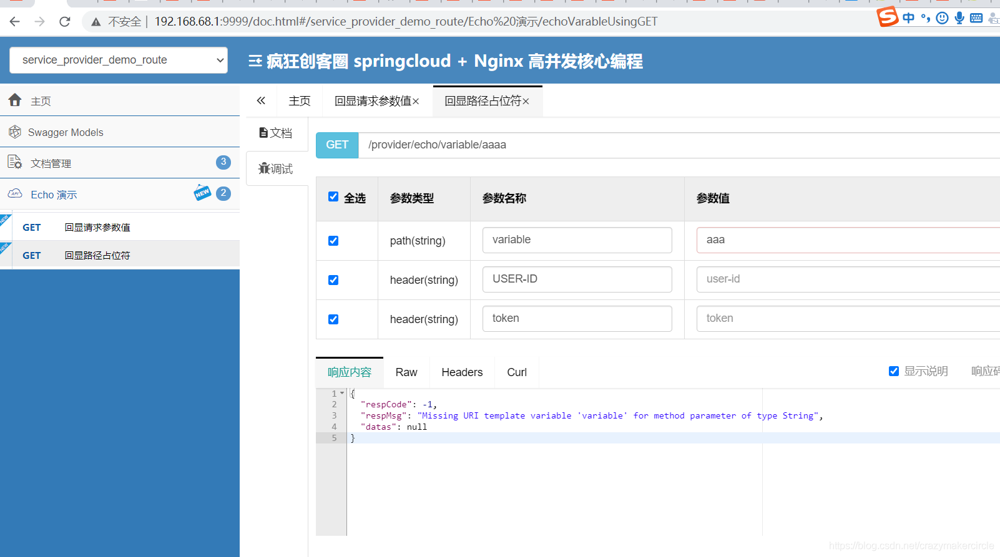

# 8、整合Sentinel完成流控和降级

使用 Sentinel 作为 gateWay 的限流、降级、系统保护工具，maven 依赖如下：

```xml
<!--alibaba 流量卫士-->
<dependency>
    <groupId>com.alibaba.csp</groupId>
    <artifactId>sentinel-core</artifactId>
    <version>${sentinel.version}</version>
</dependency>
<dependency>
    <groupId>org.springframework.cloud</groupId>
    <artifactId>spring-cloud-starter-alibaba-sentinel</artifactId>
</dependency>
<dependency>
    <groupId>com.alibaba.csp</groupId>
    <artifactId>sentinel-spring-cloud-gateway-adapter</artifactId>
    <version>1.7.1</version>
</dependency>
```

客户端配置，在配置文件中增加下列配置，dashboard 就可以轻松管理客户端了，还有一种方式是在启动时加入。配置如下：

```yaml
spring:
  cloud:
    sentinel:
      transport:
        ## VM
        ##-Djava.net.preferIPv4Stack=true -Dcsp.sentinel.dashboard.server=localhost:8080 -Dcsp.sentinel.api.port=8666 -Dproject.name=gateway -Dcsp.sentinel.app.type=1
        dashboard: localhost:8880
        port: 8880
```

限流规则通用配置，由于 sentinel 的工作原理其实借助于全局的filter进行请求拦截并计算出是否进行限流、熔断等操作的，增加 SentinelGateWayFilter 配置，代码如下：

```java
@Bean//拦截请求
@Order(Ordered.HIGHEST_PRECEDENCE)
public GlobalFilter sentinelGatewayFilter() {
    return new SentinelGatewayFilter();
}
```

sentinel 不仅支持通过硬代码方式进行资源的申明，还能通过注解方式进行声明，为了让注解生效，还需要配置切面类 SentinelResourceAspect，代码如下：

```java
@Bean
public SentinelResourceAspect sentinelResourceAspect() {
	return new SentinelResourceAspect();
}
```

sentinel 拦截包括了视图、静态资源等，需要配置 viewResolvers 以及拦截之后的异常，我们也可以自定义抛出异常的提示，代码如下：

```java
public SentinelConfig(ObjectProvider<List<ViewResolver>> viewResolversProvider,
                    ServerCodecConfigurer serverCodecConfigurer) {
	this.viewResolvers = viewResolversProvider.getIfAvailable(Collections::emptyList);
	this.serverCodecConfigurer = serverCodecConfigurer;
}

@Bean//自定义异常
@Order(Ordered.HIGHEST_PRECEDENCE)
public ExceptionHandler sentinelGatewayBlockExceptionHandler() {
	// Register the block exception handler for Spring Cloud Gateway.
	return new ExceptionHandler(viewResolvers, serverCodecConfigurer);
}
```

自定义异常提示：当发生限流、熔断异常时，会返回定义的提示信息。代码如下：

```java
/**
 * 配置限流的异常处理器:SentinelGatewayBlockExceptionHandler
 */
@Bean
@Order(Ordered.HIGHEST_PRECEDENCE)
public SentinelGatewayBlockExceptionHandler sentinelGatewayBlockExceptionHandler() {
    return new SentinelGatewayBlockExceptionHandlerEX(viewResolvers, serverCodecConfigurer);
}
```

不需要额外的配置，sentinel 就已经可以正常工作了。

## 8.1、限流规则设置

1. 资源定义：定义 API 组。
2. 定义限流规则。

## 8.2、网关限流参数

其中网关限流规则 GatewayFlowRule的字段解释如下：

- resource：资源名称，可以是网关中的 route 名称或者用户自定义的 API 分组名称。
- resourceMode：规则是针对 API Gateway 的 route（RESOURCE_MODE_ROUTE_ID）还是用户在 Sentinel 中定义的 API 分组（RESOURCE_MODE_CUSTOM_API_NAME），默认是 route。
- grade：限流指标维度，同限流规则的 grade 字段。
- count：限流阈值。
- intervalSec：统计时间窗口，单位是秒，默认是 1 秒。
- controlBehavior：流量整形的控制效果，同限流规则的 controlBehavior 字段，目前支持快速失败和匀速排队两种模式，默认是快速失败。
- burst：应对突发请求时额外允许的请求数目。
- maxQueueingTimeoutMs：匀速排队模式下的最长排队时间，单位是毫秒，仅在匀速排队模式下生效。
    paramItem：参数限流配置。若不提供，则代表不针对参数进行限流，该网关规则将会被转换成普通流控规则；否则会转换成热点规则。其中的字段：
    - parseStrategy：从请求中提取参数的策略，目前支持提取来源 IP（PARAM_PARSE_STRATEGY_CLIENT_IP）、Host（PARAM_PARSE_STRATEGY_HOST）、任意 Header（PARAM_PARSE_STRATEGY_HEADER）和任意 URL 参数（PARAM_PARSE_STRATEGY_URL_PARAM）四种模式。
    - fieldName：若提取策略选择 Header 模式或 URL 参数模式，则需要指定对应的 header 名称或 URL 参数名称。
    - pattern：参数值的匹配模式，只有匹配该模式的请求属性值会纳入统计和流控；若为空则统计该请求属性的所有值。（1.6.2 版本开始支持）
    - matchStrategy：参数值的匹配策略，目前支持精确匹配（PARAM_MATCH_STRATEGY_EXACT）、子串匹配（PARAM_MATCH_STRATEGY_CONTAINS）和正则匹配（PARAM_MATCH_STRATEGY_REGEX）。（1.6.2 版本开始支持）。

用户可以通过 GatewayRuleManager.loadRules(rules) 手动加载网关规则，或通过 GatewayRuleManager.register2Property(property) 注册动态规则源动态推送（推荐方式）。
