# 目录

[TOC]

# 概览

## 1、运行时数据区

### 1.1、五大区域

1. 栈（虚拟机栈）。
2. 本地方法栈。
3. 堆。
4. 方法区。
5. 程序计数器。

### 1.2、线程共享区域

堆、方法区。

### 1.3、线程私有区域

程序计数器、虚拟机栈、本地方法栈。

# 运行时数据区-详解


## 1、栈（虚拟机栈）

Java 虚拟机栈(Java Virtual Machine Stacks)，早期也叫 Java 栈。每个线程在创建的时候都会创建一个虚拟机栈，其内部保存一个个的栈帧(Stack Frame），对应着一次次 Java 方法调用，是线程私有的，生命周期和线程一致。

虚拟机栈描述的是 Java 方法执行的内存模型，每个方法被执行的时候都会同时创建一个栈帧（Stack Frame）用于存储<span style="color:blue;font-weight:bold;">局部变量表</span>、<span style="color:blue;font-weight:bold;">操作栈</span>、<span style="color:blue;font-weight:bold;">动态链接</span>、<span style="color:blue;font-weight:bold;">方法出口</span>等信息。每一个方法被调用直至执行完成的过程，就对应着一个栈帧在虚拟机栈中从入栈到出栈的过程。

<span style="color:blue;font-weight:bold;">局部变量表</span>存放了编译期可知的各种基本数据类型（boolean、byte、char、short、int、float、long、double）、对象引用（reference 类型，它不等同于对象本身，根据不同的虚拟机实现，它可能是一个指向对象起始地址的引用指针，也可能指向一个代表对象的句柄或者其他与此对象相关的位置）和 returnAddress 类型（指向了一条字节码指令的地址）。

其中 64 位长度的 long 和 double 类型的数据会占用 2 个局部变量空间（Slot），其余的数据类型只占用 1 个。

局部变量表所需的内存空间在编译期间完成分配，当进入一个方法时，这个方法需要在帧中分配多大的局部变量空间是完全确定的，在方法运行期间不会改变局部变量表的大小。

在 Java 虚拟机规范中，对这个区域规定了两种异常状况：

1. 如果线程请求的栈深度大于虚拟机所允许的深度，将抛出StackOverflowError异常。
2. 如果虚拟机栈可以动态扩展（当前大部分的 Java 虚拟机都可动态扩展，只不过 Java 虚拟机规范中也允许固定长度的虚拟机栈），当扩展时无法申请到足够的内存时会抛出 OutOfMemoryError 异常。

## 2、本地方法栈

本地方法栈（Native Method Stacks）与虚拟机栈所发挥的作用是非常相似的，其区别不过是虚拟机栈为虚拟机执行 Java 方法（也就是字节码）服务，而本地方法栈则是为虚拟机使用到的 Native 方法服务。虚拟机规范中对本地方法栈中的方法使用的语言、使用方式与数据结构并没有强制规定，因此具体的虚拟机可以自由实现它。甚至有的虚拟机（譬如 Sun HotSpot 虚拟机）直接就把本地方法栈和虚拟机栈合二为一。与虚拟机栈一样，本地方法栈区域也会抛出 StackOverflowError和OutOfMemoryError 异常。

## 3、堆

对于大多数应用来说，Java堆（Java Heap）是Java虚拟机所管理的内存中最大的一块。Java堆是被所有线程共享的一块内存区域，在虚拟机启动时创建。此内存区域的唯一目的就是存放对象实例，几乎所有的对象实例都在这里分配内存。

Java 堆是垃圾收集器管理的主要区域，因此很多时候也被称做 <span style="color:blue;font-weight:bold;">“GC堆”</span>。如果从内存回收的角度看，由于现在收集器基本都是采用的分代收集算法，所以 Java 堆中还可以细分为：<span style="color:blue;font-weight:bold;">新生代</span>和<span style="color:blue;font-weight:bold;">老年代</span>，再细致一点的有<span style="color:blue;font-weight:bold;">Eden空间</span>、<span style="color:blue;font-weight:bold;">From Survivor 空间</span>、<span style="color:blue;font-weight:bold;">To Survivor 空间</span>等。

根据 Java 虚拟机规范的规定，Java 堆可以处于物理上不连续的内存空间中，只要逻辑上是连续的即可，就像我们的磁盘空间一样。在实现时，既可以实现成固定大小的，也可以是可扩展的，不过当前主流的虚拟机都是按照可扩展来实现的（通过`-Xmx`和`-Xms`控制）。

如果在堆中没有内存完成实例分配，并且堆也无法再扩展时，将会抛出 OutOfMemoryError 异常。

## 4、方法区

方法区（Method Area）与 Java 堆一样，是各个线程共享的内存区域，它用于存储已被虚拟机加载的<span style="color:blue;font-weight:bold;">类信息、常量、静态变量、即时编译器编译后的代码等数据</span>。虽然 Java 虚拟机规范把方法区描述为堆的一个逻辑部分，但是它却有一个别名叫做 Non-Heap（非堆），目的应该是与 Java 堆区分开来。

对于习惯在 HotSpot 虚拟机上开发和部署程序的开发者来说，很多人愿意把方法区称为“永久代”（Permanent Generation），本质上两者并不等价，仅仅是因为 HotSpot 虚拟机的设计团队选择把 GC 分代收集扩展至方法区，或者说使用永久代来实现方法区而已。

Java 虚拟机规范对这个区域的限制非常宽松，除了和 Java 堆一样不需要连续的内存和可以选择固定大小或者可扩展外，还可以选择不实现垃圾收集。相对而言，垃圾收集行为在这个区域是比较少出现的，但并非数据进入了方法区就如永久代的名字一样“永久”存在了。这个区域的内存回收目标主要是针对常量池的回收和对类型的卸载，一般来说这个区域的回收“成绩”比较难以令人满意，尤其是类型的卸载，条件相当苛刻，但是这部分区域的回收确实是有必要的。

根据 Java 虚拟机规范的规定，当方法区无法满足内存分配需求时，将抛出 OutOfMemoryError 异常。

方法区有时被称为持久代（PermGen）。

## 5、程序计数器

程序计数器（Program Counter Register）是一块较小的内存空间，它的作用可以看做是当前线程所执行的字节码的行号指示器。在虚拟机的概念模型里（仅是概念模型，各种虚拟机可能会通过一些更高效的方式去实现），字节码解释器工作时就是通过改变这个计数器的值来选取下一条需要执行的字节码指令，分支、循环、跳转、异常处理、线程恢复等基础功能都需要依赖这个计数器来完成。

由于 Java 虚拟机的多线程是通过线程轮流切换并分配处理器执行时间的方式来实现的，在任何一个确定的时刻，一个处理器（对于多核处理器来说是一个内核）只会执行一条线程中的指令。因此，为了线程切换后能恢复到正确的执行位置，每条线程都需要有一个独立的程序计数器，各条线程之间的计数器互不影响，独立存储，我们称这类内存区域为“线程私有”的内存。

如果线程正在执行的是一个 Java 方法，这个计数器记录的是正在执行的虚拟机字节码指令的地址；如果正在执行的是 Natvie 方法，这个计数器值则为空（Undefined）。

<span style="color:blue;font-weight:bold;">此内存区域是唯一一个在 Java 虚拟机规范中没有规定任何 OutOfMemoryError 情况的区域。</span>

# Class 文件详解

## 1、概述

在各种不同平台的 Java 虚拟机中，字节码（Byte Code）是所有平台都统一支持的程序存储格式，是构成平台无关性的基石，所以 class 文件主要用于解决平台无关性的中间文件。如下图所示：

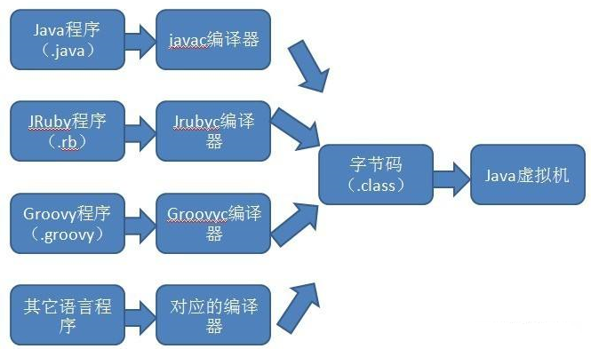

每个 class 文件都是由字节流组成，各个数据项目严格按照顺序紧凑地排列在文件之中， 中间没有添加任何分隔符，每个字节流含有 8 个二进制位，所有的 16 位，32 位和 64 位长度的数据将通过 2 个，4 个和 8 个连续的 8 位字节来对其进行表示，多字节数据总是按照 big-endian（大端在前：也就是说高位字节存储在低的地址上面，而低位字节存储到高地址上面）的顺序进行存储。

Class 文件格式采用一种类似于 C 语言结构体的伪结构来存储数据，主要有两类数据项，<span style="color:blue;font-weight:bold;">无符号数</span>和<span style="color:blue;font-weight:bold;">表</span>，无符号数用来表述数字，索引引用以及字符串等，比如 u1,u2,u4,u8 分别代表 1 个字节，2 个字节，4 个字节，8 个字节的无符号数，而表是任意数量的可变长项组成，是有多个无符号数以及其它的表组成的复合结构，所有表的命名都习惯性地以 “_info” 结尾，无论是无符号数还是表， 当需要描述同一类型但数量不定的多个数据时， 经常会使用一个前置的容量计数器加若干个连续的数据项的形式， 这时候称这一系列连续的某一类型的数据为某一类型的“集合”。 

## 2、Class 类文件结构


## 3、常量池 constant_pool 详解

常量池（Constant Pool），是用于存放编译器生成的各种<span style="color:blue;font-weight:bold;">字面量（ Literal ）</span>和<span style="color:blue;font-weight:bold;">符号引用（Symbolic References）</span>的地方。

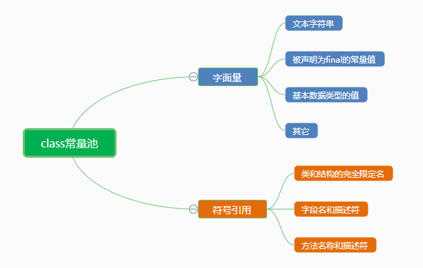

常量池的每一项常量都是一个表，分别有 17 种不同类型的常量项。这 17 类常量项都有一个共同的特点，表结构起始的第一位是个 u1 类型的标志位(tag，取值见下表中标志列)，代表着当前常量属于哪种常量类型。

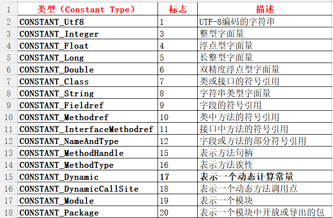

17 种数据类型结构总表，如下所示：

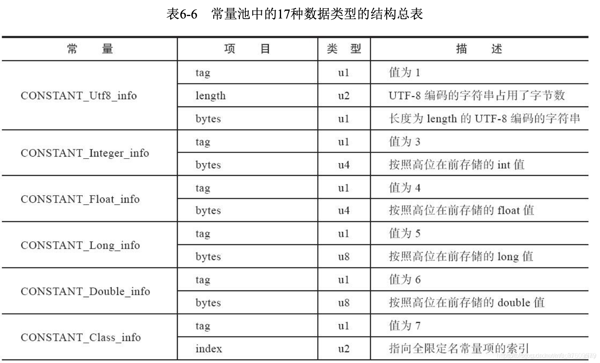

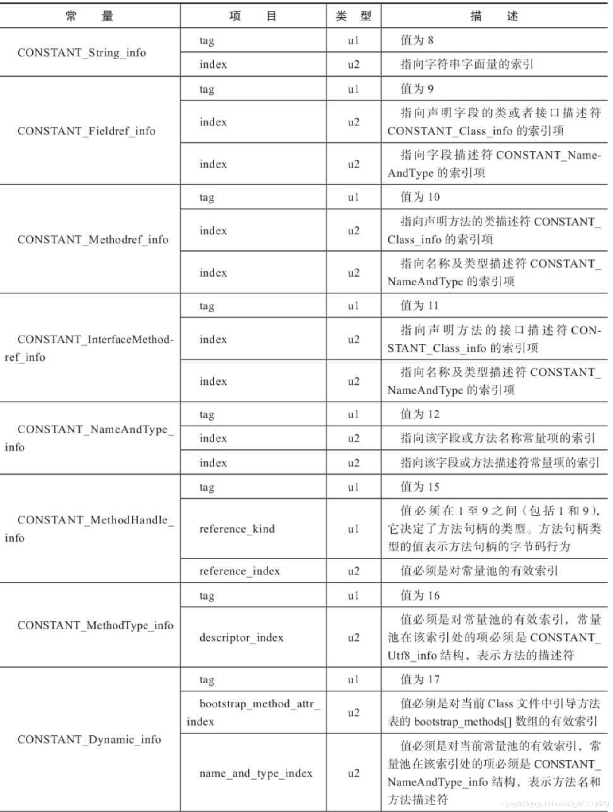

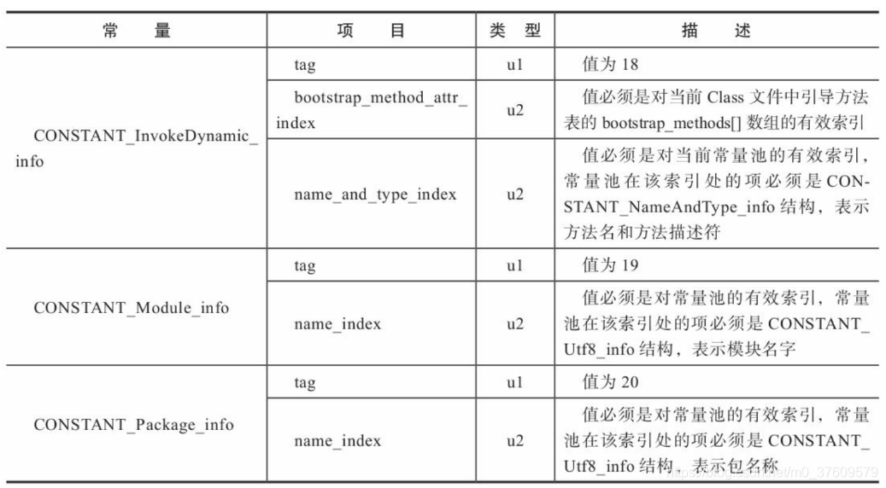


# 常量池和运行时常量池之间的联系

常量池存在于 class 文件中，运行时常量池存在于 JVM 内存的方法区中。

jvm 在执行某个类的时候，必须经过加载、连接、初始化，而连接又包括验证、准备、解析三个阶段。而当类加载到内存中后，jvm 就会将 class 常量池中的内容存放到运行时常量池中，由此可知，运行时常量池也是每个类都有一个。

简单理解，就是将 class 文件中常量池部分转换到 JVM 内存中，将以前的<span style="color:blue;font-weight:bold;">符号引用（可以理解为普通字符串）</span>转换成<span style="color:blue;font-weight:bold;">直接引用（可以理解为内存地址）</span>。

# 垃圾收集算法

## 1、标记-清除算法

“标记-清除”（Mark-Sweep）算法，如它的名字一样，算法分为“标记”和“清除”两个阶段：

1. 首先标记出所有需要回收的对象。
2. 在标记完成后统一回收掉所有被标记的对象。

之所以说它是最基础的收集算法，是因为后续的收集算法都是基于这种思路并对其缺点进行改进而得到的。

它的主要缺点有两个：

1. 一个是效率问题，标记和清除过程的效率都不高；
2. 另外一个是空间问题，标记清除之后会产生大量不连续的内存碎片，空间碎片太多可能会导致，当程序在以后的运行过程中需要分配较大对象时无法找到足够的连续内存而不得不提前触发另一次垃圾收集动作。

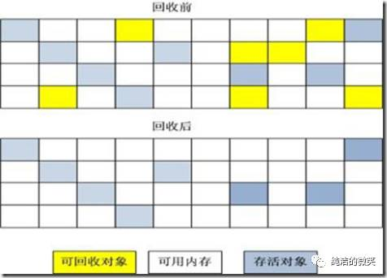

## 2、复制算法

“复制”（Copying）的收集算法，它将可用内存按容量划分为大小相等的两块，每次只使用其中的一块。

当这一块的内存用完了，就将还存活着的对象复制到另外一块上面，然后再把已使用过的内存空间一次清理掉。

这样使得每次都是对其中的一块进行内存回收，内存分配时也就不用考虑内存碎片等复杂情况，只要移动堆顶指针，按顺序分配内存即可，实现简单，运行高效。只是这种算法的代价是将内存缩小为原来的一半，持续复制长生存期的对象则导致效率降低。

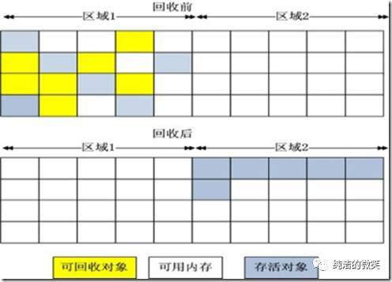

## 3、标记-压缩算法（标记-整理算法）

复制收集算法在对象存活率较高时就要执行较多的复制操作，效率将会变低。更关键的是，如果不想浪费 50% 的空间，就需要有额外的空间进行分配担保，以应对被使用的内存中所有对象都 100% 存活的极端情况，所以在老年代一般不能直接选用这种算法。

根据老年代的特点，有人提出了另外一种“标记-整理”（Mark-Compact）算法，标记过程仍然与“标记-清除”算法一样，但后续步骤不是直接对可回收对象进行清理，而是让所有存活的对象都向一端移动，然后直接清理掉端边界以外的内存。

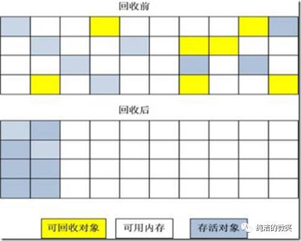

## 4、分代收集算法

GC 分代的基本假设：绝大部分对象的生命周期都非常短暂，存活时间短。

“分代收集”（Generational Collection）算法，把 Java 堆分为新生代和老年代，这样就可以根据各个年代的特点采用最适当的收集算法。

在新生代中，每次垃圾收集时都发现有大批对象死去，只有少量存活，那就选用复制算法，只需要付出少量存活对象的复制成本就可以完成收集。而老年代中因为对象存活率高、没有额外空间对它进行分配担保，就必须使用“<span style="color:blue;font-weight:bold;">标记-清除</span>”或“<span style="color:blue;font-weight:bold;">标记-压缩</span>”算法来进行回收。

# 垃圾收集器

> 如果说收集算法是内存回收的方法论，垃圾收集器就是内存回收的具体实现。

## 1、Serial 收集器

串行收集器是最古老，最稳定以及效率高的收集器，可能会产生较长的停顿，只使用一个线程去回收。

新生代（复制算法）、老年代（标记-压缩算法）使用串行回收。

垃圾收集的过程中会 Stop The World（服务暂停）。

参数控制： `-XX:+UseSerialGC` 串行收集器。


## 2、ParNew 收集器

ParNew 收集器其实就是 Serial 收集器的多线程版本。

参数控制：

`-XX:+UseParNewGC ParNew` 收集器。
`-XX:ParallelGCThreads` 限制线程数量。


## 3、Parallel 收集器

Parallel Scavenge 收集器类似 ParNew 收集器，Parallel 收集器更关注系统的吞吐量。

可以通过参数来打开自适应调节策略，虚拟机会根据当前系统的运行情况收集性能监控信息，动态调整这些参数以提供最合适的停顿时间或最大的吞吐量；也可以通过参数控制 GC 的时间不大于多少毫秒或者比例。

参数控制： `-XX:+UseParallelGC` 使用 Parallel 收集器 + 老年代串行。

## 4、Parallel Old 收集器

Parallel Old 是 Parallel Scavenge 收集器的老年代版本，使用<span style="color:blue;font-weight:bold;">多线程</span>和“标记－整理”算法。

这个收集器是在JDK 1.6中才开始提供。

参数控制： `-XX:+UseParallelOldGC` 使用 Parallel 收集器 + 老年代并行。

## 5、CMS 收集器

CMS（Concurrent Mark Sweep）收集器是一种以获取最短回收停顿时间为目标的收集器。目前很大一部分的 Java 应用都集中在互联网站或 B/S 系统的服务端上，这类应用尤其重视服务的响应速度，希望系统停顿时间最短，以给用户带来较好的体验。

从名字（包含“Mark Sweep”）上就可以看出 CMS 收集器是基于“标记-清除”算法实现的，它的运作过程相对于前面几种收集器来说要更复杂一些，整个过程分为 4 个步骤，包括：

1. 初始标记（CMS initial mark）。
2. 并发标记（CMS concurrent mark）。
3. 重新标记（CMS remark）。
4. 并发清除（CMS concurrent sweep）。

其中初始标记、重新标记这两个步骤仍然需要 “Stop The World”。初始标记仅仅只是标记一下 GC Roots 能直接关联到的对象，速度很快，并发标记阶段就是进行 GC Roots Tracing 的过程，而重新标记阶段则是为了修正并发标记期间，因用户程序继续运作而导致标记产生变动的那一部分对象的标记记录，这个阶段的停顿时间一般会比初始标记阶段稍长一些，但远比并发标记的时间短。

<span style="color:blue;font-weight:bold;">由于整个过程中耗时最长的并发标记和并发清除过程中，收集器线程都可以与用户线程一起工作，所以总体上来说，CMS 收集器的内存回收过程是与用户线程一起并发地执行</span>。

CMS 是老年代收集器，新生代使用 ParNew。

优点: 并发收集、低停顿。
缺点: 产生大量空间碎片、并发阶段会降低吞吐量。

参数控制：

`-XX:+UseConcMarkSweepGC` 使用CMS收集器。
`-XX:+ UseCMSCompactAtFullCollection` Full GC 后，进行一次碎片整理。整理过程是独占的，会引起停顿时间变长。
`-XX:+CMSFullGCsBeforeCompaction` 设置进行几次 Full GC后，进行一次碎片整理。
`-XX:ParallelCMSThreads` 设定 CMS 的线程数量（一般情况约等于可用 CPU 数量）。

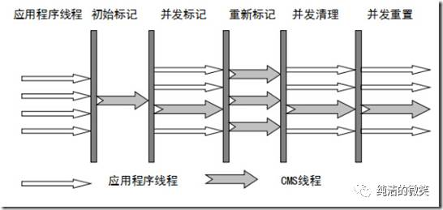

## 6、G1 收集器

G1 是目前技术发展的最前沿成果之一，HotSpot 开发团队赋予它的使命是未来可以替换掉 JDK1.5 中发布的 CMS 收集器。与 CMS 收集器相比 G1 收集器有以下特点：

- 空间整合，G1 收集器采用标记-压缩算法，不会产生内存空间碎片。分配大对象时不会因为无法找到连续空间而提前触发下一次 GC。
- 可预测停顿，这是 G1 的另一大优势，降低停顿时间是 G1 和 CMS 的共同关注点，但 G1 除了追求低停顿外，还能建立可预测的停顿时间模型，能让使用者明确指定在一个长度为 N 毫秒的时间片段内，消耗在垃圾收集上的时间不得超过 N 毫秒，这几乎已经是实时 Java（RTSJ）的垃圾收集器的特征了。

上面提到的垃圾收集器，收集的范围要么是新生代或者老年代，而 G1 不再是这样。使用 G1 收集器时，Java 堆的内存布局与其他收集器有很大差别，它将整个 Java 堆划分为多个大小相等的独立区域（Region），虽然还保留有新生代和老年代的概念，但新生代和老年代不再是物理隔阂了，它们都是一部分（可以不连续）Region 的集合。

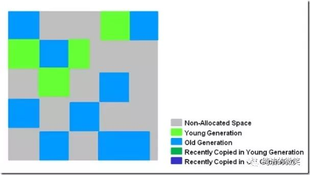

G1 的新生代收集跟 ParNew 类似，当新生代占用达到一定比例的时候，开始触发收集。

和 CMS 类似，G1 收集器收集老年代对象会有短暂停顿。

收集步骤：

1. 标记阶段，首先初始标记(Initial-Mark),这个阶段是停顿的(Stop the World)，并且会触发一次普通 Mintor GC。

    对应 GC log:GC pause (young) (inital-mark)。

2. Root Region Scanning，程序运行过程中会回收 survivor 区(存活到老年代)，这一过程必须在 young GC 之前完成。

3. Concurrent Marking，在整个堆中进行并发标记(和应用程序并发执行)，此过程可能被 young GC 中断。

    在并发标记阶段，若发现区域对象中的所有对象都是垃圾，那个这个区域会被立即回收(图中打X)。同时，并发标记过程中，会计算每个区域的对象活性(区域中存活对象的比例)。

    

4. Remark，再标记，会有短暂停顿(STW)。再标记阶段是用来收集 并发标记阶段 产生新的垃圾(并发阶段和应用程序一同运行)；G1 中采用了比 CMS 更快的初始快照算法: snapshot-at-the-beginning (SATB)。

5. Copy/Clean up，多线程清除失活对象，会有 STW。G1 将回收区域的存活对象拷贝到新区域，清除 Remember Sets，并发清空回收区域并把它返回到空闲区域链表中。

    

6. 复制/清除过程后。回收区域的活性对象已经被集中回收到深蓝色和深绿色区域。

    

## 7、常用的收集器组合

| 组合  | 新生代GC策略      | 老年老代GC策略   | 说明                                                         |
| :---- | :---------------- | :--------------- | :----------------------------------------------------------- |
| 组合1 | Serial            | Serial Old       | Serial 和 Serial Old 都是单线程进行 GC，特点就是 GC 时暂停所有应用线程。 |
| 组合2 | Serial            | CMS + Serial Old | CMS（Concurrent Mark Sweep）是并发 GC，实现 GC 线程和应用线程并发工作，不需要暂停所有应用线程。另外，当 CMS 进行 GC 失败时，会自动使用 Serial Old 策略进行 GC。 |
| 组合3 | ParNew            | CMS              | 使用 -XX:+UseParNewGC 选项来开启。ParNew 是 Serial 的并行版本，可以指定 GC 线程数，默认 GC 线程数为 CPU 的数量。可以使用 -XX:ParallelGCThreads 选项指定 GC的线程数。如果指定了选项 -XX:+UseConcMarkSweepGC 选项，则新生代默认使用ParNew GC 策略。 |
| 组合4 | ParNew            | Serial Old       | 使用 -XX:+UseParNewGC 选项来开启。新生代使用 ParNew GC 策略，年老代默认使用Serial Old GC 策略。 |
| 组合5 | Parallel Scavenge | Serial Old       | Parallel Scavenge 策略主要是关注一个可控的吞吐量：应用程序运行时间 / (应用程序运行时间 + GC 时间)，可见这会使得 CPU 的利用率尽可能的高，适用于后台持久运行的应用程序，而不适用于交互较多的应用程序。 |
| 组合6 | Parallel Scavenge | Parallel Old     | Parallel Old 是 Serial Old 的并行版本。                      |
| 组合7 | G1GC              | G1GC             | -XX:+UnlockExperimentalVMOptions <br>-XX:+UseG1GC #开启 ；<br>-XX:MaxGCPauseMillis=50 #暂停时间目标；<br>-XX:GCPauseIntervalMillis=200 #暂停间隔目标； <br>-XX:+G1YoungGenSize=512m #年轻代大小； <br>-XX:SurvivorRatio=6 #幸存区比例。 |


# JVM 常用调优参数

- -XX:CICompilerCount=3：最大并行编译数,如果设置大于 1，虽然编译速度会提高，但是同样影响系统稳定性，会增加 JVM 崩溃的可能。
- -XX:InitialHeapSize=100M：初始化堆大小，简写 -Xms100M。
- -XX:MaxHeapSize=100M：最大堆大小，简写-Xmx100M。
- -XX:NewSize=20M：设置年轻代的大小。
- -XX:MaxNewSize=50M：年轻代最大大小。
- -XX:OldSize=50M：设置老年代大小。
- -XX:MetaspaceSize=50M：设置方法区大小。
- -XX:MaxMetaspaceSize=50M：方法区最大大小。
- -XX:+UseParallelGC：使用 UseParallelGC 新生代，吞吐量优先。
- -XX:+UseParallelOldGC：使用 UseParallelOldGC 老年代，吞吐量优先。
- -XX:+UseConcMarkSweepGC：使用 CMS 老年代，停顿时间优先。
- -XX:+UseG1GC：使用 G1GC 新生代，老年代，停顿时间优先。
- -XX:NewRatio：新老生代的比值，比如 -XX:Ratio=4，则表示新生代:老年代=1:4，也就是新生代占整个堆内存的 1/5。
- -XX:SurvivorRatio：两个 S 区和 Eden 区的比值，比如 -XX:SurvivorRatio=8，也就是(S0+S1):Eden=2:8，也就是一个 S 占整个新生代的 1/10。
- -XX:+HeapDumpOnOutOfMemoryError：启动堆内存溢出打印当 JVM 堆内存发生溢出时，也就是 OOM，自动生成 dump 文件。
- -XX:HeapDumpPath=heap.hprof：指定堆内存溢出打印目录 表示在当前目录生成一个 heap.hprof 文件。
- XX:+PrintGCDetails -XX:+PrintGCTimeStamps -XX:+PrintGCDateStamps -Xloggc:$CATALINA_HOME/logs/gc.log：打印出GC 日志，可以使用不同的垃圾收集器，对比查看 GC 情况。
- -Xss128k：设置每个线程的堆栈大小，经验值是 3000-5000 最佳。
- -XX:MaxTenuringThreshold=6：提升年老代的最大临界值，默认值为 15。
- -XX:InitiatingHeapOccupancyPercent：启动并发 GC 周期时堆内存使用占比 G1 之类的垃圾收集器用它来触发并发 GC 周期，基于整个堆的使用率，而不只是某一代内存的使用比。值为 0 则表示”一直执行GC循环”。默认值为 45。
- -XX:G1HeapWastePercent：允许的浪费堆空间的占比默认是 10%，如果并发标记可回收的空间小于 10%,则不会触发 MixedGC。
- -XX:MaxGCPauseMillis=200ms：G1 最大停顿时间暂停时间不能太小，太小的话就会导致出现 G1 跟不上垃圾产生的速度。最终退化成 Full GC。所以对这个参数的调优是一个持续的过程，逐步调整到最佳状态。
- -XX:ConcGCThreads=n：并发垃圾收集器使用的线程数量，默认值随 JVM 运行的平台不同而不同。
- -XX:G1MixedGCLiveThresholdPercent=65：混合垃圾回收周期中要包括的旧区域设置占用率阈值，默认占用率为 65%。
- -XX:G1MixedGCCountTarget=8：设置标记周期完成后，对存活数据上限为 G1MixedGCLIveThresholdPercent 的旧区域执行混合垃圾回收的目标次数默认 8 次混合垃圾回收，混合回收的目标是要控制在此目标次数以内。
- -XX:G1OldCSetRegionThresholdPercent=1：描述 Mixed GC时，Old Region 被加入到 CSet 中默认情况下，G1只把 10% 的 Old Region 加入到 CSet 中。

# JVM 常用工具详解

## 1、可视化工具

### 1.1、jconsole

### 1.2、VisualVM

## 2、命令行工具

### 2.1、jps

JVM Process Status Tool，显示指定系统内所有的 HotSpot 虚拟机进程。

<span style="color:red;font-weight:bold;">命令格式</span>

```tex
jps [options] [hostid]
```

<span style="color:red;font-weight:bold;">option参数</span>

- -l : 输出主类全名或 jar 路径。
- -q : 只输出 LVMID。
- -m : 输出 JVM 启动时传递给 main() 的参数。
- -v : 输出 JVM 启动时显示指定的 JVM 参数。

其中[option]、[hostid]参数也可以不写。

<span style="color:red;font-weight:bold;">示例</span>

```bash
jps -l -m 
28920 org.apache.catalina.startup.Bootstrapstart
11589 org.apache.catalina.startup.Bootstrapstart
25816 sun.tools.jps.Jps -l -m
```

### 2.2、jstat

jstat (JVM statistics Monitoring) 是用于监视虚拟机运行时状态信息的命令，它可以显示出虚拟机进程中的类装载、内存、垃圾收集、JIT 编译等运行数据。

<span style="color:red;font-weight:bold;">命令格式</span>

```tex
jstat [option] LVMID [interval] [count]
```

<span style="color:red;font-weight:bold;">参数</span>

- [option] : 操作参数。
- LVMID : 本地虚拟机进程 ID。
- [interval] : 连续输出的时间间隔。
- [count] : 连续输出的次数。

<span style="color:red;font-weight:bold;">option参数</span>

- <span style="font-size:20px;color:#1E73E9;font-weight:bold;">class</span>：class loader 的行为统计。

    <span style="color:red;font-weight:bold;">示例：</span>监视类装载、卸载数量、总空间以及耗费的时间。

    ```bash
    jstat -class 11589
    Loaded  Bytes      Unloaded  Bytes  Time
    7035    14506.3    0         0.0    3.67
    ```

    <span style="color:red;font-weight:bold;">结果解释：</span>

    - Loaded : 加载 class 的数量。
    - Bytes : class 字节大小。
    - Unloaded : 未加载 class 的数量。
    - Bytes : 未加载 class 的字节大小。
    - Time : 加载时间。

- <span style="font-size:20px;color:#1E73E9;font-weight:bold;">compiler</span>：HotSpt JIT 编译器行为统计。

    <span style="color:red;font-weight:bold;">示例：</span>输出JIT编译过的方法数量耗时等。

    ```bash
    jstat -compiler 1262 
    Compiled  Failed  Invalid  Time   FailedType  FailedMethod
    2573      1       0        47.60  1           org/apache/catalina/loader/WebappClassLoaderfindResourceInternal
    ```

    <span style="color:red;font-weight:bold;">结果解释：</span>

    - Compiled : 编译数量。
    - Failed : 编译失败数量。
    - Invalid : 无效数量。
    - Time : 编译耗时。
    - FailedType : 失败类型。
    - FailedMethod : 失败方法的全限定名。

- <span style="font-size:20px;color:#1E73E9;font-weight:bold;">gc</span>：垃圾回收堆的行为统计。

    <span style="color:red;font-weight:bold;">示例：</span>垃圾回收堆的行为统计。

    ```bash
    $ jstat -gc 1262
    S0C      S1C      S0U     S1U   EC        EU        OC         OU        PC        PU         YGC    YGCT    FGC    FGCT     GCT   
    26112.0  24064.0  6562.5  0.0   564224.0  76274.5   434176.0   388518.3  524288.0  42724.7    320    6.417   1      0.398    6.815
    ```

    <span style="color:red;font-weight:bold;">结果解释：</span>

    C 即 Capacity 总容量，U 即 Used 已使用的容量。

    - S0C : survivor0 区的总容量。
    - S1C : survivor1 区的总容量。
    - S0U : survivor0 区已使用的容量。
    - S1U : survivor1 区已使用的容量。
    - EC : Eden 区的总容量。
    - EU : Eden 区已使用的容量。
    - OC : Old 区的总容量。
    - OU : Old 区已使用的容量。
    - MC：方法区大小。
    - MU：方法区使用大小。
    - CCSC:压缩类空间大小。
    - CCSU:压缩类空间使用大小。
    - PC 当前 perm 的容量 (KB)。
    - PU perm 的使用 (KB)。
    - YGC : 新生代垃圾回收次数。
    - YGCT : 新生代垃圾回收时间。
    - FGC : 老年代垃圾回收次数。
    - FGCT : 老年代垃圾回收时间。
    - GCT : 垃圾回收总消耗时间。

    <span style="color:red;font-weight:bold;">示例：</span>每隔 2000ms 输出 1262 的 gc 情况，一共输出 20 次。

    ```bash
    $ jstat -gc 1262 2000 20
    ```

- <span style="font-size:20px;color:#1E73E9;font-weight:bold;">gccapacity</span>：各个垃圾回收代容量(young,old,perm)和他们相应的空间统计。

    <span style="color:red;font-weight:bold;">示例：</span>同 -gc，不过还会输出 Java 堆各区域使用到的最大、最小空间。

    ```bash
    $ jstat -gccapacity 1262
    NGCMN     NGCMX      NGC        S0C       S1C       EC         OGCMN      OGCMX      OGC        OC        PGCMN     PGCMX      PGC       PC         YGC    FGC 
    614400.0  614400.0   614400.0   26112.0   24064.0   564224.0   434176.0   434176.0   434176.0   434176.0  524288.0  1048576.0  524288.0  524288.0   320    1  
    ```

    <span style="color:red;font-weight:bold;">结果解释：</span>

    - NGCMN : 新生代占用的最小空间。
    - NGCMX : 新生代占用的最大空间。
    - OGCMN : 老年代占用的最小空间。
    - OGCMX : 老年代占用的最大空间。
    - OGC：当前年老代的容量 (KB)。
    - OC：当前年老代的空间 (KB)。
    - PGCMN : perm 占用的最小空间。
    - PGCMX : perm 占用的最大空间。

- <span style="font-size:20px;color:#1E73E9;font-weight:bold;">gcutil</span>：垃圾回收统计概述。

    <span style="color:red;font-weight:bold;">示例：</span>同-gc，不过输出的是已使用空间占总空间的百分比。

    ```bash
    $ jstat -gcutil 28920
    S0      S1     E       O      P      YGC     YGCT     FGC    FGCT     GCT   
    12.45   0.00   33.85   0.00   4.44   4       0.242    0      0.000    0.242
    ```

- <span style="font-size:20px;color:#1E73E9;font-weight:bold;">gccause</span>：垃圾收集统计概述（同-gcutil），附加最近两次垃圾回收事件的原因。

    <span style="color:red;font-weight:bold;">示例：</span>垃圾收集统计概述（同-gcutil），附加最近两次垃圾回收事件的原因。

    ```bash
    $ jstat -gccause 28920
    S0      S1     E       O      P       YGC     YGCT    FGC    FGCT     GCT    LGCC                 GCC                 
    12.45   0.00   33.85   0.00   4.44    4       0.242   0      0.000    0.242  Allocation Failure   No GC  
    ```

    <span style="color:red;font-weight:bold;">结果解释：</span>

    - LGCC：最近垃圾回收的原因。
    - GCC：当前垃圾回收的原因。

- <span style="font-size:20px;color:#1E73E9;font-weight:bold;">gcnew</span>：新生代行为统计。

    <span style="color:red;font-weight:bold;">示例：</span>统计新生代的行为。

    ```bash
    $ jstat -gcnew 28920
    S0C       S1C       S0U        S1U   TT   MTT  DSS       EC         EU          YGC     YGCT  
    419392.0  419392.0  52231.8    0.0   6    6    209696.0  3355520.0  1172246.0   4       0.242
    ```

    <span style="color:red;font-weight:bold;">结果解释：</span>

    - TT：Tenuring threshold(提升阈值)。
    - MTT：最大的 tenuring threshold。
    - DSS：survivor 区域大小 (KB)。

- <span style="font-size:20px;color:#1E73E9;font-weight:bold;">gcnewcapacity</span>：新生代与其相应的内存空间的统计。

    <span style="color:red;font-weight:bold;">示例：</span>新生代与其相应的内存空间的统计。

    ```bash
    $ jstat -gcnewcapacity 28920
    NGCMN      NGCMX       NGC        S0CMX     S0C       S1CMX      S1C       ECMX        EC          YGC   FGC 
    4194304.0  4194304.0   4194304.0  419392.0  419392.0  419392.0   419392.0  3355520.0   3355520.0   4     0
    ```

    <span style="color:red;font-weight:bold;">结果解释：</span>

    - NGC:当前年轻代的容量 (KB)。
    - S0CMX:最大的 S0 空间 (KB)。
    - S0C:当前 S0 空间 (KB)。
    - ECMX:最大 eden 空间 (KB)。
    - EC:当前 eden 空间 (KB)。

- <span style="font-size:20px;color:#1E73E9;font-weight:bold;">gcold</span>：年老代和永生代行为统计。

    <span style="color:red;font-weight:bold;">示例：</span>统计旧生代的行为。

    ```bash
    $ jstat -gcold 28920
    PC          PU        OC           OU       YGC    FGC    FGCT     GCT   
    1048576.0   46561.7   6291456.0    0.0      4      0      0.000    0.242
    ```

- <span style="font-size:20px;color:#1E73E9;font-weight:bold;">gcoldcapacity</span>：年老代行为统计。

    <span style="color:red;font-weight:bold;">示例：</span>统计旧生代的大小和空间。

    ```bash
    $ jstat -gcoldcapacity 28920
    OGCMN       OGCMX        OGC         OC           YGC   FGC    FGCT     GCT   
    6291456.0   6291456.0    6291456.0   6291456.0    4     0      0.000      0.242
    
    ```

- <span style="font-size:20px;color:#1E73E9;font-weight:bold;">gcpermcapacity</span>：永生代行为统计。

    <span style="color:red;font-weight:bold;">示例：</span>永生代行为统计。

    ```bash
    $ jstat -gcpermcapacity 28920
    PGCMN       PGCMX       PGC         PC         YGC   FGC    FGCT     GCT   
    1048576.0   2097152.0   1048576.0   1048576.0  4     0      0.000    0.242
    ```

- <span style="font-size:20px;color:#1E73E9;font-weight:bold;">printcompilation</span>：HotSpot编译方法统计。

    <span style="color:red;font-weight:bold;">示例：</span>hotspot编译方法统计。

    ```bash
    $ jstat -printcompilation 28920
    Compiled  Size  Type Method
    1291      78    1    java/util/ArrayList indexOf
    ```

    <span style="color:red;font-weight:bold;">结果解释：</span>

    - Compiled：被执行的编译任务的数量。
    - Size：方法字节码的字节数。
    - Type：编译类型。
    - Method：编译方法的类名和方法名。类名使用”/” 代替 “.” 作为空间分隔符. 方法名是给出类的方法名。格式是一致于HotSpot - XX:+PrintComplation 选项。

### 2.3、jmap

jmap(JVM Memory Map)命令用于生成heap dump文件，如果不使用这个命令，还可以使用-XX:+HeapDumpOnOutOfMemoryError 参数来让虚拟机出现OOM的时候，自动生成 dump 文件。 jmap 不仅能生成 dump 文件，还阔以查询 finalize 执行队列、Java堆和永久代的详细信息，如当前使用率、当前使用的是哪种收集器等。

<span style="color:red;font-weight:bold;">命令格式</span>

```tex
jmap [option] LVMID
```

<span style="color:red;font-weight:bold;">option参数</span>

- <span style="font-size:20px;color:#1E73E9;font-weight:bold;">dump</span> : 生成堆转储快照。

    <span style="color:red;font-weight:bold;">常用格式：</span>

    ```bash
    -dump::live,format=b,file=<filename> pid 
    ```

    <span style="color:red;font-weight:bold;">示例：</span>dump 堆到文件，format 指定输出格式，live 指明是活着的对象，file 指定文件名。

    ```bash
    $ jmap -dump:live,format=b,file=dump.hprof 28920
    Dumping heap to /home/xxx/dump.hprof ...
    Heap dump file created
    ```

    dump.hprof 这个后缀是为了后续可以直接用 MAT(Memory Anlysis Tool) 打开。

- <span style="font-size:20px;color:#1E73E9;font-weight:bold;">finalizerinfo</span> : 显示在 F-Queue 队列等待 Finalizer 线程执行 finalizer 方法的对象。

    <span style="color:red;font-weight:bold;">示例：</span>打印等待回收对象的信息。

    ```bash
    $ jmap -finalizerinfo 28920
    Attaching to process ID 28920, please wait...
    Debugger attached successfully.
    Server compiler detected.
    JVM version is 24.71-b01
    Number of objects pending for finalization: 0
    ```

    可以看到当前 F-QUEUE 队列中并没有等待 Finalizer 线程执行 finalizer 方法的对象。

- <span style="font-size:20px;color:#1E73E9;font-weight:bold;">heap</span> : 显示 Java 堆详细信息。

    <span style="color:red;font-weight:bold;">示例：</span>打印 heap 的概要信息，GC 使用的算法，heap 的配置及 wise heap 的使用情况,可以用此来判断内存目前的使用情况以及垃圾回收情况。

    ```bash
    $ jmap -heap 28920
      Attaching to process ID 28920, please wait...
      Debugger attached successfully.
      Server compiler detected.
      JVM version is 24.71-b01  
    
      using thread-local object allocation.
      Parallel GC with 4 thread(s)//GC 方式  
    
      Heap Configuration: //堆内存初始化配置
         MinHeapFreeRatio = 0 //对应jvm启动参数-XX:MinHeapFreeRatio设置JVM堆最小空闲比率(default 40)
         MaxHeapFreeRatio = 100 //对应jvm启动参数 -XX:MaxHeapFreeRatio设置JVM堆最大空闲比率(default 70)
         MaxHeapSize      = 2082471936 (1986.0MB) //对应jvm启动参数-XX:MaxHeapSize=设置JVM堆的最大大小
         NewSize          = 1310720 (1.25MB)//对应jvm启动参数-XX:NewSize=设置JVM堆的‘新生代’的默认大小
         MaxNewSize       = 17592186044415 MB//对应jvm启动参数-XX:MaxNewSize=设置JVM堆的‘新生代’的最大大小
         OldSize          = 5439488 (5.1875MB)//对应jvm启动参数-XX:OldSize=<value>:设置JVM堆的‘老生代’的大小
         NewRatio         = 2 //对应jvm启动参数-XX:NewRatio=:‘新生代’和‘老生代’的大小比率
         SurvivorRatio    = 8 //对应jvm启动参数-XX:SurvivorRatio=设置年轻代中Eden区与Survivor区的大小比值 
         PermSize         = 21757952 (20.75MB)  //对应jvm启动参数-XX:PermSize=<value>:设置JVM堆的‘永生代’的初始大小
         MaxPermSize      = 85983232 (82.0MB)//对应jvm启动参数-XX:MaxPermSize=<value>:设置JVM堆的‘永生代’的最大大小
         G1HeapRegionSize = 0 (0.0MB)  
    
      Heap Usage://堆内存使用情况
      PS Young Generation
      Eden Space://Eden区内存分布
         capacity = 33030144 (31.5MB)//Eden区总容量
         used     = 1524040 (1.4534378051757812MB)  //Eden区已使用
         free     = 31506104 (30.04656219482422MB)  //Eden区剩余容量
         4.614088270399305% used //Eden区使用比率
      From Space:  //其中一个Survivor区的内存分布
         capacity = 5242880 (5.0MB)
         used     = 0 (0.0MB)
         free     = 5242880 (5.0MB)
         0.0% used
      To Space:  //另一个Survivor区的内存分布
         capacity = 5242880 (5.0MB)
         used     = 0 (0.0MB)
         free     = 5242880 (5.0MB)
         0.0% used
      PS Old Generation //当前的Old区内存分布
         capacity = 86507520 (82.5MB)
         used     = 0 (0.0MB)
         free     = 86507520 (82.5MB)
         0.0% used
      PS Perm Generation//当前的 “永生代” 内存分布
         capacity = 22020096 (21.0MB)
         used     = 2496528 (2.3808746337890625MB)
         free     = 19523568 (18.619125366210938MB)
         11.337498256138392% used  
    
      670 interned Strings occupying 43720 bytes.
    ```

    可以很清楚的看到 Java 堆中各个区域目前的情况。

- <span style="font-size:20px;color:#1E73E9;font-weight:bold;">histo</span> : 显示堆中对象的统计信息。

    <span style="color:red;font-weight:bold;">示例：</span>打印堆的对象统计，包括对象数、内存大小等等 （因为在 dump:live 前会进行 full gc，如果带上 live 则只统计活对象，因此不加 live 的堆大小要大于加 live 堆的大小）。

    ```bash
    $ jmap -histo:live 28920 | more
     num     #instances         #bytes  class name
    ----------------------------------------------
       1:         83613       12012248  <constMethodKlass>
       2:         23868       11450280  [B
       3:         83613       10716064  <methodKlass>
       4:         76287       10412128  [C
       5:          8227        9021176  <constantPoolKlass>
       6:          8227        5830256  <instanceKlassKlass>
       7:          7031        5156480  <constantPoolCacheKlass>
       8:         73627        1767048  java.lang.String
       9:          2260        1348848  <methodDataKlass>
      10:          8856         849296  java.lang.Class
      ....
    ```

    仅仅打印了前10行。

    class name 是对象类型，说明如下：

    ```tex
    B  byte
    C  char
    D  double
    F  float
    I  int
    J  long
    Z  boolean
    [  数组，如[I表示int[]
    [L+类名 其他对象
    ```

- <span style="font-size:20px;color:#1E73E9;font-weight:bold;">permstat</span> : to print permanent generation statistics。

    <span style="color:red;font-weight:bold;">示例：</span>打印 Java 堆内存的永久保存区域的类加载器的智能统计信息。对于每个类加载器而言，它的名称、活跃度、地址、父类加载器、它所加载的类的数量和大小都会被打印。此外，包含的字符串数量和大小也会被打印。

    ```bash
    $ jmap -permstat 28920
      Attaching to process ID 28920, please wait...
      Debugger attached successfully.
      Server compiler detected.
      JVM version is 24.71-b01
      finding class loader instances ..done.
      computing per loader stat ..done.
      please wait.. computing liveness.liveness analysis may be inaccurate ...
      
      class_loader            classes bytes   parent_loader           alive?  type  
      <bootstrap>             3111    18154296          null          live    <internal>
      0x0000000600905cf8      1       1888    0x0000000600087f08      dead    sun/reflect/DelegatingClassLoader@0x00000007800500a0
      0x00000006008fcb48      1       1888    0x0000000600087f08      dead    sun/reflect/DelegatingClassLoader@0x00000007800500a0
      0x00000006016db798      0       0       0x00000006008d3fc0      dead    java/util/ResourceBundle$RBClassLoader@0x0000000780626ec0
      0x00000006008d6810      1       3056      null          dead    sun/reflect/DelegatingClassLoader@0x00000007800500a0
    ```

- <span style="font-size:20px;color:#1E73E9;font-weight:bold;">F</span> : 当 -dump 没有响应时，强制生成 dump 快照。

    <span style="color:red;font-weight:bold;">示例：</span>强制模式。如果指定的 pid 没有响应，请使用 jmap -dump 或 jmap -histo 选项。此模式下，不支持 live 子选项。

### 2.4、jhat

jhat(JVM Heap Analysis Tool)命令是与 jmap 搭配使用，用来分析 jmap 生成的 dump，jhat 内置了一个微型的 HTTP/HTML 服务器，生成 dump 的分析结果后，可以在浏览器中查看。在此要注意，一般不会直接在服务器上进行分析，因为 jhat 是一个耗时并且耗费硬件资源的过程，一般把服务器生成的 dump 文件复制到本地或其他机器上进行分析。

<span style="color:red;font-weight:bold;">命令格式</span>

```tex
jhat [dumpfile]
```

<span style="color:red;font-weight:bold;">参数</span>

- -stack false|true 关闭对象分配调用栈跟踪(tracking object allocation call stack)。 如果分配位置信息在堆转储中不可用。则必须将此标志设置为 false. 默认值为 true。
- -refs false|true 关闭对象引用跟踪(tracking of references to objects)。 默认值为 true。默认情况下，返回的指针是指向其他特定对象的对象，如反向链接或输入引用(referrers or incoming references)，会统计/计算堆中的所有对象。
- -port port-number 设置 jhat HTTP server 的端口号，默认值 7000。
- -exclude exclude-file 指定对象查询时需要排除的数据成员列表文件(a file that lists data members that should be excluded from the reachable objects query)。 例如，如果文件列列出了 java.lang.String.value，那么当从某个特定对象 Object o 计算可达的对象列表时，引用路径涉及 java.lang.String.value 的都会被排除。
- -baseline exclude-file 指定一个基准堆转储(baseline heap dump)。 在两个 heap dumps 中有相同 object ID 的对象会被标记为不是新的(marked as not being new)。其他对象被标记为新的(new)。在比较两个不同的堆转储时很有用。
- -debug int 设置 debug 级别。0 表示不输出调试信息。 值越大则表示输出更详细的 debug 信息。
- -version 启动后只显示版本信息就退出。
- -J< flag > 因为 jhat 命令实际上会启动一个JVM来执行，通过 -J 可以在启动 JVM 时传入一些启动参数。例如，-J-Xmx512m 则指定运行 jhat 的 Java 虚拟机使用的最大堆内存为 512MB。如果需要使用多个 JVM 启动参数，则传入多个 -Jxxxxxx。

<span style="color:red;font-weight:bold;">示例</span>

```bash
$ jhat -J-Xmx512m dump.hprof
  eading from dump.hprof...
  Dump file created Fri Mar 11 17:13:42 CST 2016
  Snapshot read, resolving...
  Resolving 271678 objects...
  Chasing references, expect 54 dots......................................................
  Eliminating duplicate references......................................................
  Snapshot resolved.
  Started HTTP server on port 7000
  Server is ready.
```

中间的 -J-Xmx512m 是在 dump 快照很大的情况下分配 512M 内存去启动 HTTP 服务器，运行完之后就可在浏览器打开 Http://localhost:7000 进行快照分析，堆快照分析主要在最后面的 Heap Histogram 里，里面根据 class 列出了 dump 的时候所有存活对象。

分析同样一个 dump 快照，MAT 需要的额外内存比 jhat 要小的多的多，所以建议使用 MAT 来进行分析，当然也看个人偏好。

<span style="color:red;font-weight:bold;">分析</span>

打开浏览器 Http://localhost:7000，该页面提供了几个查询功能可供使用：

```tex
All classes including platform
Show all members of the rootset
Show instance counts for all classes (including platform)
Show instance counts for all classes (excluding platform)
Show heap histogram
Show finalizer summary
Execute Object Query Language (OQL) query
```

一般查看堆异常情况主要看这个两个部分： Show instance counts for all classes (excluding platform)，平台外的所有对象信息。如下图：

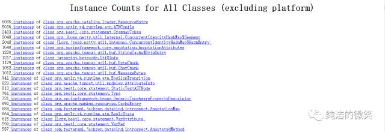Show heap histogram 以

树状图形式展示堆情况。如下图：

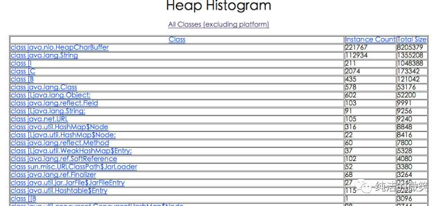

具体排查时需要结合代码，观察是否大量应该被回收的对象在一直被引用或者是否有占用内存特别大的对象无法被回收。
一般情况，会 down 到客户端用工具来分析。

### 2.5、jstack

jstack 用于生成java虚拟机当前时刻的线程快照。线程快照是当前 java 虚拟机内每一条线程正在执行的方法堆栈的集合，生成线程快照的主要目的是定位线程出现长时间停顿的原因，如线程间死锁、死循环、请求外部资源导致的长时间等待等。 线程出现停顿的时候通过 jstack 来查看各个线程的调用堆栈，就可以知道没有响应的线程到底在后台做什么事情，或者等待什么资源。 如果java程序崩溃生成 core 文件，jstack 工具可以用来获得core文件的 java stack 和 native stack 的信息，从而可以轻松地知道 java 程序是如何崩溃和在程序何处发生问题。另外，jstack 工具还可以附属到正在运行的java程序中，看到当时运行的 java 程序的 java  stack和native stack 的信息, 如果现在运行的 java 程序呈现 hung 的状态，jstack 是非常有用的。

<span style="color:red;font-weight:bold;">命令格式</span>

```tex
jstack [option] LVMID
```

<span style="color:red;font-weight:bold;">option参数</span>

- -F : 当正常输出请求不被响应时，强制输出线程堆栈。
- -l : 除堆栈外，显示关于锁的附加信息。
- -m : 如果调用到本地方法的话，可以显示 C/C++ 的堆栈。

Jstack -l PID >> 123.txt  在发生死锁时可以用 jstack -l pid 来观察锁持有情况 >>123.txt dump 到指定文件。

<span style="color:red;font-weight:bold;">示例</span>

```bash
$ jstack -l 11494|more
2016-07-28 13:40:04
Full thread dump Java HotSpot(TM) 64-Bit Server VM (24.71-b01 mixed mode):

"Attach Listener" daemon prio=10 tid=0x00007febb0002000 nid=0x6b6f waiting on condition [0x0000000000000000]
   java.lang.Thread.State: RUNNABLE

   Locked ownable synchronizers:
        - None

"http-bio-8005-exec-2" daemon prio=10 tid=0x00007feb94028000 nid=0x7b8c waiting on condition [0x00007fea8f56e000]
   java.lang.Thread.State: WAITING (parking)
        at sun.misc.Unsafe.park(Native Method)
        - parking to wait for  <0x00000000cae09b80> (a java.util.concurrent.locks.AbstractQueuedSynchronizer$ConditionObject)
        at java.util.concurrent.locks.LockSupport.park(LockSupport.java:186)
        at java.util.concurrent.locks.AbstractQueuedSynchronizer$ConditionObject.await(AbstractQueuedSynchronizer.java:2043)
        at java.util.concurrent.LinkedBlockingQueue.take(LinkedBlockingQueue.java:442)
        at org.apache.tomcat.util.threads.TaskQueue.take(TaskQueue.java:104)
        at org.apache.tomcat.util.threads.TaskQueue.take(TaskQueue.java:32)
        at java.util.concurrent.ThreadPoolExecutor.getTask(ThreadPoolExecutor.java:1068)
        at java.util.concurrent.ThreadPoolExecutor.runWorker(ThreadPoolExecutor.java:1130)
        at java.util.concurrent.ThreadPoolExecutor$Worker.run(ThreadPoolExecutor.java:615)
        at org.apache.tomcat.util.threads.TaskThread$WrappingRunnable.run(TaskThread.java:61)
        at java.lang.Thread.run(Thread.java:745)

   Locked ownable synchronizers:
        - None
      .....
```

<span style="color:red;font-weight:bold;">分析</span>

分析打印的内容即可。

### 2.6、jinfo

jinfo(JVM Configuration info)这个命令作用是实时查看和调整虚拟机运行参数。 之前的 jps -v 口令只能查看到显示指定的参数，如果想要查看未被显示指定的参数的值就要使用 jinfo 口令。

<span style="color:red;font-weight:bold;">命令格式</span>

```tex
jinfo [option] [args] LVMID
```

<span style="color:red;font-weight:bold;">option参数</span>

- -flag : 输出指定 args 参数的值。
- -flags : 不需要 args 参数，输出所有 JVM 参数的值。
- -sysprops : 输出系统属性，等同于 System.getProperties()。

<span style="color:red;font-weight:bold;">示例</span>

```bash
$ jinfo -flag 11494
-XX:CMSInitiatingOccupancyFraction=80
```

# JVM 调优技巧

## 1、思路

对 JVM 内存的系统级的调优主要的目的是减少 GC 的频率和 Full GC 的次数。

1. Full GC

    会对整个堆进行整理，包括 Young、Tenured 和 Perm。Full GC 因为需要对整个堆进行回收，所以比较慢，因此应该尽可能减少 Full GC 的次数。

2. 导致 Full GC 的原因。
    1. 年老代（Tenured）被写满，调优时尽量让对象在新生代 GC 时被回收、让对象在新生代多存活一段时间和不要创建过大的对象及数组避免直接在旧生代创建对象 。
    2. 持久代 Pemanet Generation 空间不足，增大 Perm Gen 空间，避免太多静态对象 ， 控制好新生代和旧生代的比例。
    3. System.gc() 被显示调用。

垃圾回收不要手动触发，尽量依靠 JVM 自身的机制。

## 2、方法和步骤

在对 JVM 调优的过程中，很大一部分工作就是对于 FullGC 的调节，下面详细介绍对应 JVM 调优的方法和步骤。

### 2.1、监控GC的状态

使用各种 JVM 工具，查看当前日志，分析当前 JVM 参数设置，并且分析当前堆内存快照和 gc 日志，根据实际的各区域内存划分和 GC 执行时间，觉得是否进行优化。

举一个例子：系统崩溃前的一些现象：

每次垃圾回收的时间越来越长，由之前的 10ms 延长到 50ms 左右，FullGC 的时间也有之前的 0.5s 延长到 4、5s，FullGC 的次数越来越多，最频繁时隔不到 1 分钟就进行一次 FullGC。年老代的内存越来越大并且每次FullGC后年老代没有内存被释放，之后系统会无法响应新的请求，逐渐到达 OutOfMemoryError 的临界值，这个时候就需要分析 JVM 内存快照 dump。

### 2.2、生成堆的 dump 文件

通过 JMX 的 MBean 生成当前的 Heap 信息，大小为一个 3G（整个堆的大小）的 hprof 文件，如果没有启动 JMX 可以通过 Java 的 jmap 命令来生成该文件。

### 2.3、分析 dump 文件

打开这个 3G 的堆信息文件，显然一般的 Window 系统没有这么大的内存，必须借助高配置的 Linux，几种工具打开该文件：

- Visual VM。
- IBM HeapAnalyzer。
- JDK 自带的 Hprof 工具。
- Mat(Eclipse 专门的静态内存分析工具)推荐使用。

<span style="color:blue;font-weight:bold;">备注：文件太大，建议使用Eclipse专门的静态内存分析工具Mat打开分析。</span>

### 2.4、分析结果，判断是否需要优化

如果各项参数设置合理，系统没有超时日志出现，GC 频率不高，GC 耗时不高，那么没有必要进行 GC 优化，如果 GC 时间超过1-3 秒，或者频繁 GC，则必须优化。

<span style="color:red;font-weight:bold;">注</span>：如果满足下面的指标，则一般不需要进行 GC：

- Minor GC 执行时间不到 50ms；
- Minor GC 执行不频繁，约 10 秒一次；
- Full GC 执行时间不到1s；
- Full GC 执行频率不算频繁，不低于 10 分钟 1 次。

### 2.5、调整 GC 类型和内存分配

如果内存分配过大或过小，或者采用的 GC 收集器比较慢，则应该优先调整这些参数，并且先找 1 台或几台机器进行 beta，然后比较优化过的机器和没有优化的机器的性能对比，并有针对性的做出最后选择。

2.6、不断的分析和调整

通过不断的试验和试错，分析并找到最合适的参数，如果找到了最合适的参数，则将这些参数应用到所有服务器。

## 3、JVM 调优参考

1. 针对 JVM 堆的设置，一般可以通过 -Xms -Xmx 限定其最小、最大值，为了防止垃圾收集器在最小、最大之间收缩堆而产生额外的时间，通常把最大、最小设置为相同的值。

2. 年轻代和年老代将根据默认的比例（1：2）分配堆内存， 可以通过调整二者之间的比率 NewRadio 来调整二者之间的大小，也可以针对回收代。

    比如年轻代，通过 -XX:newSize -XX:MaxNewSize 来设置其绝对大小。同样，为了防止年轻代的堆收缩，我们通常会把 -XX:newSize -XX:MaxNewSize 设置为同样大小。

3. 年轻代和年老代设置多大才算合理

    1. 更大的年轻代必然导致更小的年老代，大的年轻代会延长普通GC的周期，但会增加每次 GC 的时间；小的年老代会导致更频繁的 Full GC。

    2. 更小的年轻代必然导致更大年老代，小的年轻代会导致普通 GC 很频繁，但每次的 GC 时间会更短；大的年老代会减少Full GC 的频率。

        如何选择应该依赖应用程序对象生命周期的分布情况： 如果应用存在大量的临时对象，应该选择更大的年轻代；如果存在相对较多的持久对象，年老代应该适当增大。但很多应用都没有这样明显的特性。

        在抉择时应该根据以下两点：

        1. 本着 Full GC 尽量少的原则，让年老代尽量缓存常用对象，JVM 的默认比例 1：2 也是这个道理 。
        2. 通过观察应用一段时间，看其他在峰值时年老代会占多少内存，在不影响 Full GC的前提下，根据实际情况加大年轻代，比如可以把比例控制在 1:1。但应该给年老代至少预留 1/3 的增长空间。

4. 在配置较好的机器上（比如多核、大内存），可以为年老代选择并行收集算法： -XX:+UseParallelOldGC。

5. 线程堆栈的设置：每个线程默认会开启 1M 的堆栈，用于存放栈帧、调用参数、局部变量等，对大多数应用而言这个默认值太了，一般 256K 就足用。

    理论上，在内存不变的情况下，减少每个线程的堆栈，可以产生更多的线程，但这实际上还受限于操作系统。

# 类加载机制

## 1、类加载机制

Java 虚拟机把描述类的数据从 Class 文件加载到内存，最终形成可以被虚拟机直接使用的 Java 类型，这个过程被称作虚拟机的类加载机制。

### 1.1、类的生命周期

类从被加载到虚拟机内存中开始，到卸载出内存为止，它的整个生命周期包括：<span style="color:blue;font-weight:bold;">加载、验证、准备、解析、初始化、使用、卸载</span>这7 个阶段。其中其中<span style="color:blue;font-weight:bold;">验证、准备、解析</span> 3 个部分统称为连接。

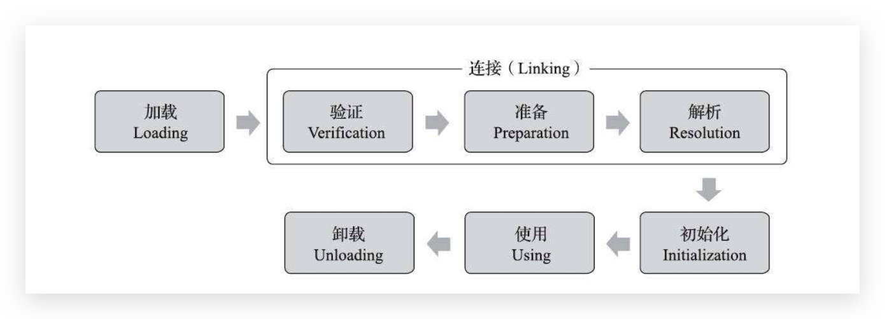

加载、验证、准备、初始化和卸载这五个阶段的顺序是确定的，类型的加载过程必须按照这种顺序按部就班地开始，而解析阶段则不一定，它在某些情况下可以在初始化阶段之后再开始，这是为了支持 Java 语言的运行时绑定特性（也称为动态绑定或晚期绑定）。

<span style="color:red;font-weight:bold;">注意：</span>这里的几个阶段是按顺序开始，而不是按顺序进行或完成，因为这些阶段通常都是互相交叉地混合进行的，通常在一个阶段执行的过程中调用或激活另一个阶段。

#### 1.1.1、加载

查找并加载类的二进制数据。

在加载阶段，虚拟机需要完成以下 3 件事情：

1. 通过一个类的全限定名来获取定义此类的二进制字节流。
2. 将这个字节流所代表的静态存储结构转化为方法区的运行时数据结构。
3. 在内存中生成一个代表这个类的 java.lang.Class 对象，作为方法区这个类的各种数据的访问入口。

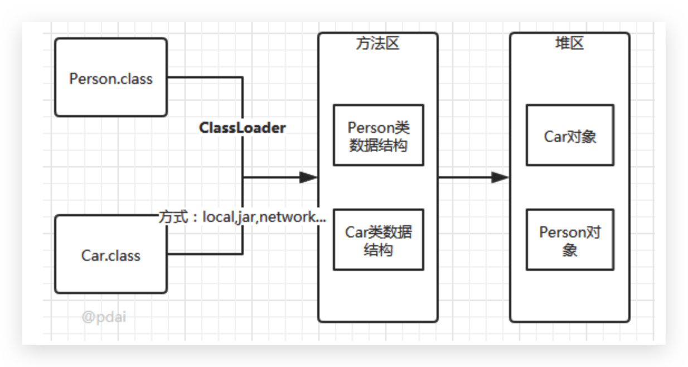

#### 1.1.2、验证

确保被加载的类的正确性。

验证是连接阶段的第一步，这一阶段的目的是为了确保 Class 文件的字节流中包含的信息符合当前虚拟机的要求，并且不会危害虚拟机自身的安全。验证阶段大致会完成 4 个阶段的检验动作：

1. 文件格式验证: 验证字节流是否符合 Class 文件格式的规范，例如：是否以 0xCAFEBABE 开头、主次版本号是否在当前虚拟机的处理范围之内、常量池中的常量是否有不被支持的类型。
2. 元数据验证：对字节码描述的信息进行语义分析(注意：对比 javac 编译阶段的语义分析)，以保证其描述的信息符合 Java 语言规范的要求，例如：这个类是否有父类，除了 java.lang.Object 之外。
3. 字节码验证：通过数据流和控制流分析，确定程序语义是合法的、符合逻辑的。
4. 符号引用验证：确保解析动作能正确执行。

验证阶段是非常重要的，但不是必须的，它对程序运行期没有影响，如果所引用的类经过反复验证，那么可以考虑采用 -Xverifynone 参数来关闭大部分的类验证措施，以缩短虚拟机类加载的时间。

#### 1.1.3、准备

为类的静态变量分配内存，并将其初始化为默认值。

准备阶段是正式为类变量分配内存并设置类变量初始值的阶段，这些变量所使用的内存都将在方法区中进行分配。

该阶段的注意事项：

- 这时候进行内存分配的仅包括类变量（被 static 修饰的变量），而不包括实例变量，实例变量将会在对象实例化时随着对象一起分配在 Java 堆中。
- 这里所设置的初始值通常情况下是数据类型默认的零值(如 0、0L、null、false 等)，而不是被在 Java 代码中被显式地赋予的值。

比如：假设一个类变量的定义为：public static int value = 3，那么变量 value 在准备阶段过后的初始值为 0，而不是 3，因为这时候尚未开始执行任何 Java 方法，而把 value 赋值为 3 的 put static 指令是在程序编译后，存放于`类构造器()`方法之中的，所以把 value 赋值为 3 的动作将在初始化阶段才会执行。

- 对基本数据类型来说，对于类变量 (static) 和全局变量，如果不显式地对其赋值而直接使用，则系统会为其赋予默认的零值，而对于局部变量来说，在使用前必须显式地为其赋值，否则编译时不通过。
- 对于同时被 static 和 final 修饰的常量，必须在声明的时候就为其显式地赋值，否则编译时不通过，而只被 final 修饰的常量则既可以在声明时显式地为其赋值，也可以在类初始化时显式地为其赋值，总之，在使用前必须为其显式地赋值，系统不会为其赋予默认零值。
- 对于引用数据类型 reference 来说，如数组引用、对象引用等，如果没有对其进行显式地赋值而直接使用，系统都会为其赋予默认的零值，即 null。
- 如果在数组初始化时没有对数组中的各元素赋值，那么其中的元素将根据对应的数据类型而被赋予默认的零值。
- 如果类字段的字段属性表中存在 ConstantValue 属性，即同时被 final 和 static 修饰，那么在准备阶段变量 value 就会被初始化为 ConstValue 属性所指定的值。假设上面的类变量 value 被定义为: public static final int value = 3，编译时Javac将会为 value 生成 ConstantValue 属性，在准备阶段虚拟机就会根据 ConstantValue 的设置将 value 赋值为 3。我们可以理解为static final 常量在编译期就将其结果放入了调用它的类的常量池中。


#### 1.1.4、解析

把类中的符号引用转换为直接引用。

解析阶段是虚拟机将常量池内的符号引用替换为直接引用的过程，解析动作主要针对<span style="color:blue;font-weight:bold;">类</span>或<span style="color:blue;font-weight:bold;">接口</span>、<span style="color:blue;font-weight:bold;">字段</span>、<span style="color:blue;font-weight:bold;">类方法</span>、<span style="color:blue;font-weight:bold;">接口方法</span>、<span style="color:blue;font-weight:bold;">方法类型</span>、<span style="color:blue;font-weight:bold;">方法句柄</span>和<span style="color:blue;font-weight:bold;">调用点限定符</span> 7 类符号引用进行。符号引用就是一组符号来描述目标，可以是任何字面量。

直接引用：就是直接指向目标的指针、相对偏移量或一个间接定位到目标的句柄。

#### 1.1.5、初始化

对类的静态变量，静态代码块执行初始化操作。

初始化，为类的静态变量赋予正确的初始值，JVM 负责对类进行初始化，主要对类变量进行初始化。在 Java 中对类变量进行初始值设定有两种方式：

1. 声明类变量是指定初始值。
2. 使用静态代码块为类变量指定初始值。

类初始化的步骤：

1. 假如这个类还没有被加载和连接，则程序先加载并连接该类。
2. 假如该类的直接父类还没有被初始化，则先初始化其直接父类。
3. 假如类中有初始化语句，则系统依次执行这些初始化语句。

触发类初始化的时机，只有当对类的主动使用的时候才会导致类的初始化，类的主动使用包括以下六种：

1. 使用 new 关键字实例化对象的时候。
2. 读取或设置一个类型的静态字段（被 final 修饰、已在编译期把结果放入常量池的静态字段除外）的时候。
3. 调用一个类型的静态方法的时候。
4. 使用 java.lang.reflect 包的方法对类型进行反射调用的时候，如果类型没有进行过初始化，则需要先触发其初始化。
5. 当初始化类的时候，如果发现其父类还没有进行过初始化，则需要先触发其父类的初始化。
6. 当虚拟机启动时，用户需要指定一个要执行的主类（包含 main() 方法的那个类），虚拟机会先初始化这个主类。

以下几种情况不会执行类初始化：

1. 通过子类引用父类的静态字段，只会触发父类的初始化，而不会触发子类的初始化。

2. 定义对象数组，不会触发该类的初始化。

3. 常量在编译期间会存入调用类的常量池中，本质上并没有直接引用定义常量的类，不会触

    发定义常量所在的类。

4. 通过类名获取 Class 对象，不会触发类的初始化。

5. 通过 Class.forName 加载指定类时，如果指定参数 initialize 为 false 时，也不会触发类初

    始化，其实这个参数是告诉虚拟机，是否要对类进行初始化。

6. 通过 ClassLoader 默认的 loadClass 方法，也不会触发初始化动作。

#### 1.1.6、使用

类访问方法区内的数据结构的接口， 对象是 Heap 区的数据。

#### 1.1.7、卸载

Java 虚拟机将结束生命周期的几种情况：

1. 执行了 System.exit() 方法。
2. 程序正常执行结束。
3. 程序在执行过程中遇到了异常或错误而异常终止。
4. 由于操作系统出现错误而导致 Java 虚拟机进程终止。

## 2、双亲委派模型

### 2.1、简介

Java 语言系统中支持以下 4 种类加载器：

1. Bootstrap ClassLoader 启动类加载器。
2. Extention ClassLoader 标准扩展类加载器。
3. Application ClassLoader 应用类加载器。
4. User ClassLoader 用户自定义类加载器。

这四种类加载器之间，是存在着一种层次关系的，如下图：

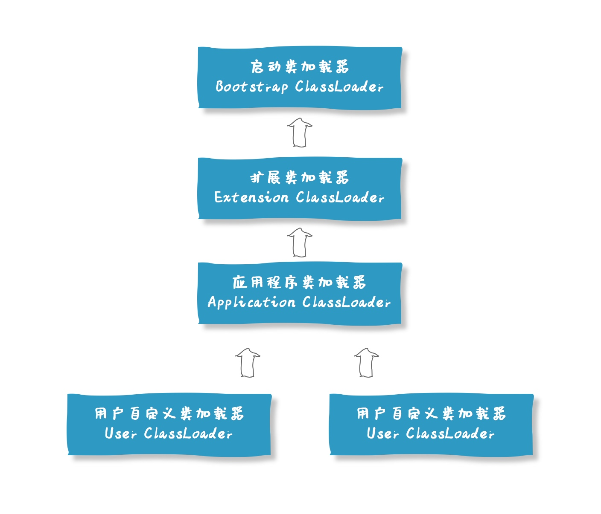

一般认为上一层加载器是下一层加载器的父加载器，那么，除了 BootstrapClassLoader 之外，所有的加载器都是有父加载器的。

那么，所谓的双亲委派机制，指的就是：当一个类加载器收到了类加载的请求的时候，他不会直接去加载指定的类，而是把这个请求委托给自己的父加载器去加载。只有父加载器无法加载这个类的时候，才会由当前这个加载器来负责类的加载。

那么，什么情况下父加载器会无法加载某一个类呢？

其实，Java 中提供的这四种类型的加载器，是有各自的职责的：

- Bootstrap ClassLoader ，主要负责加载 Java 核心类库，%JRE_HOME%\lib 下的 rt.jar、resources.jar、charsets.jar 和 class 等。
- Extention ClassLoader，主要负责加载目录 %JRE_HOME%\lib\ext 目录下的 jar 包和 class 文件。
- Application ClassLoader ，主要负责加载当前应用的 classpath 下的所有类。
- User ClassLoader ， 用户自定义的类加载器,可加载指定路径的 class 文件。

那么也就是说，一个用户自定义的类，如 com.hollis.ClassHollis 是无论如何也不会被 Bootstrap 和 Extention 加载器加载的。

### 2.2、为什么需要双亲委派？

如上面我们提到的，因为类加载器之间有严格的层次关系，那么也就使得 Java 类也随之具备了层次关系。

或者说这种层次关系是优先级。

比如一个定义在 java.lang 包下的类，因为它被存放在 rt.jar 之中，所以在被加载过程中，会被一直委托到 Bootstrap ClassLoader，最终由 Bootstrap ClassLoader 所加载。

而一个用户自定义的 com.hollis.ClassHollis 类，他也会被一直委托到 Bootstrap ClassLoader，但是因为 Bootstrap ClassLoader 不负责加载该类，那么会在由 Extention ClassLoader 尝试加载，而 Extention ClassLoader 也不负责这个类的加载，最终才会被Application ClassLoader 加载。

这种机制有几个好处。

首先，通过委派的方式，可以避免类的重复加载，当父加载器已经加载过某一个类时，子加载器就不会再重新加载这个类。

另外，通过双亲委派的方式，还保证了安全性。因为 Bootstrap ClassLoader 在加载的时候，只会加载 JAVA_HOME 中的 jar 包里面的类，如 java.lang.Integer，那么这个类是不会被随意替换的，除非有人跑到你的机器上， 破坏你的 JDK。

那么，就可以避免有人自定义一个有破坏功能的 java.lang.Integer 被加载。这样可以有效的防止核心 Java API 被篡改。

### 2.3、"父子加载器"之间的关系是继承吗？

很多人看到父加载器、子加载器这样的名字，就会认为 Java 中的类加载器之间存在着继承关系。

甚至网上很多文章也会有类似的错误观点。

这里需要明确一下，双亲委派模型中，类加载器之间的父子关系一般不会以继承（Inheritance）的关系来实现，而是都使用组合（Composition）关系来复用父加载器的代码的。

如下为 ClassLoader 中父加载器的定义：

```java
public abstract class ClassLoader {
    // The parent class loader for delegation
    private final ClassLoader parent;
}
```

### 2.4、双亲委派是怎么实现的？

双亲委派模型对于保证 Java 程序的稳定运作很重要，但它的实现并不复杂。

实现双亲委派的代码都集中在 java.lang.ClassLoader的loadClass() 方法之中：

```java
protected Class<?> loadClass(String name, boolean resolve)
        throws ClassNotFoundException
    {
        synchronized (getClassLoadingLock(name)) {
            // First, check if the class has already been loaded
            Class<?> c = findLoadedClass(name);
            if (c == null) {
                long t0 = System.nanoTime();
                try {
                    if (parent != null) {
                        c = parent.loadClass(name, false);
                    } else {
                        c = findBootstrapClassOrNull(name);
                    }
                } catch (ClassNotFoundException e) {
                    // ClassNotFoundException thrown if class not found
                    // from the non-null parent class loader
                }

                if (c == null) {
                    // If still not found, then invoke findClass in order
                    // to find the class.
                    long t1 = System.nanoTime();
                    c = findClass(name);

                    // this is the defining class loader; record the stats
                    sun.misc.PerfCounter.getParentDelegationTime().addTime(t1 - t0);
                    sun.misc.PerfCounter.getFindClassTime().addElapsedTimeFrom(t1);
                    sun.misc.PerfCounter.getFindClasses().increment();
                }
            }
            if (resolve) {
                resolveClass(c);
            }
            return c;
        }
    }
```

代码不难理解，主要就是以下几个步骤：

1. 先检查类是否已经被加载过。
2. 若没有加载则调用父加载器的 loadClass() 方法进行加载。
3. 若父加载器为空则默认使用启动类加载器作为父加载器。
4. 如果父类加载失败，抛出 ClassNotFoundException 异常后，再调用自己的 findClass() 方法进行加载。

## 3、双亲委派模型破坏

### 3.1、如何主动破坏双亲委派机制？

知道了双亲委派模型的实现，那么想要破坏双亲委派机制就很简单了。

因为他的双亲委派过程都是在 loadClass 方法中实现的，那么想要破坏这种机制，那么就自定义一个类加载器，重写其中的loadClass 方法，使其不进行双亲委派即可。

### 3.2、loadClass（）、findClass（）、defineClass（）区别

ClassLoader 中和类加载有关的方法有很多，前面提到了 loadClass，除此之外，还有 findClass 和 defineClass 等，那么这几个方法有什么区别呢？

- loadClass()：就是主要进行类加载的方法，默认的双亲委派机制就实现在这个方法中。
- findClass()：根据名称或位置加载 .class 字节码。
- definclass()：把字节码转化为 Class 对象。

这里面需要展开讲一下 loadClass 和 findClass，我们前面说过，当我们想要自定义一个类加载器的时候，并且像破坏双亲委派原则时，我们会重写 loadClass 方法。

那么，如果我们想定义一个类加载器，但是不想破坏双亲委派模型的时候呢？

这时候，就可以继承 ClassLoader，并且重写 findClass方法。findClass() 方法是 JDK1.2 之后的 ClassLoader 新添加的一个方法。代码如下：

```java
 /**
 * @since  1.2
 */
protected Class<?> findClass(String name) throws ClassNotFoundException {
    throw new ClassNotFoundException(name);
}
```

这个方法只抛出了一个异常，没有默认实现。

JDK1.2 之后已不再提倡用户直接覆盖 loadClass() 方法，而是建议把自己的类加载逻辑实现到 findClass() 方法中。

因为在 loadClass() 方法的逻辑里，如果父类加载器加载失败，则会调用自己的 findClass() 方法来完成加载。

所以，如果你想定义一个自己的类加载器，并且要遵守双亲委派模型，那么可以继承 ClassLoader，并且在 findClass 中实现你自己的加载逻辑即可。

### 3.3、双亲委派被破坏的例子

双亲委派机制的破坏不是什么稀奇的事情，很多框架、容器等都会破坏这种机制来实现某些功能。

1. 在双亲委派出现之前。

    由于双亲委派模型是在 JDK1.2 之后才被引入的，而在这之前已经有用户自定义类加载器在用了。所以，这些是没有遵守双亲委派原则的。

2. JNDI、JDBC等需要加载SPI接口实现类的情况。

3. 为了实现热插拔热部署工具。

    为了让代码动态生效而无需重启，实现方式时把模块连同类加载器一起换掉就实现了代码的热替换。

4. tomcat 等 web 容器的出现。

5. OSGI、Jigsaw 等模块化技术的应用。

### 3.4、JDBC 为什么要破坏双亲委派模型

我们日常开发中，大多数时候会通过 API 的方式调用 Java 提供的那些基础类，这些基础类时被 Bootstrap 加载的。

但是，调用方式除了 API 之外，还有一种 SPI 的方式。

如典型的 JDBC 服务，我们通常通过以下方式创建数据库连接：

```java
Connection conn = DriverManager.getConnection("jdbc:mysql://localhost:3306/mysql", "root", "1234");
```

在以上代码执行之前，DriverManager 会先被类加载器加载，因为 java.sql.DriverManager 类是位于 rt.jar 下面的 ，所以他会被根加载器加载。

类加载时，会执行该类的静态方法。其中有一段关键的代码是：

```java
ServiceLoader<Driver> loadedDrivers = ServiceLoader.load(Driver.class);
```

这段代码，会尝试加载classpath下面的所有实现了 Driver 接口的实现类。

那么，问题就来了。

DriverManager 是被根加载器加载的，那么在加载时遇到以上代码，会尝试加载所有 Driver 的实现类，但是这些实现类基本都是第三方提供的，根据双亲委派原则，第三方的类不能被根加载器加载。

那么，怎么解决这个问题呢？

于是，就在 JDBC 中通过引入 ThreadContextClassLoader（线程上下文加载器，默认情况下是 AppClassLoader）的方式破坏了双亲委派原则。

我们深入到 ServiceLoader.load 方法就可以看到：

```java
public static <S> ServiceLoader<S> load(Class<S> service) {
    ClassLoader cl = Thread.currentThread().getContextClassLoader();
    return ServiceLoader.load(service, cl);
}
```

第一行，获取当前线程的线程上下⽂类加载器 AppClassLoader，⽤于加载 classpath 中的具体实现类。

### 3.5、Tomcat 为什么要破坏双亲委派模型

我们知道，Tomcat 是 web 容器，那么一个 web 容器可能需要部署多个应用程序。

不同的应用程序可能会依赖同一个第三方类库的不同版本，但是不同版本的类库中某一个类的全路径名可能是一样的。

如多个应用都要依赖 hollis.jar，但是 A 应用需要依赖 1.0.0 版本，但是 B 应用需要依赖 1.0.1 版本。这两个版本中都有一个类是 com.hollis.Test.class。

如果采用默认的双亲委派类加载机制，那么是无法加载多个相同的类。

所以，Tomcat 破坏双亲委派原则，提供隔离的机制，为每个 web 容器单独提供一个 WebAppClassLoader 加载器。

Tomcat 的类加载机制：为了实现隔离性，优先加载 Web 应用自己定义的类，所以没有遵照双亲委派的约定，每一个应用自己的类加载器——WebAppClassLoader 负责加载本身的目录下的class文件，加载不到时再交给 CommonClassLoader 加载，这和双亲委派刚好相反。

# Java 四种引用

## 1、强引用

Java 中默认声明的就是强引用，比如：

```java
Object obj = new Object(); //只要obj还指向Object对象，Object对象就不会被回收
obj = null;  //手动置null
```

只要强引用存在，垃圾回收器将永远不会回收被引用的对象，哪怕内存不足时，JVM 也会直接抛出 OutOfMemoryError，不会去回收。如果想中断强引用与对象之间的联系，可以显示的将强引用赋值为 null，这样一来，JVM 就可以适时的回收对象了。

## 2、软引用

软引用是用来描述一些非必需但仍有用的对象。在内存足够的时候，软引用对象不会被回收，只有在内存不足时，系统则会回收软引用对象，如果回收了软引用对象之后仍然没有足够的内存，才会抛出内存溢出异常。这种特性常常被用来实现缓存技术，比如网页缓存，图片缓存等。
在 JDK1.2 之后，用 java.lang.ref.SoftReference 类来表示软引用。

下面以一个例子来进一步说明强引用和软引用的区别：
在运行下面的Java代码之前，需要先配置参数 -Xms2M -Xmx3M，将 JVM 的初始内存设为 2M，最大可用内存为 3M。

首先先来测试一下强引用，在限制了 JVM 内存的前提下，下面的代码运行正常，代码如下：

```java
public class TestOOM {
	
	public static void main(String[] args) {
		 testStrongReference();
	}
	private static void testStrongReference() {
		// 当 new byte为 1M 时，程序运行正常
		byte[] buff = new byte[1024 * 1024 * 1];
	}
}
```

但是如果我们将

```java
byte[] buff = new byte[1024 * 1024 * 1];
```

替换为创建一个大小为 2M 的字节数组，代码如下：

```java
byte[] buff = new byte[1024 * 1024 * 2];
```

则内存不够使用，程序直接报错，强引用并不会被回收，如图所示：


接着来看一下软引用会有什么不一样，在下面的示例中连续创建了 10 个大小为 1M 的字节数组，并赋值给了软引用，然后循环遍历将这些对象打印出来。代码如下：

```java
public class TestOOM {
	private static List<Object> list = new ArrayList<>();
	public static void main(String[] args) {
	     testSoftReference();
	}
	private static void testSoftReference() {
		for (int i = 0; i < 10; i++) {
			byte[] buff = new byte[1024 * 1024];
			SoftReference<byte[]> sr = new SoftReference<>(buff);
			list.add(sr);
		}
		
		System.gc(); //主动通知垃圾回收
		
		for(int i=0; i < list.size(); i++){
			Object obj = ((SoftReference) list.get(i)).get();
			System.out.println(obj);
		}
		
	}
	
}
```

打印结果，如图所示：

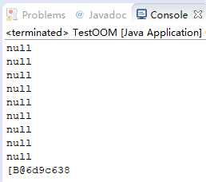

我们发现无论循环创建多少个软引用对象，打印结果总是只有最后一个对象被保留，其他的 obj 全都被置空回收了。
这里就说明了在内存不足的情况下，软引用将会被自动回收。
值得注意的一点 , 即使有 byte[] buff 引用指向对象, 且 buff 是一个 strong reference, 但是 SoftReference sr 指向的对象仍然被回收了，这是因为 Java 的编译器发现了在之后的代码中, buff 已经没有被使用了, 所以自动进行了优化。
如果我们将上面示例稍微修改一下，代码如下：

```java
private static void testSoftReference() {
    byte[] buff = null;

    for (int i = 0; i < 10; i++) {
        buff = new byte[1024 * 1024];
        SoftReference<byte[]> sr = new SoftReference<>(buff);
        list.add(sr);
    }

    System.gc(); //主动通知垃圾回收

    for(int i=0; i < list.size(); i++){
        Object obj = ((SoftReference) list.get(i)).get();
        System.out.println(obj);
    }

    System.out.println("buff: " + buff.toString());
}
```

则 buff 会因为强引用的存在，而无法被垃圾回收，从而抛出 OOM 的错误。如图所示：


如果一个对象惟一剩下的引用是软引用，那么该对象是软可及的（softly reachable）。垃圾收集器并不像其收集弱可及的对象一样尽量地收集软可及的对象，相反，它只在真正 “需要” 内存时才收集软可及的对象。

## 3、弱引用

弱引用的引用强度比软引用要更弱一些，无论内存是否足够，只要 JVM 开始进行垃圾回收，那些被弱引用关联的对象都会被回收。在 JDK1.2 之后，用 java.lang.ref.WeakReference 来表示弱引用。
我们以与软引用同样的方式来测试一下弱引用，代码如下：

```java
private static void testWeakReference() {
    for (int i = 0; i < 10; i++) {
        byte[] buff = new byte[1024 * 1024];
        WeakReference<byte[]> sr = new WeakReference<>(buff);
        list.add(sr);
    }

    System.gc(); //主动通知垃圾回收

    for(int i=0; i < list.size(); i++){
        Object obj = ((WeakReference) list.get(i)).get();
        System.out.println(obj);
    }
}
```

打印结果，如图所示：

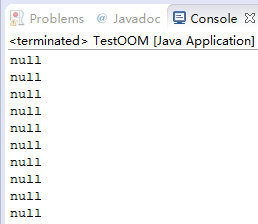

可以发现所有被弱引用关联的对象都被垃圾回收了。

## 4、虚引用

虚引用是最弱的一种引用关系，如果一个对象仅持有虚引用，那么它就和没有任何引用一样，它随时可能会被回收，在 JDK1.2 之后，用 PhantomReference 类来表示，通过查看这个类的源码，发现它只有一个构造函数和一个 get() 方法，而且它的 get() 方法仅仅是返回一个 null，也就是说将永远无法通过虚引用来获取对象，虚引用必须要和 ReferenceQueue 引用队列一起使用。源码如下：

```java
public class PhantomReference<T> extends Reference<T> {
    /**
     * Returns this reference object's referent.  Because the referent of a
     * phantom reference is always inaccessible, this method always returns
     * <code>null</code>.
     *
     * @return  <code>null</code>
     */
    public T get() {
        return null;
    }
    public PhantomReference(T referent, ReferenceQueue<? super T> q) {
        super(referent, q);
    }
}
```

## 5、引用队列（ReferenceQueue）

引用队列可以与软引用、弱引用以及虚引用一起配合使用，当垃圾回收器准备回收一个对象时，如果发现它还有引用，那么就会在回收对象之前，把这个引用加入到与之关联的引用队列中去。程序可以通过判断引用队列中是否已经加入了引用，来判断被引用的对象是否将要被垃圾回收，这样就可以在对象被回收之前采取一些必要的措施。

与软引用、弱引用不同，虚引用必须和引用队列一起使用。
