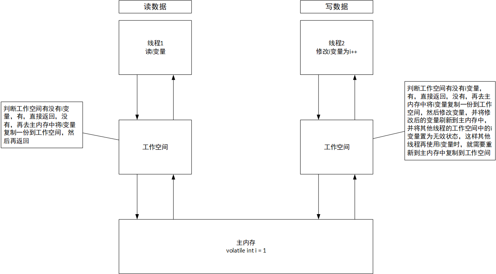

# Java——volatile笔记

## volatile实现原理

使用`volatile`修饰的变量在多个线程之间具有可见性，当一个线程修改了某个被volatile修饰的变量时，另外的其他线程也会知道那个被volatile修饰的变量被修改了。

## volatile特点

- 保证可见性：被volatile修饰的变量，在其他线程中是可见的，通常没有被volatile修饰的变量在其他线程中是不可见的。
- 保证有序性：因为JVM为了提升性能，在编译源代码时会在不影响最后程序计算结果的基础上进行代码重排序，而使用了volatile修饰变量后，可以保证该变量后的代码不能被重排序到该变量以前，同样也可以保证该变量前的代码不能被重排序到该变量后。

## volatile实际应用

- 状态标志：另外的线程需要知道某个线程中某些变量的状态。
- 双重检测锁定（double-checked-locking）：简称为DCL。
- 保证有序性：当需要保证代码中某些区域不让JVM进行代码重排时。

## volatile和synchronized的区别

- volatile是使用在变量上的，synchronized是使用在代码块和方法上的。
- volatile只能保证变量的可见性，不能保证代码的原子性，synchronized能保证可见性和原子性。