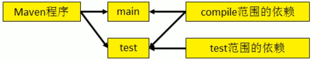
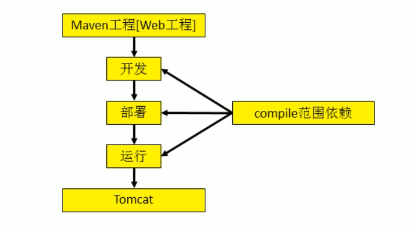

<center><h1>Maven笔记</h1></center>
# Maven构建过程

1.  清理：将以前编译得到的class字节码文件，为下次编译做准备。
2. 编译：将Java源文件编译成class字节码文件。
3. 测试：自动测试，自动调用junit程序。
4. 报告：显示测试程序执行的结果。
5. 打包：将Web工程打成war包，将Java工程打成jar包。
6. 安装：Maven特定的概念——将打包得到的文件，复制到仓库中指定的位置。
7. 部署：将动态Web工程生成的war包复制到Servlet容器的指定目录下，使其可用运行。

# Maven常用命令

- maven clean：清除。
- maven package：打包。
- maven test：测试。
- maven install：安装工程到本地仓库。

# Maven依赖

Maven解析依赖信息时会到本地仓库中查找被依赖的jar包，对于我们自己开发的Maven工程，需要使用`maven install`命令将自己开发的工程安装到本地仓库中。

## 依赖范围详解



1. compile范围依赖

   - 对主程序是否有效：有效。
   - 对测试程序是否有效：有效。
   - 是否参与打包：参与。
   - 是否参与部署：参与。
   - 是否能依赖传递：能。

   

2. test范围依赖

   - 对主程序是否有效：无效。
   - 对测试程序是否有效：有效。
   - 是否参与打包：不参与。
   - 是否参与部署：不参与。
   - 是否能依赖传递：不能。

3. provided范围依赖

   - 对主程序是否有效：有效。
   - 对测试程序是否有效：有效。
   - 是否参与打包：不参与。
   - 是否参与部署：不参与。
   - 是否能依赖传递：不能。

   

# Maven继承

- 作用：统一管理各个模块中的依赖版本。
- 解决步骤如下
  1. 创建一个Maven工程作为父工程，将打包方式设置为pom。
  2. 在子工程中声明对父工程的引用，使用`parent`标签。
  3. 将子工程中与父工程坐标相同的依赖的版本号删除掉。
  4. 在父工程中统一使用`dependencyManagement`标签进行依赖管理。

# Maven聚合

- 作用：一键安装各个模块工程。	
- 操作步骤如下：
  1. 在一个【总的聚合工程】（可以是父工程）中配置各个参与聚合的模块，使用`module`标签


# 在pom.xml中配置远程仓库

```xml
<repositories>
    <repository>
        <!-- 唯一标识Id -->
        <id>nexus3</id>
        <!-- 仓库名称 -->
        <name>maven-public</name>
        <!-- 仓库地址 -->
        <url>http://192.168.1.169:8081/repository/maven-public/</url>
        <!-- 正式版本配置 -->
        <releases>
            <!-- 为true表示从该仓库下载正式版本的构件，为false表示不下载 -->
            <enabled>true</enabled>
            <!-- 
可选配置，用来配置Maven从远程仓库检查更新的频率，默认值为daily，表示Maven每天检查一次。其它可用的值包括：never——从不检查更新；always——每次构建都检查更新；interval:X——每隔X分钟检查一次更新（X为任意整数） 
			-->
            <updatePolicy>always</updatePolicy>
            <!-- 
可选配置，用来配置Maven检验校验和文件的策略，当构件被部署到Maven仓库时，会同时部署对应的校验和文件。在下载构件的时候，Maven会验证校验和文件，如果校验和验证失败怎么办？当checksumPolicy的值为默认的warn时，Maven会在执行构建时输出警告信息，其他可用的值包括：fail——Maven遇到校验和错误就让构建失败；
			ignore——使Maven完全忽略校验和错误 
			-->
            <checksumPolicy>warn</checksumPolicy>
        </releases>
        <!-- 快照版本配置 -->
        <snapshots>
            <!-- 为true表示从该仓库下载快照版本的构件，为false表示不下载 -->
            <enabled>true</enabled>
            <!-- 同releases中的updatePolicy含义一致 -->
            <updatePolicy>always</updatePolicy>
            <!-- 同releases中的checksumPolicy含义一致 -->
            <checksumPolicy>warn</checksumPolicy>
        </snapshots>
        <!-- 表示仓库的布局是maven2和maven3默认的布局，而不是maven1的布局 -->
        <layout>default</layout>
    </repository>
</repositories>
```


# 配置远程仓库认证

当Maven在访问某些仓库需要认证的时候，就需要配置Maven的认证信息，找到maven安装路径，进入conf文件夹，找到setting.xml文件，并打开，找到`servers`标签，在该标签内添加如下内容

```xml
<server>
    <!-- 
	唯一标识id，注意，该id必须要与pom.xml中需要认证的repository元素的id一致。换句话说正是这个id将	认证信息与仓库配置联系到了一起 
	-->
    <id>deploymentRepo</id>
    <!-- 用户名 -->
    <username>repouser</username>
    <!-- 密码 -->
    <password>repopwd</password>
</server>
```


# 部署到远程仓库配置

在pom.xml文件中添加如下内容

```xml
<distributionManagement>
    <!-- 表示发布版本构件的仓库 -->
    <repository>
        <!-- 唯一标识id，该id需要和Maven的配置文件setting.xml文件中server元素中的id匹配 -->
        <id>nexus3</id>
        <!-- 为了方便阅读 -->
        <name>maven-releases</name>
        <!-- 仓库地址 -->
        <url>http://192.168.1.169:8081/repository/maven-releases/</url>
    </repository>
    <!-- 表示快照版本构件的仓库 -->
    <snapshotRepository>
        <id>nexus3</id>
        <name>maven-snapshots</name>
        <url>http://192.168.1.169:8081/repository/maven-snapshots/</url>
    </snapshotRepository>
</distributionManagement>
```


# 配置国内Maven镜像仓库

找到maven安装路径，进入conf文件夹，找到setting.xml文件，并打开，找到`mirrors`标签，在该标签内添加如下内容

```xml
<mirror>
    <!-- 
id唯一标识，可以随便写，如果该镜像仓库需要认证，该id需要和Maven的配置文件setting.xml文件中server元素中的id匹配 
	-->
    <id>alibaba</id>
    <!-- 便于阅读 -->
    <name>alibaba</name>
    <!-- 
如果为* ：任何对于远程仓库的请求都会被跳转到https://maven.aliyun.com/repository/central。
如果为external:*：匹配所有远程仓库，使用localhost的除外，使用file://协议的除外。也就是说，匹配所有不在本机上的远程仓库。
如果为repo1,repo2：匹配仓库repo1和repo2，使用逗号分隔多个远程仓库。
如果为*,!repo1：匹配所有仓库repo1除外，使用感叹号将仓库从匹配中排除。
	-->
    <mirrorOf>central</mirrorOf>
     <!-- 仓库地址 -->
    <url>https://maven.aliyun.com/repository/central</url>
</mirror>
```

