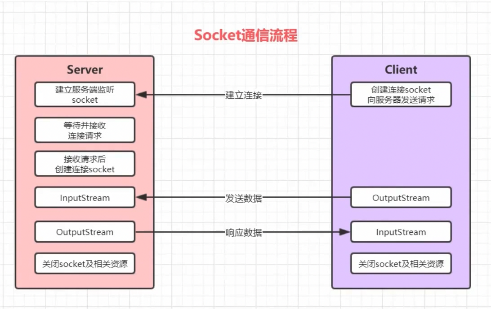

# 目录

[TOC]

# Socket

## 1、概述

Socket 套接字就是两台主机之间逻辑连接的端点。TCP/IP 协议是传输层协议，主要解决数据如何在网络中传输，而 HTTP 是应用层协议，主要解决如何包装数据。Socket 是通信的基石，是支持 TCP/IP 协议的网络通信的基本操作单元。它是网络通信过程中端点的抽象表示，包含进行网络通信必须的五种信息，如下：

1. 连接使用的协议。
2. 本地主机的 IP 地址。
3. 本地进程的协议端口。
4. 远程主机的 IP 地址。
5. 远程进程的协议端口。

## 2、Socket 整体流程

Socket 编程主要涉及到客户端和服务端两个方面，首先是服务端创建一个服务器套接字（ServerSocket），并把它附加到一个端口上，服务器从这个端口监听连接。端口号的范围是 0 ~ 65536，但是 0 ~ 1024 是为特权服务保留的端口号，因此推荐选择 1025 ~ 65536 之间没有被其它进程使用的端口。

客户端请求与服务器进行连接的时候，根据服务器的域名或 IP 地址，加上端口号，打开一个套接字。当服务器接受连接后，服务器和客户端之间的通信就像输入输出流一样进行操作。

Socket 通信流程如下图所示：

## 3、编码实现

# I/O 模型

## 1、I/O 模型说明

## 2、BIO（同步并阻塞）

## 3、NIO（同步非阻塞）

## 4、AIO（异步非阻塞）

## 5、BIO、NIO、AIO 适用场景

# NIO 编程

## 1、NIO 介绍

## 2、NIO 和 BIO 的比较

## 3、NIO 三大核心原理示意图

## 4、缓冲区（Buffer）

### 4.1、基本介绍

### 4.2、Buffer 常用 API 介绍

#### 4.2.1、Buffer 类及其子类

#### 4.2.2、缓冲区对象创建

#### 4.2.3、缓冲区对象添加数据

#### 4.2.4、缓冲区对象读取数据

## 5、通道（Channel）

### 5.1、基本介绍

### 5.2、常用类介绍

### 5.3、ServerSocketChannel

### 5.4、SocketChannel

## 6、选择器（Selector）

### 6.1、基本介绍

### 6.2、常用 API 介绍

### 6.3、Selector 编码