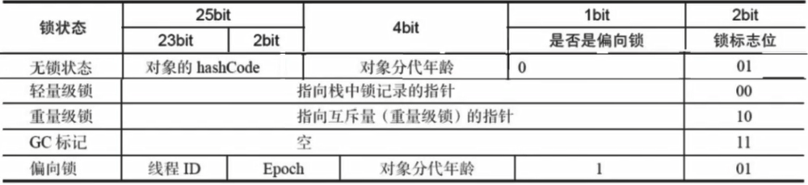

# Synchronized笔记

## Java虚拟机对Synchronized的优化

### 对象头与monitor

在堆中的任何一个实例对象中，都包含【对象头】、【实例变量】、【填充数据】的信息。

1. 对象头：就是实现加锁的基础，分为如下两个部分

   1. MarkWord（标记字段）：哈希码、分代年龄、锁标志位、偏向线程ID、偏向时间戳等信息。Mark Word被设计成了一个非固定的数据结构以便在极小的空间内存储尽量多的信息，它会根据对象的状态复用自己的存储空间。例外：如果是数组的话，还需要有一块区域存放数组大小，因为没办法从元数据确认数组大小，所以要存储到对象头的MarkWord中。

      以下是MarkWord根据对象的状态区分不同的状态位，从而区分不同的存储结构图

      

   2. Klass Pointer（类型指针）：即指向当前对象的类的元数据的指针，虚拟机通过这个指针来确定这个对象是哪个类的实例。并不是所有的虚拟机实现都必须在对象数据上保留类型指针，换句话说查找对象的元数据信息并不一定要经过对象本身。另外，如果是数组，对象头中还有一块用于存放数组长度的数据，因为虚拟机可以通过普通Java对象的元数据信息确定Java对象的大小，但是从数组的元数据中无法确定数组的大小。

2. 实例变量：实例数据部分是对象真正存储的有效信息，也就是我们在程序代码里面所定义的各种类型的字段内容，无论是从父类继承下来的，还是在子类中定义的都需要记录下来。

3. 填充数据：第三部分对齐填充并不是必然存在的，也没有特别的含义，它仅仅起着占位符的作用。由于HotSpot VM的自动内存管理系统要求对象起始地址必须是8字节的整数倍，换句话说就是对象的大小必须是8字节的整数倍。对象头正好是8字节的倍数（1倍或者2倍），因此当对象实例数据部分没有对齐的话，就需要通过对齐填充来补全。

## 锁优化

- 偏向锁

- 轻量级锁

- 重量级锁

- 自旋锁

- 锁消除

  

