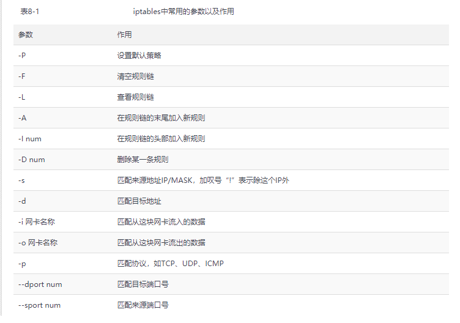

<center><h1>Linux常用命令总结</h1></center>
# yum常用命令

- yum install 【软件包名】[-y]：安装指定的软件包，如果加上`-y`表示不询问安装。
- yum remove 【软件包名】[-y]：删除指定软件包，如果加上`-y`表示不询问删除。
- yum list installed：列出所用安装过的软件，可以配合`|`和`grep`命令做过滤。
- yum list：列出所用软件，可以配合`|`和`grep`命令做过滤。
- yum search 【软件包名】：查找指定的软件包。
- yum clean all：删除缓存。
- yum update ：更新所用的软件包，如果后面添加【软件包名】就是更新指定的软件包。

# rpm命令

- rpm -e 【软件包名】：删除软件包。
- rpm -ivh 【软件包名】：安装指定软件包。
- rpm -Uvh 【软件包名】：更新指定软件包。
- rpm -Uvh --oldpackage 【软件包名】：软甲包降级。
- rpm -qa 【软件包名】：查找指定软件，可以配合`|`和`grep`命令做过滤。
- rpm -ql 【软件包名】：查看软件安装的路径。

# systemctl命令

systemctl命令是系统服务管理器指令，它实际上将 service 和 chkconfig 这两个命令组合到一起。

<table>
    <tr>
    	<th>任务</th>
        <th>旧指令</th>
        <th>新指令</th>
    </tr>
    <tr>
        <td>使某服务自动启动</td>
        <td>chkconfig --level 3 httpd on</td>
        <td>systemctl enable httpd.service</td>
    </tr>
    <tr>
        <td>使某服务不自动启动</td>
        <td>chkconfig --level 3 httpd off</td>
        <td>systemctl disable httpd.service</td>
    </tr>
    <tr>
        <td>检查服务状态</td>
        <td>service httpd status</td>
        <td>systemctl status httpd.service （服务详细信息） systemctl is-active httpd.service （仅显示是否 Active)</td>
    </tr>
    <tr>
        <td>显示所有已启动的服务</td>
        <td>chkconfig --list</td>
        <td>systemctl list-units --type=service</td>
    </tr>
    <tr>
        <td>启动某服务</td>
        <td>service httpd start</td>
        <td>systemctl start httpd.service</td>
    </tr>
     <tr>
        <td>停止某服务</td>
        <td>service httpd stop</td>
        <td>systemctl stop httpd.service</td>
    </tr>
     <tr>
        <td>重启某服务</td>
        <td>service httpd restart</td>
        <td>systemctl restart httpd.service</td>
    </tr>
    <tr>
        <td>查看自启服务</td>
        <td>--</td>
        <td>systemctl list-unit-files</td>
    </tr>
</table>

# curl命令

- curl -o 【文件名】url：将指定的url资源下载到指定的文件中。
- curl -L url：如果指定的url返回重定向，将跳转重定向地址，如果不加`L`将不回重定向。

# ln命令

- ln -s 【源文件】 【目标文件】：给源文件创建一个软连接到目标文件。

更多详情，参考以下链接：

[linux 创建连接命令 ln -s 软链接](https://www.cnblogs.com/kex1n/p/5193826.html)

# wget命令

- wget -O 【文件名】 url：将指定的url资源下载到指定的文件中。

更多详情，参考以下链接：

[wget命令详解](https://www.cnblogs.com/peida/archive/2013/03/18/2965369.html)

# CentOS关闭SELinux

查看SELinux状态

```bash
sestatus  -v
```

临时关闭

```bash
setenforce 0
```

永久关闭

修改/etc/selinux/config文件中的SELINUX="enforcing" 为 disabled ，然后重启。

# CentOS7如何设置防火墙

在旧版本的CentOS中，是使用 iptables 命令来设置防火墙的。但是，从CentOS7开始，默认就没有安装iptables，而是改用firewall来配置防火墙。

firewall的配置文件是以xml的格式，存储在 /usr/lib/firewalld/ 和 /etc/firewalld/ 目录中。

**系统配置目录**

```bash
/usr/lib/firewalld/
/usr/lib/firewalld/services
/usr/lib/firewalld/zones
```

**用户配置目录**

```bash
/etc/firewalld/
/etc/firewalld/services
/etc/firewalld/zones
```

**设置防火墙**

设置防火墙的方式有两种：firewall命令和直接修改配置文件。

推荐使用firewall命令来设置防火墙。

注意： 对防火墙所做的更改，必须重启防火墙服务，才会立即生效。命令如下：

```bash
service firewalld restart 或 systemctl restart firewalld
```

## 设置防火墙的方式有两种

### 1. firewall命令

```bash
# 对外开放3306端口，供外部的计算机访问
# 该命令方式添加的端口，可在/etc/firewalld/zones中的对应配置文件中得到体现
firewall-cmd --zone=public --add-port=3306/tcp --permanent

# 查看端口状态
firewall-cmd --zone=public --query-port=3306/tcp --permanent

# 对外关闭3306端口
firewall-cmd --zone=public --remove-port=3306/tcp --permanent

# 重启防火墙
systemctl restart firewalld
```

**说明**

- firewall-cmd：Linux中提供的操作firewall的工具。
- –zone：指定作用域。
- –add-port=80/tcp：添加的端口，格式为：端口/通讯协议。
- –permanent：表示永久生效，没有此参数重启后会失效。

**直接修改配置文件**

### 2. 直接修改配置文件

/etc/firewalld/zones/public.xml 文件的默认内容为：

```bash
<?xml version="1.0" encoding="utf-8"?>
<zone>
  <short>Public</short>
  <description>For use in public areas. You do not trust the other computers on networks to not harm your computer. Only selected incoming connections are accepted.</description>
  <service name="dhcpv6-client"/>
  <service name="ssh"/>
</zone>
```

修改该配置文件，来添加3306端口。修改后的内容为：

```bash
<?xml version="1.0" encoding="utf-8"?>
<zone>
  <short>Public</short>
  <description>For use in public areas. You do not trust the other computers on networks to not harm your computer. Only selected incoming connections are accepted.</description>
  <service name="dhcpv6-client"/>
  <service name="ssh"/>
  <port protocol="tcp" port="3306"/>
</zone>
```

## firewall常用命令

### 1. 查看firewall的状态

```bash
service firewalld status
或
systemctl status firewalld
或
firewall-cmd --state
```

### 2. 启动、停止、重启

```bash
# 启动
service firewalld start
或
systemctl start firewalld

# 停止
service firewalld stop
或
systemctl stop firewalld

# 重启
service firewalld restart
或
systemctl restart firewalld
```

### 3. 开机自启动的关闭与开启

```bash
# 关闭开机自启动
systemctl disable firewalld

# 开启开机自启动
systemctl enable firewalld
```

### 4. 查看防火墙的规则

```bash
firewall-cmd --list-all 
```

## 将CentOS7更改为iptables防火墙

CentOS7切换到iptables防火墙，首先应该关闭默认的firewall防火墙并禁止自启动，然后再来安装和启动iptables防火墙。

操作步骤如下：

```bash
# 停止firewall
systemctl stop firewalld

# 禁止firewall的开机自启动
systemctl disable firewalld

# 安装iptables
yum install iptables-services

# 开启iptables
systemctl start iptables

# 启用iptables的自启动
systemctl enable iptables
```

之后，就可以在CentOS7中使用iptables配置防火墙。

允许外部的计算机访问mysql，操作如下：

```bash
# 添加3306端口
iptables -A INPUT -p tcp -dport 3306 -j ACCEPT

# 保存当前的防火墙策略
service iptables save

# 重启iptables
service iptables restart
```

### iptables常用命令：

```bash
# 启动iptables
service iptables start

# 停止iptables
service iptables stop

# 重启iptables
service iptables restart

# 查看iptables的状态
service iptables status
```

iptables防火墙，非常重要的两个文件：

- 配置文件 /etc/sysconfig/iptables-config
- 策略文件 /etc/sysconfig/iptables（默认是不存在的，使用service ipatables save 可以保存当前策略）

### iptables常用参数说明



更多详情，参考以下链接：

- [Centos7 防火墙 firewalld 实用操作](https://www.cnblogs.com/stulzq/p/9808504.html)
- [firewalld防火墙详解](https://blog.51cto.com/andyxu/2137046)
- [iptables详解](https://www.91yun.co/archives/1690)
- [细说firewalld和iptables](cnblogs.com/grimm/p/10345693.html)
- [firewalld和iptables详解](https://www.linuxprobe.com/chapter-08.html)

# 端口占用查询

## netstat命令

netstat 命令应用是比较频繁的，比如查看端口占用啦，查看端口进程啦，这些时候都是有必要的。

netstat命令各个参数说明如下：

　　-t : 指明显示TCP端口

　　-u : 指明显示UDP端口

　　-l : 仅显示监听套接字(所谓套接字就是使应用程序能够读写与收发通讯协议(protocol)与资料的程序)

　　-p : 显示进程标识符和程序名称，每一个套接字/端口都属于一个程序。

　　-n : 不进行DNS轮询，显示IP(可以加速操作)

常用命令如下：

查看所有TCP端口

```bash
netstat -ntlp
```

查看所有端口

```bash
netstat -ntulp
```

查看指定端口的连接数量，比如：80

```bash
netstat -pnt |grep :80 |wc
```

更多详情，参考以下链接：

[linux查看端口状态相关命令](https://www.cnblogs.com/cxbhakim/p/9353383.html)

# firewalld与docker冲突问题

在CentOS7中，如果安装有docker，会出现firewalld与docker冲突问题，具体现象为，firewalld中并没有开发端口，但是其它机器依然能够访问docker提供的服务。出现这个问题的原因是因为firewalld和docker的启动顺序造成的，在机器启动后，firewalld服务比docker服务要先启动，在docker服务启动后修改了iptables规则，因为firewalld的底层实现也是基于iptables规则的，导致firewalld服务没有开发的端口，依然能够访问docker提供的服务。

解决办法有两种，如下

1. 不用firewalld，改用iptables
2. 将firewalld服务和docker服务都停止，然后先启动docker服务，过5秒（服务启动存在时间，保证docker完全启动）再启动firewalld服务。

# 查看内存使用情况

## top命令

内容说明如下：

- PID：进程的ID
- USER：进程所有者
- PR：进程的优先级别，越小越优先被执行
- NI：进程Nice值，代表这个进程的优先值
- VIRT：进程占用的虚拟内存
- RES：进程占用的物理内存
- SHR：进程使用的共享内存
- S：进程的状态。S表示休眠，R表示正在运行，Z表示僵死状态
- %CPU：进程占用CPU的使用
- %MEM：进程使用的物理内存和总内存的百分
- TIME+：该进程启动后占用的总的CPU时间，即占用CPU使用时间的累加值
- COMMAND：启动该进程的命令名称

## free命令

```bash
# 用KB为单位展示数据
free
# 用MB为单位展示数据
free -m
# 用GB为单位展示数据
free -h
```

内容说明如下：

- total : 总计屋里内存的大小
- used : 已使用内存的大小
- free : 可用内存的大小
- shared : 多个进程共享的内存总额
- buff/cache : 磁盘缓存大小
- available : 可用内存大小 ， 从应用程序的角度来说：available = free + buff/cache .

## linux可用内存足够为什么还用swap

> 该部分内容摘抄自：[linux可用内存足够为什么还用swap]([http://www.ps-aux.com/linux%E5%8F%AF%E7%94%A8%E5%86%85%E5%AD%98%E8%B6%B3%E5%A4%9F%E4%B8%BA%E4%BB%80%E4%B9%88%E8%BF%98%E4%BD%BF%E7%94%A8%E4%BA%86swap.html](http://www.ps-aux.com/linux可用内存足够为什么还使用了swap.html))

### 为什么 `buffer/cache` 会占用这么多的内存?

buffer/cache使用过高通常是程序频繁存取文件后,物理内存会很快被用光,
当程序结束后,内存不会被正常释放,而是成为cache状态.
通常我们不需要手工释放swap,Linux会自动管理.
如果非要释放,请继续看.

### 如何释放占用的`swap`呢?

```bash
## 将内存缓冲区数据立刻同步到磁盘
[root@localhost ~]# sync
## 关闭所有的swap
[root@localhost ~]# swapoff -a
## 启用所有swap
[root@localhost ~]# swapon -a
[root@localhost ~]# free -m
              total        used        free      shared  buff/cache   available
Mem:          31768       10853         217       16740       20698        3658
Swap:          8191           0        8191
```

### linux可用内存足够为什么还用swap?

上面可以看到服务器共有32G内存,其中buff/cache占用了21G+.
明明还有可以将近12G的内存可以使用.但系统却偏偏占用完了swap的8G内存.
可知系统并没有自动释放buff/cache最大化利用内存.

原因:

内核参数 swappiness 的值的大小,决定着linux何时开始使用swap。

- `swappiness=0` 时表示尽最大可能的使用物理内存以避免换入到swap.
- `swappiness＝100` 时候表示最大限度使用swap分区，并且把内存上的数据及时的换出到swap空间里面.
- 此值linux的基本默认设置为60，不同发行版可能略微不同.

查看命令具体如下：

```bash
[root@localhost ~]# cat /proc/sys/vm/swappiness
60
```

什么意思呢?
就是说，你的内存在使用率到40%(100%-60%)的时候，系统就会开始出现有交换分区的使用。
大家知道，内存的速度会比磁盘快很多，这样子会加大系统io，同时造的成大量页的换进换出，严重影响系统的性能，所以我们在操作系统层面，要尽可能使用内存，对该参数进行调整。

### 调整Swap在什么时候使用

**临时生效**

```bash
[root@localhost ~]# sysctl vm.swappiness=10
vm.swappiness = 10
[root@localhost ~]# cat /proc/sys/vm/swappiness
10
```

**重启依旧生效**

需要在/etc/sysctl.conf修改:

```bash
[root@localhost ~]# cat /etc/sysctl.conf
vm.swappiness = 10
[root@localhost ~]# sysctl -p
```

### shared内存

通常我们还经常看到shared占用大量内存,shared表示共享内存的占用,
起决定参数的两个分别是:

```bash
# 定义单个共享内存段的最大值
kernel.shmmax = 68719476736   
# 定义共享内存页数
kernel.shmall = 4194304  ##(16G)
```

当前系统内存页大小查看:

```bash
[root@localhost ~]# getconf  PAGESIZE
4096
```

当前系统共享内存段大小(bytes):

```bash
[root@localhost ~]# cat /proc/sys/kernel/shmmax
16777216000
```

共享内存段个数查看:

```bash
[root@localhost ~]# ipcs -m
```